# Graduate Texts in Mathematics - Graph Theory
> **Disclaimer:**
>
> This document contains my personal notes on the topic,
> compiled from publicly available documentation and various cited sources.
> The materials are intended for educational purposes, personal study, and reference.
> The content is dual-licensed:
> 1. **MIT License:** Applies to all code implementations (Swift, Mermaid, and other programming languages).
> 2. **Creative Commons Attribution 4.0 International License (CC BY 4.0):** Applies to all non-code content, including text, explanations, diagrams, and illustrations.
---

## A Diagrammatic Guide 

```mermaid
---
title: "Graduate Texts in Mathematics - Graph Theory"
author: "Cong Le"
version: "1.0"
license(s): "MIT, CC BY 4.0"
copyright: "Copyright (c) 2025 Cong Le. All Rights Reserved."
config:
  layout: elk
  look: handDrawn
  theme: dark
---
%%%%%%%% Mermaid version v11.4.1-b.14
%%%%%%%% Toggle theme value to `base` to activate the initilization below for the customized theme version.
%%%%%%%% Available curve styles include the following keywords:
%% basis, bumpX, bumpY, cardinal, catmullRom, linear, monotoneX, monotoneY, natural, step, stepAfter, stepBefore.
%%{
  init: {
    "flowchart": { "htmlLabels": false, 'curve': 'natural' },
    'fontFamily': 'Fantasy',
    'themeVariables': {
      'primaryColor': '#ffff',
      'primaryTextColor': '#55ff',
      'primaryBorderColor': '#7c2',
      'lineColor': '#F8B229',
      'secondaryColor': '#006100',
      'tertiaryColor': '#fff'
    }
  }
}%%
graph LR
    A[Graph Theory - Textbook Concepts] --> B{Core Areas}
    style A fill:#a2da,stroke:#333,stroke-width:1px
    B --> C[Basic Graph Theory]
    style C fill:#f2bf,stroke:#333,stroke-width:1px
    C --> CA[Graphs, vertices, edges, incidence]
    C --> CB[Degrees, isolated vertices, min/max degrees]
    C --> CC[Paths, cycles, connectedness, components]
    C --> CD[Trees, forests, leaves, tree-order]
    C --> CE[Bipartite and r-partite graphs]
    C --> CF[Graph Operations: contraction, union, complement]

    B --> D[Advanced Graph Theory]:::detail
    style D fill:#c5cf,stroke:#333,stroke-width:1px
    D --> DA[Matching, covering, packing problems]
    D --> DB[Planar graphs, embeddings, duality]
    D --> DC[Colouring and chromatic numbers]
    D --> DD[Extremal graph theory, forcing subgraphs/minors]
    D --> DE[Ramsey theory, unavoidable substructures]
    D --> DF[Hamilton cycles, sufficient conditions]
    D --> DG[Infinite graphs, ends, topological considerations]
    D --> DH[Graph Minors, WQO, and the Graph Minor Theorem]

    A --> E{Key Techniques & Concepts}
    style E fill:#c5cf,stroke:#333,stroke-width:1px
    E --> F[Proofs & Mathematical Tools]:::detail
    F --> FA[Induction, including transfinite]
    F --> FB[Contradiction]
    F --> FC[Menger's theorem for connectivity]
    F --> FD[Zorn's Lemma for maximal structures]
    F --> FE[Probabilistic method]
    F --> FF[Counting arguments and summations]
    F --> FG[Difference quotient and partial differentiation]
    F --> FH[Chain rule and vector calculus]
    F --> FI[Completing the square]
    F --> FJ[Linear transformations of Gaussian]
    F --> FK[Marginalization & Bayes' Theorem]
    F --> FL[Eigenvalues and eigenvectors]
    F --> FM[Lagrangian duality]

    A --> G{Special Classes of Graphs}
    style G fill:#f2fa,stroke:#333,stroke-width:1px
    G --> GA[k-Connected Graphs]
    G --> GB[Trees]
    G --> GC[Bipartite Graphs]
    G --> GD[Planar Graphs]
    G --> GE[Eulerian Graphs];
    G --> GF[Perfect Graphs]
    G --> GG[3-Connected Graphs]
    G --> GH[Rayless Graphs]
    G --> GI[Locally Finite Graphs]

    A --> I{Style and Presentation}
    style I fill:#f2aa,stroke:#333,stroke-width:1px
    I --> J[Mathematical Rigour]:::detail
    J --> JA[Precise definitions, formal proofs]
    J --> JB[Emphasis on theorems, lemmas]
    J --> JC[Focus on analytical techniques]
    I --> K[Content Organization]:::detail
    K --> KA[Chapter overview, core concepts]
    K --> KB[Succinct results, in-depth explanations]
    K --> KC[Bibliographical notes, further reading]
    I --> L[Textbook Style]:::detail
    L --> LA[Exercises with hints]
    L --> LB[Minimal mathematical prerequisites]
    L --> LC[Detailed explanations]
    I --> M[Visual Aids]:::detail
    M --> MA[Drawings and illustrations]
    M --> MB[Diagrammatic representations]
```

----

**Diagram Explanation:**

*   **Purpose:** The goal is to visually represent the textbook's structure, content, and style.
*   **Graph Type:** Uses a hierarchical graph structure (like a mind map) to represent the main topics and their sub-components.
*   **Nodes:** Each node represents a concept, a style point, or a key aspect of the textbook.  Different shapes could be used for different categories.
*   **Edges:** Arrows indicate relationships, dependencies, or organizational structure.
*   **Subgraphs:** Enclose related topics within subgraphs to improve clarity.
*   **Styling:**
    *   Different fill colors emphasize main topic categories (User, Content, Developer).
    *   ":::detail" allows for detailed text descriptions without cluttering the main graph.
*   **Key:**

    *   Content & Structure
    *   Style & Presentation
    *   Key Concepts

---
**Licenses:**

- **MIT License:**   - Full text in [LICENSE](LICENSE) file.
- **Creative Commons Attribution 4.0 International:**  - Legal details in [LICENSE-CC-BY](LICENSE-CC-BY) and at [Creative Commons official site](http://creativecommons.org/licenses/by/4.0/).

---