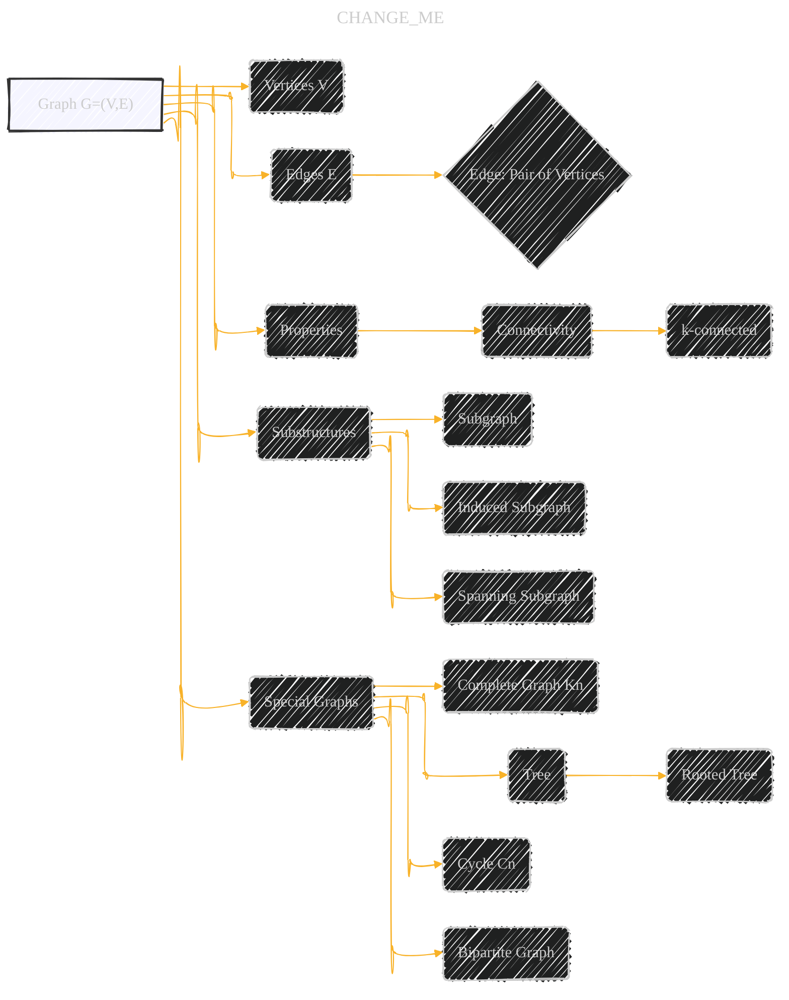

# Graduate Texts in Mathematics - Graph Theory
> **Disclaimer:**
>
> This document contains my personal notes on the topic,
> compiled from publicly available documentation and various cited sources.
> The materials are intended for educational purposes, personal study, and reference.
> The content is dual-licensed:
> 1. **MIT License:** Applies to all code implementations (Swift, Mermaid, and other programming languages).
> 2. **Creative Commons Attribution 4.0 International License (CC BY 4.0):** Applies to all non-code content, including text, explanations, diagrams, and illustrations.
---

Here's a breakdown of the core concepts and potential diagrammatic representations, categorized for clarity:

## 1. Fundamental Graph Concepts (Chapter 1)

*   **Graph (G = (V, E))**:  A central node.  Edges can point to:
    *   **Vertices (V)**: A set of nodes.
    *   **Edges (E)**: A set of nodes, each representing a pair of vertices.
    *   **Properties**: Degree, Order, Size, Connectedness, Paths, Cycles, Bipartite, etc. (These could be further broken down, e.g., 'Paths' leading to 'Path Length', 'Shortest Path', etc.)
*   **Substructures:**
    *    **Subgraph** and **Induced Subgraph:**  Nodes representing these concepts, with directed edges indicating the 'is-a' or 'part-of' relationship.
    *   **Spanning Subgraph**:  A special type of subgraph.
*   **Special Graphs:**
    *   **Complete Graph (Kn)**
    *   **Tree:**  Leading to sub-concepts like 'Rooted Tree', 'Normal Spanning Tree', etc.
    *   **Forest**
    *   **Cycle (Cn)**
    *   **Bipartite Graph** (and complete bipartite graph Km,n)
    *    **Planar Graph**

*    **Graph Operations**
    *     **Edge Contraction**
    *     **Vertex/Edge Deletion**

*    **Graph Properties**
     *   **Connectivity** (k-connected)
     *     **Cutvertex**
     *   **Bridge**
     *    **Block**

*   **Probabilities (Section 1.2):**
    *   **Probability Density Function:**  A core node.
    *   **Sum Rule, Product Rule, Bayes' Theorem:** Nodes connected to show their relationships.
    *   **Mean, Variance, Covariance:** Nodes linked to probability distributions.
    *   **Statistical Independence**
    *   **Specific Distributions:** (Uniform, Bernoulli, Binomial, Beta, Gaussian, Gamma, Wishart) - Each as a separate node, possibly with subgraphs showing their parameters and properties.
    *  **Conjugacy**

*   **Probabilistic Graphical Models (Section 1.3):**
    *   **Directed Graphical Models (Bayesian Networks):**
    *   **Undirected Graphical Models (Markov Random Fields):**
    *   **Factor Graphs:**

*   **Vector Calculus (Section 1.4):**
    *   **Gradient, Partial Derivative, Jacobian:**
    *   **Linearization, Taylor Series:**
    *   **Chain Rule:**

*   **Parameter Estimation (Section 1.5):**
    *   **Maximum Likelihood Estimation (MLE):**
    *   **Regularization**
    *   **Maximum A-Posteriori (MAP) Estimation:**
    *    **Overfitting**

*   **Gradient Descent (Section 1.6):**
     *    **Stepsize**
    *   **Gradient Descent with Momentum:**
    *   **Stochastic Gradient Descent:**

* **Model Selection (Section 1.7):**
    *    **Cross-Validation**
    *   **Bayesian Model Selection**

*   **Bayesian Linear Regression (Section 1.8):**
    *   **Model, Parameter Posterior, Prediction and Inference:**

---

## 2. Feature Extraction (Chapter 2)

* **Decompositions:**
 *   **Eigen-decomposition**
  *   **Symmetric Matrices**
  *  **QR decomposition**
        * Gram-Schmidt Process
  *  **Singular Value Decomposition (SVD)**
        * Thin SVD
        * Dimensionality Reduction
*   **Principal Component Analysis (PCA):**
    *   **Statistical Perspective**
    *   **Reconstruction Perspective**
    *   **Probabilistic PCA**
*   **Linear Discriminant Analysis (LDA):**
    *   **Two-Class Case**
    *   **Multi-Class Case**
 *    **Kernel PCA and Kernel LDA**

**3. Support Vector Machines (Chapter 3)**

*   **Support Vector Classification:**
    *   **Linear Separating Hyperplane**
    *   **Lagrangian Duality**
    *   **Karush-Kuhn-Tucker Conditions**
    *   **Dual Problem**
    *   **Mapping Data to Higher Dimensions**
*   **Support Vector Regression:**
    *   **Linear Regression**
    *    **SVR**

**4. Preliminaries on Vectors and Matrices (Appendix A.1)**
*   **Vectors and Vector Operators**
*    **Matrices and Matrix Operations**
      *  Matrix Norms, Multiplications, Transposition, Trace, Determinant, Inverse, Pseudo-Inverse
*    **Special Matrices** (Triangular)
*    **Scalar Products**
*    **Useful Matrix Identities**

---

## General Diagrammatic Conventions

*   **Nodes:** Represent concepts (definitions, theorems, algorithms).
*   **Edges:** Represent relationships (implication, dependency, specialization, part-of, is-a).  Edge direction indicates the direction of the relationship.
*   **Subgraphs:** Group related concepts.  For instance, all concepts related to "Linear Regression" could form a subgraph.
*   **Color Coding (Optional):** Use colors to distinguish different types of concepts (e.g., definitions vs. theorems).
*   **Equation Representation:** Key equations (like the definition of f(n) in A* search) can be represented as special nodes, or as annotations on edges that represent the relationship where the equation is used.

## Example Snippets (Mermaid Syntax)

---
**Licenses:**

- **MIT License:**   - Full text in [LICENSE](LICENSE) file.
- **Creative Commons Attribution 4.0 International:**  - Legal details in [LICENSE-CC-BY](LICENSE-CC-BY) and at [Creative Commons official site](http://creativecommons.org/licenses/by/4.0/).

---