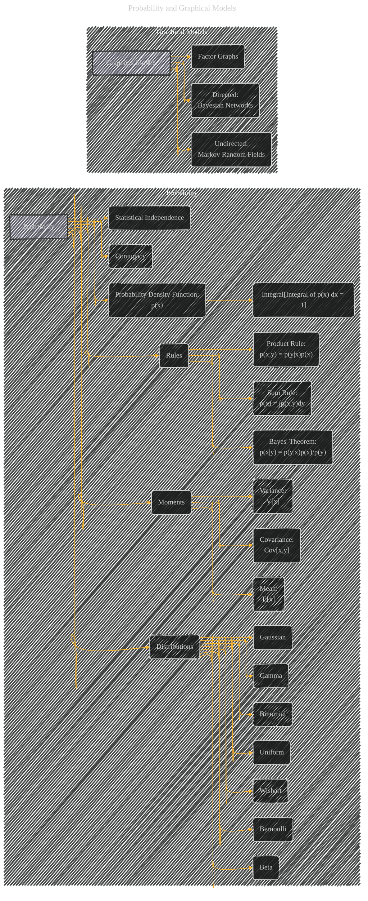
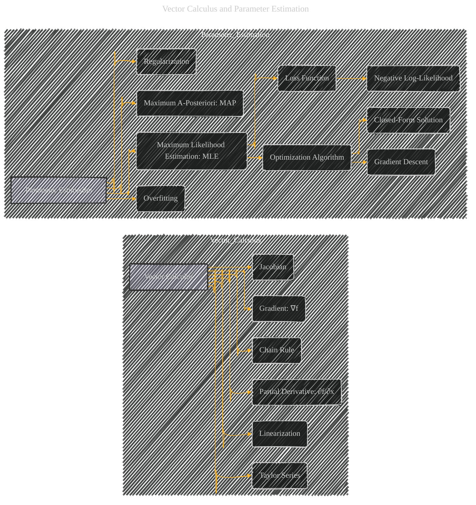
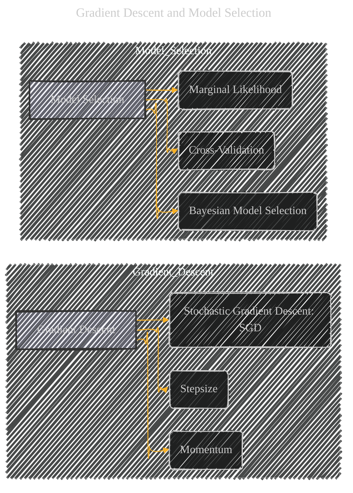
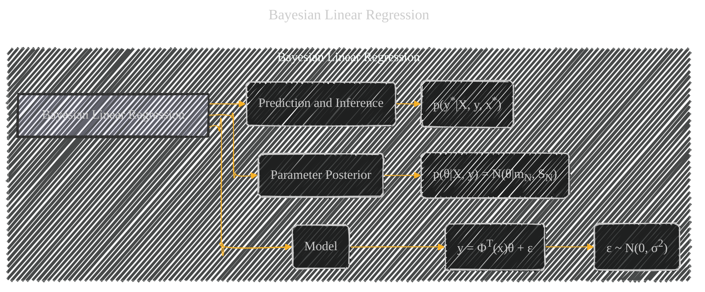
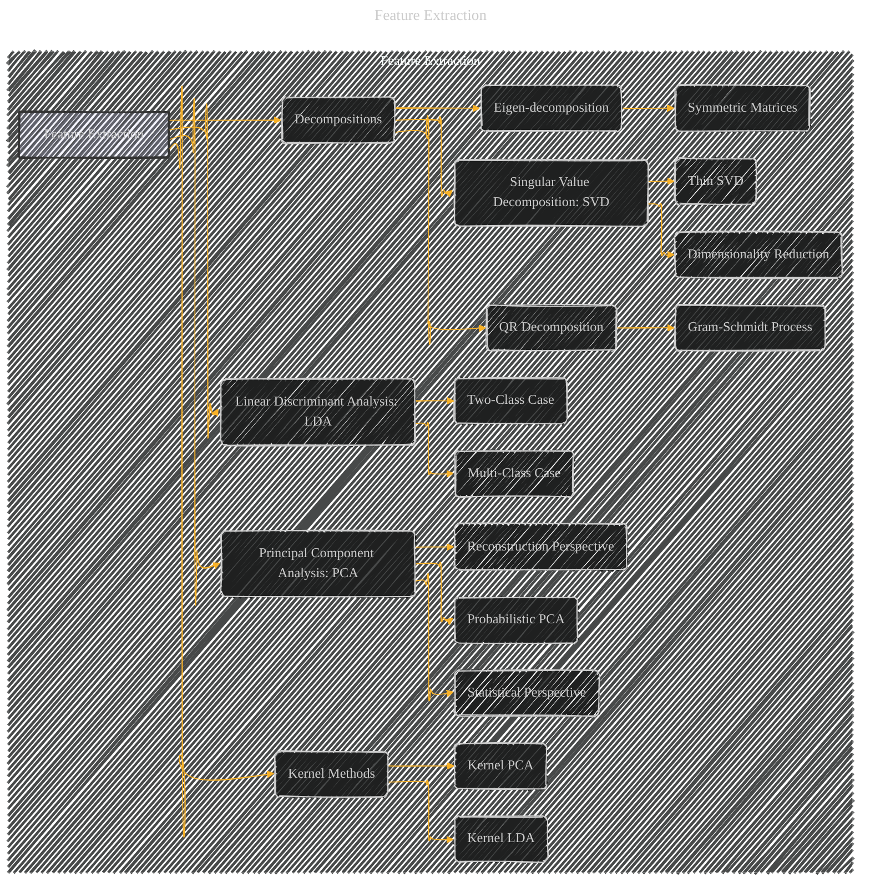
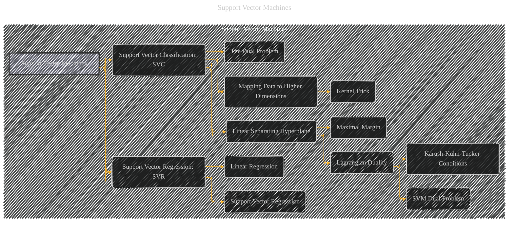
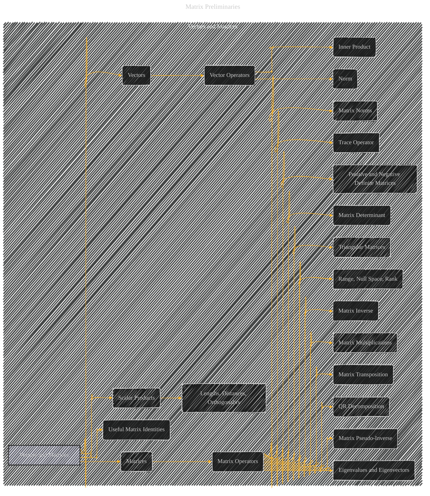

# Graduate Texts in Mathematics - Graph Theory
> **Disclaimer:**
>
> This document contains my personal notes on the topic,
> compiled from publicly available documentation and various cited sources.
> The materials are intended for educational purposes, personal study, and reference.
> The content is dual-licensed:
> 1. **MIT License:** Applies to all code implementations (Swift, Mermaid, and other programming languages).
> 2. **Creative Commons Attribution 4.0 International License (CC BY 4.0):** Applies to all non-code content, including text, explanations, diagrams, and illustrations.
---

The diagrams below provide a visual representation of the major topics and their relationships within the original document.  They are structured hierarchically, which helps in understanding the flow of concepts. The use of subgraphs groups related ideas, making the overall structure clearer. 

## 1. Fundamental Graph Concepts (Chapter 1)

---

## 2. Probability and Graphical Models (Sections 1.2 & 1.3)

---

## 3. Vector Calculus and Parameter Estimation (Sections 1.4 & 1.5)

----

## 4. Gradient Descent and Model Selection (Sections 1.6 & 1.7)

----

## 5. Bayesian Linear Regression (Section 1.8)

----

## 6. Feature Extraction (Chapter 2)

----

## 7. Support Vector Machines (Chapter 3)

----

## 8. Matrix Preliminaries

---
**Licenses:**

- **MIT License:**   - Full text in [LICENSE](LICENSE) file.
- **Creative Commons Attribution 4.0 International:**  - Legal details in [LICENSE-CC-BY](LICENSE-CC-BY) and at [Creative Commons official site](http://creativecommons.org/licenses/by/4.0/).

---