> ⚠️🏗️🚧🦺🧱🪵🪨🪚🛠️👷
> 
> This is a working draft in progress
> 
> 
> 
> ⚠️🏗️🚧🦺🧱🪵🪨🪚🛠️👷

----

# Introduction to Algorithms - Third Edition
> by Thomas H. Cormen, Charles E. Leiserson, Ronald L. Rivest, Clifford Stein

> <ins>📢 **Disclaimer** 🚨</ins>
>
> This document contains my personal notes on the topic,
> compiled from publicly available documentation and various cited sources.
> The materials are intended for educational purposes, personal study, and reference.
> The content is dual-licensed:
> 1. **MIT License:** Applies to all code implementations (Swift, Mermaid, and other programming languages).
> 2. **Creative Commons Attribution-ShareAlike 4.0 International License (CC BY-SA 4.0):** Applies to all non-code content, including text, explanations, diagrams, and illustrations.
---

----

## Visualizing "Introduction to Algorithms, Third Edition" 📖

The structure of this seminal textbook is vast and covers a wide range of topics in algorithms. The following mind map aims to capture its organization, key concepts, and the mathematical notations where appropriate.

```mermaid
---
title: "Introduction to Algorithms, Third Edition, An Overview"
author: "Cong Le"
version: "1.0"
license(s): "MIT, CC BY 4.0"
copyright: "Copyright (c) 2025 Cong Le. All Rights Reserved."
config:
  theme: base
---
%%%%%%%% Mermaid version v11.4.1-b.14
%%{
  init: {
    'fontFamily': 'Andale Mono, monospace',
    'mindmap': {
	    'nodeAlign': 'center',
	    'padding': 5
    },
    'themeVariables': {
      'primaryColor': '#FC82',
      'primaryTextColor': '#F8B229',
      'primaryBorderColor': '#27AE60',
      'secondaryColor': '#EBF3',
      'secondaryTextColor': '#6C3483',
      'secondaryBorderColor': '#A569BD',
      'fontSize': '15px'
    }
  }
}%%
mindmap
  root)"Introduction to Algorithms, Third Edition 📚<br/>(Cormen, Leiserson, Rivest, Stein)"(
    Authors["Authors: Thomas H. Cormen, Charles E. Leiserson, Ronald L. Rivest, Clifford Stein"]

    Part_I))"I. Foundations ✨"((
      Ch1{{"Chapter 1:<br/>The Role of Algorithms in Computing"}}
        Sec1_1("Section 1.1 Algorithms")
        Sec1_2("Section 1.2 Algorithms as a technology")
      Ch2{{"Chapter 2:<br/> Getting Started 🚀"}}
        Sec2_1["2.1 Insertion sort"]
        Sec2_2["2.2 Analyzing algorithms"]
        Sec2_3["2.3 Designing algorithms"]
      Ch3{{"Chapter 3:<br/>Growth of Functions 📈<br/>($\Theta, O, \Omega$)"}}
        Sec3_1["3.1 Asymptotic notation ($\Theta(n^2)$, $O(n \log n)$)"]
        Sec3_2["3.2 Standard notations and common functions"]
      Ch4{{"Chapter 4:<br/>Divide-and-Conquer ➗👑<br/>($T(n) = aT(n/b) + f(n)$)"}}
        Sec4_1["4.1 The maximum-subarray problem"]
        Sec4_2["4.2 Strassen's algorithm for matrix multiplication"]
        Sec4_3["4.3 The substitution method for solving recurrences"]
        Sec4_4["4.4 The recursion-tree method for solving recurrences"]
        Sec4_5["4.5 The master method for solving recurrences"]
        Sec4_6["? 4.6 Proof of the master theorem"]
      Ch5{{"Chapter 5:<br/> Probabilistic Analysis and Randomized Algorithms 🎲<br/>($E[X]$)"}}
        Sec5_1["5.1 The hiring problem"]
        Sec5_2["5.2 Indicator random variables ($I\{A\}$)"]
        Sec5_3["5.3 Randomized algorithms"]
        Sec5_4["? 5.4 Probabilistic analysis and further uses of indicator random variables"]

    Part_II))"II. Sorting and Order Statistics 📊"((
      Intro_II["Introduction"]
      Ch6{{"6. Heapsort"}}
        Sec6_1["6.1 Heaps"]
        Sec6_2["6.2 Maintaining the heap property"]
        Sec6_3["6.3 Building a heap"]
        Sec6_4["6.4 The heapsort algorithm"]
        Sec6_5["6.5 Priority queues"]
      Ch7{{"7. Quicksort"}}
        Sec7_1["7.1 Description of quicksort"]
        Sec7_2["7.2 Performance of quicksort"]
        Sec7_3["7.3 A randomized version of quicksort"]
        Sec7_4["7.4 Analysis of quicksort"]
      Ch8{{"8. Sorting in Linear Time ($O(n)$)"}}
        Sec8_1["8.1 Lower bounds for sorting ($\Omega(n \log n)$ for comparisons)"]
        Sec8_2["8.2 Counting sort"]
        Sec8_3["8.3 Radix sort"]
        Sec8_4["8.4 Bucket sort"]
      Ch9{{"9. Medians and Order Statistics"}}
        Sec9_1["9.1 Minimum and maximum"]
        Sec9_2["9.2 Selection in expected linear time"]
        Sec9_3["9.3 Selection in worst-case linear time"]

    Part_III))"III. Data Structures 🗂️"((
      Intro_III["Introduction"]
      Ch10{{"10. Elementary Data Structures (Stacks, Queues, Lists, Trees)"}}
        Sec10_1["10.1 Stacks and queues"]
        Sec10_2["10.2 Linked lists"]
        Sec10_3["10.3 Implementing pointers and objects"]
        Sec10_4["10.4 Representing rooted trees"]
      Ch11{{"11. Hash Tables ($h(k)$)"}}
        Sec11_1["11.1 Direct-address tables"]
        Sec11_2["11.2 Hash tables"]
        Sec11_3["11.3 Hash functions"]
        Sec11_4["11.4 Open addressing"]
        Sec11_5["? 11.5 Perfect hashing"]
      Ch12{{"12. Binary Search Trees"}}
        Sec12_1["12.1 What is a binary search tree?"]
        Sec12_2["12.2 Querying a binary search tree"]
        Sec12_3["12.3 Insertion and deletion"]
        Sec12_4["? 12.4 Randomly built binary search trees"]
      Ch13{{"13. Red-Black Trees ❤️🖤"}}
        Sec13_1["13.1 Properties of red-black trees"]
        Sec13_2["13.2 Rotations"]
        Sec13_3["13.3 Insertion"]
        Sec13_4["13.4 Deletion"]
      Ch14{{"14. Augmenting Data Structures"}}
        Sec14_1["14.1 Dynamic order statistics"]
        Sec14_2["14.2 How to augment a data structure"]
        Sec14_3["14.3 Interval trees"]

    Part_IV))"IV. Advanced Design and Analysis Techniques 🛠️"((
      Intro_IV["Introduction"]
      Ch15{{"15. Dynamic Programming"}}
        Sec15_1["15.1 Rod cutting"]
        Sec15_2["15.2 Matrix-chain multiplication"]
        Sec15_3["15.3 Elements of dynamic programming<br/>(Opt. Substructure, Overlapping Subproblems)"]
        Sec15_4["15.4 Longest common subsequence"]
        Sec15_5["15.5 Optimal binary search trees"]
      Ch16{{"16. Greedy Algorithms 💰"}}
        Sec16_1["16.1 An activity-selection problem"]
        Sec16_2["16.2 Elements of the greedy strategy"]
        Sec16_3["16.3 Huffman codes"]
        Sec16_4["? 16.4 Matroids and greedy methods"]
        Sec16_5["? 16.5 A task-scheduling problem as a matroid"]
      Ch17{{"17. Amortized Analysis (Aggregate, Accounting, Potential)"}}
        Sec17_1["17.1 Aggregate analysis"]
        Sec17_2["17.2 The accounting method"]
        Sec17_3["17.3 The potential method"]
        Sec17_4["17.4 Dynamic tables"]

    Part_V))"V. Advanced Data Structures 🧱"((
      Intro_V["Introduction"]
      Ch18["18. B-Trees (Disk-based)"]
        Sec18_1["18.1 Definition of B-trees"]
        Sec18_2["18.2 Basic operations on B-trees"]
        Sec18_3["18.3 Deleting a key from a B-tree"]
      Ch19["19. Fibonacci Heaps ($O(1)$ amortized INSERT)<br/>($O(\log n)$ amortized EXTRACT-MIN)"]
        Sec19_1["19.1 Structure of Fibonacci heaps"]
        Sec19_2["19.2 Mergeable-heap operations"]
        Sec19_3["19.3 Decreasing a key and deleting a node"]
        Sec19_4["19.4 Bounding the maximum degree"]
      Ch20["20. van Emde Boas Trees ($O(\log\log u)$)"]
        Sec20_1["20.1 Preliminary approaches"]
        Sec20_2["20.2 A recursive structure"]
        Sec20_3["20.3 The van Emde Boas tree"]
      Ch21["21. Data Structures for Disjoint Sets (Union-Find)"]
        Sec21_1["21.1 Disjoint-set operations"]
        Sec21_2["21.2 Linked-list representation of disjoint sets"]
        Sec21_3["21.3 Disjoint-set forests"]
        Sec21_4["? 21.4 Analysis of union by rank with path compression"]

    Part_VI))"VI. Graph Algorithms 🕸️ ($G=(V,E)$)"((
      Intro_VI["Introduction"]
      Ch22["22. Elementary Graph Algorithms"]
        Sec22_1["22.1 Representations of graphs"]
        Sec22_2["22.2 Breadth-first search (BFS)"]
        Sec22_3["22.3 Depth-first search (DFS)"]
        Sec22_4["22.4 Topological sort"]
        Sec22_5["22.5 Strongly connected components"]
      Ch23["23. Minimum Spanning Trees (Kruskal, Prim)"]
        Sec23_1["23.1 Growing a minimum spanning tree"]
        Sec23_2["23.2 The algorithms of Kruskal and Prim"]
      Ch24["24. Single-Source Shortest Paths"]
        Sec24_1["24.1 The Bellman-Ford algorithm ($\delta(s,v)$)"]
        Sec24_2["24.2 Single-source shortest paths in directed acyclic graphs"]
        Sec24_3["24.3 Dijkstra's algorithm"]
        Sec24_4["24.4 Difference constraints and shortest paths"]
        Sec24_5["24.5 Proofs of shortest-paths properties"]
      Ch25["25. All-Pairs Shortest Paths"]
        Sec25_1["25.1 Shortest paths and matrix multiplication"]
        Sec25_2["25.2 The Floyd-Warshall algorithm ($d_{ij}^{(k)}$)"]
        Sec25_3["25.3 Johnson's algorithm for sparse graphs"]
      Ch26["26. Maximum Flow (Ford-Fulkerson, Push-Relabel)"]
        Sec26_1["26.1 Flow networks ($f(u,v), c(u,v)$)"]
        Sec26_2["26.2 The Ford-Fulkerson method"]
        Sec26_3["26.3 Maximum bipartite matching"]
        Sec26_4["? 26.4 Push-relabel algorithms"]
        Sec26_5["? 26.5 The relabel-to-front algorithm"]

    Part_VII))"VII. Selected Topics 🌟"((
      Intro_VII["Introduction"]
      Ch27["27. Multithreaded Algorithms (Work, Span, Parallelism)"]
        Sec27_1["27.1 The basics of dynamic multithreading"]
        Sec27_2["27.2 Multithreaded matrix multiplication"]
        Sec27_3["27.3 Multithreaded merge sort"]
      Ch28["28. Matrix Operations ($A=LU, PA=LUP, A^{-1}$)"]
        Sec28_1["28.1 Solving systems of linear equations"]
        Sec28_2["28.2 Inverting matrices"]
        Sec28_3["28.3 Symmetric positive-definite matrices and least-squares approximation"]
      Ch29["29. Linear Programming (Simplex)"]
        Sec29_1["29.1 Standard and slack forms"]
        Sec29_2["29.2 Formulating problems as linear programs"]
        Sec29_3["29.3 The simplex algorithm"]
        Sec29_4["29.4 Duality"]
        Sec29_5["29.5 The initial basic feasible solution"]
      Ch30["30. Polynomials and the FFT ($Y_k = \sum_{j=0}^{N-1} x_j e^{-i2\pi jk/N}$)"]
        Sec30_1["30.1 Representing polynomials"]
        Sec30_2["30.2 The DFT and FFT"]
        Sec30_3["30.3 Efficient FFT implementations"]
      Ch31["31. Number-Theoretic Algorithms ($\gcd(a,b)$, RSA, Primality)"]
        Sec31_1["31.1 Elementary number-theoretic notions"]
        Sec31_2["31.2 Greatest common divisor"]
        Sec31_3["31.3 Modular arithmetic"]
        Sec31_4["31.4 Solving modular linear equations"]
        Sec31_5["31.5 The Chinese remainder theorem"]
        Sec31_6["31.6 Powers of an element"]
        Sec31_7["31.7 The RSA public-key cryptosystem"]
        Sec31_8["? 31.8 Primality testing"]
        Sec31_9["? 31.9 Integer factorization"]
      Ch32["32. String Matching (KMP, Rabin-Karp)"]
        Sec32_1["32.1 The naive string-matching algorithm"]
        Sec32_2["32.2 The Rabin-Karp algorithm"]
        Sec32_3["32.3 String matching with finite automata"]
        Sec32_4["? 32.4 The Knuth-Morris-Pratt algorithm"]
      Ch33["33. Computational Geometry"]
        Sec33_1["33.1 Line-segment properties"]
        Sec33_2["33.2 Determining whether any pair of segments intersects"]
        Sec33_3["33.3 Finding the convex hull"]
        Sec33_4["33.4 Finding the closest pair of points"]
      Ch34["34. NP-Completeness (P, NP, NPC, Reductions)"]
        Sec34_1["34.1 Polynomial time"]
        Sec34_2["34.2 Polynomial-time verification"]
        Sec34_3["34.3 NP-completeness and reducibility"]
        Sec34_4["34.4 NP-completeness proofs"]
        Sec34_5["34.5 NP-complete problems"]
      Ch35["35. Approximation Algorithms ($C/C^* \le \rho(n)$)"]
        Sec35_1["35.1 The vertex-cover problem"]
        Sec35_2["35.2 The traveling-salesman problem"]
        Sec35_3["35.3 The set-covering problem"]
        Sec35_4["35.4 Randomization and linear programming"]
        Sec35_5["35.5 The subset-sum problem"]

    Part_VIII))"VIII. Appendix: Mathematical Background 📐"((
      Intro_VIII["Introduction"]
      AppA["A. Summations ($\sum$)"]
        SecA_1["A.1 Summation formulas and properties"]
        SecA_2["A.2 Bounding summations"]
      AppB["B. Sets, Etc. ($\cup, \cap, \subseteq$)"]
        SecB_1["B.1 Sets"]
        SecB_2["B.2 Relations"]
        SecB_3["B.3 Functions"]
        SecB_4["B.4 Graphs"]
        SecB_5["B.5 Trees"]
      AppC["C. Counting and Probability ($P(A), E[X]$)"]
        SecC_1["C.1 Counting"]
        SecC_2["C.2 Probability"]
        SecC_3["C.3 Discrete random variables"]
        SecC_4["C.4 The geometric and binomial distributions"]
        SecC_5["? C.5 The tails of the binomial distribution"]
      AppD["D. Matrices ($A^{-1}, \det(A)$)"]
        SecD_1["D.1 Matrices and matrix operations"]
        SecD_2["D.2 Basic matrix properties"]
    Bibliography))"Bibliography 📜"((
    Index))"Index 🔍"((
```

This mind map provides a high-level view of the book's structure, highlighting the different parts and the chapters contained within each. Key mathematical concepts and chapter themes are indicated with emojis and LaTeX notations for quick reference. Chapters and sections marked with '?' are those identified as more advanced in the original Table of Contents.

---

## Preface Highlights ✨

The preface of CLRS provides context for different readers and outlines the key changes in the third edition. Here's a summary:

```mermaid
---
title: "Preface Highlights"
author: "Cong Le"
version: "1.0"
license(s): "MIT, CC BY-SA 4.0"
copyright: "Copyright (c) 2025 Cong Le. All Rights Reserved."
config:
  layout: elk
  theme: base
  look: handDrawn
---
%%%%%%%% Mermaid version v11.4.1-b.14
%%%%%%%% Available curve styles include the following keywords:
%% basis, bumpX, bumpY, cardinal, catmullRom, linear, monotoneX, monotoneY, natural, step, stepAfter, stepBefore.
%%{
  init: {
    'flowchart': { 'htmlLabels': true, 'curve': 'basis' },
    'fontFamily': 'American Typewriter, monospace',
    'logLevel': 'fatal',
    'themeVariables': {
      'primaryColor': '#22BB',
      'primaryTextColor': '#F8B229',
      'lineColor': '#F8B229',
      'primaryBorderColor': '#27AE60',
      'secondaryColor': '#E2F1',
      'secondaryTextColor': '#6C3483',
      'secondaryBorderColor': '#A569BD',
      'fontSize': '20px'
    }
  }
}%%
flowchart LR
    subgraph Preface_CLRS["Preface Insights"]
    style Preface_CLRS fill:#f9f3,stroke:#333,stroke-width:2px, color: #000
    direction LR

        Audience["🎯 Target Audiences"]
        Audience --> Teacher["To the Teacher 👨‍🏫<br/>- Versatile & complete for various courses<br/>- Self-contained chapters<br/>- 957 exercises & 158 problems<br/>- Solutions to some problems/exercises on website<br/>- Starred sections/exercises for graduate level"]
        Audience --> Student["To the Student 🧑‍🎓<br/>- Accessible and interesting algorithms<br/>- Step-by-step descriptions<br/>- Careful math explanations<br/>- Useful as textbook and future reference"]
        Audience --> Professional["To the Professional 👩‍💻<br/>- Excellent handbook on algorithms<br/>- Self-contained chapters for focused study<br/>- Addresses implementation concerns & engineering issues<br/>- Pseudocode designed for clarity and easy translation"]

        Prereqs["Prerequisites 🔑"]
        Prereqs --> ProgExp["Programming Experience<br/> (recursion, simple data structures like arrays & linked lists)"]
        Prereqs --> MathProofs["Facility with Mathematical Proofs<br/>(especially induction)"]
        Prereqs --> Calculus["Elementary Calculus<br/>(for some portions)"]
        Prereqs --> MathInBook["Parts I & VIII teach all necessary mathematical techniques"]

        Changes3rdEd["Key Changes in 3rd Edition 🔄"]
        Changes3rdEd --> NewContent["<b>New Chapters:</b> <br/>van Emde Boas trees, Multithreaded algorithms, Appendix on Matrix Basics"]
        Changes3rdEd --> Revisions["Chapter on recurrences revised<br/>(more on divide-and-conquer, Strassen's moved here)"]
        Changes3rdEd --> Removals["<b>Removed Chapters:</b><br/> Binomial heaps, Sorting networks<br/>(0-1 principle moved to a problem)"]
        Changes3rdEd --> DPGreedyRevisions["Revised treatment of Dynamic Programming (rod cutting example) and<br/> Greedy Algorithms (activity selection)"]
        Changes3rdEd --> BSTDeletionLogic["Revised BST deletion<br/>(node requested is the one deleted)"]
        Changes3rdEd --> FlowNetworkLogic["Flow networks based entirely on edges"]
        Changes3rdEd --> StringMatching["Modified Knuth-Morris-Pratt string-matching algorithm"]
        Changes3rdEd --> PseudocodeUpdate["<b>Revised Pseudocode:</b> <br/>Uses <code>:=</code> for assignment, <code>==</code> for equality tests, <code>//</code> for comments, dot-notation for attributes<br/>(still procedural)"]
        Changes3rdEd --> MorePractice["100 new exercises, 28 new problems, updated bibliography"]
        Changes3rdEd --> WritingEnhancements["Improved writing style:<br/>clearer and more active"]

        WebResources["🌐 Website<br/> (mitpress.mit.edu/algorithms/)"]
        WebResources --> ErrataList["List of known errors"]
        WebResources --> PartialSolutions["Solutions to selected exercises and problems"]
        WebResources --> Jokes["Explanation of 'corny professor jokes' 😉"]
        WebResources --> Feedback["How to report errors or make suggestions"]

        Production["Book Production Notes 🖨️"]
        Production --> LaTeX["Produced in LaTeX 2ε"]
        Production --> Fonts["Times font with MathTime Pro 2 for math"]
        Production --> Illustrations["Illustrations drawn using MacDraw Pro"]
    end
```

This diagram summarizes who the book is for, what background is helpful, the significant updates made in the third edition, and information about supplementary online resources.

### Mathematical Notations Highlighted

Several chapter sections imply specific mathematical notations or concepts central to their theme. Examples from the Table of Contents illustrated in the mindmap include:
-   **Chapter 3 (Growth of Functions):** $\Theta(n^2), O(n \log n), \Omega(n)$
-   **Chapter 4 (Divide-and-Conquer):** Recurrence relations like $T(n) = aT(n/b) + f(n)$
-   **Chapter 5 (Probabilistic Analysis):** Expected value $E[X]$, indicator random variables $I\{A\}$
-   **Chapter 8 (Sorting in Linear Time):** $O(n)$ complexity
-   **Chapter 11 (Hash Tables):** Hash function notation $h(k)$
-   **Chapter 13 (Red-Black Trees):** Use of colors ❤️🖤 (conceptual)
-   **Chapter 19 (Fibonacci Heaps):** Amortized $O(1)$ for INSERT, UNION, DECREASE-KEY; $O(\log n)$ for EXTRACT-MIN.
-   **Chapter 20 (van Emde Boas Trees):** $O(\log\log u)$ complexity.
-   **Chapter 24 (Single-Source Shortest Paths):** Shortest-path weight $\delta(s,v)$.
-   **Chapter 25 (All-Pairs Shortest Paths):** $d_{ij}^{(k)}$ notation for the Floyd-Warshall algorithm.
-   **Chapter 26 (Maximum Flow):** Flow $f(u,v)$, capacity $c(u,v)$.
-   **Chapter 28 (Matrix Operations):** $A=LU$, $PA=LUP$, $A^{-1}$, $\det(A)$.
-   **Chapter 30 (Polynomials and the FFT):** Discrete Fourier Transform $Y_k = \sum_{j=0}^{N-1} x_j e^{-i2\pi jk/N}$.
-   **Chapter 31 (Number-Theoretic Algorithms):** $\gcd(a,b)$, RSA, Primality related concepts.
-   **Chapter 35 (Approximation Algorithms):** Approximation ratio $C/C^* \le \rho(n)$.
-   **Appendices:** $\sum$ (Summations), $\cup, \cap, \subseteq$ (Sets), $P(A), E[X]$ (Probability), $A^{-1}, \det(A)$ (Matrices).

The selection of which chapters/sections are marked with '?' is directly from the provided Table of Contents.

---

## References

The primary reference for this document is the book itself:
*   Cormen, T. H., Leiserson, C. E., Rivest, R. L., & Stein, C. (2009). *Introduction to Algorithms* (3rd ed.). MIT Press.

Additional references for specific concepts or algorithms mentioned within CLRS can be found in its extensive bibliography. For example, the text mentions:
*   Knuth, D. E. (1997). *The Art of Computer Programming, Volume 1: Fundamental Algorithms* (3rd ed.). Addison-Wesley. (For general algorithm study and history)
*   Aho, A. V., Hopcroft, J. E., & Ullman, J. D. (1974). *The Design and Analysis of Computer Algorithms*. Addison-Wesley. (For asymptotic analysis and recurrences)
*   And numerous other specific papers and books for individual topics.

----

<!-- 

---
>**Licenses:**
>
>- **MIT License:**   - Full text in [LICENSE](LICENSE) file.
>- **Creative Commons Attribution-ShareAlike 4.0 International**: [CC BY-SA 4.0](https://creativecommons.org/licenses/by-sa/4.0/)  - Legal details in [LICENSE-CC-BY-SA-4.0](THE_PAST/LICENSE-CC-BY-SA-4.0) and at [Creative Commons official site](https://creativecommons.org/licenses/by-sa/4.0/).
>
---
