> ⚠️🏗️🚧🦺🧱🪵🪨🪚🛠️👷
> 
> This is a working draft in progress
> 
> 
> 
> ⚠️🏗️🚧🦺🧱🪵🪨🪚🛠️👷

----

# Chapter 1  - The Role of Algorithms in Computing 🌍
> **Disclaimer:**
>
> This document contains my personal notes on the topic,
> compiled from publicly available documentation and various cited sources.
> The materials are intended for educational purposes, personal study, and reference.
> The content is dual-licensed:
> 1. **MIT License:** Applies to all code implementations (Swift, Mermaid, and other programming languages).
> 2. **Creative Commons Attribution-ShareAlike 4.0 International License (CC BY-SA 4.0):** Applies to all non-code content, including text, explanations, diagrams, and illustrations.
---

## Detailed Mind Map: CLRS Chapter 1

```mermaid
---
title: "Chapter 1 - The Role of Algorithms in Computing"
author: "Cong Le"
version: "1.0"
license(s): "MIT, CC BY 4.0"
copyright: "Copyright (c) 2025 Cong Le. All Rights Reserved."
config:
  theme: base
---
%%%%%%%% Mermaid version v11.4.1-b.14
%%{
  init: {
    'fontFamily': 'Andale Mono, monospace',
    'mindmap': {
	    'nodeAlign': 'center',
	    'padding': 5
    },
    'themeVariables': {
      'primaryColor': '#FC82',
      'primaryTextColor': '#F8B229',
      'primaryBorderColor': '#27AE60',
      'secondaryColor': '#EBF3',
      'secondaryTextColor': '#6C3483',
      'secondaryBorderColor': '#A569BD',
      'fontSize': '15px'
    }
  }
}%%
mindmap
  root)""Chapter 1: The Role of Algorithms in Computing 💡"(
    Sec1_1["1.1 Algorithms"]
      Def["**Defining Algorithms** 📜"]
        InformalDef["- Any well-defined computational procedure"]
        InputOutput["  - Takes input value(s)"]
        InputOutput --> Process["  - Sequence of computational steps"]
        Process --> Output["  - Produces output value(s)"]
        Tool["- A tool for solving a well-specified computational problem"]
        ProblemSpec["  - Problem statement: desired input/output relationship"]
        AlgoDesc["  - Algorithm: specific procedure to achieve that relationship"]

      ExampleSorting["**Example: The Sorting Problem** 🔢"]
        FormalDefSort["- Input: Sequence of $n$ numbers $\langle a_1, a_2, \dots, a_n \rangle$"]
        FormalDefSort --> OutputSort["- Output: Permutation (reordering) $\langle a'_1, a'_2, \dots, a'_n \rangle$ <br/>such that $a'_1 \le a'_2 \le \dots \le a'_n$"]
        InstanceSort["- Instance of a problem: The input needed to compute a solution <br/>(e.g., $\langle 31, 41, 59, 26, 41, 58 \rangle$)"]
        Importance["- Fundamental operation, many good algorithms exist"]
        Factors["- Choice depends on: #items, sortedness, restrictions, architecture, storage"]

      CorrectnessAndSpec["**Algorithm Correctness & Specification** ✅📝"]
        Correct["- **Correct Algorithm:** Halts with the correct output for every input instance."]
        Incorrect["- **Incorrect Algorithm:** Might not halt or halts with incorrect answer. <br/>(Sometimes useful if error rate is controllable, e.g., primality testing)"]
        Specification["- Can be specified in: English, computer program, hardware design. <br/>(Requirement: precise description)"]

      ProblemsSolved["**What Kinds of Problems Are Solved by Algorithms?** 🌐"]
        PracticalApps["Ubiquitous Practical Applications:"]
        PracticalApps --> Genome["- **Human Genome Project:** Identifying genes, determining DNA sequences, storing data, data analysis tools."]
        PracticalApps --> Internet["- **Internet:** Managing/manipulating large data volumes, finding good routes (Ch. 24), search engines (Ch. 11, 32)."]
        PracticalApps --> ECommerce["- **Electronic Commerce:** Public-key cryptography, digital signatures (Ch. 31)."]
        PracticalApps --> Manufacturing["- **Manufacturing/Commercial:** Allocating scarce resources (linear programming, Ch. 29)."]
        SpecificExamples["Specific Problem Examples:"]
        SpecificExamples --> ShortestPath["- **Shortest Path:** Road map (graph model), find shortest route between intersections (Ch.24). Many candidate solutions."]
        SpecificExamples --> LCS["- **Longest Common Subsequence (LCS):** Measure similarity of sequences (e.g., DNA). $X = \langle x_1, \dots, x_m \rangle, Y = \langle y_1, \dots, y_n \rangle$. (Dynamic Programming, Ch. 15)."]
        SpecificExamples --> TopoSort["- **Topological Sorting:** Ordering parts in a mechanical design where parts may use other parts (Ch. 22). Factorial number of orders $n!$ for $n$ parts."]
        SpecificExamples --> ConvexHull["- **Convex Hull:** Smallest convex polygon containing $n$ points in a plane (Ch. 33). $2^n$ subsets of points as potential vertices."]
        SpecificExamples --> DFT["- **Discrete Fourier Transform (FFT):** Converts time domain to frequency domain (signal processing, data compression) (Ch. 30). Identifying candidate solutions not straightforward."]
        CommonChars["Common Characteristics of Algorithmic Problems:"]
        CommonChars --> ManyCandidates["1. Many candidate solutions, most incorrect."]
        CommonChars --> PracticalApplications["2. Practical applications."]

      DataStructures_DS["**Data Structures** 🏗️"]
        DataStructures_DS --> Definition["- A way to store and organize data to facilitate access and modifications."]
        DataStructures_DS --> Purpose["- No single data structure works well for all purposes."]

      Technique_T["**Technique** 👨‍🔬"]
        Technique_T --> BeyondCookbook["- Book teaches design and analysis techniques for new problems."]
        Technique_T --> ChapterFocus["- Chapters on specific problems vs. techniques (divide-and-conquer, dynamic programming, etc.)."]

      HardProblems_HP["**Hard Problems** 🧗‍♀️"]
        HardProblems_HP --> EfficientNonEfficient["- Most of the book about efficient algorithms (speed)."]
        HardProblems_HP --> NPComplete["- Some problems have no known efficient solution: **NP-complete** (Ch. 34)."]
        NPComplete --> NP_Interesting["  - Why NP-complete are interesting: <br/>    1. No efficient algorithm found, but none disproven. <br/>    2. If one is solved efficiently, all are. <br/>    3. Similar to problems with efficient solutions."]
        NPComplete --> NP_RealWorld["  - Arise often in real applications."]
        NPComplete --> Approximation["  - Leads to developing approximation algorithms (Ch. 35) giving good, but not best, solutions."]
        NPComplete --> TSP_Example["  - Example: Traveling-salesman problem."]

      Parallelism_P["**Parallelism** ⛓️⛓️"]
        Parallelism_P --> ClockSpeeds["- Physical limits to increasing clock speeds."]
        Parallelism_P --> MultiCore["- Chips with multiple processing 'cores' (multicore computers)."]
        Parallelism_P --> ParallelAlgorithms["- Need for algorithms designed with parallelism in mind (Multithreaded algorithms, Ch. 27)."]

    Sec1_2["1.2 Algorithms as a technology"]
      EfficiencyInf["**Efficiency with Infinite Resources** 🤔"]
        EfficiencyInf --> StillStudy["- Even with infinite speed & memory, still study algorithms to prove: <br/>  - Termination. <br/>  - Correctness."]
        EfficiencyInf --> PreferredMethod["- With infinite speed, usually choose easiest method to implement."]

      EfficiencyReal["**Efficiency in Reality** 💻"]
        EfficiencyReal --> FiniteResources["- Computers are fast, but not infinitely fast. Memory is inexpensive, but not free. <br/>- Time and space are bounded resources; algorithms help use them wisely."]
        EfficiencyReal --> DramaticDifferences["- Different algorithms for the same problem can differ dramatically in efficiency."]
        EfficiencyReal --> ExampleSortCompare["  - **Example:** Insertion Sort ($T \approx c_1 n^2$) vs. Merge Sort ($T \approx c_2 n \lg n$). <br/>    - `lg n` is $\log_2 n$. <br/>    - `lg n` factor much smaller than `n` factor for large `n`."]
        ExampleSortCompare --> ConcreteCPU["  - **Concrete Example:** Sorting $10^7$ numbers.<br/>    - Computer A (1000x faster, $10^{10}$ instructions/sec) running Insertion Sort (coded by an expert to run in $2n^2$ instructions): <br/>      $T_A = \frac{2 \cdot (10^7)^2 \text{ instructions}}{10^{10} \text{ instructions/second}} = 20,000 \text{ seconds (}>5.5 \text{ hours})$. <br/>    - Computer B (slower, $10^7$ instructions/sec) running Merge Sort (coded by average programmer, high-level language, $50n \lg n$ instructions): <br/>      $T_B = \frac{50 \cdot 10^7 \lg(10^7) \text{ instructions}}{10^7 \text{ instructions/second}} \approx 1163 \text{ seconds (}<20 \text{ minutes})$. <br/>    Current Text says $\approx 1000$ for Computer A, and $10^9$ instructions/sec -- let's check! <br/> Oh the text was updated; the provided one is older. Using the provided doc: 10 billion instructions/sec for A, 10 million for B. $N=10^7$. <br/> Comp A: $2N^2$ instr. $2(10^7)^2 / (10 \times 10^9) = 2 \times 10^{14} / 10^{10} = 2 \times 10^4 = 20,000$ sec. Correct. <br/> Comp B: $50 N \lg N$ instr. $50 \times 10^7 \times \lg(10^7) / (10 \times 10^6) = 50 \times \lg(10^7) = 50 \times 7 \lg 10 \approx 50 \times 7 \times 3.32 \approx 50 \times 23.2 \approx 1160$ sec. Correct. <br/>    - **Conclusion:** Algorithm choice can be more significant than hardware/software improvements."]

      AlgoAndTech["**Algorithms and Other Technologies**⚙️"]
        AlgoAndTech --> AlgoAsTech["- Algorithms as a technology, like fast hardware."]
        AlgoAndTech --> Importance["- Total system performance depends on efficient algorithms AND fast hardware."]
        AlgoAndTech --> ContextOfTech["- Importance in context of other advanced tech (architectures, GUIs, OOP, Web, networking): **YES**."]
        ContextOfTech --> Examples["  - Web travel service relies on: fast hardware, GUI, networking, AND algorithms (shortest-path, map rendering)."]
        ContextOfTech --> UnderlyingAlgos["  - Even apps without explicit algorithmic content rely on algorithms: <br/>    - Hardware design uses algorithms. <br/>    - GUI design uses algorithms. <br/>    - Networking (routing) uses algorithms. <br/>    - Compilers/interpreters use algorithms."]
        AlgoAndTech --> LargerProblems["- Ever-increasing computer capacities lead to solving larger problems, where algorithm efficiency differences are more prominent."]
        AlgoAndTech --> SkillSeparator["- Solid algorithmic knowledge separates skilled programmers from novices."]
```

----

## Elaboration of Chapter 1 Concepts 💬

This chapter sets the stage for the entire book, emphasizing both the theoretical and practical importance of algorithms.

### 1.1 Algorithms 📜

This section introduces the fundamental definition of an algorithm and provides context through examples.

*   **Defining Algorithms** 📜
	*   **Informal Definition:** An algorithm is a sequence of well-defined computational steps that transforms an input into an output. It's a recipe 🍳 for solving a problem.
	*   **Algorithm as a Tool:** It's a specific computational procedure to achieve a desired input/output relationship described by a problem statement. The problem statement is general, while the algorithm is specific.

*   **Example: The Sorting Problem** 🔢
	*   A classic example is sorting a sequence of numbers.
	*   **Formal Definition:**
		*   **Input:** A sequence of $n$ numbers $\langle a_1, a_2, \dots, a_n \rangle$.
		*   **Output:** A permutation (reordering) $\langle a'_1, a'_2, \dots, a'_n \rangle$ of the input sequence such that $a'_1 \le a'_2 \le \dots \le a'_n$.
	*   **Instance of a Problem:** An "instance" refers to the specific input given to the algorithm. For sorting, the instance is the sequence of numbers to be sorted, e.g., $\langle 31, 41, 59, 26, 41, 58 \rangle$.
	*   Sorting is critical in computer science, often used as an intermediate step. The best sorting algorithm depends on various factors like the number of items, their initial order, any value restrictions, computer architecture, and storage devices.

*   **Algorithm Correctness & Specification** ✅📝
	*   **Correct Algorithm:** An algorithm is correct if it halts for every possible input instance and produces the correct output for that instance.
	*   **Incorrect Algorithm:** May not halt for some inputs or may halt with an incorrect answer. CLRS notes that incorrect algorithms can sometimes be useful if their error rate can be controlled (e.g., some primality tests discussed later in Ch. 31). However, the book primarily focuses on correct algorithms.
	*   **Specification:** Algorithms can be described in natural language (like English), as a computer program (like pseudocode or actual code), or even as a hardware design. The key is that the specification must be precise enough to define the computational procedure unambiguously.

*   **What Kinds of Problems Are Solved by Algorithms?** 🌐
	Algorithms are ubiquitous and solve a vast array of problems:
	*   **Human Genome Project:** Sophisticated algorithms are needed for identifying genes, determining DNA base pair sequences, storing this massive information, and developing tools for data analysis. Efficiency here saves time (human and machine) and money.
	*   **Internet:** Algorithms manage and manipulate huge volumes of data for tasks like finding efficient data travel routes (routing, see Chapter 24) and enabling search engines to quickly locate relevant information (see Chapters 11 and 32).
	*   **Electronic Commerce:** Relies on public-key cryptography and digital signatures (covered in Chapter 31), which are built upon numerical algorithms and number theory.
	*   **Manufacturing and Commercial Enterprises:** Optimizing the allocation of scarce resources, such as an oil company deciding well placement or an airline scheduling crews, often uses techniques like linear programming (Chapter 29).
	*   **Specific Examples Detailed in CLRS Ch. 1:**
		*   **Shortest Path:** Given a road map (modeled as a graph $G=(V,E)$) with distances, find the shortest route. Chapter 24 addresses efficient solutions.
		*   **Longest Common Subsequence (LCS):** Given two sequences $X = \langle x_1, \dots, x_m \rangle$ and $Y = \langle y_1, \dots, y_n \rangle$, find a longest common subsequence. This measures similarity (e.g., between DNA strands). A brute-force check of all $2^m \cdot 2^n$ pairs of subsequences is too slow. Dynamic programming (Chapter 15) provides an efficient solution.
		*   **Topological Sorting:** Given a mechanical design with parts, where some parts require others to be assembled first (a directed acyclic graph, or DAG), list the parts in an order such that each part appears before any part that uses it. Brute-forcing $n!$ orders is infeasible for large $n$. Chapter 22 offers efficient solutions.
		*   **Convex Hull:** Given $n$ points in a plane, find the smallest convex polygon containing all points. Imagine a tight rubber band around nails representing the points. Brute-forcing $2^n$ subsets of points is too slow. Chapter 33 provides good methods.
		*   **Discrete Fourier Transform (DFT):** Converts a signal from the time domain to the frequency domain, crucial in signal processing, data compression, and multiplying large polynomials/integers. Chapter 30 discusses the Fast Fourier Transform (FFT).
	*   **Common Characteristics of These Algorithmic Problems:**
		1.  They have many candidate solutions, but the vast majority are not the desired (e.g., optimal) solution. Finding the right one is challenging.
		2.  They have significant practical applications.

*   **Data Structures** 🏗️
	*   A data structure is a method for storing and organizing data to make access and modifications easier and more efficient.
	*   No single data structure is universally optimal; knowing the strengths and limitations of several is important for algorithm design.

*   **Technique** 👨‍🔬
	*   CLRS aims to teach techniques for algorithm design and analysis, enabling readers to develop their own algorithms, prove correctness, and understand efficiency.
	*   Some chapters focus on specific problems, while others focus on general techniques like divide-and-conquer, dynamic programming, greedy algorithms, etc.

*   **Hard Problems** 🧗‍♀️
	*   The book predominantly discusses "efficient" algorithms, usually meaning those with fast running times (polynomial time).
	*   However, some problems, known as **NP-complete** problems (Chapter 34), have no known efficient solution (i.e., no known polynomial-time algorithm).
		*   **Why NP-complete problems are interesting:**
			1.  No efficient algorithm has been found, yet it hasn't been proven that one *cannot* exist (this is the famous P vs. NP problem).
			2.  If any single NP-complete problem can be solved efficiently, then *all* NP-complete problems can.
			3.  Many NP-complete problems are deceptively similar to problems that *do* have efficient solutions.
		*   Recognizing an NP-complete problem is crucial because it saves a futile search for an exact, efficient solution. Instead, one might develop an **approximation algorithm** (Chapter 35) that finds a good, but not necessarily optimal, solution quickly.
		*   The **traveling-salesman problem** is a classic example of an NP-complete problem.

*   **Parallelism** ⛓️⛓️
	*   Traditional processor clock speed increases are hitting physical limits.
	*   Modern chips contain multiple processing "cores" (multicore computers), enabling parallel computation.
	*   This necessitates designing algorithms with parallelism in mind. Chapter 27 introduces **multithreaded algorithms**.

### 1.2 Algorithms as a technology ⚙️

This section argues that algorithms are a crucial technology, just like hardware, and that efficiency is paramount.

*   **Efficiency with Infinite Resources** 🤔
	*   Even if computers were infinitely fast and memory was free, algorithms would still be studied to:
		*   Prove that a solution method **terminates**.
		*   Demonstrate that it terminates with the **correct answer**.
	*   In such a hypothetical scenario, any correct method would suffice, and one would likely choose the easiest to implement.

*   **Efficiency in Reality** 💻
	*   Real computers have finite speed and memory. Computing time and memory space are bounded resources.
	*   Efficient algorithms help use these resources wisely.
	*   **Dramatic Differences:** The choice of algorithm can lead to dramatically different performance, often more significant than differences due to hardware or software.
		*   **Example:** (as detailed in the text)
			*   Insertion Sort: Time roughly $c_1 n^2$.
			*   Merge Sort: Time roughly $c_2 n \lg n$.
			*   Even if $c_1 < c_2$, the factor of $\lg n$ versus $n$ makes merge sort much faster for large $n$.
			*   **Concrete CPU Example (Sorting $10^7$ numbers):**
				*   Computer A (Fast: $10^{10}$ instructions/sec) running expertly coded Insertion Sort ($2n^2$ instructions):
					*   Time = $\frac{2 \cdot (10^7)^2 \text{ instructions}}{10^{10} \text{ instructions/second}} = 20,000 \text{ seconds}$ (which is $>5.5$ hours).
				*   Computer B (Slow: $10^7$ instructions/sec) running averagely coded Merge Sort ($50n \lg n$ instructions):
					*   Time = $\frac{50 \cdot 10^7 \lg(10^7) \text{ instructions}}{10^7 \text{ instructions/second}} \approx 1163 \text{ seconds}$ (which is $<20$ minutes).
				*   **Conclusion:** The better algorithm on slower hardware vastly outperformed the worse algorithm on faster hardware. For $10^8$ numbers, this difference becomes even more stark (23 days vs. 4 hours).

*   **Algorithms and Other Technologies** ⚙️
	*   Algorithms should be considered a technology, alongside computer hardware. System performance hinges on choosing efficient algorithms as much as on fast hardware.
	*   **Importance in Modern Context:** Even with advanced technologies like sophisticated architectures, intuitive GUIs, object-oriented systems, Web technologies, and fast networking, algorithms remain crucial.
		*   Many applications explicitly require algorithmic content (e.g., a web service for travel directions needs shortest-path algorithms, map rendering algorithms, etc.).
		*   Even applications without direct algorithmic content at the application level rely heavily on underlying algorithms:
			*   Hardware design itself uses algorithms.
			*   GUI design relies on algorithms.
			*   Network PnProuting heavily uses algorithms.
			*   Compilers, interpreters, and assemblers (which translate high-level languages to machine code) make extensive use of algorithms. Algorithms are at the core of most contemporary computer technologies.
	*   **Solving Larger Problems:** Due to increasing computer capacities, we solve larger problems than ever before. It's precisely at these larger problem sizes that the efficiency differences between algorithms become most prominent.
	*   **Skill Differentiator:** A solid foundation in algorithmic knowledge and techniques distinguishes truly skilled programmers from novices. While some tasks can be done without deep algorithmic understanding, a good background enables much more complex and efficient problem-solving.

This chapter firmly establishes algorithms not just as a theoretical pursuit but as a vital, practical technology essential for modern computing. It highlights that while computational power grows, the intelligence embedded in efficient algorithms often provides far greater performance gains.

----

<!-- 

---
>**Licenses:**
>
>- **MIT License:**   - Full text in [LICENSE](LICENSE) file.
>- **Creative Commons Attribution-ShareAlike 4.0 International**: [CC BY-SA 4.0](https://creativecommons.org/licenses/by-sa/4.0/)  - Legal details in [LICENSE-CC-BY-SA-4.0](THE_PAST/LICENSE-CC-BY-SA-4.0) and at [Creative Commons official site](https://creativecommons.org/licenses/by-sa/4.0/).
>
---

## References

*   Cormen, T. H., Leiserson, C. E., Rivest, R. L., & Stein, C. (2009). *Introduction to Algorithms* (3rd ed.). MIT Press. (Specifically Chapter 1 for this response)

----
