# Numerical Analysis by Timothy Sauer - 2nd Edition
> **Disclaimer:**
>
> This document contains my personal notes on the topic,
> compiled from publicly available documentation and various cited sources.
> The materials are intended for educational purposes, personal study, and reference.
> The content is dual-licensed:
> 1. **MIT License:** Applies to all code implementations (Swift, Mermaid, and other programming languages).
> 2. **Creative Commons Attribution 4.0 International License (CC BY 4.0):** Applies to all non-code content, including text, explanations, diagrams, and illustrations.
---

## A Diagrammatic Guide 

This mind map provides a comprehensive visual overview of the book's structure and the key concepts covered in each chapter

```mermaid
mindmap
  root((Numerical Analysis - Concepts))
    %% Chapter 0: Fundamentals
    Ch0(Ch 0: Fundamentals)
      Sec0.1(0.1 Polynomial Evaluation)
        Horner(Horner's Method / Nested Mult.)
      Sec0.2(0.2 Binary Numbers)
        Conversions(Decimal <-> Binary)
      Sec0.3(0.3 Floating Point Rep.)
        Formats(Formats: Single/Double/Long)
        MachineRep(Machine Rep: Sign, Exp, Mantissa)
        IEEE754(IEEE 754 Standard)
        Arithmetic(FP Arithmetic & Rounding)
        Epsilon(Machine Epsilon)
      Sec0.4(0.4 Loss of Significance)
      Sec0.5(0.5 Calculus Review)
        IVT(Intermediate Value Thm.)
        MVT(Mean Value Thm.)
        Taylor(Taylor's Theorem)

    %% Chapter 1: Solving Equations
    Ch1(Ch 1: Solving Equations)
      Sec1.1(1.1 Bisection Method)
        Bracketing(Root Bracketing)
        AccuracySpeed(Accuracy & Speed)
      Sec1.2(1.2 Fixed-Point Iteration)
        FixedPoints(Fixed Points)
        Geometry(Geometry / Cobwebs)
        Convergence(Linear Convergence)
        Stopping(Stopping Criteria)
      Sec1.3(1.3 Limits of Accuracy)
        Errors(Forward/Backward Error)
        Wilkinson(Wilkinson Polynomial)
        Sensitivity(Sensitivity / Conditioning)
      Sec1.4(1.4 Newton's Method)
        Convergence(Quadratic/Linear Convergence)
      Sec1.5(1.5 Methods w/o Derivatives)
        Secant(Secant Method)
        Brent(Brent's Method)
      RC1(RC 1: Stewart Platform Kinematics)

    %% Chapter 2: Systems of Equations
    Ch2(Ch 2: Systems of Equations)
      Sec2.1(2.1 Gaussian Elimination)
        NaiveGE(Naive GE)
        Complexity(Operation Counts)
      Sec2.2(2.2 LU Factorization)
        MatrixForm(Matrix Form of GE)
        BackSub(Back Substitution)
        Complexity(LU Complexity)
      Sec2.3(2.3 Sources of Error)
        Conditioning(Error Mag. & Condition Number)
        Swamping(Swamping)
      Sec2.4(2.4 PA = LU Factorization)
        Pivoting(Partial Pivoting)
        Permutation(Permutation Matrices)
      RC2(RC 2: Euler-Bernoulli Beam)
      Sec2.5(2.5 Iterative Methods)
        Jacobi(Jacobi Method)
        GaussSeidelSOR(Gauss-Seidel & SOR)
        Convergence(Convergence Theory)
        Sparse(Sparse Matrices)
      Sec2.6(2.6 Methods for SPD Matrices)
        SPDProps(SPD Properties)
        Cholesky(Cholesky Factorization)
        CG(Conjugate Gradient Method)
        Precond(Preconditioning)
      Sec2.7(2.7 Nonlinear Systems)
        MultiNewton(Multivariate Newton)
        Broyden(Broyden's Method)

    %% Chapter 3: Interpolation
    Ch3(Ch 3: Interpolation)
      Sec3.1(3.1 Data & Interpolating Functions)
        Lagrange(Lagrange Polynomial)
        NewtonDD(Newton's Divided Differences)
        Uniqueness(Uniqueness Thm.)
      Sec3.2(3.2 Interpolation Error)
        ErrorFormula(Error Formula)
        Runge(Runge Phenomenon)
      Sec3.3(3.3 Chebyshev Interpolation)
        Minimax(Chebyshev's Thm.)
        ChebPoly(Chebyshev Polynomials)
        IntervalChange(Change of Interval)
      Sec3.4(3.4 Cubic Splines)
        Properties(Spline Properties)
        Endpoints(Endpoint Conditions: Natural, Clamped...)
      Sec3.5(3.5 Bézier Curves)
      RC3(RC 3: Fonts from Bézier Curves)

    %% Chapter 4: Least Squares
    Ch4(Ch 4: Least Squares)
      Sec4.1(4.1 Least Squares & Normal Eq.)
        Inconsistent(Inconsistent Systems)
        Fitting(Fitting Models to Data)
        Conditioning(LS Conditioning)
      Sec4.2(4.2 Survey of Models)
        Periodic(Periodic Data)
        Linearization(Data Linearization)
      Sec4.3(4.3 QR Factorization)
        GramSchmidt(Gram-Schmidt Orthogonalization)
        ModGS(Modified Gram-Schmidt)
        Householder(Householder Reflectors)
      Sec4.4(4.4 GMRES Method)
        Krylov(Krylov Methods)
        Precond(Preconditioned GMRES)
      Sec4.5(4.5 Nonlinear Least Squares)
        GaussNewton(Gauss-Newton Method)
        NonlinParams(Models w/ Nonlinear Params)
        LevenbergMarq(Levenberg-Marquardt)
      RC4(RC 4: GPS & Least Squares)

    %% Chapter 5: Numerical Diff & Integration
    Ch5(Ch 5: Numerical Diff & Integration)
      Sec5.1(5.1 Numerical Differentiation)
        FiniteDiff(Finite Difference Formulas)
        RoundingErr(Rounding Error)
        Extrapolation(Richardson Extrapolation)
        SymbolicDiff(Symbolic Differentiation)
      Sec5.2(5.2 Newton-Cotes Integration)
        Trapezoid(Trapezoid Rule)
        Simpson(Simpson's Rule)
        Composite(Composite Rules)
        OpenNC(Open Newton-Cotes)
      Sec5.3(5.3 Romberg Integration)
      Sec5.4(5.4 Adaptive Quadrature)
      Sec5.5(5.5 Gaussian Quadrature)
      RC5(RC 5: Motion Control CAD)

    %% Chapter 6: Ordinary Differential Equations (ODEs)
    Ch6(Ch 6: Ordinary Differential Eqs)
      Sec6.1(6.1 Initial Value Problems)
        Euler(Euler's Method)
        Theory(Existence, Uniqueness, Lipschitz)
        LinearODE(First-Order Linear ODEs)
      Sec6.2(6.2 Analysis of IVP Solvers)
        Errors(Local/Global Truncation Error)
        Order(Order of a Method)
        TrapezoidExp(Explicit Trapezoid Method)
        TaylorMethods(Taylor Methods)
      Sec6.3(6.3 Systems of ODEs)
        HigherOrder(Converting Higher Order)
        SimPendulum(Simulation: Pendulum)
        SimOrbit(Simulation: Orbital Mechanics)
      Sec6.4(6.4 Runge-Kutta Methods)
        RKFamily(RK Family: Midpoint, RK4)
        SimNeuron(Simulation: Hodgkin-Huxley)
        SimLorenz(Simulation: Lorenz Eqs)
      RC6(RC 6: Tacoma Narrows Bridge)
      Sec6.5(6.5 Variable Step-Size)
        EmbeddedRK(Embedded RK Pairs: RKF45, ode45)
        LocalExtrap(Local Extrapolation)
      Sec6.6(6.6 Implicit Methods & Stiff Eqs)
        Stiffness(Stiffness)
        BackwardEuler(Backward Euler)
      Sec6.7(6.7 Multistep Methods)
        AdamsBash(Adams-Bashforth)
        AdamsMoulton(Adams-Moulton)
        Stability(Stability: Dahlquist Criterion)
        PredictorCorr(Predictor-Corrector)

    %% Chapter 7: Boundary Value Problems (BVPs)
    Ch7(Ch 7: Boundary Value Problems)
      Sec7.1(7.1 Shooting Method)
        BVPtoIVP(Convert BVP to IVP Sequence)
        Implementation(Implementation w/ Root-Finding)
      RC7(RC 7: Ring Buckling)
      Sec7.2(7.2 Finite Difference Methods)
        LinearBVP(Discretization - Linear)
        NonlinearBVP(Discretization - Nonlinear)
      Sec7.3(7.3 Collocation & FEM)
        Collocation(Collocation Method)
        FEM(Finite Element Method / Galerkin)

    %% Chapter 8: Partial Differential Equations (PDEs)
    Ch8(Ch 8: Partial Differential Eqs)
      Classification(PDE Classification)
      Sec8.1(8.1 Parabolic Equations)
        ForwardDiff(Forward Difference)
        BackwardDiff(Backward Difference)
        CrankNicolson(Crank-Nicolson)
      Sec8.2(8.2 Hyperbolic Equations)
        WaveEq(Wave Equation)
        CFL(CFL Condition)
      Sec8.3(8.3 Elliptic Equations)
        PoissonLaplace(Poisson/Laplace Equation)
        FiniteDiff(Finite Difference Method)
        FEM(Finite Element Method)
      RC8(RC 8: Cooling Fin Heat Dist.)
      Sec8.4(8.4 Nonlinear PDEs)
        NewtonSolver(Implicit Newton Solver)
        ReactionDiff(Reaction-Diffusion / Fisher)
        PatternForm(Pattern Formation / Brusselator)

    %% Chapter 9: Random Numbers & Applications
    Ch9(Ch 9: Random Numbers & Apps)
      Sec9.1(9.1 Random Numbers)
        PseudoRandom(Pseudo-Random / LCGs)
        ExpNormal(Exponential & Normal Dist.)
      Sec9.2(9.2 Monte Carlo Simulation)
        Convergence(Convergence Rates)
        QuasiRandom(Quasi-Random / Halton)
      Sec9.3(9.3 Brownian Motion)
        RandomWalk(Discrete Random Walks)
        ContinuousBM(Continuous Brownian Motion)
      Sec9.4(9.4 Stochastic Diff Eqs - SDEs)
        Modeling(Modeling with Noise)
        ItoCalc(Ito Calculus)
        NumericalSDE(Numerical Methods: Euler-Maruyama, Milstein)
      RC9(RC 9: Black-Scholes Formula)

    %% Chapter 10: Trig Interpolation & FFT
    Ch10(Ch 10: Trig Interpolation & FFT)
      Sec10.1(10.1 Fourier Transform)
        ComplexArith(Complex Arithmetic / Roots of Unity)
        DFT(Discrete Fourier Transform)
        FFT(Fast Fourier Transform)
      Sec10.2(10.2 Trigonometric Interpolation)
        DFTInterpThm(DFT Interpolation Theorem)
        EfficientEval(Efficient Evaluation w/ FFT)
      Sec10.3(10.3 FFT & Signal Processing)
        Orthogonality(Orthogonality & Interpolation)
        LSFitting(Least Squares Fitting)
        Filtering(Sound, Noise, Filtering)
      RC10(RC 10: Wiener Filter)

    %% Chapter 11: Compression
    Ch11(Ch 11: Compression)
      Sec11.1(11.1 Discrete Cosine Transform - DCT)
        1D_DCT(1D-DCT / Interpolation)
        LSApprox(DCT & Least Squares)
      Sec11.2(11.2 2D-DCT & Image Compression)
        2D_DCT(2D-DCT Definition)
        ImageBlocks(Application to Pixels)
        Quantization(Quantization)
      Sec11.3(11.3 Huffman Coding)
        InfoTheory(Information Theory / Shannon)
        HuffmanTrees(Huffman Trees / Lossless Coding)
        JPEGApp(Application in JPEG)
      Sec11.4(11.4 MDCT & Audio Compression)
        MDCT(Modified DCT / Overlapping Windows)
        BitQuant(Bit Quantization)
      RC11(RC 11: Simple Audio Codec)

    %% Chapter 12: Eigenvalues & Singular Values
    Ch12(Ch 12: Eigenvalues & Singular Values)
      Sec12.1(12.1 Power Iteration Methods)
        PowerIter(Power Iteration)
        Convergence(Convergence Analysis)
        InversePower(Inverse Power Iteration)
        RQI(Rayleigh Quotient Iteration)
      Sec12.2(12.2 QR Algorithm)
        SimulIter(Simultaneous Iteration / NSI)
        SchurForm(Real Schur Form)
        Hessenberg(Upper Hessenberg Form)
        ShiftedQR(Shifted QR Algorithm)
      RC12(RC 12: Page Ranking)
      Sec12.3(12.3 Singular Value Decomposition - SVD)
        Definition(Singular Values/Vectors)
        Calculation(Calculating SVD)
        SymmetricSVD(SVD for Symmetric Matrices)
      Sec12.4(12.4 Applications of SVD)
        Properties(Properties: Rank, Det, Inv)
        LowRankApprox(Low-Rank Approximation)
        DimReduction(Dimension Reduction)
        Compression(Compression via SVD)

    %% Chapter 13: Optimization
    Ch13(Ch 13: Optimization)
      Sec13.1(13.1 Opt. w/o Derivatives)
        GoldenSection(Golden Section Search)
        SPI(Successive Parabolic Interpolation)
        NelderMead(Nelder-Mead Search)
      Sec13.2(13.2 Opt. w/ Derivatives)
        NewtonOpt(Newton's Method)
        SteepestDesc(Steepest Descent)
        ConjGradSearch(Conjugate Gradient Search)
      RC13(RC 13: Molecular Conformation)

    %% Appendices & Themes
    AppA(Appendix A: Matrix Algebra)
      Fundamentals(Matrix Fundamentals)
      BlockMult(Block Multiplication)
      Eigen(Eigenvalues/Eigenvectors)
      Symmetric(Symmetric Matrices)
      VectorCalc(Vector Calculus)
    AppB(Appendix B: MATLAB Intro)
      Basics(Starting, Graphics, Programming)
      FlowControl(Flow Control)
      Functions(Functions)
      MatrixOps(Matrix Operations)
      Animation(Animation)
    Themes(Overarching Themes)
      Convergence(Convergence)
      Complexity(Complexity)
      Conditioning(Conditioning)
      Compression(Compression)
      Orthogonality(Orthogonality)

```

----

**Explanation of Strategy:**

1.  **Root Node:** The central topic is "Numerical Analysis - Concepts".
2.  **Main Branches:** Each chapter is a primary branch, labeled clearly (e.g., `Ch0(Ch 0: Fundamentals)`).
3.  **Sub-Branches:** Sections within chapters become the next level (e.g., `Sec0.1(0.1 Polynomial Evaluation)`).
4.  **Leaf Nodes:** Key concepts, methods, or sub-topics within sections form the leaves (e.g., `Horner(Horner's Method / Nested Mult.)`). Abbreviations are used where necessary to keep the diagram readable.
5.  **Reality Checks (RC):** Included at the end of the relevant chapter's branch to show application context (e.g., `RC1(RC 1: Stewart Platform Kinematics)`).
6.  **Appendices & Themes:** Grouped as separate main branches because they provide foundational/cross-cutting information.
7.  **Conciseness:** Titles are kept relatively brief. For instance, "Floating Point Representation of Real Numbers" becomes "Floating Point Rep."
8.  **Hierarchy:** The mind map structure naturally represents the book's hierarchical organization.

---
**Licenses:**

- **MIT License:**   - Full text in [LICENSE](LICENSE) file.
- **Creative Commons Attribution 4.0 International:**  - Legal details in [LICENSE-CC-BY](LICENSE-CC-BY) and at [Creative Commons official site](http://creativecommons.org/licenses/by/4.0/).

---