# Numerical Analysis by Timothy Sauer - 2nd Edition
> **Disclaimer:**
>
> This document contains my personal notes on the topic,
> compiled from publicly available documentation and various cited sources.
> The materials are intended for educational purposes, personal study, and reference.
> The content is dual-licensed:
> 1. **MIT License:** Applies to all code implementations (Swift, Mermaid, and other programming languages).
> 2. **Creative Commons Attribution 4.0 International License (CC BY 4.0):** Applies to all non-code content, including text, explanations, diagrams, and illustrations.
---

## A Diagrammatic Guide 

Below diagrams capture the hierarchical structure and key concepts presented in the textbook's table of contents and preface. They highlight the main algorithms, their properties (convergence, complexity, stability), the core principles emphasized by the author, and connections to applications via the Reality Checks.

The preface highlights five core unifying principles: **Convergence, Complexity, Conditioning, Compression, and Orthogonality**. These themes permeate the various methods discussed throughout the book. The book aims to cover fundamental algorithms for solving science and engineering problems, often using MATLAB for illustration.

Here is a collection of Mermaid diagrams illustrating the main concepts:

----

### Diagram 1: Overall Structure of the Textbook

This diagram provides a high-level overview of the book's chapters and their primary topics.

----

### Diagram 2: Core Numerical Analysis Principles

This diagram highlights the five key principles mentioned in the preface and links them to relevant areas covered in the book.

```mermaid
---
title: "Core Numerical Analysis Principles"
author: "Cong Le"
version: "1.0"
license(s): "MIT, CC BY 4.0"
copyright: "Copyright (c) 2025 Cong Le. All Rights Reserved."
config:
  layout: elk
  look: handDrawn
  theme: dark
---
%%%%%%%% Mermaid version v11.4.1-b.14
%%%%%%%% Toggle theme value to `base` to activate the initilization below for the customized theme version.
%%%%%%%% Available curve styles include the following keywords:
%% basis, bumpX, bumpY, cardinal, catmullRom, linear, monotoneX, monotoneY, natural, step, stepAfter, stepBefore.
%%{
  init: {
    'graph': { 'htmlLabels': false, 'curve': 'linear' },
    'fontFamily': 'Fantasy',
    'themeVariables': {
      'primaryColor': '#ffff',
      'primaryTextColor': '#55ff',
      'primaryBorderColor': '#7c2',
      'lineColor': '#F8B229',
      'secondaryColor': '#006100',
      'tertiaryColor': '#fff'
    }
  }
}%%
graph LR
    subgraph CorePrinciples["Core Principles"]
        style CorePrinciples fill:#f9f3,stroke:#333,stroke-width:2px
        P1(Convergence):::principle --> EqSol("Equation Solving<br>(Iterative Methods)")
        P1 --> DESolvers("ODE/PDE Solvers<br>(Order, Stability)")
        P1 --> Opt("Optimization Algorithms")
        P1 --> MC("Monte Carlo<br>(n -> inf)")

        P2(Complexity):::principle --> GE("Gaussian Elim<br>(O(n³))")
        P2 --> FFT("FFT<br>(O(n log n))")
        P2 --> BackSub("Back Substitution<br>(O(n²))")
        P2 --> IterMethodCost("Iterative Methods<br>(Cost per step)")

        P3(Conditioning):::principle --> RootFind("Root Finding<br>(Sensitivity)")
        P3 --> LinSys("Linear Systems<br>(Condition Number)")
        P3 --> LSError("Least Squares<br>(Normal Eq. vs QR/SVD)")
        P3 --> PolyInterp("Polynomial Interpolation<br>(Runge)")
        P3 --> Eigen("Eigenvalue Problems")
        P3 --> ODEStab("ODE Stability<br>(Stiffness)")

        P4(Compression):::principle --> InterpApprox("Interpolation/Approximation")
        P4 --> LSFitting("Least Squares Model Fitting")
        P4 --> FFTBased("FFT/DCT/MDCT<br>(Signal/Image/Audio)")
        P4 --> SVDApprox("SVD<br>(Low Rank Approximation)")

        P5(Orthogonality):::principle --> GS("Gram-Schmidt")
        P5 --> QR("QR Factorization<br>(Householder)")
        P5 --> CG("Conjugate Gradient")
        P5 --> GMRES("GMRES")
        P5 --> OrthoPoly("Orthogonal Polynomials<br>(Legendre)")
        P5 --> FourierCos("Fourier/Cosine Transforms")
        P5 --> SVDOrtho("SVD<br>(Orthonormal Bases)")
        P5 --> FEM("Finite Element Method")
    end

classDef principle fill:#ccf3,stroke:#000,stroke-width:2px;

```

-----

### Diagram 3: Methods for Solving Equations (Chapters 1 & 2)

Focuses on the methods for single equations and systems (linear and nonlinear).

----

### Diagram 4: Interpolation, Approximation, and Transforms (Chapters 3, 4, 10, 11, 12)

Covers methods for fitting functions to data and transforming data representations.

----

### Diagram 5: Numerical Calculus & Differential Equations (Chapters 5, 6, 7, 8)

Covers differentiation, integration, and the solution of ODEs and PDEs.

----

### Diagram 6: Stochastic Methods & Optimization (Chapters 9, 13)

Covers random number generation, simulation using randomness, and finding minima/maxima of functions.

---
**Licenses:**

- **MIT License:**   - Full text in [LICENSE](LICENSE) file.
- **Creative Commons Attribution 4.0 International:**  - Legal details in [LICENSE-CC-BY](LICENSE-CC-BY) and at [Creative Commons official site](http://creativecommons.org/licenses/by/4.0/).

---