# Advanced Data Structures
> **Disclaimer:**
>
> This document contains my personal notes on the topic,
> compiled from publicly available documentation and various cited sources.
> The materials are intended for educational purposes, personal study, and reference.
> The content is dual-licensed:
> 1. **MIT License:** Applies to all code implementations (Swift, Mermaid, and other programming languages).
> 2. **Creative Commons Attribution 4.0 International License (CC BY 4.0):** Applies to all non-code content, including text, explanations, diagrams, and illustrations.
---

## A Diagrammatic Guide 

Let's expand the "Advanced Data Structures" section, digging deeper into the details provided in the original text and arranging the information in a structured Mermaid diagram.

```mermaid
---
title: "Python Data Structures and Algorithms"
author: "Cong Le"
version: "1.0"
license(s): "MIT, CC BY 4.0"
copyright: "Copyright (c) 2025 Cong Le. All Rights Reserved."
config:
  layout: elk
  look: handDrawn
  theme: dark
---
%%%%%%%% Mermaid version v11.4.1-b.14
%%%%%%%% Toggle theme value to `base` to activate the initilization below for the customized theme version.
%%%%%%%% Available curve styles include the following keywords:
%% basis, bumpX, bumpY, cardinal, catmullRom, linear, monotoneX, monotoneY, natural, step, stepAfter, stepBefore.
%%{
  init: {
    "graph": { "htmlLabels": false, 'curve': 'linear' },
    'themeVariables': {
        'fontFamily': 'Comic Sans MS',
        'fontSize': '20px',
        'primaryColor': '#ffff',
        'primaryTextColor': '#55ff',
        'primaryBorderColor': '#7c2',
        'lineColor': '#F8B229',
        'secondaryColor': '#006100',
        'tertiaryColor': '#fff'
    }
  }
}%%
graph LR
    subgraph Advanced_Data_Structures["Advanced Data Structures"]
    style Advanced_Data_Structures fill:#bfb3,stroke:#333,stroke-width:1px

        A["Stacks"] --> A1["LIFO<br>(Last-In, First-Out)"]
        A --> A2["Implementation"]
        A2 --> A2a("Node-Based")
        A2 --> A2b("List-Based")
        A --> A3["Operations"]
        A3 --> A3a("Push: O(1)")
        A3 --> A3b("Pop: O(1)")
        A3 --> A3c("Peek: O(1)")
        A --> A4["Application"]
        A4 --> A4a("Bracket Matching")

        B["Queues"] --> B1["FIFO<br>(First-In, First-Out)"]
        B --> B2["Implementation"]
        B2 --> B2a("Node-Based")
        B2 --> B2b("List-Based")
        B2 --> B2c("Stack-Based<br>(2 Stacks)")
        B --> B3["Operations"]
        B3 --> B3a("Enqueue:<br>O(1) List/Node,<br>O(1) Stack-Based amortized")
        B3 --> B3b("Dequeue:<br>O(n) List,<br>O(1) Node,<br>O(1) Stack-Based amortized")
        B --> B4[Application]
        B4 --> B4a("Media Player Queue")

        C["Trees"] --> C1["Hierarchical"]
        C --> C2["Types"]
        C2 --> C2a("Binary Trees<br>(max 2 children)")
        C2 --> C2b("Binary Search Trees (BSTs) - Ordered")
        C2 --> C2c["Heaps"]
        C3 --> C3a["Min Heap"]
        C3 --> C3b["Max Heap"]
        C --> C3["Traversal"]
        C3 --> C3a("Depth-First<br>(Inorder, Preorder, Postorder)")
        C3 --> C3b("Breadth-First")
        C --> C4["Balancing"]
        C4 --> C4a("Self-Balancing<br>(Red-Black, AVL)")
        C4 --> C4b("External<br>(After-Insertion)")

        D["Graphs"] --> D1["Vertices & Edges"]
        D --> D2["Types"]
        D2 --> D2a("Directed")
        D2 --> D2b("Undirected")
        D2 --> D2c("Weighted")
        D --> D3["Representations"]
        D3 --> D3a("Adjacency List")
        D3 --> D3b("Adjacency Matrix")
        D --> D4["Traversal"]
        D4 --> D4a("Depth-First Search<br>(DFS)")
        D4 --> D4b("Breadth-First Search<br>(BFS)")
    end
    
```

---

**Key Improvements and Expansion:**

*   **More Specific Operations:**  The diagram now lists specific operations for each data structure (e.g., Push, Pop, Peek for Stacks; Enqueue, Dequeue for Queues).
*   **Implementation Details:** Implementation methods are also listed (e.g. Node-Based, List-Based for Queues), adding depth.
*   **Complexity:** Wherever possible, I've included the Big O notation for the time complexity of core operations. Note: Amortized complexities are noted explicitly as such.
*   **Traversal Methods:** Tree traversal methods are enumerated.
*   **Balancing:** Types of tree balancing are given to describe different types of tree properties.
*   **Graph Types and Representations:** Explicit types of graphs and representations.

---

**Licenses:**

- **MIT License:**   - Full text in [LICENSE](LICENSE) file.
- **Creative Commons Attribution 4.0 International:**  - Legal details in [LICENSE-CC-BY](LICENSE-CC-BY) and at [Creative Commons official site](http://creativecommons.org/licenses/by/4.0/).

---