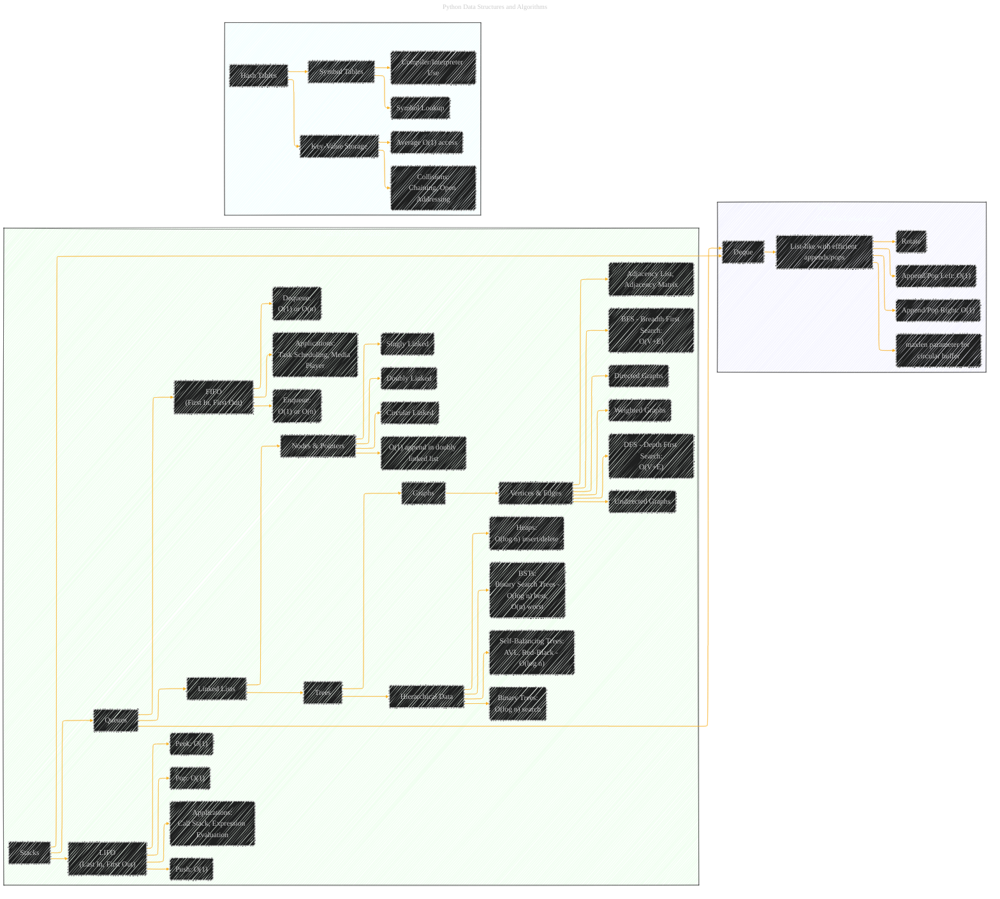

# Advanced Data Structures
> **Disclaimer:**
>
> This document contains my personal notes on the topic,
> compiled from publicly available documentation and various cited sources.
> The materials are intended for educational purposes, personal study, and reference.
> The content is dual-licensed:
> 1. **MIT License:** Applies to all code implementations (Swift, Mermaid, and other programming languages).
> 2. **Creative Commons Attribution 4.0 International License (CC BY 4.0):** Applies to all non-code content, including text, explanations, diagrams, and illustrations.
---

## A Diagrammatic Guide 

Here's a more comprehensive Mermaid diagram for "Advanced Data Structures," drawing from the provided text and expanding on the concepts:

----

**Key Improvements and Expansions:**

*   **More Detail for Each Structure:** Each data structure now includes more specific operations and characteristics.
*   **Time Complexity:** Key operations (e.g., push, pop, enqueue, dequeue) are now annotated with their typical time complexities (Big O notation).  This is crucial for understanding performance.
*   **Applications:** Real-world use cases for each data structure are listed to give more context.
*   **Tree Specializations:**  The "Trees" section is expanded to include Binary Search Trees (BSTs) and Self-Balancing Trees.
*    **Heaps**: Added heaps to provide different ordering for elements and its time complexity.
*   **Graphs:** Graph representation techniques such as adjacency lists and adjacency matrices, plus the Breadth First Search (BFS) and Depth First Search (DFS) algorithms are listed.
*   **Deques and Circular Buffers:** Added `Deque` data structure with its utility to be a circular buffer.
*   **Hashing and Symbol Tables:** Added the `Hashing & Symbol Tables` from chapter 7 in original document and linked with its feature details.

---
**Licenses:**

- **MIT License:**   - Full text in [LICENSE](LICENSE) file.
- **Creative Commons Attribution 4.0 International:**  - Legal details in [LICENSE-CC-BY](LICENSE-CC-BY) and at [Creative Commons official site](http://creativecommons.org/licenses/by/4.0/).

---