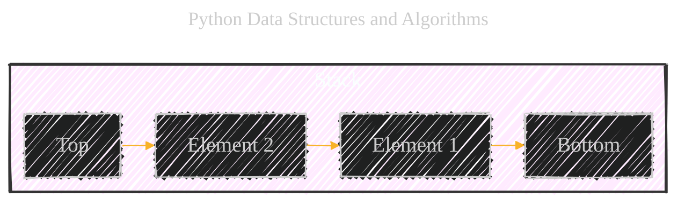
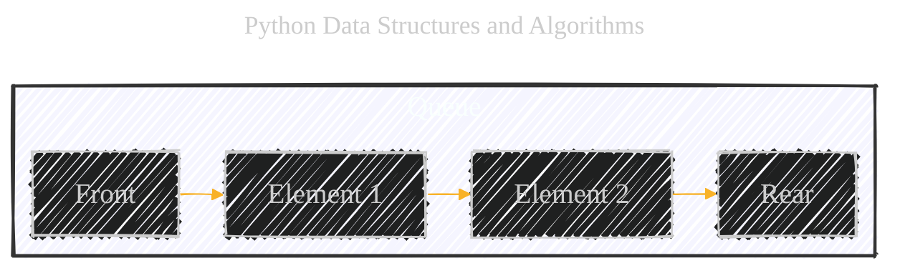
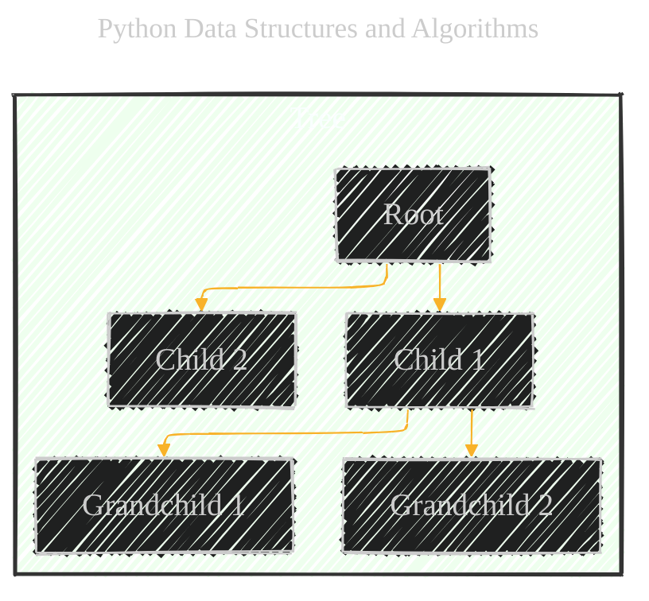
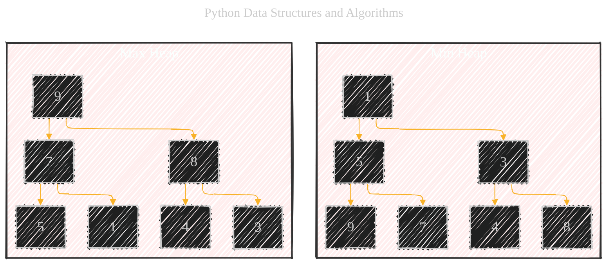
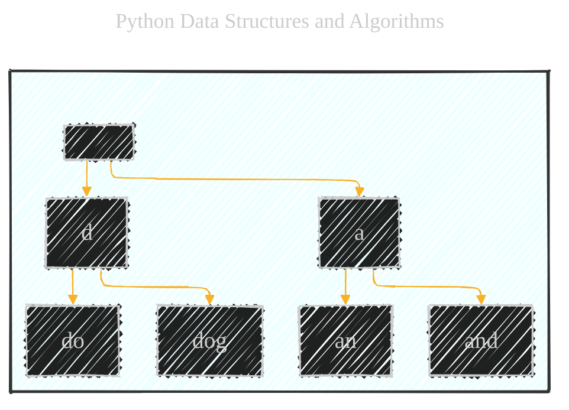
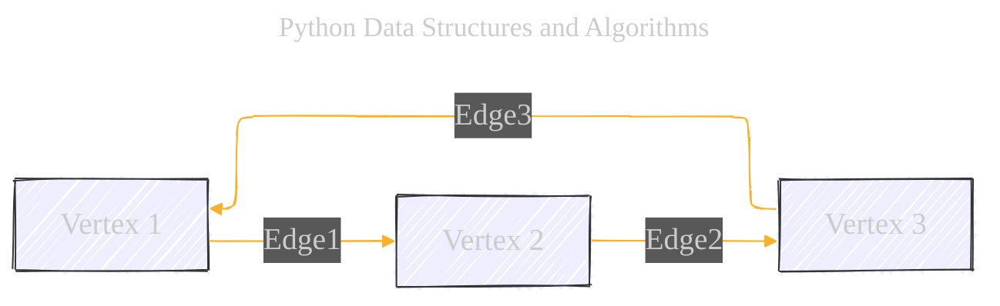
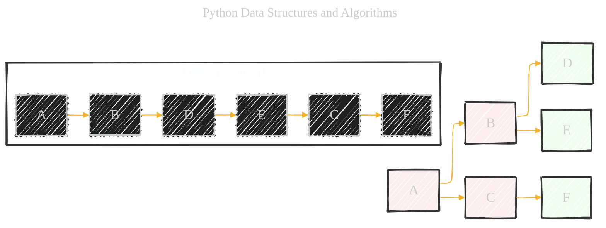
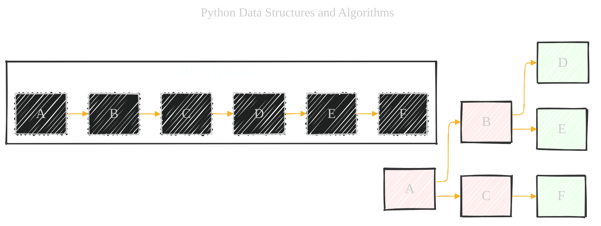

# Advanced Data Structures
> **Disclaimer:**
>
> This document contains my personal notes on the topic,
> compiled from publicly available documentation and various cited sources.
> The materials are intended for educational purposes, personal study, and reference.
> The content is dual-licensed:
> 1. **MIT License:** Applies to all code implementations (Swift, Mermaid, and other programming languages).
> 2. **Creative Commons Attribution 4.0 International License (CC BY 4.0):** Applies to all non-code content, including text, explanations, diagrams, and illustrations.
---


This document is an expansion of the initial version [here](./Advanced_Data_Structures_Draft_1.md), exploring advanced data structures in Python, focusing on their implementation, operations, time complexities, and applications. We will cover stacks, queues, trees, and graphs.

### Stacks

A stack is a linear data structure that follows the **Last-In, First-Out (LIFO)** principle.  Think of it like a stack of plates: you can only add or remove plates from the top.



#### Implementation

Stacks can be implemented using either nodes (linked lists) or lists (arrays).

*   **Node-Based:** Each element is a node containing data and a pointer to the next node.  This offers dynamic resizing.
*   **List-Based:**  Uses a Python list.  Simpler to implement but may have performance implications for very large stacks (due to potential list resizing).

#### Operations

*   **Push:** Adds an element to the top of the stack.  Time Complexity: O(1).
*   **Pop:** Removes and returns the top element from the stack. Time Complexity: O(1).
*   **Peek:** Returns the top element without removing it. Time Complexity: O(1).
*   **IsEmpty:** Checks if the stack is empty. Time Complexity: O(1).
*   **Size:** Returns the number of elements in the stack. Time Complexity: O(1).

#### Application

*   **Bracket Matching:**  Ensuring that opening and closing brackets (e.g., `()`, `[]`, `{}`) are balanced in an expression.
*   **Function Call Stack:**  Managing function calls in a program.
*   **Undo/Redo Functionality:** Implementing undo and redo operations in applications.
* **Depth-First Search (DFS):** Used in graph traversal (discussed later).
* **Backtracking Algorithms:** Used in solving constraint satisfaction problems.

### Queues

A queue is a linear data structure that follows the **First-In, First-Out (FIFO)** principle.  Think of it like a queue of people waiting in line: the first person in line is the first person served.



#### Implementation

Queues can be implemented using:

*   **Node-Based:**  Each element is a node with data and a pointer to the next node.
*   **List-Based:** Uses a Python list.  `append()` for enqueue and `pop(0)` for dequeue.  However, `pop(0)` is O(n), making this inefficient for large queues.
*   **Stack-Based (Two Stacks):** Uses two stacks to simulate a queue.  Enqueue is O(1) (push to the first stack). Dequeue is amortized O(1) (elements are moved from the first stack to the second stack only when the second stack is empty).
* **`collections.deque`:** Python's `deque` (double-ended queue) class from the `collections` module provides an efficient implementation, offering O(1) for both enqueue and dequeue operations from both ends. This is the preferred approach for most queue implementations in Python.

#### Operations

*   **Enqueue:** Adds an element to the rear of the queue.
    *   List/Node: O(1)
    *   Stack-Based: O(1) amortized
    *   `collections.deque`: O(1)
*   **Dequeue:** Removes and returns the front element of the queue.
    *   List: O(n)
    *   Node: O(1)
    *   Stack-Based: O(1) amortized
    *   `collections.deque`: O(1)
*   **Peek:** Returns the front element without removing it. Time Complexity: O(1).
*   **IsEmpty:** Checks if the queue is empty. Time Complexity: O(1).
*   **Size:** Returns the number of elements in the queue. Time Complexity: O(1).

#### Application

*   **Media Player Queue:** Managing a playlist of songs or videos.
*   **Print Queue:**  Handling print jobs sent to a printer.
*   **Operating System Task Scheduling:**  Managing processes waiting for CPU time.
*   **Breadth-First Search (BFS):** Used in graph traversal (discussed later).
* **Asynchronous Task Processing:** Managing tasks in web servers and other concurrent systems.

### Trees

Trees are hierarchical data structures, unlike the linear structures of stacks and queues.  A tree consists of nodes connected by edges.



#### Key Concepts

*   **Root:** The topmost node in the tree.
*   **Child:** A node directly connected to another node when moving away from the root.
*   **Parent:** The converse notion of a child.
*   **Siblings:** Nodes with the same parent.
*   **Leaf:** A node with no children.
*   **Edge:** The connection between two nodes.
*   **Depth of a Node:** The number of edges from the root to the node.
*   **Height of a Node:** The number of edges on the longest path from the node to a leaf.
*   **Height of a Tree:** The height of the root node.

#### Types

*   **Binary Trees:** Each node has at most two children (left and right).

```mermaid
---
title: "Python Data Structures and Algorithms"
author: "Cong Le"
version: "1.0"
license(s): "MIT, CC BY 4.0"
copyright: "Copyright (c) 2025 Cong Le. All Rights Reserved."
config:
  layout: elk
  look: handDrawn
  theme: dark
---
%%%%%%%% Mermaid version v11.4.1-b.14
%%%%%%%% Toggle theme value to `base` to activate the initilization below for the customized theme version.
%%%%%%%% Available curve styles include the following keywords:
%% basis, bumpX, bumpY, cardinal, catmullRom, linear, monotoneX, monotoneY, natural, step, stepAfter, stepBefore.
%%{
  init: {
    "graph": { "htmlLabels": false, 'curve': 'linear' },
    'themeVariables': {
        'fontFamily': 'Comic Sans MS',
        'fontSize': '20px',
        'primaryColor': '#ffff',
        'primaryTextColor': '#55ff',
        'primaryBorderColor': '#7c2',
        'lineColor': '#F8B229',
        'secondaryColor': '#006100',
        'tertiaryColor': '#fff'
    }
  }
}%%
graph TD
    A[Root] --> B[Left Child]
    A --> C[Right Child]
    B --> D[Left Grandchild]
    B --> E[Right Grandchild]
 ```

*   **Binary Search Trees (BSTs):**  A special type of binary tree where the value of each node in the left subtree is less than the node's value, and the value of each node in the right subtree is greater than the node's value.  This ordering allows for efficient searching, insertion, and deletion.

```mermaid
---
title: "Python Data Structures and Algorithms"
author: "Cong Le"
version: "1.0"
license(s): "MIT, CC BY 4.0"
copyright: "Copyright (c) 2025 Cong Le. All Rights Reserved."
config:
  layout: elk
  look: handDrawn
  theme: dark
---
%%%%%%%% Mermaid version v11.4.1-b.14
%%%%%%%% Toggle theme value to `base` to activate the initilization below for the customized theme version.
%%%%%%%% Available curve styles include the following keywords:
%% basis, bumpX, bumpY, cardinal, catmullRom, linear, monotoneX, monotoneY, natural, step, stepAfter, stepBefore.
%%{
  init: {
    "graph": { "htmlLabels": false, 'curve': 'linear' },
    'themeVariables': {
        'fontFamily': 'Comic Sans MS',
        'fontSize': '20px',
        'primaryColor': '#ffff',
        'primaryTextColor': '#55ff',
        'primaryBorderColor': '#7c2',
        'lineColor': '#F8B229',
        'secondaryColor': '#006100',
        'tertiaryColor': '#fff'
    }
  }
}%%
graph TD
    subgraph BST
    A[8] --> B[3]
    A --> C[10]
    B --> D[1]
    B --> E[6]
    C --> F[14]
    E --> G[4]
    E --> H[7]
    F --> I[13]
    end
    style BST fill:#aaf3,stroke:#333,stroke-width:2px

```

    *   **Search:** O(log n) on average (for a balanced tree), O(n) in the worst case (skewed tree).
    *   **Insertion:** O(log n) on average, O(n) in the worst case.
    *   **Deletion:** O(log n) on average, O(n) in the worst case.

*   **Heaps:**  A specialized tree-based data structure that satisfies the heap property:
    *   **Min Heap:** The value of each node is greater than or equal to the value of its parent.  The minimum value is at the root.  Used for priority queues.
    *   **Max Heap:** The value of each node is less than or equal to the value of its parent.  The maximum value is at the root.



    *   **Insert:** O(log n)
    *   **Delete Min/Max:** O(log n)
    *   **Get Min/Max:** O(1)

*   **Trie (Prefix Tree):**  A tree-like structure used for storing a dynamic set or associative array where the keys are usually strings.


    * **Search:** O(m) where m is the length of the key.
    * **Insert:** O(m)
    * **Delete:** O(m)

#### Traversal

*   **Depth-First Traversal:**  Explores as far as possible along each branch before backtracking.
    *   **Inorder (Left, Root, Right):**  Processes the left subtree, then the current node, then the right subtree.  For a BST, this visits nodes in sorted order.
    *   **Preorder (Root, Left, Right):** Processes the current node, then the left subtree, then the right subtree.
    *   **Postorder (Left, Right, Root):** Processes the left subtree, then the right subtree, then the current node.

*   **Breadth-First Traversal (Level Order):**  Visits all nodes at the current level before moving to the next level. Uses a queue.

#### Balancing

*   **Self-Balancing Trees:**  Automatically adjust their structure during insertion and deletion to maintain a balanced tree, ensuring logarithmic time complexity for operations.  Examples include:
    *   **Red-Black Trees:**  Uses "color" properties (red or black) for nodes to maintain balance.
    *   **AVL Trees:**  Uses height balancing to ensure that the heights of the two child subtrees of any node differ by at most one.

*   **External Balancing:**  Balancing operations are performed after insertion or deletion, rather than during.

### Graphs

Graphs are non-linear data structures consisting of vertices (nodes) and edges that connect them. Graphs can represent relationships between objects.



#### Types

*   **Directed Graphs (Digraphs):** Edges have a direction (e.g., A -> B is different from B -> A).
*   **Undirected Graphs:** Edges have no direction (A -- B is the same as B -- A).
*   **Weighted Graphs:**  Edges have associated weights (e.g., representing distance, cost, or capacity).
*   **Cyclic Graphs:** Contain cycles (paths that start and end at the same vertex).
*   **Acyclic Graphs:** Do not contain cycles.  A Directed Acyclic Graph (DAG) is a directed graph with no cycles.

#### Representations

*   **Adjacency List:**  Each vertex stores a list of its adjacent vertices.  Efficient for sparse graphs (graphs with relatively few edges).
*   **Adjacency Matrix:**  A 2D array where `matrix[i][j]` is 1 if there's an edge from vertex `i` to vertex `j`, and 0 otherwise.  Efficient for dense graphs (graphs with many edges).  For weighted graphs, the matrix can store the weights instead of just 0 or 1.

#### Traversal

*   **Depth-First Search (DFS):**  Explores as far as possible along each branch before backtracking.  Uses a stack (often implemented recursively, which implicitly uses the call stack).


*   **Breadth-First Search (BFS):**  Visits all neighbors of a vertex before moving to the next level.  Uses a queue.



#### Graph Algorithms

*   **Shortest Path:**
    *   **Dijkstra's Algorithm:** Finds the shortest path from a source vertex to all other vertices in a weighted graph with non-negative edge weights. Uses a priority queue (often implemented with a min-heap).  Time Complexity: O(E log V) where E is the number of edges and V is the number of vertices.
    *   **Bellman-Ford Algorithm:** Finds the shortest path from a source vertex to all other vertices in a weighted graph, even if some edge weights are negative.  Can detect negative cycles. Time Complexity: O(V * E).
    * **Floyd-Warshall Algorithm:** Finds the shortest paths between all pairs of vertices in a weighted graph. Time complexity: O(V^3).

* **Minimum Spanning Tree (MST):** A spanning tree of a connected, undirected, weighted graph that has the minimum total edge weight.
   * **Prim's Algorithm:**  Starts with a single vertex and grows the MST by repeatedly adding the minimum-weight edge that connects a vertex in the MST to a vertex outside the MST. Uses a priority queue. Time Complexity: O(E log V).
   * **Kruskal's Algorithm:** Sorts edges by weight and repeatedly adds the minimum-weight edge that does not create a cycle. Uses the Disjoint Set data structure to efficiently check for cycles. Time Complexity: O(E log E) or O(E log V) (since E is at most V^2).

*   **Topological Sort:**  A linear ordering of vertices in a Directed Acyclic Graph (DAG) such that for every directed edge from vertex A to vertex B, vertex A comes before vertex B in the ordering. Used for scheduling tasks with dependencies. Time Complexity: O(V + E).

*   **Cycle Detection:**
    *   **Undirected Graphs:** Can be done using DFS.  If a back edge (an edge to an ancestor in the DFS tree) is found, there's a cycle.
    *   **Directed Graphs:**  Can be done using DFS.  If a back edge (an edge to a vertex currently on the recursion stack) is found, there's a cycle.

*   **Strongly Connected Components:**  Finding subsets of vertices in a directed graph where there's a path between any two vertices in the subset.  Kosaraju's algorithm and Tarjan's algorithm are commonly used.  Time Complexity: O(V + E).

### Big O Notation

Big O notation is used to describe the performance or complexity of an algorithm. It specifically describes the worst-case scenario, and can be used to describe the execution time required or the space used (e.g., in memory or on disk) by an algorithm.

* **O(1):** Constant time. The algorithm takes the same amount of time regardless of the input size.
* **O(log n):** Logarithmic time. The algorithm's running time increases logarithmically with the input size.  Common in binary search and balanced tree operations.
* **O(n):** Linear time. The algorithm's running time increases linearly with the input size.
* **O(n log n):**  Log-linear time.  Common in efficient sorting algorithms like merge sort and heap sort.
* **O(n^2):** Quadratic time. The algorithm's running time increases quadratically with the input size.  Common in nested loops.
* **O(2^n):** Exponential time. The algorithm's running time doubles with each addition to the input data set.
* **O(n!):** Factorial time.  The algorithm's running time grows factorially with the input size.

### Practical Examples with Python Code

#### Stack (List-Based)

```python
class Stack:
    def __init__(self):
        self.items = []

    def push(self, item):
        self.items.append(item)

    def pop(self):
        if not self.is_empty():
            return self.items.pop()
        return None

    def peek(self):
        if not self.is_empty():
            return self.items[-1]
        return None

    def is_empty(self):
        return len(self.items) == 0

    def size(self):
        return len(self.items)

# Example usage
stack = Stack()
stack.push(1)
stack.push(2)
stack.push(3)
print(f"Top element: {stack.peek()}")  # Output: Top element: 3
print(f"Popped element: {stack.pop()}")  # Output: Popped element: 3
print(f"Stack size: {stack.size()}")  # Output: Stack size: 2
```

#### Queue (`collections.deque`)

```python
from collections import deque

class Queue:
    def __init__(self):
        self.items = deque()

    def enqueue(self, item):
        self.items.append(item)

    def dequeue(self):
        if not self.is_empty():
            return self.items.popleft()
        return None

    def peek(self):
        if not self.is_empty():
            return self.items[0]
        return None
    
    def is_empty(self):
        return len(self.items) == 0
    
    def size(self):
        return len(self.items)
        
# Example
queue = Queue()
queue.enqueue(1)
queue.enqueue(2)
queue.enqueue(3)
print(f"Front Element: {queue.peek()}") # Output: Front Element: 1
print(f"Dequeue Element: {queue.dequeue()}") # Output: Dequeue Element: 1
print(f"Queue Size: {queue.size()}") # Output: Queue Size: 2
```

#### Binary Search Tree

```python
class Node:
    def __init__(self, key):
        self.key = key
        self.left = None
        self.right = None

class BST:
    def __init__(self):
        self.root = None

    def insert(self, key):
        self.root = self._insert_recursive(self.root, key)

    def _insert_recursive(self, node, key):
        if node is None:
            return Node(key)
        if key < node.key:
            node.left = self._insert_recursive(node.left, key)
        elif key > node.key:
            node.right = self._insert_recursive(node.right, key)
        return node

    def search(self, key):
        return self._search_recursive(self.root, key)

    def _search_recursive(self, node, key):
        if node is None or node.key == key:
            return node
        if key < node.key:
            return self._search_recursive(node.left, key)
        return self._search_recursive(node.right, key)

    def inorder_traversal(self):
        result = []
        self._inorder_recursive(self.root, result)
        return result
    
    def _inorder_recursive(self, node, result):
        if node:
            self._inorder_recursive(node.left, result)
            result.append(node.key)
            self._inorder_recursive(node.right, result)

# Example
bst = BST()
bst.insert(5)
bst.insert(3)
bst.insert(7)
bst.insert(2)
bst.insert(4)
bst.insert(6)
bst.insert(8)
print(f"Inorder Traversal: {bst.inorder_traversal()}") # Output: Inorder Traversal: [2, 3, 4, 5, 6, 7, 8]
print(f"Search for 4: {bst.search(4) != None }") # Output: Search for 4: True
print(f"Search for 9: {bst.search(9) != None}") # Output: Search for 9: False
```

#### Heap (using `heapq`)

```python
import heapq

class MinHeap:
    def __init__(self):
        self.heap = []

    def push(self, item):
        heapq.heappush(self.heap, item)

    def pop(self):
        if not self.is_empty():
            return heapq.heappop(self.heap)
        return None

    def peek(self):  # Renamed from get_min to peek for consistency
        if not self.is_empty():
            return self.heap[0]
        return None

    def is_empty(self):
        return len(self.heap) == 0

    def size(self):
        return len(self.heap)
#Example Usage
min_heap = MinHeap()
min_heap.push(5)
min_heap.push(3)
min_heap.push(7)
min_heap.push(1)
print(f"Min Element: {min_heap.peek()}") # Output: Min Element: 1
print(f"Pop Element: {min_heap.pop()}")   # Output: Pop Element: 1
print(f"Heap Size: {min_heap.size()}")   # Output: Heap Size: 3

```

#### Graph (Adjacency List)

```python
class Graph:
    def __init__(self):
        self.graph = {}

    def add_vertex(self, vertex):
        if vertex not in self.graph:
            self.graph[vertex] = []

    def add_edge(self, vertex1, vertex2):
        self.add_vertex(vertex1)
        self.add_vertex(vertex2)
        self.graph[vertex1].append(vertex2)
        self.graph[vertex2].append(vertex1)  # For undirected graph

    def dfs(self, start_vertex):
        visited = set()
        self._dfs_recursive(start_vertex, visited)

    def _dfs_recursive(self, vertex, visited):
        visited.add(vertex)
        print(vertex, end=" ")
        for neighbor in self.graph[vertex]:
            if neighbor not in visited:
                self._dfs_recursive(neighbor, visited)

    def bfs(self, start_vertex):
        visited = set()
        queue = deque([start_vertex])
        visited.add(start_vertex)
        while queue:
            vertex = queue.popleft()
            print(vertex, end=" ")
            for neighbor in self.graph[vertex]:
                if neighbor not in visited:
                    visited.add(neighbor)
                    queue.append(neighbor)

# Example
graph = Graph()
graph.add_edge('A', 'B')
graph.add_edge('A', 'C')
graph.add_edge('B', 'D')
graph.add_edge('B', 'E')
graph.add_edge('C', 'F')
print("DFS Traversal:") # Output: DFS Traversal: A B D E C F
graph.dfs('A')
print("\nBFS Traversal:") # Output: BFS Traversal: A B C D E F
graph.bfs('A')
print()
```

---

This comprehensive guide covers the fundamental advanced data structures in Python.  Understanding these structures and their associated algorithms is crucial for writing efficient and well-structured code. Remember to choose the appropriate data structure based on the specific requirements of your problem. Using Python's built-in libraries like `collections.deque` and `heapq` can significantly improve performance and code readability.


---
**Licenses:**

- **MIT License:**  [](LICENSE) - Full text in [LICENSE](LICENSE) file.
- **Creative Commons Attribution 4.0 International:** [](LICENSE-CC-BY) - Legal details in [LICENSE-CC-BY](LICENSE-CC-BY) and at [Creative Commons official site](http://creativecommons.org/licenses/by/4.0/).

---