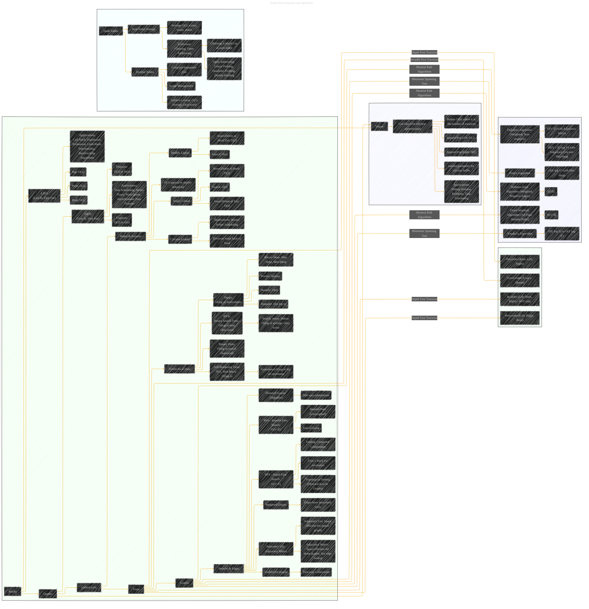

# Advanced Data Structures
> **Disclaimer:**
>
> This document contains my personal notes on the topic,
> compiled from publicly available documentation and various cited sources.
> The materials are intended for educational purposes, personal study, and reference.
> The content is dual-licensed:
> 1. **MIT License:** Applies to all code implementations (Swift, Mermaid, and other programming languages).
> 2. **Creative Commons Attribution 4.0 International License (CC BY 4.0):** Applies to all non-code content, including text, explanations, diagrams, and illustrations.
---

This document is an expansion of the initial version [here](./Advanced_Data_Structures_Draft_1.md), providing a comprehensive overview of advanced data structures and their implementations in Python, along with relevant algorithms and their complexities.  It covers stacks, queues, linked lists, trees, graphs, deques, hashing, and symbol tables, with a focus on practical applications and performance analysis.

----

## Detailed Explanations

### 1. Stacks

*   **LIFO (Last In, First Out):**  The last element added to the stack is the first element removed.
*   **Operations:**
    *   `Push`: Adds an element to the top of the stack.  O(1) time complexity.
    *   `Pop`: Removes the top element from the stack. O(1) time complexity.
    *   `Peek`:  Returns the top element without removing it. O(1) time complexity.
    *   `isEmpty`: Checks if the stack is empty. O(1) time complexity.
*   **Applications:**
    *   **Call Stack:**  Managing function calls in program execution.
    *   **Expression Evaluation:**  Converting infix expressions to postfix and evaluating them.
    *   **Undo/Redo Functionality:**  Storing previous states for undo operations.
    * **Backtracking Algorithms:** Explore the options and revert back if a dead end is found.

---

### 2. Queues

*   **FIFO (First In, First Out):** The first element added to the queue is the first element removed.
*   **Operations:**
    *   `Enqueue`: Adds an element to the rear of the queue.  O(1) for most Python implementations (using `collections.deque`), but can be O(n) for list-based implementations if resizing is needed.
    *   `Dequeue`: Removes the front element from the queue. O(1) for `collections.deque`, O(n) for list-based implementations.
    *   `isEmpty`: Checks if the queue is empty.  O(1).
    *   `isFull`: Checks if the queue is full (relevant for fixed-size queues). O(1)
*   **Applications:**
    *   **Task Scheduling:**  Managing tasks in operating systems or applications.
    *   **Media Player Queues:**  Storing songs or videos to be played.
    *   **Print Queues:**  Managing print jobs.
    *   **Asynchronous Data Transfer:** Handling data streams between processes.

---

### 3. Linked Lists

*   **Nodes & Pointers:**  Data is stored in nodes, each containing a data element and a pointer (reference) to the next node.
*   **Types:**
    *   **Singly Linked List:**  Each node points to the next node.
        *   Insert/Delete at Head: O(1)
        *   Insert/Delete at Tail: O(n) (unless a tail pointer is maintained)
        *   Search: O(n)
    *   **Doubly Linked List:** Each node points to both the next and previous nodes.
        *   Insert/Delete at Head/Tail: O(1)
        *   Search: O(n)
    *   **Circular Linked List:**  The last node's pointer points back to the head.
        *   Useful for applications where continuous looping is required (e.g., Round Robin scheduling).
* **Advantages over Arrays**: Dynamic size. Efficient insertion/deletion in the middle (for doubly linked lists).
* **Disadvantages over Arrays**: No constant-time random access. Extra memory overhead for pointers.

---

### 4. Trees

*   **Hierarchical Data Structure:**  Data is organized in a hierarchy of nodes, with a root node and child nodes.
*   **Types:**
    *   **Binary Tree:**  Each node has at most two children (left and right).
    *   **Binary Search Tree (BST):**  A binary tree where the left child's value is less than the parent's value, and the right child's value is greater.
        *   Search, Insert, Delete: O(log n) average case (balanced tree), O(n) worst case (skewed tree).
    *   **Self-Balancing Trees (AVL, Red-Black):**  Trees that automatically adjust their structure to maintain balance, ensuring O(log n) performance for all operations.
    *   **Heaps:**  A complete binary tree (all levels are filled except possibly the last, which is filled from left to right) that satisfies the heap property (min-heap or max-heap).
        *   **Min-Heap:**  The value of each node is less than or equal to the value of its children.
        *   **Max-Heap:**  The value of each node is greater than or equal to the value of its children.
        *   Insert/Delete: O(log n)
        *   Heapify (build a heap from an array): O(n)
        *   Heapsort: O(n log n) sorting algorithm.  Uses a heap to efficiently sort an array.
*   **Tree Traversal:**
    *   **Depth-First Traversal:**
        *   **Pre-order:** Visit the root, then the left subtree, then the right subtree.
        *   **In-order:** Visit the left subtree, then the root, then the right subtree (BSTs only - produces sorted output).
        *   **Post-order:** Visit the left subtree, then the right subtree, then the root.
    *   **Breadth-First Traversal (Level-order):**  Visit nodes level by level, using a queue.

---

### 5. Graphs

*   **Vertices & Edges:**  Data is represented as a set of vertices (nodes) and edges (connections between vertices).
*   **Types:**
    *   **Directed Graphs (Digraphs):**  Edges have a direction (one-way).
    *   **Undirected Graphs:** Edges have no direction (two-way).
    *   **Weighted Graphs:**  Edges have associated weights (costs).
*   **Representations:**
    *   **Adjacency List:**  Each vertex stores a list of its adjacent vertices.  Space-efficient for sparse graphs (few edges).
    *   **Adjacency Matrix:**  A 2D array where `matrix[i][j]` indicates the presence (or weight) of an edge between vertex `i` and vertex `j`. Space-efficient for dense graphs (many edges), provides fast edge lookup.
*   **Graph Algorithms:**
    *   **Breadth-First Search (BFS):**  Explores the graph level by level, using a queue.  Finds the shortest path in unweighted graphs. O(V+E) time complexity.
    *   **Depth-First Search (DFS):**  Explores the graph by going as deep as possible along each branch before backtracking, using a stack (or recursion). O(V+E) time complexity.  Useful for topological sorting (directed acyclic graphs) and finding connected components.
    * **Shortest Path Algorithms**:
        *   **Dijkstra's Algorithm:**  Finds the shortest path from a source vertex to all other vertices in a weighted graph with non-negative edge weights. O(V^2) with an adjacency matrix, O((V + E) log V) with an adjacency list and a min-heap.
        *   **Bellman-Ford Algorithm:**  Finds the shortest path in a weighted graph that may contain negative edge weights (but no negative cycles). O(VE) time complexity.
        *   **Floyd-Warshall Algorithm:**  Finds the shortest paths between all pairs of vertices in a weighted graph. O(V^3) time complexity.
    * **Minimum Spanning Tree**:
        *   **Prim's Algorithm:** Finds a minimum spanning tree (a tree that connects all vertices with the minimum total edge weight) for a weighted, undirected graph. O(E log V) with a min-heap.
        *   **Kruskal's Algorithm:**  Another algorithm for finding a minimum spanning tree. O(E log E) or O(E log V) time complexity.

---

### 6. Deque (Double-Ended Queue)

*   **List-like with Efficient Appends/Pops:**  Allows efficient addition and removal of elements from both ends.
*   **Operations:**
    *   `appendleft`: Adds an element to the left. O(1)
    *   `append`: Adds an element to the right. O(1)
    *   `popleft`: Removes an element from the left. O(1)
    *   `pop`: Removes an element from the right. O(1)
    *   `rotate`: Rotates the deque by a specified number of steps. O(k), where k is the number of rotations.
    * `maxlen`: Optional parameter to create a bounded deque (circular buffer).
*   **Applications:**
    *   **Sliding Window Problems:**  Maintaining a window of elements in a stream.
    *   **Task Scheduling:** Can be used for scheduling tasks with different priorities.
    * Implementing stacks and queues.

----

### 7. Hashing and Symbol Tables

*   **Hash Tables:**  Data structure that uses a hash function to map keys to indices in an array (or a list of buckets).
    *   **Key-Value Storage:**  Stores data in key-value pairs.
    *   **Average O(1) access, insert, delete:**  In the average case, hash tables provide very fast operations.
    *   **Collisions:**  When different keys map to the same index.
        *   **Chaining:**  Each index stores a linked list of elements that hash to that index.
        *   **Open Addressing:**  If a collision occurs, the algorithm probes for an empty slot using techniques like:
            *   **Linear Probing:**  Checks consecutive slots.
            *   **Quadratic Probing:**  Checks slots with increasing quadratic offsets.
            *   **Double Hashing:**  Uses a second hash function to determine the probing sequence.
*   **Symbol Tables:**  A data structure used by compilers and interpreters to store information about symbols (variables, functions, etc.) in a program.
    *   **Compiler/Interpreter Use:**  Used for symbol lookup, scope management, and type checking.
    *   **Symbol Lookup:**  Finding the information associated with a symbol. O(1) average case, O(n) worst case (for hash table implementations).
    * **Scope Management:** Keeping track of which symbols are visible in different parts of the code.

---

## Mathematical Notation (LaTeX)

*   **Time Complexity:**
    *   Big O Notation:  O(n), O(log n), O(n log n), O(n^2), etc.
    *   Example:  $O(n \log n)$ (for heapsort)
*   **Heap Property (Min-Heap):**
    $$
    \forall i, \text{parent}(i) \le \text{child}(i)
    $$
*  **Heap Property (Max-Heap):**

    $$
     \forall i,  parent(i) \ge child(i)
    $$
* **Adjacency Matrix:**

  $$
  A_{ij} =
  \begin{cases}
  1, & \text{if there is an edge from vertex } i \text{ to vertex } j \\
  0, & \text{otherwise}
  \end{cases}
  $$

  For weighted graphs, $A_{ij}$ would store the weight of the edge.

* **Dijkstra's Algorithm (Shortest Path):**

  $$
    d[v] = \min(d[v], d[u] + w(u, v))
  $$

Where:
* $d[v]$ is the shortest distance from the source vertex to vertex $v$.
* $d[u]$ is the shortest distance from the source vertex to vertex $u$.
* $w(u, v)$ is the weight of the edge between vertex $u$ and vertex $v$.

* **Hash Function:**
$$
h(k) = k \mod m
$$

Where:
* $h(k)$ is the hash value for key $k$.
* $k$ is the key.
* $m$ is the size of the hash table.
This is a simple example of a hash function (division method). Other, more sophisticated hash functions exist.

---
**Licenses:**

- **MIT License:**   - Full text in [LICENSE](LICENSE) file.
- **Creative Commons Attribution 4.0 International:**  - Legal details in [LICENSE-CC-BY](LICENSE-CC-BY) and at [Creative Commons official site](http://creativecommons.org/licenses/by/4.0/).

---