# Algorithm Classifications
> **Disclaimer:**
>
> This document contains my personal notes on the topic,
> compiled from publicly available documentation and various cited sources.
> The materials are intended for educational purposes, personal study, and reference.
> The content is dual-licensed:
> 1. **MIT License:** Applies to all code implementations (Swift, Mermaid, and other programming languages).
> 2. **Creative Commons Attribution 4.0 International License (CC BY 4.0):** Applies to all non-code content, including text, explanations, diagrams, and illustrations.
---

## A Diagrammatic Guide 

Okay, here's an expanded Mermaid diagram for "Algorithm Classifications," based on the provided source material and building upon the previous structure. This version digs deeper into subcategories and related concepts.

```mermaid
---
title: "Python Data Structures and Algorithms"
author: "Cong Le"
version: "1.0"
license(s): "MIT, CC BY 4.0"
copyright: "Copyright (c) 2025 Cong Le. All Rights Reserved."
config:
  layout: elk
  look: handDrawn
  theme: dark
---
%%%%%%%% Mermaid version v11.4.1-b.14
%%%%%%%% Toggle theme value to `base` to activate the initilization below for the customized theme version.
%%%%%%%% Available curve styles include the following keywords:
%% basis, bumpX, bumpY, cardinal, catmullRom, linear, monotoneX, monotoneY, natural, step, stepAfter, stepBefore.
%%{
  init: {
    "graph": { "htmlLabels": false, 'curve': 'linear' },
    'themeVariables': {
        'fontFamily': 'Comic Sans MS',
        'fontSize': '20px',
        'primaryColor': '#ffff',
        'primaryTextColor': '#55ff',
        'primaryBorderColor': '#7c2',
        'lineColor': '#F8B229',
        'secondaryColor': '#006100',
        'tertiaryColor': '#fff'
    }
  }
}%%
graph LR
    A["Algorithm Classifications"] --> B{"By Implementation"}
    style A fill:#a3a3,stroke:#333,stroke-width:1px
    B --> C["Recursive"]:::detail
    C --> CA["Base Cases & Recursive Calls"]
    C --> CB["Stack Overflow Risk"]
    C --> CC["Divide and Conquer often recursive"]

    B --> D["Iterative"]:::detail
    D --> DA["Loops<br>(while, for)"]
    D --> DB["Direct Step-by-Step Execution"]
    B --> E["Logical"]:::detail
    E --> EA["Axioms and Deductions"]
    E --> EB["Prolog, Datalog"]
    E --> EC["Algorithm = Logic + Control"]

    B --> F["Serial<br>(Sequential)"]:::detail
    F --> FA["One Instruction at a Time"]
    B --> G["Parallel / Distributed"]:::detail
    G --> GA["Multiple Processors"]
    G --> GB["Shared or Distributed Memory"]
    G --> GC["Amdahl's Law Considerations"]

    B --> H["Deterministic"]:::detail
    H --> HA["Predictable Output"]
    H --> I["Nondeterministic"]:::detail
    I --> IA["Unpredictable Output"]
    I --> IB["Uses Randomness or Probabilistic Choices"]
    I --> IC["Monte Carlo Algorithms"]
    
    A --> J{"By Design Paradigm"}
        J --> K["Divide & Conquer"]:::detail
        K --> KA["Recursive Problem Decomposition"]
        K --> KB["Merge Sort, Quick Sort"]
        J --> L["Dynamic Programming"]:::detail
        L --> LA["Optimal Substructure"]
        L --> LB["Overlapping Subproblems"]
        L --> LC["Memoization & Tabulation"]
        J --> M["Greedy Algorithms"]:::detail
        M --> MA["Local Optimality Choice"]
        M --> MB["Potential Suboptimality"]
        M --> MC["Dijkstra's, Coin Change"]
    
    A --> N{"By Problem Type"}
    N --> O["Searching"]:::detail
        O --> OA["Linear Search"]
        O --> OB["Binary Search"]
        O --> OC["Interpolation Search"]
        N --> P["Sorting"]:::detail
            P --> PA["Comparison Based<br>(Bubble, Insertion, Merge, Quick)"]
            P --> PB["Non-Comparison Based<br>(Counting, Radix)"]
                P --> PC["In-Place vs. Out-of-Place"]
        N --> Q["Graph Algorithms"]:::detail
        Q --> QA["Shortest Path<br>(Dijkstra, Bellman-Ford)"]
        Q --> QB["Minimum Spanning Tree<br>(Prim's, Kruskal's)"]
    
    A --> R{"By Complexity Class"}
        R --> S["P<br>(Polynomial Time)"]:::detail
        S --> SA["Easily Solvable"]
        R --> T["NP<br>(Nondeterministic Polynomial Time)"]:::detail
        T --> TA["Verifiable in Polynomial Time"]
        T --> TB["P = NP ?<br>(Unresolved)"]
        R --> U["NP-Hard"]:::detail
        U --> UA["At Least as Hard as NP Problems"]
        R --> V["NP-Complete"]:::detail
        V --> VA["Both NP and NP-Hard"]

    classDef detail fill:#f9c3,stroke:#333,stroke-width:1px

```

---

**Key improvements and expansions**

*   **More Detail in Implementation:**  Added sub-nodes to `Recursive`, `Iterative`, `Logical`, `Serial`, `Parallel`, and `Deterministic` to provide a more complete picture of each implementation type.
*   **Examples of Problems:** Specific algorithms are now listed as examples under the `By Design Paradigm` and `By Problem Type` categories to illustrate the connection between problem type and algorithmic approach.
*   **Expanded Problem Types:** Added categories like `Graph Algorithms` and linked them to relevant algorithms.
*   **Complexity Classifications Deep Dive:** Explored `P`, `NP`, `NP-Hard`, and `NP-Complete` in more detail.

---
**Licenses:**

- **MIT License:**   - Full text in [LICENSE](LICENSE) file.
- **Creative Commons Attribution 4.0 International:**  - Legal details in [LICENSE-CC-BY](LICENSE-CC-BY) and at [Creative Commons official site](http://creativecommons.org/licenses/by/4.0/).

---