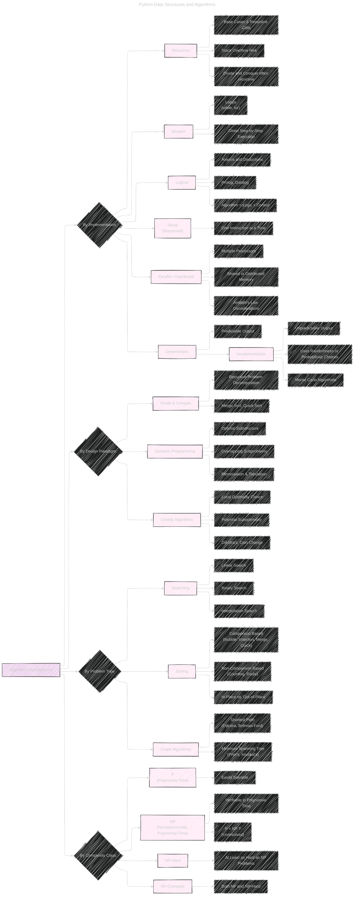

# Algorithm Classifications
> **Disclaimer:**
>
> This document contains my personal notes on the topic,
> compiled from publicly available documentation and various cited sources.
> The materials are intended for educational purposes, personal study, and reference.
> The content is dual-licensed:
> 1. **MIT License:** Applies to all code implementations (Swift, Mermaid, and other programming languages).
> 2. **Creative Commons Attribution 4.0 International License (CC BY 4.0):** Applies to all non-code content, including text, explanations, diagrams, and illustrations.
---


This document is an expansion of the initial version [here](./Algorithm_Classifications.md), providing a detailed exploration of algorithm classifications within the context of Python, delving into various paradigms, problem types, and complexity classes.



---

## I. Algorithm Classification: By Implementation

This section categorizes algorithms based on their underlying implementation strategies.

### 1. Recursive Algorithms

*   **Definition:**  Algorithms that call themselves with modified input values, progressing towards one or more *base cases* that terminate the recursion.
*   **Key Characteristics:**
    *   **Base Cases:** Essential conditions that stop the recursive calls, preventing infinite loops.
    *   **Recursive Calls:** The function calls itself, typically with a smaller or simpler input.
    *   **Stack Usage:** Each recursive call adds a frame to the call stack, potentially leading to *stack overflow* if the recursion is too deep (many nested calls).
*   **Example (Python):**  Factorial calculation.

    ```python
    def factorial(n):
        if n == 0:  # Base case
            return 1
        else:
            return n * factorial(n - 1)  # Recursive call
    ```
* **Advantages:**
    *  Elegance and Readability: Recursive code for some problems.
    *   Natural Fit: Divide-and-conquer strategies.
*   **Disadvantages:**
    *   Stack Overflow: Deep recursion can exceed stack limits.
    *   Overhead: Function calls have overhead, potentially making recursion slower than iteration for some problems.
    *   Debugging: Sometimes be harder to trace the execution flow.

---

### 2. Iterative Algorithms

*   **Definition:** Algorithms that use loops (e.g., `for`, `while`) to repeat a block of code until a condition is met.
*   **Key Characteristics:**
    *   **Loops:**  Control the repetition of instructions.
    *   **Direct Execution:**  Step-by-step processing without function call overhead.
    *   **State Management:**  Variables explicitly track the algorithm's progress.
*   **Example (Python):**  Factorial calculation (iterative).

    ```python
    def factorial_iterative(n):
        result = 1
        for i in range(1, n + 1):
            result *= i
        return result
    ```
* **Advantages:**
     * Efficiency: No function call overhead.
     *  Stack Safety: No risk of stack overflow.
*   **Disadvantages:**
    *   Readability: For some problems, iterative code can be less intuitive.
    *   Complexity: Managing loop variables and conditions can be more complex in certain cases.

---

### 3. Logical Algorithms

* **Definition:** Algorithm defined by a logical deduction.
* **Example:** Prolog, Datalog.
* **Key Equation:**
    ```latex
    \text{Algorithm} = \text{Logic} + \text{Control}
    ```

---

### 4. Serial (Sequential) Algorithms

*   **Definition:** Instructions are executed one after another, in a strictly sequential manner.  This is the most common type of algorithm and the default assumption unless otherwise specified.

---

### 5. Parallel / Distributed Algorithms

*   **Definition:** Algorithms designed to run on multiple processors simultaneously, either sharing memory or distributed across a network.
*   **Key Considerations:**
    *   **Communication Overhead:**  Coordinating tasks between processors introduces overhead.
    *   **Synchronization:** Ensuring that processors work together correctly.
    *   **Amdahl's Law:**  Describes the theoretical speedup achievable by parallelization.  Amdahl's Law states that the overall speedup of a program using multiple processors is limited by the sequential portion of the program.
*   **Amdahl's Law (Equation):**

    ```latex
    S_{\text{latency}}(s) = \frac{1}{(1 - p) + \frac{p}{s}}
    ```

    Where:
    *   \( S_{\text{latency}}(s) \) is the theoretical speedup of the whole task.
    *   \( s \) is the speedup of the part of the task that benefits from parallelization.
    *   \( p \) is the proportion of the execution time that the part benefiting from parallelization originally took.

---

### 6. Deterministic vs. Nondeterministic Algorithms

*   **Deterministic:** Given the same input, a deterministic algorithm *always* produces the same output and follows the same sequence of steps.  Most algorithms we encounter are deterministic.
*   **Nondeterministic:**  May produce different outputs on different runs, even with the same input. This can be due to:
    *   **Randomness:**  Using random number generators (e.g., Monte Carlo methods).
    *   **External State:**  Relying on external factors that can change.
    *   **Concurrency:**  In parallel algorithms, the order of operations might not be guaranteed.
* **Example (Python - Nondeterministic with Randomness):**

  ```python
    import random
    def get_random_element(data):
        return random.choice(data) #The result is nondeterministic

  ```

---

## II. Algorithm Classification: By Design Paradigm

This section classifies algorithms based on their overall design approach.

### 1. Divide and Conquer

*   **Definition:**  Recursively break down a problem into smaller subproblems of the same type, solve the subproblems, and combine their solutions to solve the original problem.
*   **Key Steps:**
    1.  **Divide:** Break the problem into smaller, independent subproblems.
    2.  **Conquer:** Solve the subproblems recursively (or directly if they are small enough).
    3.  **Combine:** Combine the solutions of the subproblems to create a solution to the original problem.
*   **Examples:**
    *   **Merge Sort:** Divides the list in half, sorts each half, and then merges the sorted halves.
    *   **Quick Sort:**  Selects a pivot element and partitions the list into elements less than the pivot and elements greater than the pivot, then recursively sorts the partitions.
    *   **Binary Search:**  (Covered in the "Searching" section below)

---

### 2. Dynamic Programming

*   **Definition:**  Solves problems by breaking them down into overlapping subproblems and storing the solutions to these subproblems to avoid redundant computations.  This is particularly effective for optimization problems.
*   **Key Principles:**
    *   **Optimal Substructure:**  The optimal solution to the problem can be constructed from optimal solutions to its subproblems.
    *   **Overlapping Subproblems:**  The same subproblems are encountered multiple times during the recursive solution.
*   **Techniques:**
    *   **Memoization (Top-Down):**  Store the results of expensive function calls and return the cached result when the same inputs occur again.  This is a recursive approach.
    *   **Tabulation (Bottom-Up):**  Build a table (usually an array) bottom-up, starting with the smallest subproblems and using their solutions to solve larger subproblems. This is an iterative approach.
*   **Example (Python - Fibonacci Sequence with Memoization):**

    ```python
    def fibonacci_memo(n, memo={}):
        if n in memo:
            return memo[n]
        if n <= 1:
            return n
        memo[n] = fibonacci_memo(n - 1, memo) + fibonacci_memo(n - 2, memo)
        return memo[n]
    ```

*   **Example (Python - Fibonacci Sequence with Tabulation):**

    ```python
    def fibonacci_tab(n):
        table = [0, 1]
        for i in range(2, n + 1):
            table.append(table[i - 1] + table[i - 2])
        return table[n]
    ```
---

### 3. Greedy Algorithms

*   **Definition:**  Make the locally optimal choice at each step with the hope of finding a global optimum.  Greedy algorithms don't always guarantee the best solution, but they are often simple and efficient.
*   **Key Characteristics:**
    *   **Greedy Choice Property:**  A locally optimal choice can lead to a globally optimal solution (this property must hold for the greedy approach to be valid).
    *   **Optimal Substructure:**  (As in dynamic programming)
*   **Examples:**
    *   **Dijkstra's Algorithm:** (Shortest path in a graph - covered later)
    *   **Coin Change Problem (with certain coin denominations):**  Always choose the largest denomination coin that is less than or equal to the remaining amount. Note that this greedy approach *doesn't* work for all possible coin systems.  For example, if the coin denominations are {1, 3, 4} and the target amount is 6, the greedy algorithm would choose 4 + 1 + 1, while the optimal solution is 3 + 3.
    *   **Huffman Coding:**  Used for lossless data compression.
    * **Activity Selection:**
      ```python
        def activity_selection_problem(start, finish):
            # Sort activities by finish time.
            activities = sorted(zip(start, finish), key=lambda x: x[1])
            
            selected_activities = []
            # The first activity is always selected.
            current_finish_time = 0
            
            for activity in activities:
                if activity[0] >= current_finish_time:
                    selected_activities.append(activity)
                    current_finish_time = activity[1]
            
            return selected_activities
      ```

---

## III. Algorithm Classification: By Problem Type

This section focuses on classifying algorithms according to the type of problem they solve.

### 1. Searching Algorithms

*   **Purpose:**  Find a specific element (the "target") within a collection of data (e.g., a list, array, or tree).

    *   **Linear Search:**
        *   **Description:**  Examines each element in the collection sequentially until the target is found or the end of the collection is reached.
        *   **Time Complexity:**  O(n) in the worst case (target is at the end or not present), O(1) in the best case (target is at the beginning).
        *   **Python Example:**

            ```python
            def linear_search(data, target):
                for i, item in enumerate(data):
                    if item == target:
                        return i  # Return the index
                return -1  # Not found
            ```

    *   **Binary Search:**
        *   **Description:**  Requires the data to be *sorted*.  Repeatedly divides the search interval in half.  If the middle element is the target, the search is successful.  If the target is less than the middle element, the search continues in the left half; otherwise, it continues in the right half.
        *   **Time Complexity:** O(log n) - very efficient for large datasets.
        *   **Python Example (Iterative):**

            ```python
            def binary_search(data, target):
                low = 0
                high = len(data) - 1
                while low <= high:
                    mid = (low + high) // 2  # Integer division
                    if data[mid] == target:
                        return mid
                    elif data[mid] < target:
                        low = mid + 1
                    else:
                        high = mid - 1
                return -1
            ```

    *   **Interpolation Search:**
        *   **Description:**  An improvement over binary search for *uniformly distributed* sorted data.  It estimates the position of the target based on its value relative to the minimum and maximum values in the search interval.
        *   **Time Complexity:**  Average case: O(log log n) if the data is uniformly distributed.  Worst case: O(n) (if the data is not uniformly distributed).
        *   **Python Example:**

            ```python
            def interpolation_search(data, target):
                low = 0
                high = len(data) - 1

                while low <= high and target >= data[low] and target <= data[high]:
                    if low == high:
                        if data[low] == target:
                            return low
                        return -1

                    # Estimate the position
                    pos = low + int(((float(high - low) / (data[high] - data[low])) * (target - data[low])))

                    if data[pos] == target:
                        return pos
                    elif data[pos] < target:
                        low = pos + 1
                    else:
                        high = pos - 1
                return -1
            ```

---

### 2. Sorting Algorithms

*   **Purpose:**  Arrange the elements of a collection in a specific order (e.g., ascending or descending).

    *   **Comparison-Based Sorting:**
        *   **Bubble Sort:**
            *   **Description:**  Repeatedly steps through the list, compares adjacent elements, and swaps them if they are in the wrong order.  The largest element "bubbles" to the end in each pass.
            *   **Time Complexity:** O(n^2) - inefficient for large datasets.  Best case: O(n) (if the list is already sorted).
            * **Space Complexity:** O(1) In-place sorting.
        *   **Insertion Sort:**
            *   **Description:**  Builds the sorted list one element at a time.  It takes each element and inserts it into its correct position within the already sorted portion of the list.
            *   **Time Complexity:** O(n^2) - inefficient for large datasets.  Best case: O(n) (if the list is already sorted).  Good for nearly sorted data.
            * **Space Complexity:** O(1) In-place sorting.
        *   **Merge Sort:**
            *   **Description:**  A divide-and-conquer algorithm.  Divides the list into halves, recursively sorts each half, and then merges the two sorted halves.
            *   **Time Complexity:** O(n log n) - efficient for large datasets.
            * **Space Complexity:** O(n) Out-of-place sorting, needs auxiliary array.
        *   **Quick Sort:**
            *   **Description:**  A divide-and-conquer algorithm.  Selects a "pivot" element and partitions the list around the pivot, placing elements smaller than the pivot before it and elements larger than the pivot after it.  Then, it recursively sorts the two partitions.
            *   **Time Complexity:**  Average case: O(n log n).  Worst case: O(n^2) (can occur if the pivot selection is poor, e.g., always choosing the smallest or largest element).
            * **Space Complexity:** O(log n) in average case, O(n) in the worst case due to recursion.
        *   **Heap Sort:**
            *   **Description:** The algorithm has two main phases. In the first phase, it transforms the input array into a max-heap, a complete binary tree that satisfies the heap property: the value of each node is greater than or equal to the values of its children.
            *   **Time Complexity:** O(n log n).
            * **Space Complexity:** O(1), In-place sorting.

    *   **Non-Comparison-Based Sorting:**
        *   **Counting Sort:**
            *   **Description:**  Works for integer data within a known range.  Counts the occurrences of each element and uses these counts to determine the sorted positions.
            *   **Time Complexity:** O(n + k), where n is the number of elements and k is the range of input values.  Efficient when k is not significantly larger than n.
        *   **Radix Sort:**
            *   **Description:**  Sorts elements digit by digit (or by any other grouping).  It often uses counting sort as a subroutine.
            *   **Time Complexity:** O(nk), where n is the number of elements and k is the number of digits (or the length of the keys).

---

### 3. Graph Algorithms

*   **Purpose:**  Solve problems related to graphs, which are data structures consisting of nodes (vertices) and edges connecting them.

    *   **Shortest Path Algorithms:**
        *   **Dijkstra's Algorithm:**
            *   **Description:**  Finds the shortest path from a single source node to all other nodes in a graph with non-negative edge weights.  Uses a greedy approach.
            *   **Time Complexity:** O(V^2) with a simple implementation, O((V + E) log V) with a priority queue (e.g., using Python's `heapq` module), where V is the number of vertices and E is the number of edges.
            *   **Python Example (using `heapq`):**

                ```python
                import heapq

                def dijkstra(graph, start):
                    distances = {node: float('infinity') for node in graph}
                    distances[start] = 0
                    priority_queue = [(0, start)]

                    while priority_queue:
                        current_distance, current_node = heapq.heappop(priority_queue)

                        if current_distance > distances[current_node]:
                            continue

                        for neighbor, weight in graph[current_node].items():
                            distance = current_distance + weight
                            if distance < distances[neighbor]:
                                distances[neighbor] = distance
                                heapq.heappush(priority_queue, (distance, neighbor))

                    return distances
                ```

        *   **Bellman-Ford Algorithm:**
            *   **Description:**  Finds the shortest path from a single source node to all other nodes in a graph that may contain negative edge weights.  Can detect negative cycles (cycles whose total weight is negative).
            *   **Time Complexity:** O(VE) - slower than Dijkstra's but handles negative weights.

    *   **Minimum Spanning Tree Algorithms:**
        *   **Prim's Algorithm:**
            *   **Description:**  Finds a minimum spanning tree (MST) for a weighted, undirected graph.  An MST is a subset of the edges that connects all vertices with the minimum total edge weight.  Prim's algorithm is greedy.
            *   **Time Complexity:** O(V^2) with a simple implementation, O((V + E) log V) with a priority queue.
        *   **Kruskal's Algorithm:**
            *   **Description:**  Also finds an MST.  It sorts the edges by weight and adds them to the MST in increasing order, as long as adding an edge doesn't create a cycle.  Uses the "Disjoint Set Union" (DSU) data structure to efficiently check for cycles.
            *   **Time Complexity:** O(E log E) or O(E log V) (since E is at most V^2).

*   **Graph Representation:**
    *   **Adjacency Matrix:**  A 2D array where `matrix[i][j]` represents the weight of the edge between node `i` and node `j` (or 1/0 for unweighted graphs).  Good for dense graphs.
    *   **Adjacency List:**  A dictionary (or list) where each key (or index) represents a node, and the value is a list of its neighbors (and optionally, edge weights).  Good for sparse graphs.  This is generally preferred in Python.

---

## IV. Algorithm Classification: By Complexity Class

This section categorizes algorithms based on their time and space complexity.

*   **Big O Notation:**  Describes the *asymptotic* behavior of an algorithm's resource usage (time or space) as the input size grows.  It focuses on the *dominant term* and ignores constant factors.  For example, O(n), O(log n), O(n log n), O(n^2), O(2^n).

*   **Complexity Classes:**

    *   **P (Polynomial Time):**  Problems that can be solved by a deterministic algorithm in polynomial time (e.g., O(n), O(n log n), O(n^3)).  These are generally considered "tractable" or "efficiently solvable."

    *   **NP (Nondeterministic Polynomial Time):**  Problems for which a *solution* can be *verified* in polynomial time.  It's unknown whether all NP problems can be *solved* in polynomial time (this is the famous P vs. NP problem).

    *   **NP-Hard:**  Problems that are at least as hard as the hardest problems in NP.  A polynomial-time algorithm for an NP-hard problem would imply P = NP.

    *   **NP-Complete:**  Problems that are both in NP and NP-hard.  These are the hardest problems in NP.  Examples include the Traveling Salesperson Problem, the Knapsack Problem, and the Boolean Satisfiability Problem (SAT).

*   **P vs. NP Problem:**  One of the most important unsolved problems in computer science and mathematics.  It asks whether every problem whose solution can be *verified* in polynomial time (NP) can also be *solved* in polynomial time (P).  A proof that P = NP or P ≠ NP would have profound implications.

---

This comprehensive overview covers the major classifications of algorithms, providing a foundation for understanding and analyzing their behavior and suitability for different tasks within the context of Python programming.  It combines textual explanations, code examples, mathematical formulations, and visual diagrams for clarity.


---
**Licenses:**

- **MIT License:**  [](LICENSE) - Full text in [LICENSE](LICENSE) file.
- **Creative Commons Attribution 4.0 International:** [](LICENSE-CC-BY) - Legal details in [LICENSE-CC-BY](LICENSE-CC-BY) and at [Creative Commons official site](http://creativecommons.org/licenses/by/4.0/).

---