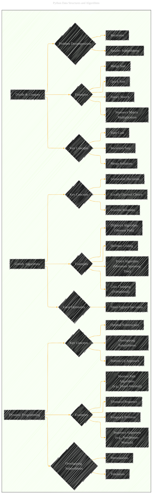

# Algorithm Design Paradigms
> **Disclaimer:**
>
> This document contains my personal notes on the topic,
> compiled from publicly available documentation and various cited sources.
> The materials are intended for educational purposes, personal study, and reference.
> The content is dual-licensed:
> 1. **MIT License:** Applies to all code implementations (Swift, Mermaid, and other programming languages).
> 2. **Creative Commons Attribution 4.0 International License (CC BY 4.0):** Applies to all non-code content, including text, explanations, diagrams, and illustrations.
---

## A Diagrammatic Guide 

Here's an expanded Mermaid diagram detailing the "Algorithm Design Paradigms," drawing heavily from the original document and elaborating on each paradigm with related concepts:

----

**Key Improvements and Expansion:**

*   **Divide & Conquer (A):** Added specific examples of algorithms that use this paradigm. Added more key concepts such as breaking problems down into smaller subproblems and the recursion aspect to it.
*   **Dynamic Programming (B):** Specified core components and how they achieve optimal substructure.
*   **Greedy Algorithms (C):** Specified core components, how they are the result of local optimizations that are later put together in order to obtain a global solution.
*   **Clearer Organization:** Used more distinct node labels and organized them hierarchically to improve readability.

---
**Licenses:**

- **MIT License:**   - Full text in [LICENSE](LICENSE) file.
- **Creative Commons Attribution 4.0 International:**  - Legal details in [LICENSE-CC-BY](LICENSE-CC-BY) and at [Creative Commons official site](http://creativecommons.org/licenses/by/4.0/).

---