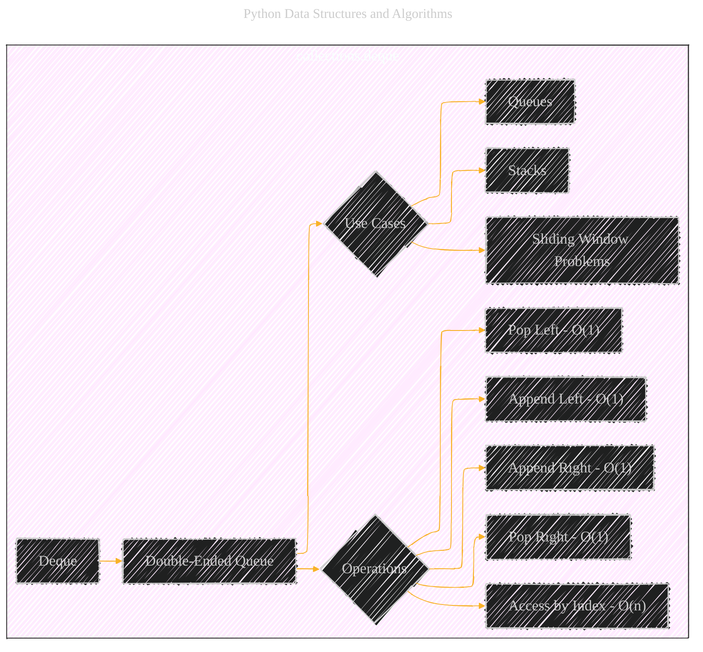
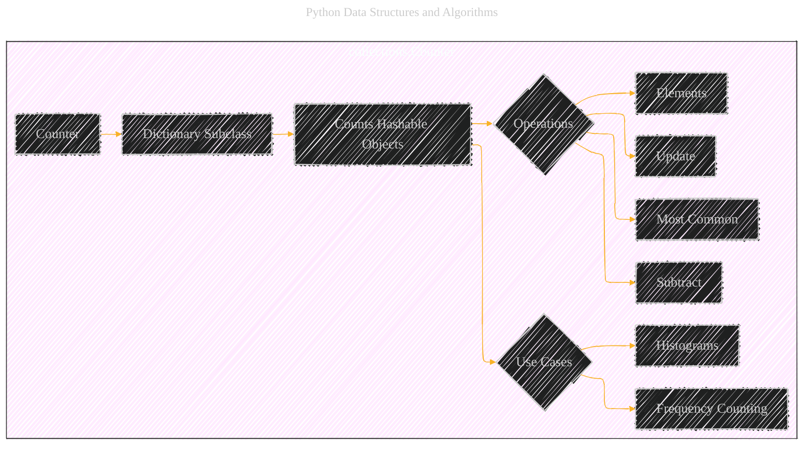
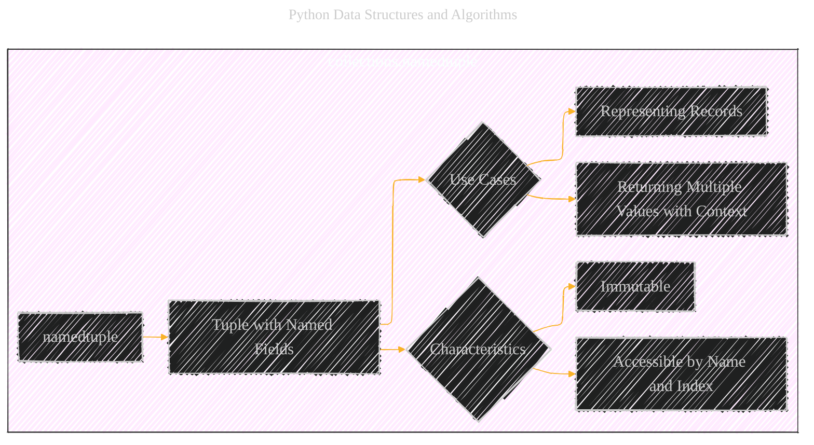
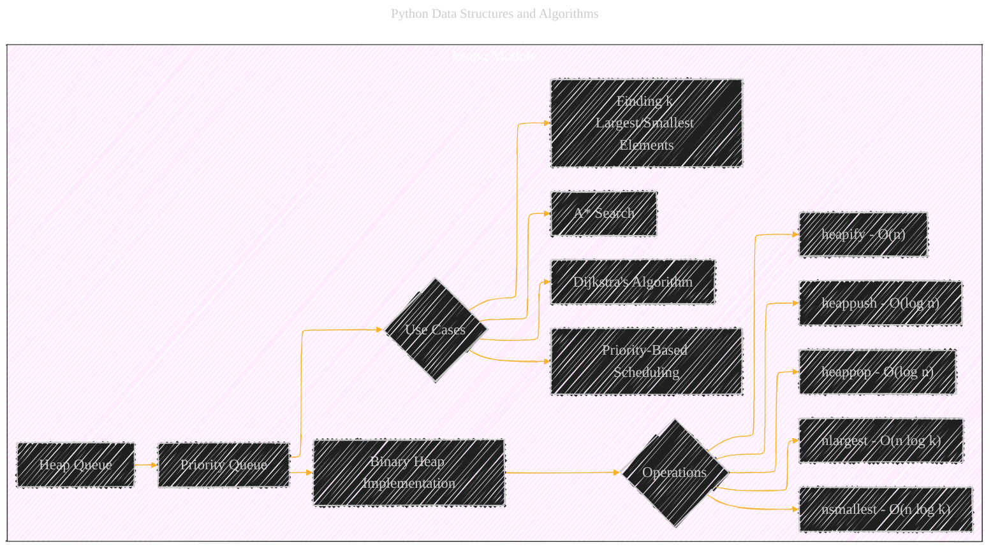
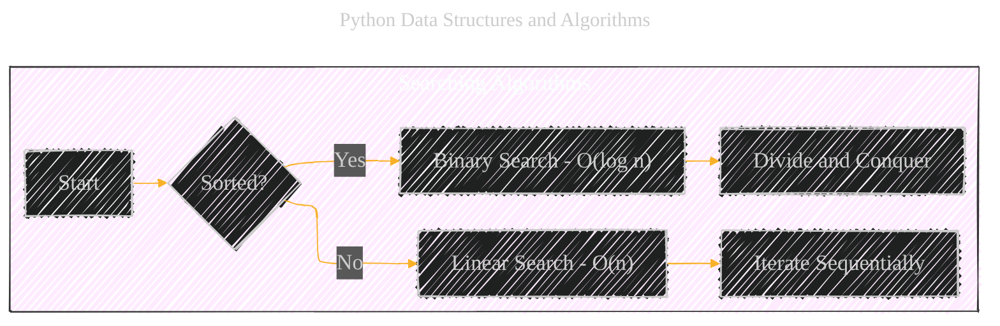
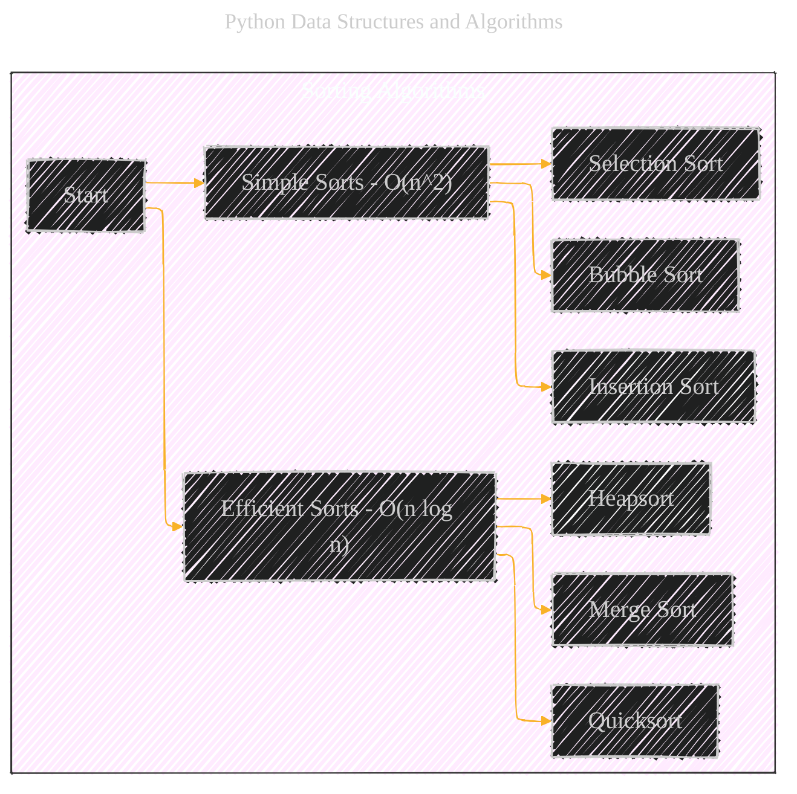
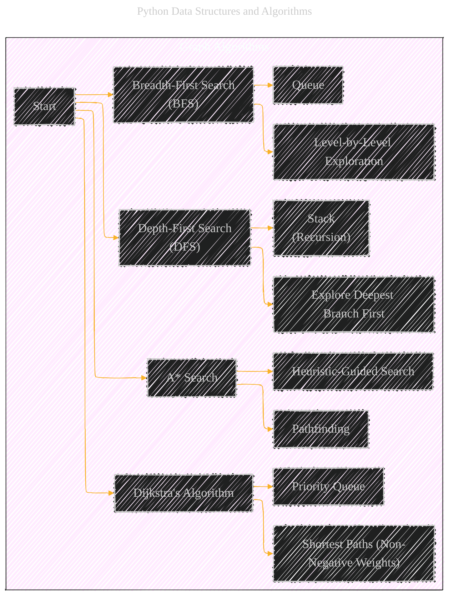

# Core Data Structures
> **Disclaimer:**
>
> This document contains my personal notes on the topic,
> compiled from publicly available documentation and various cited sources.
> The materials are intended for educational purposes, personal study, and reference.
> The content is dual-licensed:
> 1. **MIT License:** Applies to all code implementations (Swift, Mermaid, and other programming languages).
> 2. **Creative Commons Attribution 4.0 International License (CC BY 4.0):** Applies to all non-code content, including text, explanations, diagrams, and illustrations.
---

This document is an expansion of the initial version [here](./Core_Data_Structures.md), providing a comprehensive overview of core data structures and algorithms in Python, complete with explanations, characteristics, use cases, operations, and relevant mathematical formulations.

```mermaid
---
title: "Python Data Structures and Algorithms"
config:
  layout: elk
  look: handDrawn
  theme: dark
---
%%%%%%%% Mermaid version v11.4.1-b.14
%%%%%%%% Toggle theme value to `base` to activate the initilization below for the customized theme version.
%%%%%%%% Available curve styles include the following keywords:
%% basis, bumpX, bumpY, cardinal, catmullRom, linear, monotoneX, monotoneY, natural, step, stepAfter, stepBefore.
%%{
  init: {
    "graph": { "htmlLabels": false, 'curve': 'linear' },
    'themeVariables': {
        'fontFamily': 'Comic Sans MS',
        'fontSize': '20px',
        'primaryColor': '#ffff',
        'primaryTextColor': '#55ff',
        'primaryBorderColor': '#7c2',
        'lineColor': '#F8B229',
        'secondaryColor': '#006100',
        'tertiaryColor': '#fff'
    }
  }
}%%
graph LR
    subgraph Core_Data_Structures["Core Data Structures"]
    style Core_Data_Structures fill:#f9f3,stroke:#333,stroke-width:1px
        A[Lists] --> A1[Sequential, Mutable]
        A1 --> A2{Implementation}
        A2 --> A21[Dynamic Arrays]
        A2 --> A22[Linked Lists]
        A1 --> A3{Characteristics}
        A3 --> A31[Ordered]
        A3 --> A32[Allow Duplicates]
        A3 --> A33[Variable Size]
        A --> A4{Operations}
        A4 --> A41[Append]
        A4 --> A42[Insert]
        A4 --> A43[Delete]
        A4 --> A44[Search]
        A4 --> A45[Iterate]
        A4 --> A46[Slice]

        B["Tuples"] --> B1["Sequential, Immutable"]
        B1 --> B2{Characteristics}
        B2 --> B21[Ordered]
        B2 --> B22[Allow Duplicates]
        B2 --> B23[Fixed Size]
        B --> B3{Use Cases}
        B3 --> B31[Returning Multiple Values from Function]
        B3 --> B32[Record Representation]
        B --> B4{Operations}
        B4 --> B41[Index]
        B4 --> B42[Slice]
        B4 --> B43[Iterate]
        B4 --> B44[Count]
        B4 --> B45[Index]

        C[Dictionaries] --> C1[Key-Value Pairs]
        C1 --> C2{Implementation}
        C2 --> C21[Hash Tables]
        C1 --> C3{Characteristics}
        C3 --> C31[Unordered]
        C3 --> C32[Mutable]
        C3 --> C33[Keys Must Be Immutable]
        C --> C4{Use Cases}
        C4 --> C41[Symbol Tables]
        C4 --> C42[Caching]
        C4 --> C43[Configuration Settings]
        C --> C5{Operations}
        C5 --> C51[Insert]
        C5 --> C52[Delete]
        C5 --> C53["Lookup<br>(Get)"]
        C5 --> C54[Update]
        C5 --> C55["Iterate<br>(Keys, Values, Items)"]

        D[Sets] --> D1[Unordered, Unique Elements]
        D1 --> D2{Implementation}
        D2 --> D21[Hash Tables]
        D1 --> D3{Characteristics}
        D3 --> D31["Mutable<br>(set)"]
        D3 --> D32["Immutable<br>(frozenset)"]
        D3 --> D33[No Duplicates]
        D --> D4{Use Cases}
        D4 --> D41[Membership Testing]
        D4 --> D42[Removing Duplicates]
        D4 --> D43["Set Operations<br>(Union, Intersection, Difference)"]
        D --> D5{Operations}
        D5 --> D51[Add]
        D5 --> D52[Remove]
        D5 --> D53[Membership Test]
        D5 --> D54[Union]
        D5 --> D55[Intersection]
        D5 --> D56[Difference]
    end
    
```

---

## 1. Lists

Lists are one of the most fundamental and versatile data structures in Python. They are *sequential* and *mutable*, meaning their elements can be changed after creation.

### Implementation

*   **Dynamic Arrays:**  Most common implementation.  Provides amortized O(1) time for appending elements.
*   **Linked Lists:** Less common in Python's standard library, but can be implemented for specific use cases where frequent insertions/deletions at arbitrary positions are needed.

### Characteristics

*   **Ordered:** Elements maintain their insertion order.
*   **Allow Duplicates:**  The same value can appear multiple times.
*   **Variable Size:** Lists can grow or shrink dynamically.

### Operations

| Operation | Description                                      | Time Complexity |
| --------- | ------------------------------------------------ | --------------- |
| Append    | Add an element to the end of the list.           | O(1) (amortized)|
| Insert    | Insert an element at a specific position.       | O(n)            |
| Delete    | Remove an element by value or index.            | O(n)            |
| Search    | Find an element by value.                        | O(n)            |
| Iterate   | Traverse through all elements.                   | O(n)            |
| Slice     | Create a new list from a portion of the original. | O(k) (k = slice size) |

### Time Complexity - Mathematical Representation

*   **Append:**  $T_{append}(n) = O(1)$ (amortized)
*   **Insert:** $T_{insert}(n) = O(n)$
*   **Delete:** $T_{delete}(n) = O(n)$
*    **Search:**  $T_{search}(n) = O(n)$
*   **Iterate:** $T_{iterate}(n) = O(n)$
*    **Slice:** $T_{slice}(k) = O(k)$

---

## 2. Tuples

Tuples are similar to lists, but they are *immutable*.  Once a tuple is created, its elements cannot be changed.

### Characteristics

*   **Ordered:** Elements maintain their insertion order.
*   **Allow Duplicates:** The same value can appear multiple times.
*   **Fixed Size:**  The size of a tuple is determined at creation.

### Use Cases

*   **Returning Multiple Values from a Function:** Tuples allow functions to return multiple values in a single object.
*   **Record Representation:** Representing fixed collections of related data, like coordinates (x, y).

### Operations

| Operation | Description                               | Time Complexity |
| --------- | ----------------------------------------- | --------------- |
| Index     | Access an element by its index.           | O(1)            |
| Slice     | Create a new tuple from a portion.        | O(k)            |
| Iterate   | Traverse through all elements.            | O(n)            |
| Count     | Count occurrences of a specific value.     | O(n)            |
| Index     | Find the index of the first occurrence. | O(n)            |

### Time Complexity - Mathematical Representation

*    **Index:** $T_{index}(n) = O(1)$
*   **Slice:** $T_{slice}(k) = O(k)$
* **Iterate:** $T_{iterate}(n) = O(n)$
*   **Count:** $T_{count}(n) = O(n)$
*    **Index (Search):** $T_{index\_search}(n) = O(n)$

----

## 3. Dictionaries

Dictionaries store *key-value pairs*.  They are also known as hash maps or associative arrays in other programming languages.

### Implementation

*   **Hash Tables:**  Python dictionaries are implemented using hash tables, providing fast average-case time complexity for key operations.

### Characteristics

*   **Unordered** (Prior to Python 3.7):  Dictionaries did not guarantee insertion order.  From Python 3.7 onwards, dictionaries *do* preserve insertion order.  However, it's best practice *not* to rely on this ordering.
*   **Mutable:**  Keys and values can be added, removed, or modified.
*   **Keys Must Be Immutable:**  Keys must be of immutable types (e.g., strings, numbers, tuples). Values can be of any type.

### Use Cases

*   **Symbol Tables:**  Mapping names to values.
*   **Caching:**  Storing pre-computed results for quick retrieval.
*   **Configuration Settings:**  Storing key-value pairs for application configuration.

### Operations

| Operation        | Description                                   | Time Complexity (Average) | Time Complexity (Worst) |
| ---------------- | --------------------------------------------- | ------------------------- | ----------------------- |
| Insert           | Add a new key-value pair.                     | O(1)                      | O(n)                    |
| Delete           | Remove a key-value pair.                      | O(1)                      | O(n)                    |
| Lookup (Get)     | Retrieve the value associated with a key.     | O(1)                      | O(n)                    |
| Update           | Change the value associated with a key.      | O(1)                      | O(n)                    |
| Iterate (Keys, Values, Items) | Traverse through keys, values, or pairs. | O(n)                      | O(n)                    |

### Time Complexity - Mathematical Representation
* **Insert:** $T_{insert}(n) = O(1)$ (average), $T_{insert}(n) = O(n)$ (worst)
*   **Delete:** $T_{delete}(n) = O(1)$ (average), $T_{delete}(n) = O(n)$ (worst)
*   **Lookup (Get):** $T_{lookup}(n) = O(1)$ (average), $T_{lookup}(n) = O(n)$ (worst)
* **Update:** $T_{update}(n) = O(1)$ (average), $T_{update}(n) = O(n)$ (worst)
* **Iterate:** $T_{iterate}(n) = O(n)$

The worst-case O(n) time complexity for dictionary operations occurs when there are hash collisions, forcing the hash table to search through multiple entries.  Well-designed hash functions minimize collisions.

----

## 4. Sets

Sets store *unordered* collections of *unique* elements. They are useful for membership testing and eliminating duplicate entries.

### Implementation

*   **Hash Tables:**  Similar to dictionaries, sets are typically implemented using hash tables.

### Characteristics

*   **Mutable (set):**  The `set` type is mutable, allowing elements to be added or removed.
*   **Immutable (frozenset):** The `frozenset` type is immutable.
*   **No Duplicates:** Sets automatically enforce uniqueness; adding a duplicate element has no effect.

### Use Cases

*   **Membership Testing:** Quickly checking if an element is present in a collection.
*   **Removing Duplicates:**  Efficiently eliminating duplicate values from a list or other iterable.
*   **Set Operations:** Performing mathematical set operations like union, intersection, and difference.

### Operations

| Operation        | Description                                         | Time Complexity (Average) | Time Complexity (Worst) |
| ---------------- | --------------------------------------------------- | ------------------------- | ----------------------- |
| Add              | Add an element to the set.                         | O(1)                      | O(n)                    |
| Remove           | Remove an element from the set.                    | O(1)                      | O(n)                    |
| Membership Test  | Check if an element is in the set.                 | O(1)                      | O(n)                    |
| Union            | Combine two sets (all elements from both).         | O(len(s1) + len(s2))        |                         |
| Intersection     | Find common elements between two sets.             | O(min(len(s1), len(s2)))   |                         |
| Difference       | Find elements present in one set but not the other. | O(len(s1))                |                         |

### Time Complexity - Mathematical Representation

*   **Add:** $T_{add}(n) = O(1)$ (average), $T_{add}(n) = O(n)$ (worst)
*   **Remove:** $T_{remove}(n) = O(1)$ (average), $T_{remove}(n) = O(n)$ (worst)
*   **Membership Test:** $T_{membership}(n) = O(1)$ (average),  $T_{membership}(n) = O(n)$ (worst)
* **Union:** $T_{union}(s1, s2) = O(len(s1) + len(s2))$
*   **Intersection:**$T_{intersection}(s1, s2) = O(min(len(s1), len(s2)))$
*   **Difference:** $T_{difference}(s1, s2) = O(len(s1))$

---

## 5. Beyond Core Data Structures

Python offers several other important data structures, often found in the `collections` module:

### 5.1 `collections.deque` (Double-Ended Queue)

A deque (pronounced "deck") is a double-ended queue, allowing efficient addition and removal of elements from both ends.

*   **Operations:** `appendleft()`, `append()`, `popleft()`, `pop()`, `rotate()`
*   **Time Complexity:** Appending and popping from either end is O(1). Accessing elements by index is O(n).
* **Use Cases:** Implementing queues, stacks, and solving sliding window problems.

### 5.2 `collections.Counter`

A `Counter` is a dictionary subclass for counting hashable objects. It's a convenient way to tally the frequency of elements in a sequence.

*   **Operations:** `update()`, `most_common()`, `elements()`, `subtract()`
* **Use Cases**: Frequency counting, creating histograms.

### 5.3 `collections.namedtuple`

`namedtuple` creates tuple-like objects with named fields, enhancing readability and making code more self-documenting.

*   **Use Cases:**  Representing records or data structures where field names improve clarity.

### 5.4 `heapq` (Heap Queue Algorithm)

The `heapq` module provides an implementation of the heap queue algorithm, also known as a priority queue. Heaps are binary trees that satisfy the heap property:  the value of each node is greater than or equal to the value of its children (for a min-heap).

*   **Operations:** `heappush()`, `heappop()`, `heapify()`, `nlargest()`, `nsmallest()`
*   **Time Complexity:**
    *   `heappush()`:  $T_{push}(n) = O(\log n)$
    *   `heappop()`:   $T_{pop}(n) = O(\log n)$
    *   `heapify()`:   $T_{heapify}(n) = O(n)$
    *   `nlargest(k, iterable)`: $T_{nlargest}(n, k) = O(n \log k)$
    *   `nsmallest(k, iterable)`: $T_{nsmallest}(n, k) = O(n \log k)$
* **Use Cases:** Implementing priority queues, finding the k largest or smallest elements in a collection, and in algorithms like Dijkstra's and A*.

----

## 6. Algorithms and Data Structures

Data structures are often used in conjunction with specific algorithms.  Here are some key examples:

### 6.1 Searching

*   **Linear Search:**  Examines each element sequentially.  O(n) time complexity.
*   **Binary Search:**  Requires a *sorted* collection.  Repeatedly divides the search interval in half. O(log n) time complexity.

    **Binary Search - Mathematical Representation:**

    The number of steps in binary search is logarithmic.  If *n* is the size of the input, and *k* is the number of steps:

    $$
    n / 2^k = 1 \\
    n = 2^k \\
    k = \log_2 n
    $$
    Therefore, the time complexity is $T(n) = O(\log n)$.

### 6.2 Sorting

*   **Bubble Sort, Insertion Sort, Selection Sort:**  Simple but inefficient algorithms. O(n^2) time complexity.
*   **Merge Sort, Quicksort, Heapsort:**  More efficient, divide-and-conquer algorithms.  O(n log n) time complexity (average or best case).

* **Merge Sort - Mathematical Representation:**

    Merge sort divides the input into halves, recursively sorts each half, and then merges the sorted halves.  The recurrence relation is:

    $$
    T(n) = 2T(n/2) + O(n)
    $$

    Where:
    *   $T(n)$ is the time complexity for an input of size *n*.
    *   $2T(n/2)$ represents the time to sort the two halves.
    *   $O(n)$ represents the time to merge the sorted halves.

    Using the Master Theorem, the solution to this recurrence is $T(n) = O(n \log n)$.

*   **Quicksort - Mathematical Representation:**
    Quicksort selects a 'pivot' element and partitions the other elements into two sub-arrays, according to whether they are less than or greater than the pivot.  The sub-arrays are then recursively sorted.

    *Best and Average Case:*
    $$ T(n) = 2T(n/2) + O(n) $$
    Which results in: $ T(n) = O(n \log n) $

    *Worst Case:* (occurs when the pivot is consistently the smallest or largest element):
    $$ T(n) = T(n-1) + O(n) $$
    Which results in: $ T(n) = O(n^2) $

### 6.3 Graph Algorithms

*   **Breadth-First Search (BFS):**  Explores a graph level by level.  Uses a queue.
*   **Depth-First Search (DFS):**  Explores as far as possible along each branch before backtracking.  Uses a stack (or recursion).
*   **Dijkstra's Algorithm:**  Finds the shortest paths from a source node to all other nodes in a weighted graph (with non-negative edge weights).
*   **A* Search Algorithm:**  An informed search algorithm that uses a heuristic to guide its search.  Often used in pathfinding.

* **Dijkstra - Time Complexity:**
    With a binary heap, the time complexity is $T(V, E) = O((V + E) \log V)$, where V is number of vertices/nodes and E is the number of edges.

*   **A* Search - Time Complexity:**
The time complexity of A* depends heavily on the heuristic function used. In the worst case, it can still be exponential, but with a good heuristic, it can be significantly faster than Dijkstra's algorithm. A common representation is:
$$
T(A*) = O(b^d)
$$

Where:
- $b$ is the branching factor (average number of neighbors)
-  $d$ is the depth of the solution.

### 6.4. Hash Tables and Hashing

Hash tables are a fundamental data structure used in dictionaries and sets.  A hash function maps keys to indices in an array (the hash table).

*   **Hash Function:**  A good hash function should distribute keys uniformly across the hash table to minimize collisions.
*   **Collision Resolution:**  Techniques to handle collisions (when multiple keys map to the same index):
    *   **Separate Chaining:**  Each index stores a linked list of keys that hash to that index.
    *   **Open Addressing:**  If a collision occurs, probe for an empty slot in the table (linear probing, quadratic probing, double hashing).

*   **Time Complexity (Average Case):**
    *   Search, Insertion, Deletion: O(1)
*   **Time Complexity (Worst Case):**
    *   Search, Insertion, Deletion: O(n) (when all keys collide)

-----

This comprehensive guide provides a strong foundation in Python data structures and algorithms.  Understanding these concepts is crucial for writing efficient and effective Python code, particularly when dealing with large datasets or complex problems. Remember to choose the right data structure and algorithm for the specific task at hand, considering factors like time complexity, space complexity, and the characteristics of the data.

---
**Licenses:**

- **MIT License:**   - Full text in [LICENSE](LICENSE) file.
- **Creative Commons Attribution 4.0 International:**  - Legal details in [LICENSE-CC-BY](LICENSE-CC-BY) and at [Creative Commons official site](http://creativecommons.org/licenses/by/4.0/).

---