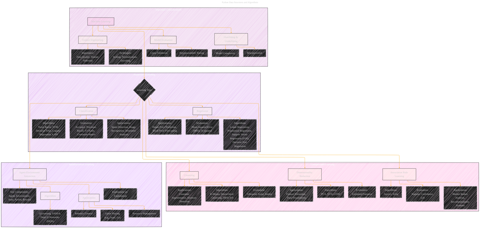

# Machine Learning
> **Disclaimer:**
>
> This document contains my personal notes on the topic,
> compiled from publicly available documentation and various cited sources.
> The materials are intended for educational purposes, personal study, and reference.
> The content is dual-licensed:
> 1. **MIT License:** Applies to all code implementations (Swift, Mermaid, and other programming languages).
> 2. **Creative Commons Attribution 4.0 International License (CC BY 4.0):** Applies to all non-code content, including text, explanations, diagrams, and illustrations.
---

## A Diagrammatic Guide 

Okay, here's a much more expanded and detailed Mermaid diagram focusing on Machine Learning, drawing from the original "Python Data Structures and Algorithms" text and related concepts, and including more relevant aspects:

---

**Key Improvements and Expansions:**

*   **Supervised Learning Expanded:** Breaks down supervised learning into classification and regression, listing common algorithms, evaluation metrics, and example applications for each.
*   **Unsupervised Learning Expanded:** Similar detailed breakdown for clustering, dimensionality reduction, and association rule learning. Evaluation metrics are key here.
*   **Reinforcement Learning Added:** Reinforcement learning is now included, outlining key components, algorithms, and applications.
*   **Important Considerations Section:** This is new, highlighting crucial aspects applicable across all ML types, like feature engineering, model evaluation (and related methods like cross-validation and hyperparameter tuning), and overfitting/underfitting issues. This adds a lot of practical value.
*   **Specific Algorithms Listed:** More concrete examples of algorithms are given within each category to ground the concepts (e.g., Naive Bayes, K-Means, PCA).
*   **Evaluation Metrics:** Evaluation metrics are now included, which are essential for understanding how well each type of algorithm performs.
*   **Applications:** Listing example applications helps connect the algorithms to real-world uses.

---

**Explanation of the Additions:**

*   **Algorithms:** Providing concrete algorithm names (e.g., SVM, k-NN, Linear Regression) makes the diagram more useful.  It gives starting points for further research.
*   **Evaluation Metrics:** Listing evaluation metrics (e.g., accuracy, precision, recall, MSE) is critical because it shows *how* the performance of each type of algorithm is measured.  This is crucial for understanding and comparing different algorithms.
*   **Applications:** Listing real-world applications (e.g., spam detection, customer segmentation) helps connect the abstract concepts to tangible problems.  This makes the information more relatable.
*   **Feature Engineering:** This is a vital step in almost all ML projects.  Techniques like scaling, normalization, and encoding significantly affect model performance.
*   **Model Evaluation:**  Concepts like cross-validation and hyperparameter tuning are essential for building robust and reliable models.
*   **Overfitting & Underfitting:** Understanding and mitigating these problems is crucial for ensuring that models generalize well to new data.

This expanded diagram provides a much more complete overview of the machine learning landscape and its relationship to the topics covered in the book.

---
**Licenses:**

- **MIT License:**   - Full text in [LICENSE](LICENSE) file.
- **Creative Commons Attribution 4.0 International:**  - Legal details in [LICENSE-CC-BY](LICENSE-CC-BY) and at [Creative Commons official site](http://creativecommons.org/licenses/by/4.0/).

---