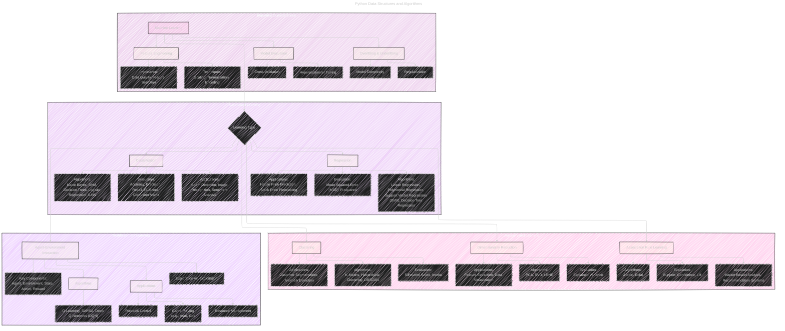

# Machine Learning
> **Disclaimer:**
>
> This document contains my personal notes on the topic,
> compiled from publicly available documentation and various cited sources.
> The materials are intended for educational purposes, personal study, and reference.
> The content is dual-licensed:
> 1. **MIT License:** Applies to all code implementations (Swift, Mermaid, and other programming languages).
> 2. **Creative Commons Attribution 4.0 International License (CC BY 4.0):** Applies to all non-code content, including text, explanations, diagrams, and illustrations.
---

This document is an expansion of the initial version [here](./Machine_Learning.md), providing a comprehensive overview of data structures and algorithms in Python, emphasizing their applications within the realm of machine learning. We'll explore supervised, unsupervised, and reinforcement learning techniques, along with crucial considerations like feature engineering, model evaluation, and overfitting/underfitting. The content is structured to be accessible to a range of learners, from beginners to experienced practitioners. Visual aids, including Mermaid diagrams and LaTeX-formatted equations, are incorporated to enhance understanding.

---

## 1. Machine Learning Overview

Machine learning (ML) is a subfield of artificial intelligence (AI) that focuses on enabling systems to learn from data without explicit programming.  The core idea is to identify patterns, make predictions, and improve performance over time based on experience.  ML algorithms can be broadly categorized into three main learning types:

### 1.1. Supervised Learning

Supervised learning involves training a model on a labeled dataset, where each data point has a known input (features) and a corresponding output (target variable). The goal is to learn a mapping function that can accurately predict the output for new, unseen inputs.

#### 1.1.1. Classification

Classification problems involve predicting a categorical output variable.  Examples include:

*   **Spam Detection:** Classifying emails as spam or not spam.
*   **Image Recognition:** Identifying objects within an image (e.g., cat, dog, car).
*   **Sentiment Analysis:** Determining the sentiment (positive, negative, neutral) expressed in a piece of text.

**Common Classification Algorithms:**

*   **Naive Bayes:** A probabilistic classifier based on Bayes' theorem.
*   **Support Vector Machines (SVM):**  Finds an optimal hyperplane to separate data points into different classes.
*   **Decision Trees:**  Builds a tree-like structure to make decisions based on feature values.
*   **Logistic Regression:**  Uses a sigmoid function to predict the probability of a binary outcome.
*   **k-Nearest Neighbors (k-NN):** Classifies a data point based on the majority class among its k-nearest neighbors.

**Evaluation Metrics:**

*   **Accuracy:** The proportion of correctly classified instances.
*   **Precision:** The proportion of true positives among all predicted positives.
*   **Recall:** The proportion of true positives among all actual positives.
*   **F1-Score:** The harmonic mean of precision and recall.
*   **Confusion Matrix:**  A table that visualizes the performance of a classification model.

#### 1.1.2. Regression

Regression problems involve predicting a continuous output variable. Examples include:

*   **House Price Prediction:** Predicting the price of a house based on features like size, location, and number of bedrooms.
*   **Stock Price Forecasting:** Predicting the future price of a stock based on historical data and other relevant factors.

**Common Regression Algorithms:**

*   **Linear Regression:** Models the relationship between variables using a linear equation.
*   **Polynomial Regression:**  Extends linear regression by using polynomial terms.
*   **Support Vector Regression (SVR):**  Applies SVM principles to regression problems.
*   **Decision Tree Regression:** Uses a decision tree to predict continuous values.

**Evaluation Metrics:**

*   **Mean Squared Error (MSE):** The average squared difference between predicted and actual values.
*   **R-squared:**  A statistical measure that represents the proportion of variance in the dependent variable that can be explained by the independent variables.

### 1.2. Unsupervised Learning

Unsupervised learning deals with unlabeled data, where the goal is to discover hidden patterns, structures, or relationships within the data.

#### 1.2.1. Clustering

Clustering algorithms group data points into clusters based on similarity.  Examples include:

*   **Customer Segmentation:** Grouping customers based on purchasing behavior, demographics, or other characteristics.
*   **Anomaly Detection:** Identifying unusual data points that deviate significantly from the norm.

**Common Clustering Algorithms:**

*   **K-Means:** Partitions data into k clusters, where each data point belongs to the cluster with the nearest mean (centroid).
*   **Hierarchical Clustering:**  Builds a hierarchy of clusters, either by merging smaller clusters (agglomerative) or splitting larger clusters (divisive).
*   **DBSCAN (Density-Based Spatial Clustering of Applications with Noise):**  Groups together data points that are closely packed together, marking as outliers those that lie alone in low-density regions.

**Evaluation Metrics:**

*   **Silhouette Score:** Measures how similar a data point is to its own cluster compared to other clusters.
*   **Inertia:**  The sum of squared distances of samples to their closest cluster center (used in K-Means).

#### 1.2.2. Dimensionality Reduction

Dimensionality reduction techniques aim to reduce the number of features (variables) in a dataset while preserving essential information. This can improve model performance, reduce computational cost, and aid in data visualization.

**Common Dimensionality Reduction Algorithms:**

*   **PCA (Principal Component Analysis):**  Transforms data into a new set of uncorrelated variables (principal components) that capture the most variance in the data.
*   **SVD (Singular Value Decomposition):**  A matrix factorization technique that can be used for dimensionality reduction.
*   **t-SNE (t-distributed Stochastic Neighbor Embedding):**  A non-linear technique particularly well-suited for visualizing high-dimensional data in lower dimensions.

**Evaluation Metrics:**

*   **Explained Variance:** The proportion of variance in the original data that is captured by the reduced set of features.

#### 1.2.3. Association Rule Learning

Association rule learning discovers interesting relationships or associations among items in a dataset.

**Common Association Rule Learning Algorithms:**

*  **Apriori:** Identifies frequent itemsets and generates association rules.
*   **Eclat:**  A more efficient algorithm for frequent itemset mining.

**Evaluation Metrics:**

*   **Support:** The frequency of occurrence of an itemset.
*   **Confidence:** The probability of finding the consequent of a rule given the antecedent.
*   **Lift:**  A measure of the strength of an association rule, indicating how much more likely the consequent is to occur given the antecedent compared to its expected occurrence.

### 1.3. Reinforcement Learning

Reinforcement learning (RL) involves training an agent to make decisions in an environment to maximize a cumulative reward. The agent learns through trial and error, receiving feedback in the form of rewards or penalties.

**Key Components:**

*   **Agent:** The learner and decision-maker.
*   **Environment:** The external system with which the agent interacts.
*   **State:** A representation of the current situation.
*   **Action:** A move or decision made by the agent.
*   **Reward:**  A scalar feedback signal indicating the goodness of an action.

**Exploration vs. Exploitation:**

A key challenge in RL is balancing exploration (trying new actions) and exploitation (using actions known to yield high rewards).

**Common Reinforcement Learning Algorithms:**

*   **Q-Learning:**  An off-policy algorithm that learns an action-value function (Q-function) that estimates the expected cumulative reward for taking a given action in a given state.
*   **SARSA (State-Action-Reward-State-Action):**  An on-policy algorithm that updates the Q-function based on the actual action taken.
*   **Deep Q-Networks (DQN):**  Combines Q-learning with deep neural networks to handle high-dimensional state spaces.

**Applications:**

*   **Game Playing:** Training agents to play games like Atari and Go.
*   **Robotics Control:**  Developing control policies for robots.
*   **Resource Management:** Optimizing the allocation of resources in various domains.

----

## 2. Important Considerations in Machine Learning

### 2.1. Feature Engineering

Feature engineering is the process of selecting, transforming, and creating relevant features from raw data to improve model performance.

**Techniques:**

*   **Scaling:**  Transforming features to a common scale (e.g., standardization, min-max scaling).
*   **Normalization:**  Scaling features to have a unit norm.
*   **Encoding:**  Converting categorical features into numerical representations (e.g., one-hot encoding, label encoding).

**Importance:**

*   **Data Quality:**  Handling missing values, outliers, and inconsistencies.
*   **Feature Selection:**  Choosing the most informative features to reduce dimensionality and improve model interpretability.

### 2.2. Model Evaluation

Evaluating the performance of a machine learning model is crucial to assess its generalization ability and identify areas for improvement.

**Techniques:**

*   **Cross-Validation:**  Splitting the data into multiple folds and training/testing the model on different combinations of folds to estimate its performance on unseen data.  A common technique is k-fold cross-validation.
*   **Hyperparameter Tuning:**  Optimizing the hyperparameters of a model (parameters that are not learned from data) to achieve the best performance.  Techniques include grid search, random search, and Bayesian optimization.

### 2.3. Overfitting and Underfitting

*   **Overfitting:**  Occurs when a model learns the training data too well, including noise and irrelevant patterns, leading to poor generalization to new data.
*   **Underfitting:**  Occurs when a model is too simple to capture the underlying patterns in the data, resulting in poor performance on both training and test data.

**Addressing Overfitting and Underfitting:**

* **Regularization:** Adding a penalty term to the loss function to discourage complex models (e.g., L1 regularization, L2 regularization). This is particularly important in models like linear regression and logistic regression.

  *   **L1 Regularization (Lasso Regression):** Adds a penalty equal to the absolute value of the magnitude of coefficients.  This can lead to some coefficients being exactly zero, effectively performing feature selection.

      $$
      \text{Cost Function} = \text{Loss} + \lambda \sum_{i=1}^{n} |w_i|
      $$

      where:
      -  $\lambda$ is the regularization parameter.
      -  $w_i$ are the model weights.

  *   **L2 Regularization (Ridge Regression):** Adds a penalty equal to the square of the magnitude of coefficients.  This tends to shrink coefficients towards zero but doesn't eliminate them entirely.

      $$
      \text{Cost Function} = \text{Loss} + \lambda \sum_{i=1}^{n} w_i^2
      $$

*   **Model Complexity:**  Choosing an appropriate model complexity for the data.  For example, using a simpler model (e.g., linear regression) for a dataset with a linear relationship, and a more complex model (e.g., a deep neural network) for a dataset with complex non-linear relationships.
* **More Data:** Increasing the size of the training dataset can often help reduce overfitting, providing the model with a more representative sample of the underlying data distribution.
* **Cross-Validation:** Using cross-validation to evaluate model performance and detect overfitting.
* **Early Stopping:** Monitoring model performance on a validation set during training and stopping the training process when performance starts to degrade, preventing overfitting.
* **Data Augmentation:** Artificially increasing the size of the training set by creating modified versions of existing data points.  This is commonly used in image classification.
* **Dropout:** Randomly dropping out units (neurons) during training in neural networks. This prevents co-adaptation of neurons and acts as a form of regularization.
* **Feature Selection:** Carefully select features and remove irrelevant ones.

----

## 3. Python Data Structures

The choice of data structure significantly impacts the efficiency and performance of machine learning algorithms. Python offers a variety of built-in and library-provided data structures.

### 3.1. Lists

*   **Description:** Ordered, mutable sequences of elements.
*   **Use Cases:** Storing and manipulating collections of data where order matters and modifications are needed.
* **Time Complexity:**
  * Access: O(1)
    * Insert: O(n)
    * Deletion: O(n)
    * Search: O(n)

### 3.2. Tuples

*   **Description:** Ordered, immutable sequences of elements.
*   **Use Cases:** Representing fixed collections of data where immutability is desired (e.g., coordinates, database records).
* **Time Complexity:**
  * Access: O(1)
    * Insert: N/A
    * Deletion: N/A
    * Search: O(n)

### 3.3. Sets

*   **Description:** Unordered collections of unique elements.
*   **Use Cases:** Checking for membership, removing duplicates, performing set operations (union, intersection, difference).
* **Time Complexity:**
  * Access: N/A
    * Insert: O(1) on average, O(n) worst case
    * Deletion: O(1) on average, O(n) worst case
    * Search: O(1) on average, O(n) worst case

### 3.4. Dictionaries

*   **Description:** Unordered collections of key-value pairs.
*   **Use Cases:** Storing and retrieving data associated with specific keys (e.g., feature names and values, model parameters).
* **Time Complexity:**
    * Access: O(1) on average, O(n) worst case
    * Insert: O(1) on average, O(n) worst case
    * Deletion: O(1) on average, O(n) worst case
    * Search: O(1) on average, O(n) worst case (for keys)

### 3.5. NumPy Arrays

*   **Description:** Provided by the NumPy library, multi-dimensional arrays optimized for numerical operations.
*   **Use Cases:**  Fundamental data structure for numerical computation in machine learning, representing data matrices, vectors, and tensors.
* **Time Complexity:**
  * Access: O(1)
    * Insert: O(n)
    * Deletion: O(n)
    * Search: O(n)

### 3.6. Pandas DataFrames

*   **Description:** Provided by the Pandas library, two-dimensional labeled data structures with columns of potentially different types.
*   **Use Cases:**  Representing tabular data, handling missing values, performing data cleaning, manipulation, and analysis.
* **Time Complexity:**
  * Access (by label): O(1) on average
    * Access (by position): O(1)
    * Insert/Delete Row: O(n)
    * Insert/Delete Column: O(1)
    * Search: Depends on the operation (e.g., filtering, sorting)

### 3.7. Heaps (Priority Queues)

*   **Description:** Tree-based data structure that satisfies the heap property (min-heap or max-heap).
*   **Use Cases:**  Implementing priority queues, used in algorithms like A* search and Dijkstra's algorithm, which are relevant to some reinforcement learning and pathfinding problems.  Also useful in certain sorting algorithms (heap sort).
*   **Python Implementation:** `heapq` module.
* **Time Complexity:**
  * Insert: O(log n)
    * Delete Min/Max: O(log n)
    * Find Min/Max: O(1)

### 3.8. Graphs

* **Description:** A data structure to model relationships between nodes.
* **Use Cases:** Many use cases, for example in Recommendation Systems (user-item relationships) and Social Network Analysis
* **Time Complexity:**
  * Add Vertex: O(1)
  * Add Edge: O(1)
  * Remove Vertex: O(|V| + |E|)
  * Remove Edge: O(|E|)
  * Query: O(|V|)

---

## 4. Algorithms

Beyond the specific machine learning algorithms discussed earlier, several fundamental algorithms are essential for efficient data processing and problem-solving.

### 4.1. Sorting Algorithms

*   **Bubble Sort:**  Simple but inefficient, repeatedly compares adjacent elements and swaps them if they are in the wrong order.  O(n^2) time complexity.
*   **Insertion Sort:**  Builds a sorted array one element at a time, inserting each element into its correct position.  O(n^2) time complexity, but efficient for small datasets or nearly sorted data.
*   **Selection Sort:**  Repeatedly finds the minimum element from the unsorted portion and places it at the beginning. O(n^2) time complexity.
*   **Merge Sort:**  A divide-and-conquer algorithm that recursively divides the array into halves, sorts them, and then merges the sorted halves.  O(n log n) time complexity.
*   **Quicksort:**  Another divide-and-conquer algorithm that selects a 'pivot' element and partitions the array around the pivot.  O(n log n) average time complexity, O(n^2) worst-case time complexity.
*   **Heapsort:**  Uses a heap data structure to sort the array.  O(n log n) time complexity.
* **Counting Sort:** Sorts elements of an array by counting the number of occurrences of each unique element in the array. O(n+k) where n is the number of elements and k is the range of input.
* **Radix Sort:**  Sorts data with integer keys by grouping keys by the individual digits which share the same significant position and value. O(nk) where n is the number of elements and k is the number of digits.

### 4.2. Searching Algorithms

*   **Linear Search:**  Sequentially checks each element in a list until a match is found or the end of the list is reached.  O(n) time complexity.
*   **Binary Search:**  Efficiently searches a *sorted* list by repeatedly dividing the search interval in half.  O(log n) time complexity.

### 4.3. Graph Algorithms

*   **Breadth-First Search (BFS):**  Explores a graph level by level, visiting all neighbors of a node before moving to the next level.  Used for finding the shortest path in unweighted graphs.
*   **Depth-First Search (DFS):**  Explores a graph by going as deep as possible along each branch before backtracking.  Used for topological sorting, cycle detection, and finding connected components.
*   **Dijkstra's Algorithm:**  Finds the shortest path between nodes in a weighted graph with non-negative edge weights.
*   **A* Search Algorithm:**  An informed search algorithm that uses a heuristic function to estimate the cost from a node to the goal.  More efficient than Dijkstra's algorithm in many cases.
* **Bellman-Ford Algorithm:** Finds the shortest path from one node to other nodes. It can handle negative edge weights.
* **Floyd-Warshall Algorithm:** Finds the shortest path between all pair of nodes.

### 4.4. Dynamic Programming

*   **Description:**  A technique for solving optimization problems by breaking them down into smaller overlapping subproblems and storing the solutions to these subproblems to avoid redundant computations.
*   **Use Cases:**  Many optimization problems in machine learning and other areas can be solved using dynamic programming (e.g., sequence alignment, shortest path problems, knapsack problem).

### 4.5. Tree Traversal Algorithms

* **Inorder Traversal:** Processes the left subtree, then the root, then the right subtree.
* **Preorder Traversal:** Processes the root, then the left subtree, then the right subtree.
* **Postorder Traversal:** Processes the left subtree, then the right subtree, then the root.
* **Level Order Traversal:** Processes nodes level by level, similar to Breadth-First Search.

---

## 5. Conclusion

This document has provided a detailed overview of Python data structures and algorithms, with a particular focus on their applications in machine learning.  Understanding these fundamental concepts is crucial for building efficient, scalable, and robust machine learning models. By mastering these tools and techniques, you'll be well-equipped to tackle a wide range of data-driven challenges. The examples provided, along with the time complexity analysis, should help you choose the right data structures and algorithms for your specific needs. The combination of theoretical knowledge and practical implementation details makes this a valuable resource for both learning and reference. Further exploration into specialized libraries like Scikit-learn, TensorFlow, and PyTorch will build upon this foundation, enabling you to create sophisticated machine learning solutions.

---
**Licenses:**

- **MIT License:**   - Full text in [LICENSE](LICENSE) file.
- **Creative Commons Attribution 4.0 International:**  - Legal details in [LICENSE-CC-BY](LICENSE-CC-BY) and at [Creative Commons official site](http://creativecommons.org/licenses/by/4.0/).

---