# Python Data Structures and Algorithms Overview
> **Disclaimer:**
>
> This document contains my personal notes on the topic,
> compiled from publicly available documentation and various cited sources.
> The materials are intended for educational purposes, personal study, and reference.
> The content is dual-licensed:
> 1. **MIT License:** Applies to all code implementations (Swift, Mermaid, and other programming languages).
> 2. **Creative Commons Attribution 4.0 International License (CC BY 4.0):** Applies to all non-code content, including text, explanations, diagrams, and illustrations.
---

## A Diagrammatic Guide 

```mermaid
---
title: "Python Data Structures and Algorithms"
author: "Cong Le"
version: "1.0"
license(s): "MIT, CC BY 4.0"
copyright: "Copyright (c) 2025 Cong Le. All Rights Reserved."
config:
  layout: elk
  look: handDrawn
  theme: dark
---
%%%%%%%% Mermaid version v11.4.1-b.14
%%%%%%%% Toggle theme value to `base` to activate the initilization below for the customized theme version.
%%%%%%%% Available curve styles include the following keywords:
%% basis, bumpX, bumpY, cardinal, catmullRom, linear, monotoneX, monotoneY, natural, step, stepAfter, stepBefore.
%%{
  init: {
    "graph": { "htmlLabels": false, 'curve': 'linear' },
    'themeVariables': {
        'fontFamily': 'Comic Sans MS',
        'fontSize': '20px',
        'primaryColor': '#ffff',
        'primaryTextColor': '#55ff',
        'primaryBorderColor': '#7c2',
        'lineColor': '#F8B229',
        'secondaryColor': '#006100',
        'tertiaryColor': '#fff'
    }
  }
}%%
graph LR
    subgraph Core_Data_Structures["Core Data Structures"]
    style Core_Data_Structures fill:#f9f3,stroke:#333,stroke-width:1px
        A["Lists"] --> A1["Sequential, Mutable"]
        A1 --> A2("Dynamic Arrays, Linked Lists")
        A --> B["Tuples"]
        B --> B1["Sequential, Immutable"]
        B --> C["Dictionaries"]
        C --> C1["Key-Value Pairs"]
        C1 --> C2("Hash Tables")
        C --> D["Sets"]
        D --> D1["Unordered, Unique Elements"]
    end
    
    subgraph Advanced_Data_Structures["Advanced Data Structures"]
    style Advanced_Data_Structures fill:#bfb3,stroke:#333,stroke-width:1px
        E["Stacks"] --> E1["LIFO"]
        E1 --> E2("Push, Pop, Peek")
        E --> F["Queues"]
        F --> F1["FIFO"]
        F1 --> F2("Enqueue, Dequeue")
        F --> G["Trees"]
        G --> G1["Hierarchical"]
        G1 --> G2("Binary Trees, BSTs, Heaps")
        G --> H["Graphs"]
        H --> H1["Vertices & Edges"]
        H1 --> H2("Directed, Undirected, Weighted")
    end
    
    subgraph Algorithm_Design_Paradigms["Algorithm Design Paradigms"]
    style Algorithm_Design_Paradigms fill:#cfa3,stroke:#333,stroke-width:1px
        J["Divide & Conquer"] --> J1["Recursion, Subproblems"]
        J --> K["Dynamic Programming"]
        K --> K1["Memoization, Tabulation"]
        K --> L["Greedy Algorithms"]
        L --> L1["Local Optimality"]
    end
    
    subgraph Algorithm_Classifications["Algorithm Classifications"]
    style Algorithm_Classifications fill:#ffa3,stroke:#333,stroke-width:1px
        M["By Implementation"] --> M1["Recursive, Iterative"]
        M --> N["By Approach"]
        N --> N1["Divide & Conquer, Greedy, Dynamic Programming"]
        M --> O["By Complexity"]
        O --> O1["O(1), O(log n), O(n), O(n log n), O(n^2), O(2^n)"]
    end
    
    subgraph Searching_Algorithms["Searching Algorithms"]
    style Searching_Algorithms fill:#afa3,stroke:#333,stroke-width:1px
        P["Linear Search"] --> P1["$$O(n)$$"]
        P --> Q["Binary Search"]
        Q --> Q1["$$O(log n)$$"]
        P --> R["Interpolation Search"]
         R--> R1["$$O(log log n)$$"]
    end
    
    subgraph Sorting_Algorithms["Sorting Algorithms"]
    style Sorting_Algorithms fill:#aaf3,stroke:#333,stroke-width:1px
        S[Bubble Sort] --> S1["$$O(n^2)$$"]
        S --> T[Insertion Sort];
        T --> T1["O(n^2), Best O(n)"]
        S --> U["Selection Sort"]
        U --> U1["$$O(n^2)$$"]
        S --> V["Quick Sort"]
        V --> V1["O(n^2) worst,<br>O(n log n) avg"]
        S --> W["Heap Sort"]
        W --> W1["$$O(n log n)$$"]
    end
    
    subgraph Machine_Learning["Machine Learning"]
    style Machine_Learning fill:#faa3,stroke:#333,stroke-width:1px
    X[Supervised Learning] --> X1[Classification, Regression]
        X --> Y[Unsupervised Learning]
        Y --> Y1[Clustering, Dimensionality Reduction]
        X --> Z[Reinforcement Learning]
        Z --> Z1[Agent Environment Interaction]
    end
    
    subgraph Tools_and_Techniques["Tools and Techniques"]
    style Tools_and_Techniques fill:#eee3,stroke:#333,stroke-width:1px
    AA[Data Preprocessing] --> AA1[Feature Scaling, Handling Missing Data]
        AA --> BB[Data Visualization]
        BB --> BB1[Bar Charts, Pie Charts, Box Plots, Bubble Charts]
    end
    
```

---

### Explanation of the Diagram

*   **Purpose:** This diagram categorizes the main concepts from the "Python Data Structures and Algorithms" book using a Mermaid syntax mind map.
*   **Nodes:** Each concept is represented as a node (e.g., "Lists," "Divide & Conquer").
*   **Subgraphs:** Nodes are organized within their respective subgraphs for easy visual interpretation (e.g., "Core Data Structures," "Algorithm Design Paradigms").
*   **Arrows:** Arrows illustrate the relationships between concepts (e.g., "Lists" --> "Sequential, Mutable").
*   **Styles:** Each subgraph is styled with a specific color for clear distinction.
*   **Complexity Annotations:**  Time complexity annotations (e.g., O(n^2)) are added to sorting and searching algorithms to visually indicate their performance characteristics.

---

### Breakdown of the Subgraphs

*   **Core Data Structures:** Basic Python data structures.
*   **Advanced Data Structures:**  Data structures built upon the core ones.
*   **Algorithm Design Paradigms:** Common algorithmic approaches.
*   **Algorithm Classifications:**  Different ways to categorize algorithms.
*   **Searching Algorithms:** Various searching techniques and their complexities.
*   **Sorting Algorithms:** Sorting techniques and their complexities.
*   **Machine Learning:** High-level machine learning concepts.
*   **Tools and Techniques:**  Useful data preprocessing and visualization methods.

---
**Licenses:**

- **MIT License:**   - Full text in [LICENSE](LICENSE) file.
- **Creative Commons Attribution 4.0 International:**  - Legal details in [LICENSE-CC-BY](LICENSE-CC-BY) and at [Creative Commons official site](http://creativecommons.org/licenses/by/4.0/).

---