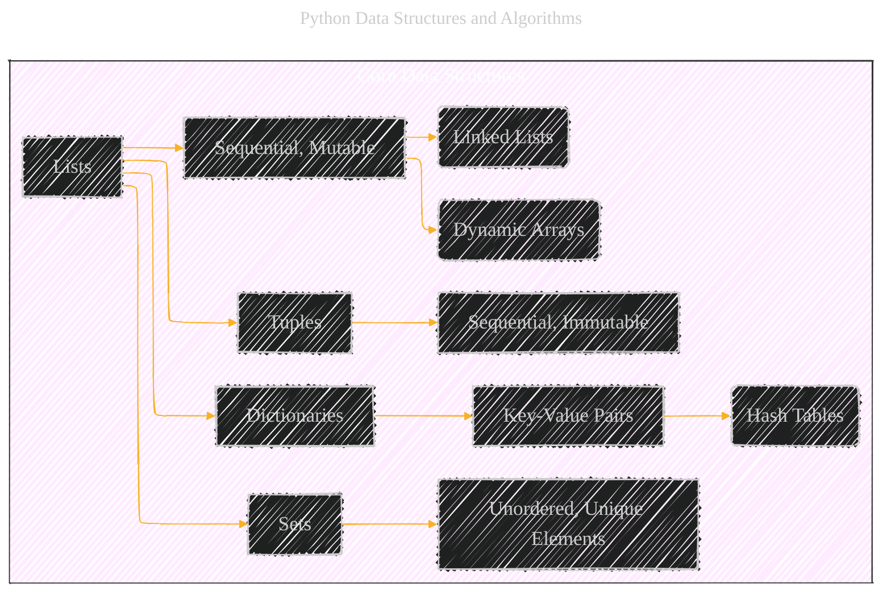
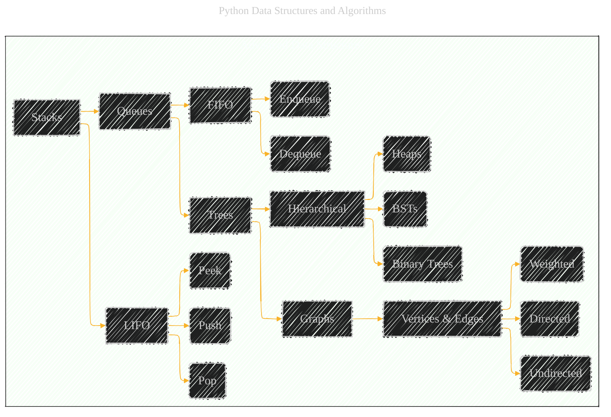
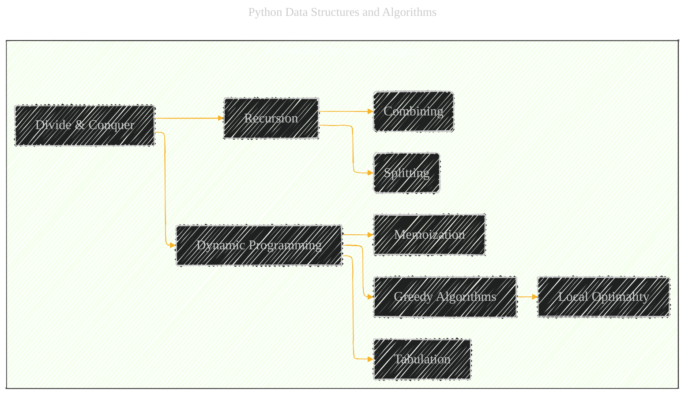
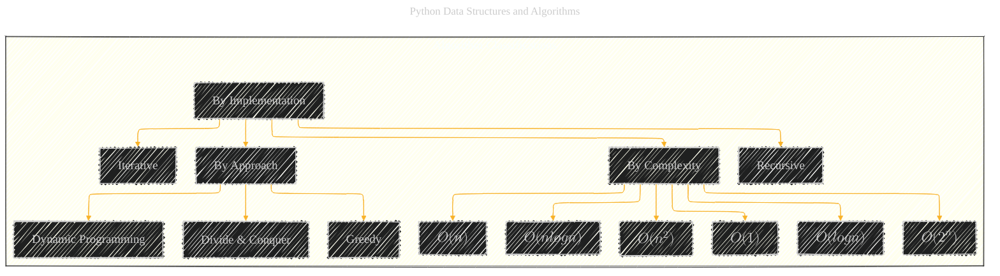
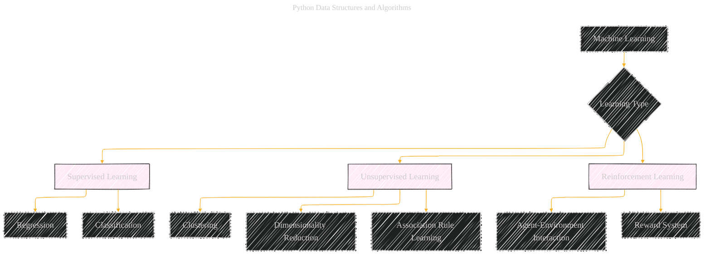
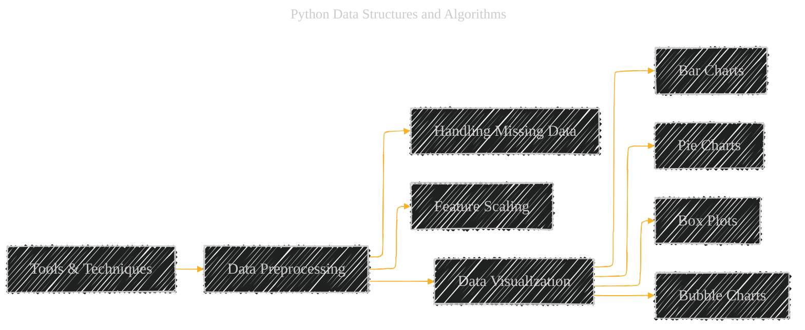

# Python Data Structures and Algorithms Overview
> **Disclaimer:**
>
> This document contains my personal notes on the topic,
> compiled from publicly available documentation and various cited sources.
> The materials are intended for educational purposes, personal study, and reference.
> The content is dual-licensed:
> 1. **MIT License:** Applies to all code implementations (Swift, Mermaid, and other programming languages).
> 2. **Creative Commons Attribution 4.0 International License (CC BY 4.0):** Applies to all non-code content, including text, explanations, diagrams, and illustrations.
---

Here are some Mermaid diagrams translating the content from the original book, focusing on the structure and relationships between the concepts. I've tried to choose the most appropriate diagram type for each section to maximize clarity.

---

## 1. Core Data Structures

---

## 2. Advanced Data Structures

---

## 3. Algorithm Design Paradigms

---

## 4. Algorithm Classifications

----

## 5. Searching Algorithms

---

## 6. Sorting Algorithms

----

## 7. Machine Learning

---

## 8. Tools and Techniques

----

### Key Considerations for These Diagrams

*   **Readability:**  I've tried to keep the diagrams as simple as possible while still conveying the core relationships.
*   **Appropriate Type:**  The choice of diagram type (flowchart, graph, gantt chart) is deliberate to best represent the nature of the information.
*   **Context:** While Mermaid syntax is great, some additional text context might be needed to fully explain the concepts.  These diagrams are intended as visual aids, not replacements for written explanations.

---
**Licenses:**

- **MIT License:**   - Full text in [LICENSE](LICENSE) file.
- **Creative Commons Attribution 4.0 International:**  - Legal details in [LICENSE-CC-BY](LICENSE-CC-BY) and at [Creative Commons official site](http://creativecommons.org/licenses/by/4.0/).

---