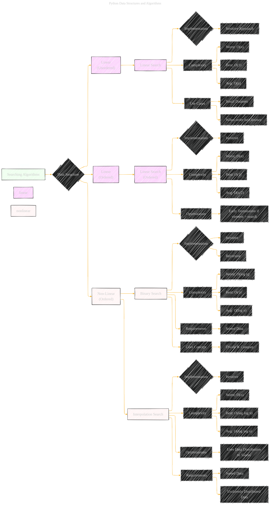

# Searching Algorithms
> **Disclaimer:**
>
> This document contains my personal notes on the topic,
> compiled from publicly available documentation and various cited sources.
> The materials are intended for educational purposes, personal study, and reference.
> The content is dual-licensed:
> 1. **MIT License:** Applies to all code implementations (Swift, Mermaid, and other programming languages).
> 2. **Creative Commons Attribution 4.0 International License (CC BY 4.0):** Applies to all non-code content, including text, explanations, diagrams, and illustrations.
---

## A Diagrammatic Guide 

Here's a more detailed and comprehensive Mermaid diagram for the "Searching Algorithms" section, expanding on the concepts from the provided Python Data Structures and Algorithms book content and drawing connections to relevant directions.

**Explanation of the Diagram and Expanded Details:**

*   **`A[Searching Algorithms]`**: The root node, representing the overall topic.
*   **`B{Data Structure}`**:  A decision node indicating that the choice of search algorithm depends on the underlying data structure.

    *   **`C[Linear (Unordered)]`**:  This branch covers searching in linear, unordered data.

        *   **`CA[Linear Search]`**: The basic linear search algorithm.

            *   **`CA1{Implementation}`**: Specifies the implementation approach.
                *   **`CAA[Iterative Approach]`**: Notes that linear search is usually implemented iteratively.
            *   **`CB[Complexity]`**:  Time complexity analysis.
                *   **`CBA["Worst: O(n)"]`**: Worst-case time complexity.
                *   **`CBB["Best: O(1)"]`**: Best-case time complexity (element found at the beginning).
                *   **`CBC["Avg: O(n)"]`**: Average-case time complexity.
            *   **`CC[Use Cases]`**: Scenarios where linear search is appropriate.
                *   **`CC1["Small Datasets"]`**: Useful for small datasets where the overhead of more complex algorithms isn't justified.
                *   **`CC2["When order isn't known"]`**: Necessary when the data is not sorted and cannot be easily sorted.

    *   **`D[Linear (Ordered)]`**: Branch covering searching in linear, ordered data.

        *   **`DA[Linear Search (Ordered)]`**:  Linear search optimized for ordered data.

            *   **`DA1{Implementation}`**: Specifies the implementation approach.
                *   **`DAA[Iterative]`**: Iterative implementation.
            *   **`DB[Complexity]`**:  Time complexity analysis.
                *   **`DBA["Worst: O(n)"]`**: Worst-case time complexity.
                *   **`DBB["Best: O(1)"]`**: Best-case time complexity.
                *   **`DBC["Avg: O(n/2)"]`**: Average case time complexity, which is generally better than the unordered version.
            *   **`DC[Optimization]`**: Describes possible optimizations.
                *   **`DC1["Early Termination if element > search"]`**: Highlights the key optimization: stopping the search early if the current element exceeds the search term.

    *   **`E[Non-Linear (Ordered)]`**: Branch covering searching in non-linear, ordered data.

        *   **`EA[Binary Search]`**: The classic binary search algorithm.

            *   **`EA1{Implementation}`**: Implementation approaches.
                *   **`EAA[Iterative]`**:  Iterative implementation.
                *   **`EAB[Recursive]`**:  Recursive implementation.
            *   **`EB[Complexity]`**:  Time complexity analysis.
                *   **`EBA["Worst: O(log n)"]`**: Worst-case time complexity.
                *   **`EBB["Best: O(1)"]`**: Best-case time complexity (element found at the midpoint).
                *   **`EBC["Avg: O(log n)"]`**: Average-case time complexity.
            *   **`EC[Requirements]`**: Necessary requirements.
                *   **`EC1["Sorted Data"]`**: The data must be sorted for binary search to work.
            *   **`ED[Core Concept]`**:  Core concept related to Binary Search
                 *   **`ED1["Divide & Conquer"]`**: Shows that Binary Search is a type of Divide and Conquer.

        *   **`FA[Interpolation Search]`**:  The Interpolation Search algorithm, an improvement over binary search.

            *   **`FA1{Implementation}`**:  Implementation approach.
                *   **`FAA[Iterative]`**:  Iterative implementation.
            *   **`FB[Complexity]`**: Time complexity analysis.
                *   **`FBA["Worst: O(n)"]`**:  Worst-case time complexity.
                *   **`FBB["Best: O(log log n)"]`**: Best-case time complexity.
                *   **`FBC["Avg: O(log log n)"]`**: Average-case time complexity.
            *   **`FC[Optimizations]`**: Highlights specific optimizations.
                *   **`FC1["Uses Data Distribution to 'Guess'"]`**:  Emphasizes the key feature of interpolation search: guessing the position based on data distribution.
            *   **`FD[Requirements]`**:  Prerequisites.
                *   **`FD1["Sorted Data"]`**:  The data must be sorted.
                *   **`FD2["Uniformly Distributed Data"]`**: Works best when data is uniformly distributed.

-----

**Additional Notes and Enhancements:**

*   **Complexity Values:** You can add more specific information about the constant factors involved in the complexity if available (though Big O notation typically hides these).
*   **Space Complexity:** The diagram focuses on time complexity, but space complexity (memory usage) could be added as another attribute.
*   **Hybrid Approaches:** You could include hybrid algorithms that combine features of different search methods.
*   **Real-world Considerations:** The section on each algorithm could contain a note about the practical limitations and what types of datasets are best suited for the algorithm.

---
**Licenses:**

- **MIT License:**   - Full text in [LICENSE](LICENSE) file.
- **Creative Commons Attribution 4.0 International:**  - Legal details in [LICENSE-CC-BY](LICENSE-CC-BY) and at [Creative Commons official site](http://creativecommons.org/licenses/by/4.0/).

---