# Searching Algorithms
> **Disclaimer:**
>
> This document contains my personal notes on the topic,
> compiled from publicly available documentation and various cited sources.
> The materials are intended for educational purposes, personal study, and reference.
> The content is dual-licensed:
> 1. **MIT License:** Applies to all code implementations (Swift, Mermaid, and other programming languages).
> 2. **Creative Commons Attribution 4.0 International License (CC BY 4.0):** Applies to all non-code content, including text, explanations, diagrams, and illustrations.
---


This document is an expansion of the initial version at [here](./Searching_Algorithms.md), exploring various searching algorithms in Python, focusing on their implementation, complexity, and use cases. We'll delve into both linear and non-linear search techniques, highlighting the importance of data structure and order in algorithm selection.

```mermaid
---
title: "Python Data Structures and Algorithms"
config:
  layout: elk
  look: handDrawn
  theme: dark
---
%%%%%%%% Mermaid version v11.4.1-b.14
%%%%%%%% Toggle theme value to `base` to activate the initilization below for the customized theme version.
%%%%%%%% Available curve styles include the following keywords:
%% basis, bumpX, bumpY, cardinal, catmullRom, linear, monotoneX, monotoneY, natural, step, stepAfter, stepBefore.
%%{
  init: {
    "graph": { "htmlLabels": false, 'curve': 'linear' },
    'themeVariables': {
        'fontFamily': 'Comic Sans MS',
        'fontSize': '20px',
        'primaryColor': '#ffff',
        'primaryTextColor': '#55ff',
        'primaryBorderColor': '#7c2',
        'lineColor': '#F8B229',
        'secondaryColor': '#006100',
        'tertiaryColor': '#fff'
    }
  }
}%%
graph LR
    A[Searching Algorithms] --> B{Data Structure}
    style A fill:#afa3,stroke:#333,stroke-width:1px

    B --> C["Linear<br>(Unordered)"]:::linear
    C --> CA["Linear Search"]:::linear
    CA --> CA1{"Implementation"}
    CA1 --> CAA["Iterative Approach"]
    CA --> CB["Complexity"]
    CB --> CBA["Worst: O(n)"]
    CB --> CBB["Best: O(1)"]
    CB --> CBC["Avg: O(n)"]
    CA --> CC["Use Cases"]
    CC --> CC1["Small Datasets"]
    CC --> CC2["When order isn't known"]

    B --> D["Linear<br>(Ordered)"]:::linear
    D --> DA["Linear Search<br>(Ordered)"]:::linear
    DA --> DA1{"Implementation"}
    DA1 --> DAA["Iterative"]
    DA --> DB["Complexity"]
    DB --> DBA["Worst: O(n)"]
    DB --> DBB["Best: O(1)"]
    DB --> DBC["Avg: O(n/2)"]
    DA --> DC["Optimization"]
    DC --> DC1["Early Termination if element > search"]

    B --> E["Non-Linear<br>(Ordered)"]:::nonlinear
    E --> EA["Binary Search"]:::nonlinear
    EA --> EA1{"Implementation"}
    EA1 --> EAA["Iterative"]
    EA1 --> EAB["Recursive"]
    EA --> EB["Complexity"]
    EB --> EBA["Worst: O(log n)"]
    EB --> EBB["Best: O(1)"]
    EB --> EBC["Avg: O(log n)"]
    EA --> EC["Requirements"]
    EC --> EC1["Sorted Data"]
    EA --> ED["Core Concept"]
    ED --> ED1["Divide & Conquer"]

    E --> FA["Interpolation Search"]:::nonlinear
    FA --> FA1{"Implementation"}
    FA1 --> FAA["Iterative"]
    FA --> FB["Complexity"]
    FB --> FBA["Worst: O(n)"]
    FB --> FBB["Best: O(log log n)"]
    FB --> FBC["Avg: O(log log n)"]
    FA --> FC["Optimizations"]
    FC --> FC1["Uses Data Distribution to 'Guess'"]
    FA --> FD["Requirements"]
    FD --> FD1["Sorted Data"]
    FD --> FD2["Uniformly Distributed Data"]
    
    E --> FBJ["Jump Search"]:::nonlinear
    FBJ --> FBJ1[Implementation]
    FBJ1 --> FBJA[Iterative]
    FBJ --> FBJ2[Complexity]
    FBJ2 --> FBJB["Worst: O(√n)"]
    FBJ2 --> FBJC["Best: O(1)"]
    FBJ2 --> FBJD["Avg: O(√n)"]
    FBJ --> FBJ3[Requirements]
    FBJ3 --> FBJ4[Sorted Data]
    FBJ --> FBJ5[Block Size Optimization]
    FBJ5 --> FBJ6["Optimal Block Size: √n"]

    E --> FBF["Fibonacci Search"]:::nonlinear
    FBF --> FBF1[Implementation]
    FBF1 --> FBFA[Iterative]
    FBF --> FBF2[Complexity]
    FBF2 --> FBFB["Worst: O(log n)"]
    FBF2 --> FBFC["Best: O(1)"]
    FBF2 --> FBFD["Avg: O(log n)"]
    FBF --> FBF3[Requirements]
    FBF3 --> FBF4[Sorted Data]
    FBF --> FBF5[Core Concept]
    FBF5 --> FBF6["Uses Fibonacci Numbers for Division"]
    
     E --> FBE["Exponential Search"]:::nonlinear
    FBE --> FBE1[Implementation]
    FBE1 --> FBEA[Iterative]
    FBE --> FBE2[Complexity]
    FBE2 --> FBEB["Worst: O(log n)"]
    FBE2 --> FBEC["Best: O(1)"]
    FBE2 --> FBED["Avg: O(log n)"]
    FBE --> FBE3[Requirements]
    FBE3 --> FBE4[Sorted Data]
    FBE --> FBE5[Core Concept]
    FBE5 --> FBE6["Find Range, then Binary Search"]


    subgraph Legend
        style linear fill:#e3e3,stroke:#333,stroke-width:1px
        style nonlinear fill:#fcc3,stroke:#333,stroke-width:1px
    end
    classDef linear fill:#e3e3,stroke:#333,stroke-width:1px
    classDef nonlinear fill:#fcc3,stroke:#333,stroke-width:1px
```



---

## 1. Linear Search (Unordered)

   - **Concept:**  Examines each element in a list sequentially until the target element is found or the end of the list is reached.
   - **Implementation (Iterative):**

     ```python
     def linear_search_unordered(data, target):
         for i in range(len(data)):
             if data[i] == target:
                 return i  # Return index if found
         return -1  # Return -1 if not found
     ```

   - **Complexity:**
     - **Best Case:** O(1) - The target element is the first element.
     - **Worst Case:** O(n) - The target element is the last element or not present.
     - **Average Case:** O(n) - On average, half the list will be searched.

   - **Use Cases:**
     - Suitable for small datasets.
     - Applicable when the data is not sorted.

----

## 2. Linear Search (Ordered)

   - **Concept:** Similar to unordered linear search, but takes advantage of the sorted nature of the data.
   - **Implementation (Iterative):**

     ```python
     def linear_search_ordered(data, target):
         for i in range(len(data)):
             if data[i] == target:
                 return i
             elif data[i] > target:
                 return -1  # Early termination
         return -1
     ```

   - **Complexity:**
     - **Best Case:** O(1)
     - **Worst Case:** O(n)
     - **Average Case:** O(n/2) -  Slightly better than unordered on average due to early termination.

   - **Optimization:**  The search can terminate early if an element greater than the target is encountered, as subsequent elements will also be greater.

---

## 3. Binary Search (Non-Linear, Ordered)

   - **Concept:**  A "divide and conquer" algorithm.  It repeatedly divides the search interval in half.  If the middle element is the target, the search is successful.  Otherwise, the search continues in either the left or right half, depending on whether the target is smaller or larger than the middle element.
   - **Implementation (Iterative):**

     ```python
     def binary_search_iterative(data, target):
         low = 0
         high = len(data) - 1

         while low <= high:
             mid = (low + high) // 2  # Integer division
             if data[mid] == target:
                 return mid
             elif data[mid] < target:
                 low = mid + 1
             else:
                 high = mid - 1
         return -1
     ```

   - **Implementation (Recursive):**

     ```python
     def binary_search_recursive(data, target, low, high):
         if low > high:
             return -1
         mid = (low + high) // 2
         if data[mid] == target:
             return mid
         elif data[mid] < target:
             return binary_search_recursive(data, target, mid + 1, high)
         else:
             return binary_search_recursive(data, target, low, mid - 1)
     ```

   - **Complexity:**
     - **Best Case:** O(1) - The target is the middle element.
     - **Worst Case:** O(log n) - The search space is halved with each step.
     - **Average Case:** O(log n)

   - **Requirements:** The data *must* be sorted.

   - **Core Concept:** Divide and Conquer.

---

## 4. Interpolation Search (Non-Linear, Ordered)

   - **Concept:** An improvement over binary search for *uniformly distributed* data.  It estimates the position of the target element based on its value relative to the values at the boundaries of the search interval.  Instead of always checking the middle, it "guesses" where the element might be.
   - **Implementation (Iterative):**

     ```python
     def interpolation_search(data, target):
         low = 0
         high = len(data) - 1

         while low <= high and target >= data[low] and target <= data[high]:
             if low == high:
                 if data[low] == target:
                     return low
                 return -1

             # Probing the position
             pos = low + int(((float(high - low) / (data[high] - data[low])) * (target - data[low])))

             if data[pos] == target:
                 return pos
             elif data[pos] < target:
                 low = pos + 1
             else:
                 high = pos - 1
         return -1
     ```
        - **Formula for Probing Position (`pos`)**:

          ```
          pos = low + [ (target - data[low]) * (high - low) / (data[high] - data[low]) ]
          ```
          This formula is derived from the concept of linear interpolation. It estimates where the `target` would lie within the range `[low, high]` based on its relative position between `data[low]` and `data[high]`.

   - **Complexity:**
     - **Best Case:** O(log log n) -  If the data is uniformly distributed.
     - **Worst Case:** O(n) - If the data is not uniformly distributed (e.g., exponentially distributed), it can degrade to linear search.
     - **Average Case:** O(log log n) - Assuming uniform distribution.

   - **Requirements:**
     - Sorted data.
     - Uniformly distributed data (for optimal performance).

   - **Optimization:** Uses the distribution of data to make a more informed guess about the target's location.

---

## 5. Jump Search (Non-Linear, Ordered)

- **Concept:**  Instead of searching linearly, Jump Search checks elements at fixed intervals (the "jump").  If the target is between two jumped elements, a linear search is performed within that block.
    - **Implementation (Iterative):**
        ```python
        import math

        def jump_search(data, target):
            n = len(data)
            jump = int(math.sqrt(n))  # Optimal jump size
            left, right = 0, 0

            while right < n and data[right] < target:
                left = right
                right += jump

            for i in range(left, min(right + 1, n)):
                if data[i] == target:
                    return i
            return -1
        ```
    - **Complexity:**
        - **Best Case:** O(1)
        - **Worst Case:** O(√n)
        - **Average Case:** O(√n)
    - **Requirements:** Sorted Data
    - **Block Size Optimization:**  The optimal block size (jump size) is √n, leading to the O(√n) complexity.

---

## 6. Fibonacci Search (Non-Linear, Ordered)

- **Concept:** Similar to binary search, but uses Fibonacci numbers to divide the search space.  Useful when division operations are expensive.
    - **Implementation (Iterative):**
        ```python
        def fibonacci_search(data, target):
            fib2 = 0  # (m-2)'th Fibonacci number
            fib1 = 1  # (m-1)'th Fibonacci number
            fib = fib2 + fib1  # m'th Fibonacci number
            n = len(data)

            while fib < n:
                fib2 = fib1
                fib1 = fib
                fib = fib2 + fib1

            offset = -1

            while fib > 1:
                i = min(offset + fib2, n - 1)

                if data[i] < target:
                    fib = fib1
                    fib1 = fib2
                    fib2 = fib - fib1
                    offset = i
                elif data[i] > target:
                    fib = fib2
                    fib1 = fib1 - fib2
                    fib2 = fib - fib1
                else:
                    return i

            if fib1 and data[offset + 1] == target:
                return offset + 1
            return -1
        ```
    - **Complexity:**
        - **Best Case:** O(1)
        - **Worst Case:** O(log n)
        - **Average Case:** O(log n)
    - **Requirements:** Sorted Data
    - **Core Concept:**  Uses Fibonacci numbers to divide the array, avoiding division operations (which can be slower than addition/subtraction on some architectures).

----

## 7. Exponential Search (Non-Linear, Ordered)

- **Concept:**  Finds a range where the target might exist (by repeatedly doubling the index) and then performs a binary search within that range. Useful for unbounded or very large sorted arrays.
    - **Implementation (Iterative):**
      ```python
      def exponential_search( arr, x):
        # If x is present at first location itself
        if arr[0] == x:
            return 0
        
        # Find range for binary search by
        # repeated doubling
        i = 1
        n = len(arr)
        while i < n and arr[i] <= x:
            i = i * 2
        
        #  Call binary search for the found range.
        return binary_search_iterative(arr[:min(i, n)], x)
      ```
    - **Complexity:**
        - **Best Case:** O(1)
        - **Worst Case:** O(log n)
        - **Average Case:** O(log n)
    - **Requirements:** Sorted Data
    - **Core Concept:** Combines range finding with binary search. The initial "exponential" step quickly narrows down the search space.

---

## Choosing the Right Algorithm

The best searching algorithm depends on the specific characteristics of the data and the requirements of the application:

- **Small, unsorted data:** Linear search is simple and sufficient.
- **Sorted data, uniform distribution:** Interpolation search can be very efficient.
- **Sorted data, unknown distribution:** Binary search is a good general-purpose choice.
- **Sorted data, need to minimize divisions:** Fibonacci search.
- **Sorted data, potentially unbounded/very large:** Exponential Search.
- **Sorted data, balance between linear and binary:** Jump Search.

----


This expanded explanation provides a more comprehensive overview of searching algorithms in Python, including their implementations, complexities, use cases, and the critical role of data characteristics in selecting the appropriate algorithm. The addition of Jump Search, Fibonacci Search, and Exponential Search, along with the probing formula for Interpolation Search, significantly enhances the completeness of the guide. The use of LaTeX for mathematical formulas and Mermaid for diagrams makes the explanation clear and visually appealing.


---
**Licenses:**

- **MIT License:**  [](LICENSE) - Full text in [LICENSE](LICENSE) file.
- **Creative Commons Attribution 4.0 International:** [](LICENSE-CC-BY) - Legal details in [LICENSE-CC-BY](LICENSE-CC-BY) and at [Creative Commons official site](http://creativecommons.org/licenses/by/4.0/).

---