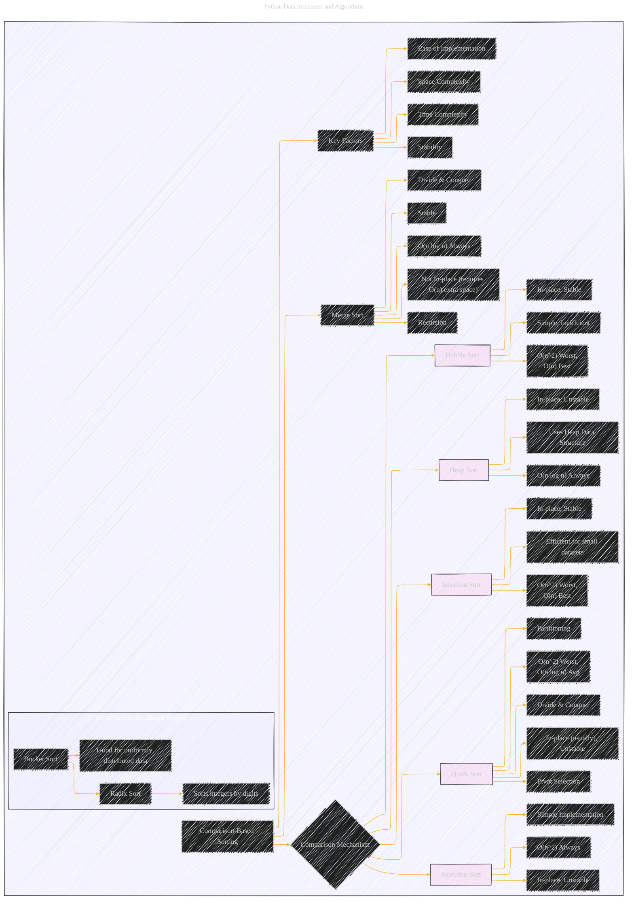

# Sorting Algorithms
> **Disclaimer:**
>
> This document contains my personal notes on the topic,
> compiled from publicly available documentation and various cited sources.
> The materials are intended for educational purposes, personal study, and reference.
> The content is dual-licensed:
> 1. **MIT License:** Applies to all code implementations (Swift, Mermaid, and other programming languages).
> 2. **Creative Commons Attribution 4.0 International License (CC BY 4.0):** Applies to all non-code content, including text, explanations, diagrams, and illustrations.
---

## A Diagrammatic Guide 

Here's a more detailed and expanded Mermaid diagram for Sorting Algorithms, incorporating the content from the original document and relating it to relevant sub-topics and considerations:

---

**Explanation of Additions and Refinements:**

*   **Comparison-Based vs. Non-Comparison-Based Sorting:** Added a top-level split to distinguish between these two broad categories. The original document focused primarily on comparison-based sorts.
*   **Merge Sort Added:**  Since it was mentioned in the text, but not detailed as one of the main algorithms, I've included a basic entry for Merge Sort and made it a separate entry instead of "Comaparison-Based"
*    **More Details:** The comments and notes are provided so you can get a better understanding.
*   **Clarification of Properties:**  The properties (e.g., "In-place," "Stable") are now listed directly under each algorithm for easy comparison.
*   **Key Factors Added:** To show the influence of those factors
*   **Emphasis on Trade-offs:** It shows how different algorithms have different trade-offs between time complexity, space complexity, stability, and ease of implementation.

---
**Licenses:**

- **MIT License:**   - Full text in [LICENSE](LICENSE) file.
- **Creative Commons Attribution 4.0 International:**  - Legal details in [LICENSE-CC-BY](LICENSE-CC-BY) and at [Creative Commons official site](http://creativecommons.org/licenses/by/4.0/).

---