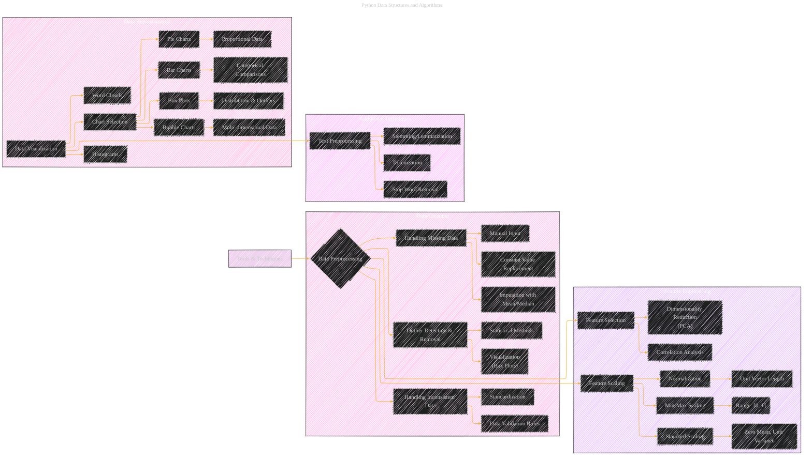

# Tools and Techniques
> **Disclaimer:**
>
> This document contains my personal notes on the topic,
> compiled from publicly available documentation and various cited sources.
> The materials are intended for educational purposes, personal study, and reference.
> The content is dual-licensed:
> 1. **MIT License:** Applies to all code implementations (Swift, Mermaid, and other programming languages).
> 2. **Creative Commons Attribution 4.0 International License (CC BY 4.0):** Applies to all non-code content, including text, explanations, diagrams, and illustrations.
---

## A Diagrammatic Guide 

Alright, let's expand the `Tools and Techniques` diagram to include more details, connections, and related concepts from the provided book content, aiming for a more comprehensive visual representation:

----

**Key improvements and Explanations:**

*   **Data Cleaning Subgraph:** Added a subgraph for "Data Cleaning" to address the initial state of raw data, expanding on the "Handling Missing Data" concept.
*   **Feature Engineering Subgraph:** Added a "Feature Engineering" section that includes:
    *   More detailed Scaling methods: Min-Max Scaling, Standard Scaling
    *   Feature Selection: Dimensionality Reduction, Correlation Analysis
*   **Data Representation Subgraph:**  More chart types are included.
*   **Text Preprocessing** Given the book's content, particularly the Machine Learning chapter, a "Text Preprocessing" section is added, highlighting:
    *   Tokenization
    *   Stop Word Removal
    *   Stemming/Lemmatization
*   **Connections:** Increased the number of connections between nodes to better reflect relationships (e.g., Data Visualization is connected to multiple Chart types).
*    **Annotations:** Use more descriptive annotations for each technique.
*   **Styling:** Consistent styling for clarity.

This expanded diagram provides a more detailed and interconnected overview of the various tools and techniques discussed in the book.

---
**Licenses:**

- **MIT License:**   - Full text in [LICENSE](LICENSE) file.
- **Creative Commons Attribution 4.0 International:**  - Legal details in [LICENSE-CC-BY](LICENSE-CC-BY) and at [Creative Commons official site](http://creativecommons.org/licenses/by/4.0/).

---