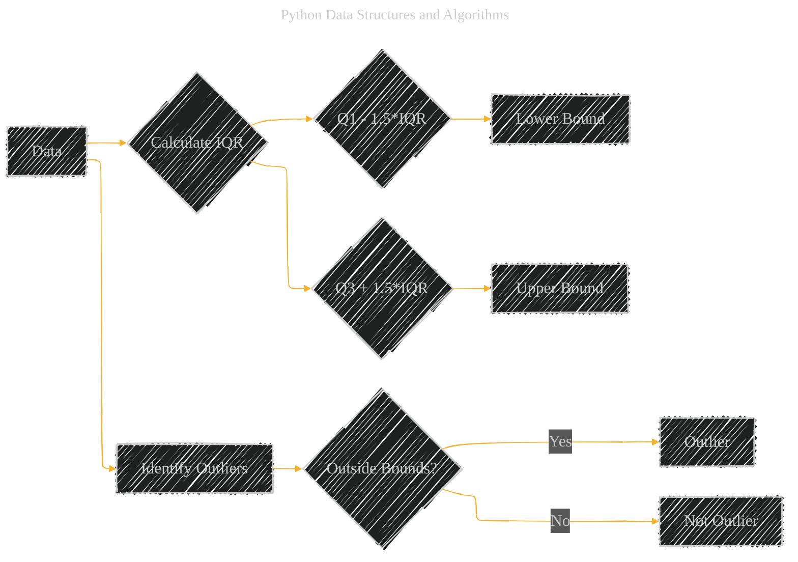

# Tools and Techniques
> **Disclaimer:**
>
> This document contains my personal notes on the topic,
> compiled from publicly available documentation and various cited sources.
> The materials are intended for educational purposes, personal study, and reference.
> The content is dual-licensed:
> 1. **MIT License:** Applies to all code implementations (Swift, Mermaid, and other programming languages).
> 2. **Creative Commons Attribution 4.0 International License (CC BY 4.0):** Applies to all non-code content, including text, explanations, diagrams, and illustrations.
---


This document is an expansion of the initial version [here](./Tools_and_Techniques.md), providing a comprehensive guide to data structures and algorithms in Python, with a particular emphasis on data preprocessing techniques. Data preprocessing is a crucial step in any data analysis or machine learning project, as the quality of the data significantly impacts the performance and reliability of any subsequent analysis or model building.

---

## Tools & Techniques

The foundation of effective data preprocessing lies in understanding and applying the right tools and techniques. These can be broadly categorized into data cleaning, feature engineering, and data representation. The following sections delve into each of these areas, providing detailed explanations, practical examples, and visual aids.

---

## Data Preprocessing

Data preprocessing is the process of transforming raw data into a clean, organized, and understandable format suitable for analysis and modeling. It involves several key steps, including data cleaning, feature engineering, and choosing appropriate data representations.

### Data Cleaning

Raw data often contains various issues such as missing values, outliers, and inconsistencies. Data cleaning addresses these problems to ensure data quality.

#### Handling Missing Data

Missing data is a common problem that can significantly bias analysis results. Several techniques can be employed to handle missing values:

1.  **Imputation with Mean/Median:**
    *   **Description:** Replace missing values with the mean (for normally distributed data) or median (for skewed data) of the available values in that feature.
    *   **Python Example:**

        ```python
        import pandas as pd
        import numpy as np

        data = {'col1': [1, 2, np.nan, 4, 5],
                'col2': [10, np.nan, 30, 40, 50]}
        df = pd.DataFrame(data)

        # Impute with mean
        df['col1'].fillna(df['col1'].mean(), inplace=True)

        # Impute with median
        df['col2'].fillna(df['col2'].median(), inplace=True)
        print(df)

        ```

    *   **Mathematical Representation:**
        *   Mean:  $\bar{x} = \frac{1}{n}\sum_{i=1}^{n} x_i$
        *   Median: The middle value in a sorted dataset.

2.  **Constant Value Replacement:**
    *   **Description:** Replace missing values with a predefined constant (e.g., 0, "Unknown"). This is useful when the missingness itself carries some information.
    *   **Python Example:**

        ```python
        df['col1'].fillna(-1, inplace=True)  # Replace with -1
        print(df)
        ```

3.  **Manual Input:**
    *   **Description:** In some cases, domain knowledge or external sources can be used to manually fill in missing values. This is the most accurate method but can be time-consuming.

4.  **Deletion:** Remove rows with missing values. This should be the last resort, especially if there is a limited amount of data.

#### Outlier Detection & Removal

Outliers are data points that significantly deviate from the rest of the data. They can be caused by errors or represent genuinely unusual but valid data.

1.  **Statistical Methods:**
    *   **Description:** Use statistical measures like z-scores or the interquartile range (IQR) to identify outliers.
    *   **Z-score:** Measures how many standard deviations a data point is from the mean. A common threshold is a z-score of 3 or -3.
    *   **IQR:**  The range between the first quartile (Q1) and the third quartile (Q3). Outliers are often defined as values below Q1 - 1.5\*IQR or above Q3 + 1.5\*IQR.
    *   **Python Example (Z-score):**

        ```python
        from scipy import stats

        df['zscore_col1'] = np.abs(stats.zscore(df['col1']))
        df_no_outliers = df[(df['zscore_col1'] < 3)]
        print(df_no_outliers)
        ```
    * **Mathematical Representation (Z-Score):**
        $z = \frac{x - \mu}{\sigma}$ , Where x = data point, $\mu$ = mean, and $\sigma$ is the standard deviation.

2.  **Visualization (Box Plots):**
    *   **Description:** Box plots visually represent the distribution of data and highlight outliers.
    *  **Mermaid diagram**



#### Handling Inconsistent Data

Inconsistent data arises from different formats, typos, or conflicting information.

1.  **Data Validation Rules:**
    *   **Description:** Define rules to check for data consistency (e.g., age must be a positive number).
    *   **Python Example:**

        ```python
        def validate_age(age):
            if age < 0:
                return "Invalid"
            return "Valid"

        df['age_status'] = df['age'].apply(validate_age)
        print(df)
        ```

2.  **Standardization:**
    *   **Description:** Convert data to a common format (e.g., date formats, units of measurement).
    * **Python Example:**
      ```python
      #Convert 'YYYY/MM/DD' to 'YYYY-MM-DD'
      df['Date'] = pd.to_datetime(df['Date']).dt.strftime('%Y-%m-%d')
      print(df)
      ```

### Feature Engineering

Feature engineering involves creating new features or transforming existing ones to improve model performance.

#### Feature Scaling

Feature scaling adjusts the range of features to ensure they have a similar scale. This is important for algorithms sensitive to feature magnitudes (e.g., k-nearest neighbors, gradient descent-based methods).

1.  **Min-Max Scaling:**
    *   **Description:** Scales features to a range between 0 and 1.
    *   **Python Example:**

        ```python
        from sklearn.preprocessing import MinMaxScaler

        scaler = MinMaxScaler()
        df[['col1_scaled', 'col2_scaled']] = scaler.fit_transform(df[['col1', 'col2']])
        print(df)
        ```
    * **Mathematical Equation:**

        $$
        x_{scaled} = \frac{x - x_{min}}{x_{max} - x_{min}}
        $$

2.  **Standard Scaling:**
    *   **Description:** Scales features to have a mean of 0 and a standard deviation of 1.
    *   **Python Example:**

        ```python
        from sklearn.preprocessing import StandardScaler

        scaler = StandardScaler()
        df[['col1_scaled', 'col2_scaled']] = scaler.fit_transform(df[['col1', 'col2']])
        print(df)

        ```
     * **Mathematical Equation:**
        $x_{scaled} = \frac{x - \mu}{\sigma}$

3.  **Normalization:**
    *   **Description:** Scales each sample (row) to have unit norm (length).
    *   **Python Example:**

        ```python
        from sklearn.preprocessing import Normalizer
        scaler = Normalizer()
        df[['col1_normalized','col2_normalized']] = scaler.fit_transform(df[['col1','col2']])
        print(df)
        ```
      * **Mathematical Representation:**
        $$
        x_{normalized} = \frac{x}{||x||}
        $$
       Where $||x||$ represents the Euclidean norm (or L2 norm) of the vector x.

#### Feature Selection

Feature selection aims to identify the most relevant features for a model, reducing dimensionality and improving performance.

1.  **Dimensionality Reduction (PCA):**
    *   **Description:** Principal Component Analysis (PCA) is a technique that transforms data into a new coordinate system where the axes (principal components) are orthogonal and capture the most variance in the data.
    *   **Python Example:**

        ```python
        from sklearn.decomposition import PCA

        pca = PCA(n_components=2)  # Reduce to 2 components
        principalComponents = pca.fit_transform(df[['col1', 'col2']])
        df_pca = pd.DataFrame(data=principalComponents, columns=['PC1', 'PC2'])
        print(df_pca)
        ```

2.  **Correlation Analysis:**
    *   **Description:** Identify highly correlated features and potentially remove one of them to avoid multicollinearity.
    * **Python Example:**
        ```python
        correlation_matrix = df.corr()
        print(correlation_matrix)
        ```

### Data Representation

Choosing the right data representation is crucial for effective communication and analysis.

#### Data Visualization

Visualizing data helps to understand patterns, trends, and outliers.

1. **Chart Selection:**
  *  **Bar Charts:** For comparing categorical data.
  *   **Pie Charts:** For showing proportions of a whole.
  *   **Box Plots:** For visualizing data distribution and identifying outliers.
  *   **Bubble Charts:** For representing multi-dimensional data (x, y, size, and potentially color).
  *   **Word Clouds:** For visualizing the frequency of words in text data.
  * **Histograms:** For visualizing data distribution.

2. **Python Example (using Matplotlib and Seaborn):**

```python
import matplotlib.pyplot as plt
import seaborn as sns

# Bar Chart
sns.barplot(x='category', y='value', data=df)
plt.show()

# Pie Chart
plt.pie(df['value'], labels=df['category'], autopct='%1.1f%%')
plt.show()

# Box Plot
sns.boxplot(x='category', y='value', data=df)
plt.show()

# Bubble Chart
plt.scatter('x', 'y', s='size', c='color', data=df)
plt.show()

#Word Cloud
from wordcloud import WordCloud
text = " ".join(review for review in df.text_column)
wordcloud = WordCloud().generate(text)
plt.imshow(wordcloud, interpolation='bilinear')
plt.axis('off')
plt.show()

#Histogram
plt.hist(df['numerical_column'], bins = 10)
plt.xlabel('Value')
plt.ylabel('Frequency')
plt.title('Histogram of Numerical Column')
plt.show()
```

#### Additional Techniques

##### Text Preprocessing

For text data, several preprocessing steps are commonly used:

1.  **Tokenization:**
    *   **Description:** Splitting text into individual words or tokens.
    * **Python Example (using NLTK):**
    ```python
    import nltk
    nltk.download('punkt')
    from nltk.tokenize import word_tokenize
    text = "This is a sample sentence."
    tokens = word_tokenize(text)
    print(tokens)
    ```

2.  **Stop Word Removal:**
    *   **Description:** Removing common words (e.g., "the", "a", "is") that don't carry much meaning.
    * **Python Example**
        ```python
        from nltk.corpus import stopwords
        nltk.download('stopwords')
        stop_words = set(stopwords.words('english'))
        filtered_tokens = [w for w in tokens if not w.lower() in stop_words]
        print(filtered_tokens)
        ```

3.  **Stemming/Lemmatization:**
    *   **Description:** Reducing words to their root form (e.g., "running" to "run"). Stemming is a cruder heuristic process, while lemmatization uses a vocabulary and morphological analysis.
    * **Python Example (Stemming):**
        ```python
        from nltk.stem import PorterStemmer
        stemmer = PorterStemmer()
        stemmed_tokens = [stemmer.stem(w) for w in filtered_tokens]
        print(stemmed_tokens)

        ```
      * **Python Example (Lemmatization):**
        ```python
        from nltk.stem import WordNetLemmatizer
        nltk.download('wordnet')
        lemmatizer = WordNetLemmatizer()
        lemmatized_tokens = [lemmatizer.lemmatize(w) for w in filtered_tokens]
        print(lemmatized_tokens)
        ```
---


**Summary**

This comprehensive guide covered essential data preprocessing techniques in Python, including data cleaning, feature engineering, and data representation.  By applying these methods appropriately, you can significantly improve the quality and effectiveness of your data analysis and machine-learning models. The use of Python libraries such as Pandas, NumPy, Scikit-learn, Matplotlib, Seaborn, and NLTK greatly simplifies the implementation of these techniques.  Visualizations, both through code examples and Mermaid diagrams, help to illustrate the concepts and processes involved.  The mathematical representations of key formulas provide a deeper understanding of the underlying principles.


---
**Licenses:**

- **MIT License:**  [](LICENSE) - Full text in [LICENSE](LICENSE) file.
- **Creative Commons Attribution 4.0 International:** [](LICENSE-CC-BY) - Legal details in [LICENSE-CC-BY](LICENSE-CC-BY) and at [Creative Commons official site](http://creativecommons.org/licenses/by/4.0/).

---