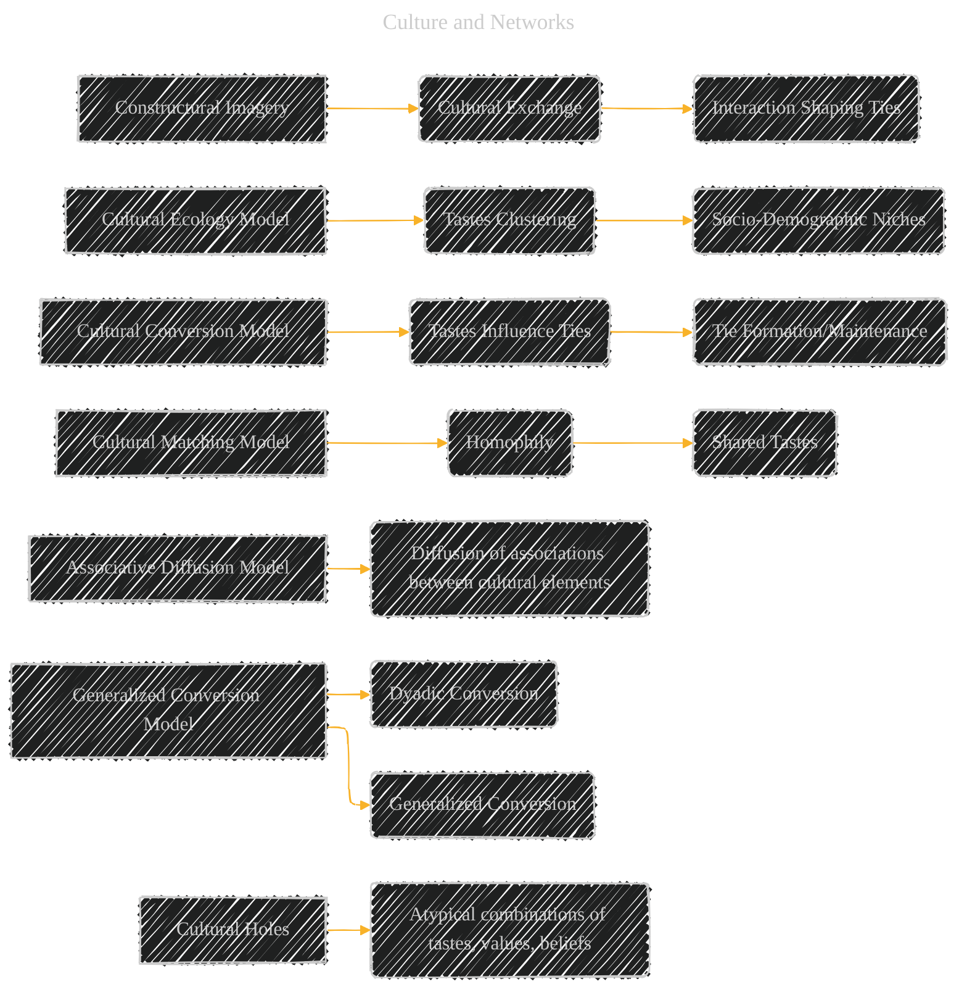
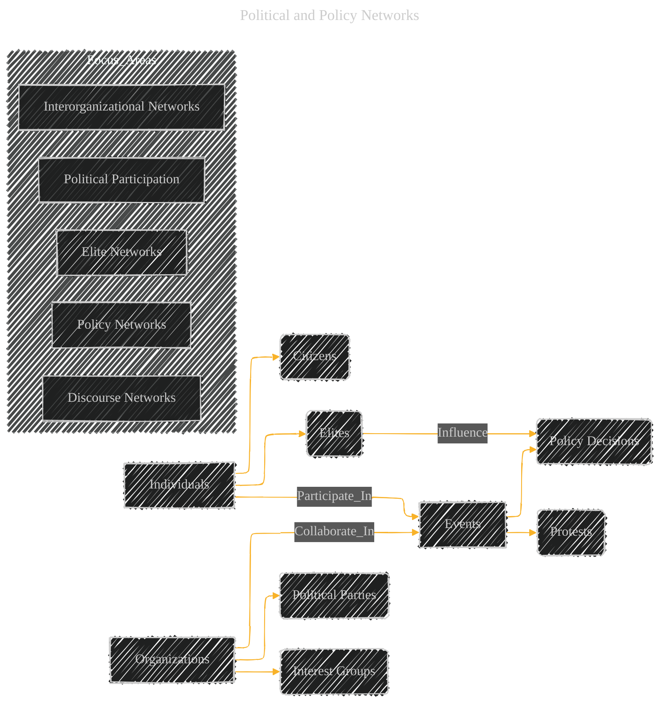
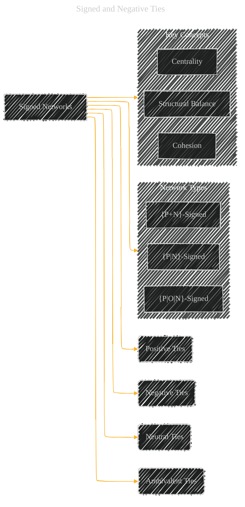

# The Sage Handbook of Social Network Analysis - A Diagrammatic Guide
> **Disclaimer:**
>
> This document contains my personal notes on the topic,
> compiled from publicly available documentation and various cited sources.
> The materials are intended for educational purposes, personal study, and reference.
> The content is dual-licensed:
> 1. **MIT License:** Applies to all code implementations (Swift, Mermaid, and other programming languages).
> 2. **Creative Commons Attribution 4.0 International License (CC BY 4.0):** Applies to all non-code content, including text, explanations, diagrams, and illustrations.
---


**Concepts and Diagrams Extracted from the Original Document, with Mermaid Representations**

Here's a breakdown of concepts and potential diagrams I've extracted, mirroring the approach of the reference (using Mermaid syntax for diagrams when applicable):

## 1. Core Concepts of Social Networks (Relational Data)

*   **Nodes:**  Actors (individuals, groups, organisations, events).
*   **Edges:** Ties, links, relationships (directed or undirected, weighted or unweighted).
*   **Network Types:** One-mode, two-mode, multimodal, multilevel, multiplex, longitudinal.
*   **Properties:** Density, centrality, cohesion, structural equivalence, reciprocity.
*   **Statistical Models:** Stochastic block models (SBM), Exponential Random Graph Models (ERGM), etc.
* **Data Types:**
    *       Positive and Negative Ties
    *       Binary, Weighted and Valued Ties
    *       Multimode Networks
    *       Dynamic Networks
    *       Missing Network Data

## Mermaid Representation (Graph - General Concepts)


----


## 2.  Social Capital and Networks

*   **Concept:**  Social capital as a resource embedded in social networks.
*   **Levels:** Individual vs. collective social capital.
*   **Mechanisms:** Investment, property rights, institutions.
*   **Network Structures:**  Dense networks (cohesion, closure), sparse networks (structural holes, brokerage).
*   **Outcomes:**  Benefits for individuals (job attainment, upward mobility), collective benefits (social cohesion, lower crime rates).

## Mermaid Representation (Mind Map - Social Capital)

```mermaid
---
title: "Social Capital and Networks"
author: "Cong Le"
version: "1.0"
license(s): "MIT, CC BY 4.0"
copyright: "Copyright (c) 2025 Cong Le. All Rights Reserved."
config:
  layout: elk
  look: handDrawn
  theme: dark
---
%%%%%%%% Mermaid version v11.4.1-b.14
%%%%%%%% Toggle theme value to `base` to activate the initilization below for the customized theme version.
%%%%%%%% Available curve styles include the following keywords:
%% basis, bumpX, bumpY, cardinal, catmullRom, linear, monotoneX, monotoneY, natural, step, stepAfter, stepBefore.
%%{
  init: {
    'mindmap': { 'htmlLabels': false},
    'fontFamily': 'Fantasy',
    'themeVariables': {
      'primaryColor': '#ffff',
      'primaryTextColor': '#55ff',
      'primaryBorderColor': '#7c2',
      'lineColor': '#F8B229',
      'secondaryColor': '#006100',
      'tertiaryColor': '#fff'
    }
  }
}%%
mindmap
  root((Social Capital))
    Individual_Level
      Investment_in_Relationships
      Resources_from_Networks
      Job_Attainment
      Upward_Mobility
    Collective_Level
      Cohesion
      Trust
      Lower_Crime_Rates
      Functioning_of_Society
    Network_Structures
      Dense_Networks
      Sparse_Networks
      Structural_Holes
      Brokerage
    Mechanisms
      Investment
      Property_Rights
      Institutions
```


---


## 3. Culture and Networks

*   **Constructural Imagery:** Cultural exchange and interaction shaping social connections.
*   **Cultural Ecology Model:** Tastes and opinions clustering in social-demographic niches.
*   **Cultural Conversion Model:** Cultural tastes influencing tie formation and maintenance.
*   **Cultural Matching Model:**  Homophily based on shared cultural tastes.
*   **Generalized Conversion Model:**  Distinguishing between dyadic and generalized conversion.
*   **Associative Diffusion Model:** Diffusion of associations between cultural elements, not just single elements.
* **Cultural Holes:** Atypical combination of tastes, values and beliefs.

## Mermaid Representation (Graph - Cultural Concepts)



---

## 4. Social Movements and Collective Action

*  **Key Concepts:**
    *       Micromobilisation
    *       Social Ties
    *       Collective Identity
    *       Network Embeddedness
    *       Social Capital
    *       Virtual vs Non-Virtual Networks

## Mermaid Representation (Mindmap)

```mermaid
---
title: "Social Movements and Collective Action"
author: "Cong Le"
version: "1.0"
license(s): "MIT, CC BY 4.0"
copyright: "Copyright (c) 2025 Cong Le. All Rights Reserved."
config:
  layout: elk
  look: handDrawn
  theme: dark
---
%%%%%%%% Mermaid version v11.4.1-b.14
%%%%%%%% Toggle theme value to `base` to activate the initilization below for the customized theme version.
%%%%%%%% Available curve styles include the following keywords:
%% basis, bumpX, bumpY, cardinal, catmullRom, linear, monotoneX, monotoneY, natural, step, stepAfter, stepBefore.
%%{
  init: {
    'mindmap': { 'htmlLabels': false},
    'fontFamily': 'Fantasy',
    'themeVariables': {
      'primaryColor': '#ffff',
      'primaryTextColor': '#55ff',
      'primaryBorderColor': '#7c2',
      'lineColor': '#F8B229',
      'secondaryColor': '#006100',
      'tertiaryColor': '#fff'
    }
  }
}%%
mindmap
  root((Social Movements and Collective Action))
    section Core_Elements
      Micro-mobilisation
      Social_Ties
      Collective_Identity
      Network_Embeddedness
      Social_Capital
      Virtual_Networks
      Non-Virtual_Networks
      
      Micro-mobilisation --> Social_Ties
      Social_Ties --> Collective_Identity
      Network_Embeddedness --> Collective_Identity
      Social_Capital --> Network_Embeddedness
      Virtual_Networks --> Micro-mobilisation
      Non-Virtual_Networks --> Micro-mobilisation
```


----


## 5.  Political and Policy Networks

*   **Key Components:**
    *   Individuals (citizens, elites)
    *   Organizations (parties, interest groups)
    *   Events (policy decisions, protests)
*   **Focus Areas:**
    *   Political participation
    *   Elite networks
    *   Interorganizational networks
    *   Policy networks
    *   Discourse networks

## Mermaid Representation (Graph - Political Networks)



---


## 6. International Trade Networks

* **Key Relations**
    *   Commodity trade networks
    *   Preferential trade agreements (PTAs)
    *   Interfirm Networks
* **Levels of Aggregation**
    *   Country
    *   Sector
    *   Firm
* **Research Questions**
    *   Network topology
    *   Explanations of Network Structure
    *   Outcomes of network structure
    *   Co-evolution of networks and attributes

## Mermaid Representation (Mind Map - Trade Networks)

```mermaid
---
title: "International Trade Networks"
author: "Cong Le"
version: "1.0"
license(s): "MIT, CC BY 4.0"
copyright: "Copyright (c) 2025 Cong Le. All Rights Reserved."
config:
  layout: elk
  look: handDrawn
  theme: dark
---
%%%%%%%% Mermaid version v11.4.1-b.14
%%%%%%%% Toggle theme value to `base` to activate the initilization below for the customized theme version.
%%%%%%%% Available curve styles include the following keywords:
%% basis, bumpX, bumpY, cardinal, catmullRom, linear, monotoneX, monotoneY, natural, step, stepAfter, stepBefore.
%%{
  init: {
    'mindmap': { 'htmlLabels': false},
    'fontFamily': 'Fantasy',
    'themeVariables': {
      'primaryColor': '#ffff',
      'primaryTextColor': '#55ff',
      'primaryBorderColor': '#7c2',
      'lineColor': '#F8B229',
      'secondaryColor': '#006100',
      'tertiaryColor': '#fff'
    }
  }
}%%
mindmap
    root((International Trade Networks))
        section Relations
            Commodity_Trade
            Preferential_Trade_Agreements
            Interfirm
        section Aggregation_Levels
            Country
            Sector
            Firm
        section Research_Questions
            Network_Topology
            Explanations_Structure
            Outcomes_Structure
            Coevolution
```

---


## 7.  Signed and Negative Ties

*   **Key Concepts:**
    *   Positive ties
    *   Negative ties
    *   Neutral ties
    *   Ambivalent ties
    *   Structural balance
    *   Cohesion
    *   Centrality
*   **Network Types:**
    *   {P|N}-signed network
    *   {P|O|N}-signed network
    *   {P+N}-signed network

## Mermaid Representation (Graph - Signed Networks)



---


## 8. Qualitative and Mixed-Methods in Network Analysis

*   **Strengths:**
    *   Accessing hard-to-reach populations.
    *   Understanding meaning, context, and processes.
    *   Improving data quality.
    *   Triangulation and validation.
*   **Methods:**
    *   Ethnography, observation, interviews, document analysis.
    *   Visual tools (e.g., sociograms, network maps).
    *   Mixed-methods designs (qual-quant, quant-qual, parallel).

## Mermaid Representation (Mind Map - Qualitative/Mixed Methods)

```mermaid
---
title: "Qualitative and Mixed-Methods in Network Analysis"
author: "Cong Le"
version: "1.0"
license(s): "MIT, CC BY 4.0"
copyright: "Copyright (c) 2025 Cong Le. All Rights Reserved."
config:
  layout: elk
  look: handDrawn
  theme: dark
---
%%%%%%%% Mermaid version v11.4.1-b.14
%%%%%%%% Toggle theme value to `base` to activate the initilization below for the customized theme version.
%%%%%%%% Available curve styles include the following keywords:
%% basis, bumpX, bumpY, cardinal, catmullRom, linear, monotoneX, monotoneY, natural, step, stepAfter, stepBefore.
%%{
  init: {
    'mindmap': { 'htmlLabels': false},
    'fontFamily': 'Fantasy',
    'themeVariables': {
      'primaryColor': '#ffff',
      'primaryTextColor': '#55ff',
      'primaryBorderColor': '#7c2',
      'lineColor': '#F8B229',
      'secondaryColor': '#006100',
      'tertiaryColor': '#fff'
    }
  }
}%%
mindmap
    root((Qualitative and Mixed Methods))
        section Strengths
            Access_Populations
            Understanding_Meaning
            Data_Quality
            Triangulation
        section Methods
            Ethnography
            Observation
            Interviews
            Document_Analysis
            Visual_Tools
        section Mixed_Methods_Designs
            Qual-Quant
            Quant-Qual
            Parallel
```

---


## 9. Missing Network Data
*  **Key Concepts:**
    *       Missing completely at random (MCAR)
    *       Missing at random (MAR)
    *       Missing not at random (MNAR)
    *       Actor non-response
    *       Tie non-response
* **Techniques**
    *       Deletion
    *       Likelihood-based methods
    *       Imputation
        *          Unconditional means
        *          Unconditional distributions
        *          Conditional means
        *          Conditional distributions

## Mermaid Representation (Mindmap)

```mermaid
---
title: "Missing Network Data"
author: "Cong Le"
version: "1.0"
license(s): "MIT, CC BY 4.0"
copyright: "Copyright (c) 2025 Cong Le. All Rights Reserved."
config:
  layout: elk
  look: handDrawn
  theme: dark
---
%%%%%%%% Mermaid version v11.4.1-b.14
%%%%%%%% Toggle theme value to `base` to activate the initilization below for the customized theme version.
%%%%%%%% Available curve styles include the following keywords:
%% basis, bumpX, bumpY, cardinal, catmullRom, linear, monotoneX, monotoneY, natural, step, stepAfter, stepBefore.
%%{
  init: {
    'mindmap': { 'htmlLabels': false},
    'fontFamily': 'Fantasy',
    'themeVariables': {
      'primaryColor': '#ffff',
      'primaryTextColor': '#55ff',
      'primaryBorderColor': '#7c2',
      'lineColor': '#F8B229',
      'secondaryColor': '#006100',
      'tertiaryColor': '#fff'
    }
  }
}%%
mindmap
  root((Missing Network Data))
    section Concepts
      MCAR
      MAR
      MNAR
      Actor_Non-Response
      Tie_Non-Response
      
      Actor_Non-Response --> Missing_Data
      Tie_Non-Response --> Missing_Data
      
      Missing_Data
      
    section Techniques
      Deletion
      Likelihood_Based
      Imputation
      
      Imputation --> Unconditional_Means
      Imputation --> Unconditional_Distribution
      Imputation --> Conditional_Means
      Imputation --> Conditional_Distribution
    
```

----


## 10.  Scientific Software for Network Analysis

* **UCINet and NetDraw**: Long-established, menu-driven software with many features, including visualisation.
* **R and Python**: Powerful, flexible programming environments with extensive libraries for network analysis, modelling, and visualisation.
* **Other Software Packages**:  Gephi, Pajek, Visone, ORA, statnet, etc.
* **Programming Languages**:
    *       R
        *          sna
        *          statnet
        *         igraph
    *      Python
        *           NetworkX
        *           igraph
        *           graph-tool

## Mermaid Representation (Mindmap)

```mermaid
---
title: "Scientific Software for Network Analysis"
author: "Cong Le"
version: "1.0"
license(s): "MIT, CC BY 4.0"
copyright: "Copyright (c) 2025 Cong Le. All Rights Reserved."
config:
  layout: elk
  look: handDrawn
  theme: dark
---
%%%%%%%% Mermaid version v11.4.1-b.14
%%%%%%%% Toggle theme value to `base` to activate the initilization below for the customized theme version.
%%%%%%%% Available curve styles include the following keywords:
%% basis, bumpX, bumpY, cardinal, catmullRom, linear, monotoneX, monotoneY, natural, step, stepAfter, stepBefore.
%%{
  init: {
    'mindmap': { 'htmlLabels': false},
    'fontFamily': 'Fantasy',
    'themeVariables': {
      'primaryColor': '#ffff',
      'primaryTextColor': '#55ff',
      'primaryBorderColor': '#7c2',
      'lineColor': '#F8B229',
      'secondaryColor': '#006100',
      'tertiaryColor': '#fff'
    }
  }
}%%
mindmap
    root((Scientific Software for Network Analysis))
        section UCINet_NetDraw
            Menu-Driven
            Visualization
            Long_History
        section R_Python
            Programming_Environments
            Extensive_Libraries
            Flexibility
            Reproducibility
        section Other_Software
            Gephi
            Pajek
            Visone
            ORA
        section Packages
            subsection R
                sna
                statnet
                igraph
            subsection Python
                NetworkX
                igraph
                graph-tool
```


## Key Points and Takeaways

*   **Networks as a Foundational Perspective:** The chapter emphasizes that social network analysis is not merely a method, but a fundamental theoretical perspective or paradigm.  It's a way of understanding social life through the lens of relationships.
*   **Multifaceted Applications:**  SNA's concepts and methods have been applied to a vast array of social phenomena. This chapter showcases that diversity.
*   **Interdisciplinary Nature:** The research covered draws from multiple disciplines, reflecting the interdisciplinary roots and current breadth of SNA.
*   **Emphasis on Dynamics:** There's a clear emphasis on longitudinal studies and modelling network dynamics, reflecting the ongoing development of the field.
*   **Mixed Methods Potential:** The chapter explicitly acknowledges the importance of combining quantitative network analysis with qualitative research, pointing towards more holistic and contextualised understanding.
*   **Challenges and New Frontiers:** The chapter also highlights ongoing methodological challenges, such as boundary specification, missing data, and the need for further theoretical development. It points to new frontiers like the analysis of digital trace data, computational social science, and the integration of network science with other fields like ecology and neuroscience.
*   **Practical Application:** The overview of software tools makes the chapter practically relevant for researchers wanting to get started with network analysis.


The original document highlights a thriving and evolving field that is grappling with both its theoretical foundations and practical applications. It shows a move towards more nuanced, dynamic, and interdisciplinary approaches to network analysis. The examples are well-chosen to illustrate key concepts and ongoing debates.


---
**Licenses:**

- **MIT License:**  [](LICENSE) - Full text in [LICENSE](LICENSE) file.
- **Creative Commons Attribution 4.0 International:** [](LICENSE-CC-BY) - Legal details in [LICENSE-CC-BY](LICENSE-CC-BY) and at [Creative Commons official site](http://creativecommons.org/licenses/by/4.0/).

---