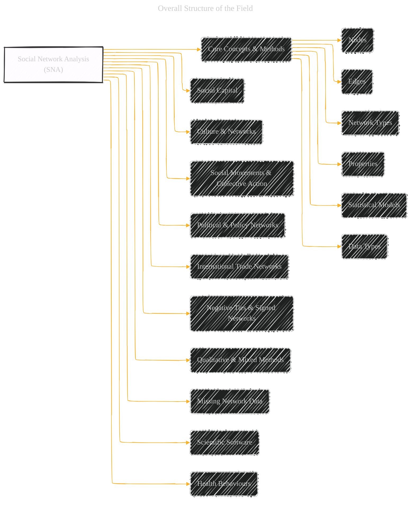
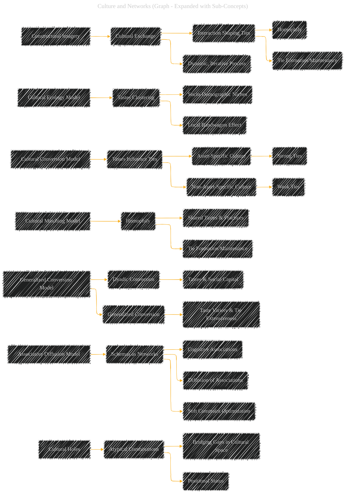
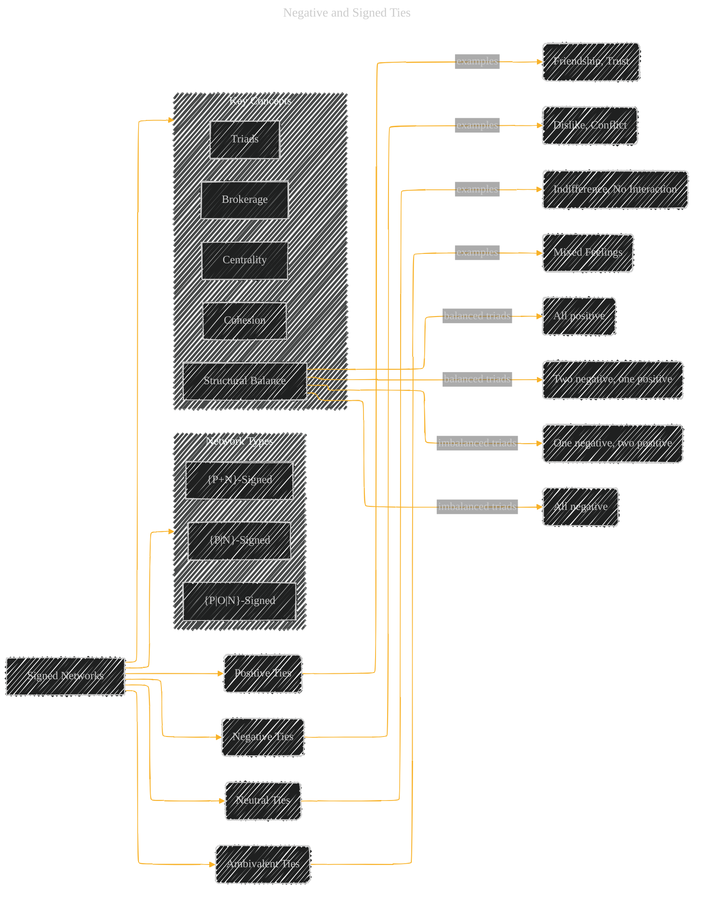

# The Sage Handbook of Social Network Analysis - A Diagrammatic Guide
> **Disclaimer:**
>
> This document contains my personal notes on the topic,
> compiled from publicly available documentation and various cited sources.
> The materials are intended for educational purposes, personal study, and reference.
> The content is dual-licensed:
> 1. **MIT License:** Applies to all code implementations (Swift, Mermaid, and other programming languages).
> 2. **Creative Commons Attribution 4.0 International License (CC BY 4.0):** Applies to all non-code content, including text, explanations, diagrams, and illustrations.
---

The diagrams below provide a more visually structured and interconnected representation of the key ideas, concepts, and methods discussed in the original document. The use of different diagram types (graph, mindmap) helps to differentiate between general overviews, hierarchical relationships, and more specific process flows.  The expanded versions provide more detail and sub-topics, making the relationships between concepts clearer.

----


## 1.  Overall Structure of the Field (Graph)

This will be a high-level graph showing the major areas of application and their interconnections.  It will serve as a "map" of the chapter's content.



---


## 2. Social Capital (Mind Map - Expanded)

This expands the previous mind map to include sub-topics and related research areas.

```mermaid
---
title: "Social Capital"
author: "Cong Le"
version: "1.0"
license(s): "MIT, CC BY 4.0"
copyright: "Copyright (c) 2025 Cong Le. All Rights Reserved."
config:
  layout: elk
  look: handDrawn
  theme: dark
---
%%%%%%%% Mermaid version v11.4.1-b.14
%%%%%%%% Toggle theme value to `base` to activate the initilization below for the customized theme version.
%%%%%%%% Available curve styles include the following keywords:
%% basis, bumpX, bumpY, cardinal, catmullRom, linear, monotoneX, monotoneY, natural, step, stepAfter, stepBefore.
%%{
  init: {
    "mindmap": { "htmlLabels": false, 'curve': 'linear' },
    'fontFamily': 'Fantasy',
    'themeVariables': {
      'primaryColor': '#ffff',
      'primaryTextColor': '#55ff',
      'primaryBorderColor': '#7c2',
      'lineColor': '#F8B229',
      'secondaryColor': '#006100',
      'tertiaryColor': '#fff'
    }
  }
}%%
mindmap
  root((Social Capital))
    Individual_Level
      Investment_in_Relationships
      Resources_from_Networks
        Job_Attainment
        Upward_Mobility
        Information_Access
        Social_Support
    Collective_Level
      Cohesion
      Trust
        Civic_Engagement
        Lower_Crime_Rates
      Functioning_of_Society
    Network_Structures
      Dense_Networks(Cohesion, Closure)
      Sparse_Networks(Structural Holes, Brokerage)
    Mechanisms
      Investment
      Property_Rights
        Shared_Ownership
      Institutions
        Welfare_States
    Critiques
        Vagueness
        Dark_Side
    Measurement
        Name_Generators
        Position_Generators

```


----


## 3.  Culture and Networks (Graph - Expanded with Sub-Concepts)

This graph will show the two primary theoretical imageries and link them to related concepts.



----


## 4.  Social Movements and Collective Action (Mindmap - Expanded)

```mermaid
---
title: "Social Movements and Collective Action"
author: "Cong Le"
version: "1.0"
license(s): "MIT, CC BY 4.0"
copyright: "Copyright (c) 2025 Cong Le. All Rights Reserved."
config:
  layout: elk
  look: handDrawn
  theme: dark
---
%%%%%%%% Mermaid version v11.4.1-b.14
%%%%%%%% Toggle theme value to `base` to activate the initilization below for the customized theme version.
%%%%%%%% Available curve styles include the following keywords:
%% basis, bumpX, bumpY, cardinal, catmullRom, linear, monotoneX, monotoneY, natural, step, stepAfter, stepBefore.
%%{
  init: {
    "mindmap": { "htmlLabels": false, 'curve': 'linear' },
    'fontFamily': 'Fantasy',
    'themeVariables': {
      'primaryColor': '#ffff',
      'primaryTextColor': '#55ff',
      'primaryBorderColor': '#7c2',
      'lineColor': '#F8B229',
      'secondaryColor': '#006100',
      'tertiaryColor': '#fff'
    }
  }
}%%
mindmap
  root((Social Movements and Collective Action))
    section Core_Elements
      Micro-mobilisation
        Network_Recruitment
        Resource_Mobilization
      Social_Ties
        Strong_Ties
        Weak_Ties
        Multiplex_Ties
      Collective_Identity
        Shared_Beliefs
        Shared_Goals
      Network_Embeddedness
        Social_Influence
        Social_Contagion
      Social_Capital
        Information_Flow
        Coordination
      Virtual_Networks
        Online_Activism
        Social_Media
      Non-Virtual_Networks
        Offline_Activism
        Face-to-Face
      
      Micro-mobilisation --> Social_Ties
      Social_Ties --> Collective_Identity
      Network_Embeddedness --> Collective_Identity
      Social_Capital --> Network_Embeddedness
      Virtual_Networks --> Micro-mobilisation
      Non-Virtual_Networks --> Micro-mobilisation
      Virtual_Networks -- Complementary --> Non-Virtual_Networks
    section Dynamics
        Tie_Formation
        Tie_Dissolution
        Tie_Activation
        Identity_Salience
        Protest_Cycles
        
```

----

## 5. Political and Policy Networks (Graph Expanded)


-----

## 6. International Trade Networks (Mindmap - Expanded)

```mermaid
---
title: "International Trade Networks"
author: "Cong Le"
version: "1.0"
license(s): "MIT, CC BY 4.0"
copyright: "Copyright (c) 2025 Cong Le. All Rights Reserved."
config:
  layout: elk
  look: handDrawn
  theme: dark
---
%%%%%%%% Mermaid version v11.4.1-b.14
%%%%%%%% Toggle theme value to `base` to activate the initilization below for the customized theme version.
%%%%%%%% Available curve styles include the following keywords:
%% basis, bumpX, bumpY, cardinal, catmullRom, linear, monotoneX, monotoneY, natural, step, stepAfter, stepBefore.
%%{
  init: {
    'mindmap': { 'htmlLabels': false},
    'fontFamily': 'Fantasy',
    'themeVariables': {
      'primaryColor': '#ffff',
      'primaryTextColor': '#55ff',
      'primaryBorderColor': '#7c2',
      'lineColor': '#F8B229',
      'secondaryColor': '#006100',
      'tertiaryColor': '#fff'
    }
  }
}%%
mindmap
    root((International Trade Networks))
        section Relations
            Commodity_Trade
                Goods
                Services
            Preferential_Trade_Agreements
                Bilateral
                Plurilateral
            Interfirm
                Supply_Chains
                Joint_Ventures
        section Aggregation_Levels
            Country
            Sector
            Firm
        section Research_Questions
            Network_Topology
                Core-Periphery_Structure
                Small-World_Properties
                Clustering
                Centralization
            Explanations_Structure
                Endogenous_Processes
                    Transitivity
                    Preferential_Attachment
                Exogenous_Factors
                    Economic_Size
                    Geographic_Distance
                    Political_Alliances
            Outcomes_Structure
                Economic_Growth
                Development
                Vulnerability_Resilience
            Coevolution
                Networks_Attributes
                Multiple_Networks
        section Data_Sources
            IMF
            WTO
            EORA
            GTAP
            World_Input-Output_Database
            FactSet
            Compustat

```

-----

## 7. Negative and Signed Ties (Graph Expanded)



-----

## 8. Qualitative and Mixed Methods (Mindmap Expanded)

```mermaid
---
title: "Qualitative and Mixed Methods"
author: "Cong Le"
version: "1.0"
license(s): "MIT, CC BY 4.0"
copyright: "Copyright (c) 2025 Cong Le. All Rights Reserved."
config:
  layout: elk
  look: handDrawn
  theme: dark
---
%%%%%%%% Mermaid version v11.4.1-b.14
%%%%%%%% Toggle theme value to `base` to activate the initilization below for the customized theme version.
%%%%%%%% Available curve styles include the following keywords:
%% basis, bumpX, bumpY, cardinal, catmullRom, linear, monotoneX, monotoneY, natural, step, stepAfter, stepBefore.
%%{
  init: {
    'mindmap': { 'htmlLabels': false, 'curve': 'basis' },
    'fontFamily': 'Fantasy',
    'themeVariables': {
      'primaryColor': '#ffff',
      'primaryTextColor': '#55ff',
      'primaryBorderColor': '#7c2',
      'lineColor': '#F8B229',
      'secondaryColor': '#006100',
      'tertiaryColor': '#fff'
    }
  }
}%%
mindmap
    root((Qualitative and Mixed Methods))
        section Strengths
            Access_Populations
                Hard-to-Reach
                Vulnerable
            Understanding_Meaning
                Context
                Processes
                Subjective_Experiences
            Data_Quality
                Validity
                Reliability
            Triangulation
                Validation
                Complementarity
        section Methods
            Ethnography
            Observation
                Participant-Observation
                Systematic_Observation
            Interviews
                Semi-Structured
                In-Depth
                Expert
            Document_Analysis
                Archival_Data
            Visual_Tools
                Sociograms
                Network_Maps
            Mixed-Methods_Strategies
                Qual-Quant
                Quant-Qual
                Parallel_Designs
                Conversion_Designs
        section Benefits
            Network_Practices
            Network_Orientations
            Network_Processes
            Network_Dynamics
            Network_Effects
        section Integration_Stages
            Data_Collection
            Data_Analysis
            Interpretation
            
```


----

## 9. Missing Network Data (Mind Map - Expanded)

```mermaid
---
title: "Missing Network Data"
author: "Cong Le"
version: "1.0"
license(s): "MIT, CC BY 4.0"
copyright: "Copyright (c) 2025 Cong Le. All Rights Reserved."
config:
  layout: elk
  look: handDrawn
  theme: dark
---
%%%%%%%% Mermaid version v11.4.1-b.14
%%%%%%%% Toggle theme value to `base` to activate the initilization below for the customized theme version.
%%%%%%%% Available curve styles include the following keywords:
%% basis, bumpX, bumpY, cardinal, catmullRom, linear, monotoneX, monotoneY, natural, step, stepAfter, stepBefore.
%%{
  init: {
    'mindmap': { 'htmlLabels': false},
    'fontFamily': 'Fantasy',
    'themeVariables': {
      'primaryColor': '#ffff',
      'primaryTextColor': '#55ff',
      'primaryBorderColor': '#7c2',
      'lineColor': '#F8B229',
      'secondaryColor': '#006100',
      'tertiaryColor': '#fff'
    }
  }
}%%
mindmap
    root((Missing Network Data))
        section Concepts
            MCAR
            MAR
            MNAR
            Actor_Non-Response
                Complete
                Partial
            Tie_Non-Response
            Missing_Nodes

            Actor_Non-Response --> Missing_Data
            Tie_Non-Response --> Missing_Data
            Missing_Nodes --> Missing_Data

            Missing_Data

        section Techniques
            Deletion
                Listwise
                Pairwise
            Likelihood_Based
                ERGM
                SAOM
            Imputation
                Unconditional_Means
                Unconditional_Distributions
                    Hot-Deck_Imputation
                Conditional_Means
                    Reconstruction
                Conditional_Distributions
                    Link_Prediction
                    Multiple_Imputation
        section Challenges
            Unknown_Mechanism
            Bias
            Reduced_Power

```

-----

## 10.  Scientific Software for Network Analysis (Mind Map - Expanded)


```mermaid
---
title: "Scientific Software for Network Analysis"
author: "Cong Le"
version: "1.0"
license(s): "MIT, CC BY 4.0"
copyright: "Copyright (c) 2025 Cong Le. All Rights Reserved."
config:
  layout: elk
  look: handDrawn
  theme: dark
---
%%%%%%%% Mermaid version v11.4.1-b.14
%%%%%%%% Toggle theme value to `base` to activate the initilization below for the customized theme version.
%%%%%%%% Available curve styles include the following keywords:
%% basis, bumpX, bumpY, cardinal, catmullRom, linear, monotoneX, monotoneY, natural, step, stepAfter, stepBefore.
%%{
  init: {
    'mindmap': { 'htmlLabels': false},
    'fontFamily': 'Fantasy',
    'themeVariables': {
      'primaryColor': '#ffff',
      'primaryTextColor': '#55ff',
      'primaryBorderColor': '#7c2',
      'lineColor': '#F8B229',
      'secondaryColor': '#006100',
      'tertiaryColor': '#fff'
    }
  }
}%%
mindmap
    root((Scientific Software for Network Analysis))
        section UCINet_NetDraw
            Menu-Driven
                Easy_to_Learn
                Limited_Flexibility
            Visualization
            Descriptive_Statistics
            Basic_Inferential_Methods
            Long_History
        section R_Python
            Programming_Environments
                Flexibility
                Reproducibility
                Extensibility
            Extensive_Libraries
                Advanced_Models
                Large-Scale_Analysis
            Visualization
        section Other_Software
            Gephi
                Interactive_Visualization
                Large_Networks
            Pajek
                Large_Networks
                Longitudinal_Analysis
            Visone
                Interactive_Exploration
                Multilevel_Networks
            ORA
                Dynamic_Network_Analysis
                Meta-Networks
        section Packages
            subsection R
                sna
                statnet
                    ergm
                    SAOM
                    network
                    latentnet
                igraph
                RSiena
                Bergm
                btergm
            subsection Python
                NetworkX
                    Basic_Network_Analysis
                    Visualization
                igraph
                    Large-Scale_Analysis
                    Community_Detection
                graph-tool
                    Statistical_Inference
                    Efficient_Computation
                pyvis
```

---
**Licenses:**

- **MIT License:**  [](LICENSE) - Full text in [LICENSE](LICENSE) file.
- **Creative Commons Attribution 4.0 International:** [](LICENSE-CC-BY) - Legal details in [LICENSE-CC-BY](LICENSE-CC-BY) and at [Creative Commons official site](http://creativecommons.org/licenses/by/4.0/).

---