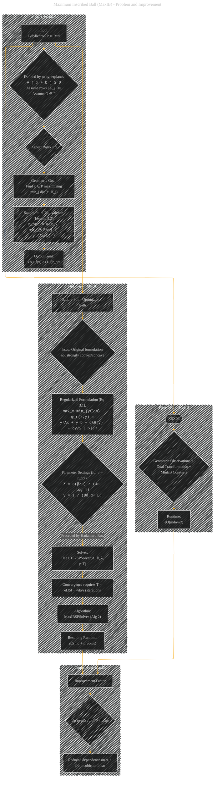
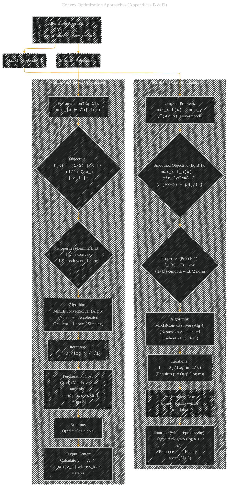

# Optimization Algorithms for Faster Computational Geometry
> **Disclaimer:**
>
> This document contains my personal notes on the topic,
> compiled from publicly available documentation and various cited sources.
> The materials are intended for educational purposes, personal study, and reference.
> The content is dual-licensed:
> 1. **MIT License:** Applies to all code implementations (Swift, Mermaid, and other programming languages).
> 2. **Creative Commons Attribution 4.0 International License (CC BY 4.0):** Applies to all non-code content, including text, explanations, diagrams, and illustrations.
---

## Diagram 1: Paper Overview and Contributions

*This first diagram gives a big-picture look at the research paper. It introduces the two main geometric problems (MaxIB and MinEB), the new optimization technique used (Saddle-Point with L1L2SPSolver and Hadamard Rotation), and summarizes the main results – significantly faster algorithms. It sets the stage for digging into the details of each problem and the methods used, starting with the Maximum Inscribed Ball (MaxIB) problem.*

---

## Diagram 2: Maximum Inscribed Ball (MaxIB) - Problem and Improvement

*This diagram focuses specifically on the first problem: finding the Maximum Inscribed Ball (MaxIB). It explains the problem's input and goal, shows how it's mathematically related to a saddle-point problem (Lemma 3.2), outlines the previous best algorithm's runtime, and then details how the new saddle-point approach (using L1L2SPSolver after regularization and Hadamard rotation) achieves a better runtime. Having explained MaxIB, the next diagram will similarly break down the second main problem, Minimum Enclosing Ball (MinEB).*

---

## Diagram 3: Minimum Enclosing Ball (MinEB) - Problem and Improvement

*Following the structure for MaxIB, this diagram details the Minimum Enclosing Ball (MinEB) problem. It describes the input (a set of points), the goal (find the smallest ball containing them), its saddle-point formulation (Eq 4.1), compares prior algorithm runtimes, and outlines how the new regularized saddle-point method leads to the improved runtime. Since both MaxIB and MinEB rely on the same core technical ideas (L1L2SPSolver and Hadamard rotation), the next diagram will dive into these shared components.*

```mermaid
---
title: "Minimum Enclosing Ball (MinEB) - Problem and Improvement"
author: "Cong Le"
version: "1.0"
license(s): "MIT, CC BY 4.0"
copyright: "Copyright (c) 2025 Cong Le. All Rights Reserved."
config:
  layout: elk
  look: handDrawn
  theme: dark
---
%%%%%%%% Mermaid version v11.4.1-b.14
%%%%%%%% Toggle theme value to `base` to activate the initilization below for the customized theme version.
%%%%%%%% Available curve styles include the following keywords:
%% basis, bumpX, bumpY, cardinal, catmullRom, linear, monotoneX, monotoneY, natural, step, stepAfter, stepBefore.
%%{
  init: {
    'graph': { 'htmlLabels': false, 'curve': 'linear' },
    'fontFamily': 'Fantasy',
    'themeVariables': {
      'primaryColor': '#ffff',
      'primaryTextColor': '#55ff',
      'primaryBorderColor': '#7c2',
      'lineColor': '#F8B229',
      'secondaryColor': '#006100',
      'tertiaryColor': '#fff'
    }
  }
}%%
graph TD
    subgraph MinEB_Problem
        A["Input:<br/> n points {a_1, ..., a_n} ⊂ R^d"] --> A1{"Preprocessing:<br/> Shift origin to a_1 (a_1=0)<br/> Scale s.t. max_i ||a_i||₂ = 1"}
        A1 --> B{"Geometric Goal:<br/> Find center y ∈ R^d minimizing max_i ||y - a_i||₂"}
        B --> C{"Saddle-Point Equivalence (Eq 4.1):<br/><code>OPT = (1/2)R_opt² = min_y max_{x ∈ Δn} (1/2) Σ x_i ||y - a_i||²</code>"}
        C --> E("Output Goal:<br/> y s.t. max_i ||y - a_i||₂ ≤ (1+ε)R_opt")
    end

    subgraph Prior_Work_MinEB
        F["Core-set Techniques"] --> G["Runtime:<br/> O(nd/ε)"]
        H["[SVZ11] Primal-Dual"] --> I{"Runtime:<br/> Worst Case ~ O(nd√logn/√ε)"}
    end

    subgraph This_Paper_MinEB
        J["Saddle-Point Optimization Path"] -- Rewrite --> K{"Max-Min Formulation:<br/><code>-OPT = max_y min_{x ∈ Δn} φ(x,y)</code><br/><code>φ(x,y) = xᵀ Aᵀ y + xᵀ b - (1/2) ||y||²</code> <br> (where b_i = -1/2 ||a_i||²)"}
        K --> L{"Issue:<br/> Not strongly convex in x"}
        L --> M["Regularized Formulation (Eq 4.2):<br/><code>-min_x max_y φ_r(x,y) =</code><br/><code>xᵀAᵀy + xᵀb + dλH(x) - dγ/2 ||y||²</code>"]
        M --> N{"Parameter Settings:<br/><code>λ = ε / (8d log n)</code><br/><code>γ = 1/d</code>"}
        N -- "Preceded by Hadamard Rot." --> O["Solver:<br/> Use L1L2SPSolver((A^T)', b, λ, γ, T)<br/>Note: x, y roles swapped vs Alg 1 definition!"]
        O --> P["Convergence requires T = eΩ(d + √d/√ε) iterations"]
        P --> Q["Algorithm:<br/> MinEBSPSolver (Alg 3)"]
        Q --> R["Resulting Runtime:<br/> eO(nd + n√d/√ε)"]
    end

    subgraph Comparison_MinEB
        S["Improvement Factor"] --> T{"Up to eO(√d) vs [SVZ11] <br/> Up to eO(√d/√ε) vs Core-sets"}
    end

    A --> F
    A --> H
    A --> J
    G --> S
    I --> S
    R --> S

```

---

## Diagram 4: Core Technical Components - L1L2SPSolver and Hadamard Rotation

*This diagram zooms in on the key technical innovations of the paper: the L1L2SPSolver algorithm (Algorithm 1) and the use of a randomized Hadamard rotation (Lemma 2.1). It explains the target saddle-point problem structure (Eq 2.1), the steps within the L1L2SPSolver, its convergence guarantee (Theorem 2.2), and how the Hadamard rotation preprocesses the input matrix to improve the solver's performance. Understanding these core tools allows us to see exactly how they are applied to formulate and solve MaxIB in the next diagram.*

```mermaid
---
title: "Core Technical Components - L1L2SPSolver and Hadamard Rotation"
author: "Cong Le"
version: "1.0"
license(s): "MIT, CC BY 4.0"
copyright: "Copyright (c) 2025 Cong Le. All Rights Reserved."
config:
  layout: elk
  look: handDrawn
  theme: dark
---
%%%%%%%% Mermaid version v11.4.1-b.14
%%%%%%%% Toggle theme value to `base` to activate the initilization below for the customized theme version.
%%%%%%%% Available curve styles include the following keywords:
%% basis, bumpX, bumpY, cardinal, catmullRom, linear, monotoneX, monotoneY, natural, step, stepAfter, stepBefore.
%%{
  init: {
    'graph': { 'htmlLabels': false, 'curve': 'linear' },
    'fontFamily': 'Fantasy',
    'themeVariables': {
      'primaryColor': '#ffff',
      'primaryTextColor': '#55ff',
      'primaryBorderColor': '#7c2',
      'lineColor': '#F8B229',
      'secondaryColor': '#006100',
      'tertiaryColor': '#fff'
    }
  }
}%%
graph TD
    subgraph Haddamard_Preprocessing["Hadamard Rotation Preprocessing<br/>(Lemma 2.1)"]
        direction LR
        P1["Input Matrix A"] --> P2{"Goal:<br/>Uniformize Entries -> |(AT)_ji| ≤ q/√d<br/>where q = O(√logm)"}
        P2 --> P3["Method:<br/> Apply Random Rotation T = (HD)^T <br/> H: Walsh-Hadamard, D: Random ±1 Diagonal"]
        P3 --> P4["Compute A' = AT"]
        P4 --> P5["Cost:<br/> O(md log d) using FFT"]
        P5 --> P6["Output:<br/> Transformed matrix A'"]
    end

    subgraph SaddlePointProblem["Target Saddle-Point Problem solved by L1L2SPSolver<br/>(Eq 2.1)"]
        SP1["Problem Definition: <br/> <code>max_{x∈R^d} min_{y∈Δm} { (1/d) yᵀA'x + (1/d) yᵀb + λH(y) - γ/2 ||x||² }</code>"]
        SP1 --> SP2{"Characteristics: <br/> A' ∈ R^{mxd}, b ∈ R^m <br/> y ∈ Δm (probability simplex) <br/> H(y) = Σ y_i log y_i (Entropy) <br> λ, γ > 0: Regularization params"}
        SP2 --> SP3["'1-'2 Structure: <br/> λ - strongly convex in y (w.r.t '1 norm via Bregman V_x(y)) <br> γ - strongly concave in x (w.r.t '2 norm)"]
    end

    subgraph L1L2SPSolverAlgo["L1L2SPSolver Algorithm<br/>(Alg 1)"]
        S1["Input:<br/> A', b, λ, γ, T<br/>(iterations)"] --> S2{"Parameter Calculation:<br/><code>τ = 1 / (2q√dγλ)</code><br/><code>σ = 1 / (2q√dλγ)</code><br/><code>θ = 1 - 1 / (d + q/√λdγ)</code>"}
        S2 --> S3{"Initialization:<br/> x(0)=0, y(0)=uniform, Set τ, σ, θ"}
        S3 --> S4{"Iteration t=0 to T-1:"}
        S4 -- "Random i*" --> S5["Update x(t+1)_i*:<br/> Single coordinate update (closed form) <br/> Depends on y(t), y(t-1), A'_i*, σ, γ, θ"]
        S4 -- Full Update --> S6["Update y(t+1):<br/> Multiplicative Weight Update (exp step) <br/> Depends on A'x(t+1)', b, y(t), τ, λ"]
        S5 --> S7["Next Iteration"]
        S6 --> S7
        S7 --> S8["Output:<br/> x(T), y(T)"]
    end

    subgraph Convergence["Convergence Guarantee<br/>(Thm 2.2)"]
        C1["Result:<br/> Converges towards optimal (x◦, y◦) with rate θ^T"]
        C1 --> C2{"Explicit Bound (Eq 2.3):<br/><code>(1/τ+2/λ) E[V_{y(T)}(y◦)] + (1/(4σ)+dγ) E[||x◦-x(T)||²] ≤</code><br/><code>θ^T * [ (1/τ+2/λ)log m + (1/(2σ)+dγ)||x◦||² ]</code>"}
        C2 --> C3["Interpretation:<br/>Error decreases exponentially with T."]
    end

    P6 --> SP1
    SP3 --> S1
    S8 --> C1

```

---

## Diagram 5: MaxIB Formulation as Saddle-Point Optimization

*This diagram shows the step-by-step process of turning the MaxIB geometric problem into the specific regularized saddle-point form (Eq 3.1) that the L1L2SPSolver can handle effectively. It highlights the addition of regularization terms (entropy H(y) and squared L2 norm ||x||²) and specifies the parameter choices (λ, γ) needed for the theoretical guarantees. It details the exact setup for MaxIB before the next diagram does the same for MinEB.*

```mermaid
---
title: "MaxIB Formulation as Saddle-Point Optimization"
author: "Cong Le"
version: "1.0"
license(s): "MIT, CC BY 4.0"
copyright: "Copyright (c) 2025 Cong Le. All Rights Reserved."
config:
  layout: elk
  look: handDrawn
  theme: dark
---
%%%%%%%% Mermaid version v11.4.1-b.14
%%%%%%%% Toggle theme value to `base` to activate the initilization below for the customized theme version.
%%%%%%%% Available curve styles include the following keywords:
%% basis, bumpX, bumpY, cardinal, catmullRom, linear, monotoneX, monotoneY, natural, step, stepAfter, stepBefore.
%%{
  init: {
    'graph': { 'htmlLabels': false, 'curve': 'linear' },
    'fontFamily': 'Fantasy',
    'themeVariables': {
      'primaryColor': '#ffff',
      'primaryTextColor': '#55ff',
      'primaryBorderColor': '#7c2',
      'lineColor': '#F8B229',
      'secondaryColor': '#006100',
      'tertiaryColor': '#fff'
    }
  }
}%%
graph TD
    A["MaxIB Problem:<br/> Maximize radius r_opt"] --> B{"Geometric Formulation: <br/> <code>r_opt = max_x min_j { <A_j, x> + b_j }</code>"}
    B --> C{"Equivalent Saddle-Point (Lemma 3.2): <br/> <code>r_opt = max_x min_{y ∈ Δm} φ(x,y)</code><br/> where <code>φ(x,y) = yᵀ(Ax+b)</code>"}
    C --> D{"Issue:<br/> φ(x,y) lacks strong convexity/concavity required by solver."}
    D --> E["Solution:<br/> Add '1-norm (entropy) and '2-norm regularization."]
    E --> F{"Regularized Problem (Eq 3.1): <br/> <code>max_x min_{y ∈ Δm} φ_r(x,y) =</code><br/><code>yᵀAx + yᵀb + dλH(y) - dγ/2 ||x||²</code> <br>(H(y) is entropy on Δm)"}
    F --> G{"Parameter Setting (depends on β ≈ r_opt):<br/><code>λ = ε(β/c) / (4d log m)</code><br/><code>γ = ε / (8d α² β)</code>"}
    G --> H["Preprocessing:<br/> 1. Apply Hadamard Rotation A → A' (Lemma 2.1) <br/> 2. Need β s.t. β/c ≤ r_opt ≤ β (Appx C)"]
    H --> I["Solver Stage:<br/> Apply L1L2SPSolver(A', b, λ, γ, T) <br/> T = eΩ(d + α√d/ε)"]
    I --> J{"Result (Thm 3.7):<br/> Output x(T) satisfies f(x(T)) ≥ (1-O(ε))r_opt w.h.p. <br/> based on Claims 3.4-3.6 showing error bounds"}
    J --> K["Final Runtime:<br/> eO(md + m√dα/ε)"]
```

---

## Diagram 6: MinEB Formulation as Saddle-Point Optimization

*Similar to the previous diagram, this one details the transformation of the MinEB geometric problem into the specific regularized saddle-point form (Eq 4.2) suitable for the L1L2SPSolver framework. It shows the max-min reformulation, identifies the need for regularization, defines the regularized objective, specifies the parameters (λ, γ), mentions preprocessing steps (shifting/scaling points, Hadamard rotation), and crucially notes the role-swapping of variables when inputting to L1L2SPSolver. Having detailed the main saddle-point approaches for both problems, the final diagram looks at the alternative convex optimization methods from the appendices.*

```mermaid
---
title: "MinEB Formulation as Saddle-Point Optimization"
author: "Cong Le"
version: "1.0"
license(s): "MIT, CC BY 4.0"
copyright: "Copyright (c) 2025 Cong Le. All Rights Reserved."
config:
  layout: elk
  look: handDrawn
  theme: dark
---
%%%%%%%% Mermaid version v11.4.1-b.14
%%%%%%%% Toggle theme value to `base` to activate the initilization below for the customized theme version.
%%%%%%%% Available curve styles include the following keywords:
%% basis, bumpX, bumpY, cardinal, catmullRom, linear, monotoneX, monotoneY, natural, step, stepAfter, stepBefore.
%%{
  init: {
    'graph': { 'htmlLabels': false, 'curve': 'linear' },
    'fontFamily': 'Fantasy',
    'themeVariables': {
      'primaryColor': '#ffff',
      'primaryTextColor': '#55ff',
      'primaryBorderColor': '#7c2',
      'lineColor': '#F8B229',
      'secondaryColor': '#006100',
      'tertiaryColor': '#fff'
    }
  }
}%%
graph TD
    A["MinEB Problem:<br/> Minimize radius R_opt"] --> B{"Geometric Formulation: <br/> <code>R_opt² = min_y max_i ||y - a_i||²</code>"}
    B --> C{"Equivalent Saddle-Point (Eq 4.1): <br/> <code>OPT = (1/2)R_opt² = min_y max_{x ∈ Δn} (1/2) Σ x_i ||y - a_i||²</code>"}
    C --> D{"Rewrite as Max-Min Problem: <br/><code>-OPT = max_y min_{x ∈ Δn} φ(x,y)</code><br/>where <code>φ(x,y) = xᵀ Aᵀ y + xᵀ b - (1/2) ||y||²</code> <br/> (A = [a1..an], b_i = -1/2 ||a_i||²)"}
    D --> E{"Issue:<br/> φ(x,y) is not strongly convex in x for the target solver form."}
    E --> F["Solution:<br/> Add '1-norm (entropy) and '2-norm regularization."]
    F --> G{"Regularized Problem (Eq 4.2): <br/><code>-min_x max_y φ_r(x,y) =</code><br/><code>xᵀAᵀy + xᵀb + dλH(x) - dγ/2 ||y||²</code> <br> (H(x) is entropy on Δn)"}
    G --> H{"Parameter Setting:<br/><code>λ = ε / (8d log n)</code><br/><code>γ = 1/d</code>"}
    H --> I["Preprocessing:<br/> 1. Shift origin (a1=0), Scale max||ai||=1 <br/> 2. Apply Hadamard Rotation to Aᵀ → (Aᵀ)' (Lemma 2.1)"]
    I --> J["Solver Stage:<br/> Apply L1L2SPSolver((Aᵀ)', b, λ, γ, T)<br/><b>Crucially: Map Alg 1's 'y' to problem's 'x', Alg 1's 'x' to problem's 'y'</b> <br/> T = eΩ(d + √d/√ε)"]
    J --> K{"Result (Thm 4.5):<br/> Output y(T) is center of ball with radius ≤ (1+O(ε))R_opt w.h.p.<br/> based on Claims 4.2-4.4 showing error bounds"}
    K --> L["Final Runtime:<br/> eO(nd + n√d/√ε)"]
```

---

## Diagram 7: Convex Optimization Approaches (Appendices B & D)

*This final diagram shifts focus to the alternative solutions presented in the appendices, which use convex smooth optimization instead of the main paper's saddle-point approach. It outlines how MaxIB can be tackled using a smoothed "softmin" objective with Nesterov's accelerated gradient method (Appendix B), and how MinEB can be directly formulated as a smooth convex problem (w.r.t. the '1 norm) also solvable by accelerated gradient methods (Appendix D). This concludes the overview by presenting these alternative, simpler (though sometimes slightly slower) methods.*

---
**Licenses:**

- **MIT License:**   - Full text in [LICENSE](LICENSE) file.
- **Creative Commons Attribution 4.0 International:**  - Legal details in [LICENSE-CC-BY](LICENSE-CC-BY) and at [Creative Commons official site](http://creativecommons.org/licenses/by/4.0/).

---