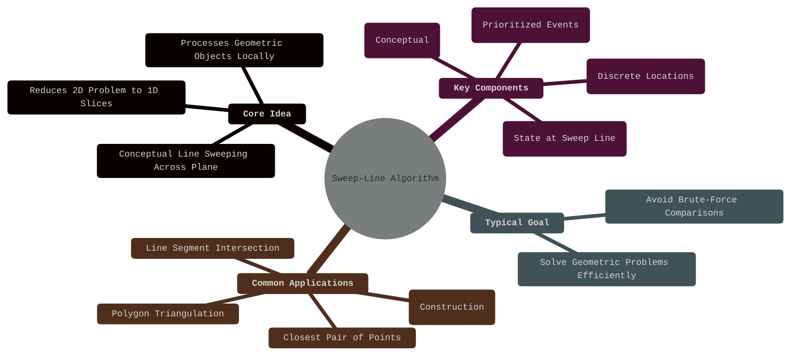
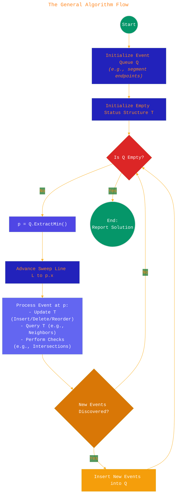
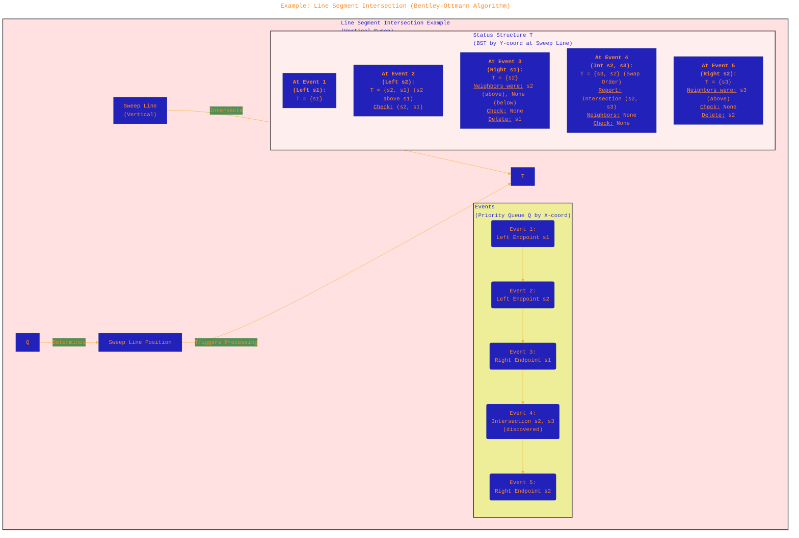
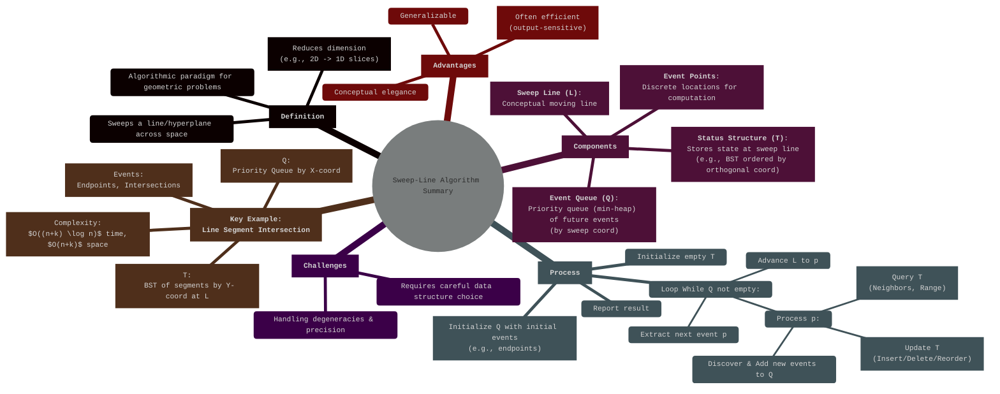

# The Sweep-Line Algorithm Overview
> **Disclaimer:**
>
> This document contains my personal notes on the topic,
> compiled from publicly available documentation and various cited sources.
> The materials are intended for educational purposes, personal study, and reference.
> The content is dual-licensed:
> 1. **MIT License:** Applies to all code implementations (Swift, Mermaid, and other programming languages).
> 2. **Creative Commons Attribution 4.0 International License (CC BY 4.0):** Applies to all non-code content, including text, explanations, diagrams, and illustrations.
---

# The Sweep-Line Algorithm: A Geometric Approach

**Author:** Cong Le
**Description:** Introductory mind map outlining the core concepts of the Sweep-Line Algorithm.

## 1. Introduction: What is the Sweep-Line Algorithm?

The **Sweep-Line Algorithm**, also known as the **Plane Sweep Algorithm**, is a powerful algorithmic paradigm primarily used in **Computational Geometry**. It transforms a static, $d$-dimensional geometric problem (commonly 2D) into a sequence of $(d-1)$-dimensional problems (commonly 1D) by conceptually "sweeping" a line or hyperplane across the space. Instead of considering all geometric objects globally at once, the algorithm processes them incrementally as they intersect the sweep line, managing the relevant information dynamically. This often leads to significantly more efficient solutions compared to naive or brute-force approaches.

---

## 2. Core Concept: The Sweep Metaphor

Imagine a vertical line sweeping across a 2D plane containing geometric objects (points, line segments, polygons) from left to right (or sometimes top to bottom). The core idea is that the relevant geometric relationships change only at specific, discrete points, called **event points**. The algorithm only performs computations at these event points. Between event points, the combinatorial structure relevant to the problem (relative order of objects intersected by the sweep line) remains unchanged.

```mermaid
---
title: "Core Concept: The Sweep Metaphor"
author: "Cong Le"
version: "1.0"
license(s): "MIT, CC BY 4.0"
copyright: "Copyright (c) 2025 Cong Le. All Rights Reserved."
config:
  theme: base
---
%%%%%%%% Mermaid version v11.4.1-b.14
%%%%%%%% Available curve styles include the following keywords:
%% basis, bumpX, bumpY, cardinal, catmullRom, linear, monotoneX, monotoneY, natural, step, stepAfter, stepBefore.
%%{
  init: {
    'graph': { 'htmlLabels': false, 'curve': 'natural' },
    'fontFamily': 'Monospace',
    'themeVariables': {
      'primaryColor': '#22B',
      'primaryTextColor': '#F82',
      'primaryBorderColor': '#7C33',
      'secondaryColor': '#0615',
      'lineColor': '#F8B229'
    }
  }
}%%
graph TD
    A["Start:<br/>Plane with Geometric Objects"]
    B("Sweep Line at X_initial")
    C{"Sweep Line Moves -->"}
    D("Event Point Encountered?")
    E["Process Event:<br/>Update Information"]
    F["Continue Sweep"]
    G["End:<br/>Sweep Completed, Solution Found"]

    A --> B
    B --> C
    C --> D
    D -- Yes --> E
    E --> F
    D -- No --> F
    F --> C
    F --> G
    
    subgraph Geometric_Space_2D_Plane["Geometric Space<br/>(2D Plane)"]
    style Geometric_Space_2D_Plane fill:#e9f,stroke:#333,stroke-width:2px
    direction LR
      P1("Point 1")
      P2("Point 2")
      L1("Line Segment A")
      L2("Line Segment B")
    end
    
    subgraph Sweep_Process["Sweep Process"]
    style Sweep_Process fill:#2ee,stroke:#333,stroke-width:2px
    %% direction TD
        B
        C
        D
        E
        F
    end
    
   style A fill:#1a1a1a,stroke:#eee,stroke-width:2px
   style G fill:#1a1a1a,stroke:#eee,stroke-width:2px
   style D fill:#87CEEB, color: #000
   style E fill:#90EE90, color: #000
   
```

**Author:** Cong Le
**Description:** Conceptual flow illustrating the sweep-line metaphor.

---

## 3. Key Components

The sweep-line algorithm relies on three crucial components:

1.  **Sweep Line (L):** A conceptual line (typically vertical or horizontal) that moves across the plane. Its position defines the "present" moment in the algorithm's execution.
2.  **Event Points (Events):** Discrete points in the plane where the combinatorial structure related to the problem potentially changes. These are typically determined by the input objects (e.g., endpoints of line segments, intersection points). They dictate *when* the algorithm needs to perform actions.
    *   **Event Queue (Q):** A data structure, usually implemented as a **priority queue** (min-heap), that stores future event points, ordered by their sweep coordinate (e.g., x-coordinate for a vertical sweep line). This allows the algorithm to efficiently jump to the next relevant location. Operations: `Insert(event)`, `ExtractMin()`.
3.  **Status Structure (T or S):** A data structure that maintains the relevant information about the geometric objects currently intersected by the sweep line. It represents the state of the $(d-1)$-dimensional subproblem at the current sweep line position. The choice of status structure is critical and problem-dependent. Often, a **balanced binary search tree (BST)** or a similar ordered dictionary structure is used, ordered by the coordinate perpendicular to the sweep direction (e.g., y-coordinate for a vertical sweep line). Operations typically include `Insert(object)`, `Delete(object)`, `FindNeighbors(object)`, `Query(range)`.

```mermaid
---
title: "Key Components"
author: "Cong Le"
version: "1.0"
license(s): "MIT, CC BY 4.0"
copyright: "Copyright (c) 2025 Cong Le. All Rights Reserved."
config:
  theme: base
---
%%%%%%%% Mermaid version v11.4.1-b.14
%%%%%%%% Available curve styles include the following keywords:
%% basis, bumpX, bumpY, cardinal, catmullRom, linear, monotoneX, monotoneY, natural, step, stepAfter, stepBefore.
%%{
  init: {
    'graph': { 'htmlLabels': false, 'curve': 'natural' },
    'fontFamily': 'Monospace',
    'themeVariables': {
      'primaryColor': '#22BB',
      'primaryTextColor': '#F82',
      'primaryBorderColor': '#7C33',
      'secondaryColor': '#0615',
      'lineColor': '#F8B229'
    }
  }
}%%
graph LR
    subgraph Sweep_Line_Components_Framework["Sweep-Line Components Framework"]
        A["Geometric Problem Input"] --> B("Identify Event Points")
        B --> C("Initialize Event Queue - Q")
        A --> D("Choose Status Structure - T")
        D --> E("Initialize Empty Status Structure")
        
        F{"Algorithm Loop"}
        C -- "Get Next Event" --> F
        
        F -- "Current Sweep Line Position" --> G["Process Event Point"]
        G -- "Interactions? Query" --> T[("Status Structure T<br><i>e.g., BST ordered by Y</i>")]
        G -- "Updates Needed" --> T
        T -- "Update/Modify" --> G
        
        F -- "Finished?" --> H["Solution Found"]
    end

    style A fill:#1f2937,stroke:#eee
    style B fill:#374151,stroke:#eee
    style C fill:#4b5563,stroke:#eee
    style D fill:#374151,stroke:#eee
    style E fill:#4b5563,stroke:#eee
    style F fill:#6b7280,stroke:#eee
    style G fill:#9ca3af,stroke:#000
    style T fill:#d1d5db,stroke:#000
    style H fill:#1f2937,stroke:#eee

```

**Author:** Cong Le
**Description:** Diagram showing the interplay between the key components: Input, Event Queue (Q), Status Structure (T), and the main algorithm loop.

---

## 4. The General Algorithm Flow

While specific implementations vary, the general structure of a sweep-line algorithm is as follows:

1.  **Initialization:**
    *   Identify all relevant event points based on the input geometric objects (e.g., segment endpoints).
    *   Insert these initial event points into the Event Queue (Q), prioritized by their sweep coordinate (e.g., x-coordinate).
    *   Initialize an empty Status Structure (T).
2.  **Sweep Loop:** While the Event Queue (Q) is not empty:
    *   Extract the event point (p) with the minimum sweep coordinate from Q.
    *   Advance the conceptual Sweep Line (L) to the position of p.
    *   **Process Event (p):** Handle the event based on its type (e.g., segment start, segment end, intersection point):
        *   Update the Status Structure (T) by inserting, deleting, or reordering objects relevant at p.
        *   Perform checks or computations based on the objects in T near p (e.g., check for intersections between neighbors in T).
        *   If new event points are discovered during processing (e.g., intersections), insert them into the Event Queue (Q).
3.  **Termination:** Once the Event Queue is empty, the sweep is complete. The final solution is constructed from the information gathered during the sweep.

**Author:** Cong Le
**Description:** Flowchart detailing the steps of a typical Sweep-Line Algorithm.

---

## 5. Example: Line Segment Intersection (Bentley-Ottmann Algorithm)

One of the classic applications is finding all intersection points among a set of $n$ line segments.

1.  **Input:** A set of $n$ line segments $S = \{s_1, s_2, ..., s_n\}$.
2.  **Event Points:**
    *   Segment endpoints (left and right).
    *   Intersection points between segments (discovered dynamically).
    *   Events are prioritized by x-coordinate, then y-coordinate (for ties).
3.  **Event Queue (Q):** A min-priority queue storing events `(x, y, type, segment(s))`. Types: `LEFT_ENDPOINT`, `RIGHT_ENDPOINT`, `INTERSECTION`.
4.  **Status Structure (T):** A balanced binary search tree (like AVL or Red-Black Tree) storing segments that currently intersect the sweep line, ordered by their y-coordinate at the sweep line's x-position. Requires efficient `Insert`, `Delete`, `FindAbove`, `FindBelow` operations.
5.  **Processing:**
    *   **Left Endpoint (p, segment $s_i$):**
        *   Insert $s_i$ into T based on its y-coordinate at $p.x$.
        *   Let $s_a$ be the segment immediately above $s_i$ in T, and $s_b$ be the segment immediately below $s_i$ in T.
        *   Check for intersections between $(s_i, s_a)$ and $(s_i, s_b)$.
        *   If an intersection point $p_{int}$ is found and $p_{int}.x > p.x$, insert $p_{int}$ into Q as an `INTERSECTION` event.
    *   **Right Endpoint (p, segment $s_i$):**
        *   Let $s_a$ be the segment immediately above $s_i$ in T, and $s_b$ be the segment immediately below $s_i$ in T.
        *   Check for intersection between $(s_a, s_b)$.
        *   If an intersection point $p_{int}$ is found and $p_{int}.x > p.x$, insert $p_{int}$ into Q.
        *   Delete $s_i$ from T.
    *   **Intersection Point (p, segments $s_i, s_j$):**
        *   Report the intersection $(p, s_i, s_j)$.
        *   Swap the order of $s_i$ and $s_j$ in T (they must have been adjacent).
        *   Let $s_a$ be the new segment above the swapped pair, and $s_b$ be the new segment below.
        *   Check for intersections between $(s_j, s_a)$ (new upper) and $(s_i, s_b)$ (new lower).
        *   If intersections $p_{int}$ are found and $p_{int}.x > p.x$, insert them into Q.

**Author:** Cong Le
**Description:** Illustrative sequence for the Line Segment Intersection problem, showing event processing and status updates.

---

## 6. Complexity Analysis

Let $n$ be the number of input objects (e.g., line segments) and $k$ be the number of intersection points (or relevant output features).

*   **Event Queue (Q - Priority Queue):** Operations (`Insert`, `ExtractMin`) typically take $O(\log M)$ time, where $M$ is the maximum size of the queue. In the worst case, $M$ can be $O(n+k)$. The total number of events processed is $O(n+k)$. Total time for Q operations: $O((n+k) \log(n+k))$. Often simplified to $O((n+k) \log n)$ if $k$ is not excessively larger than $n$.
*   **Status Structure (T - Balanced BST):** Operations (`Insert`, `Delete`, `FindNeighbors`) typically take $O(\log |T|)$ time, where $|T|$ is the number of items currently in the structure. In the worst case, $|T| \le n$. Each event might trigger a constant number of these operations. Total time for T operations: $O((n+k) \log n)$.
*   **Overall Time Complexity:** Dominated by the queue and status structure operations. Typically:
    $$
    T(n, k) = O((n+k) \log n)
    $$
    This is significantly better than the brute-force $O(n^2)$ check for problems like line segment intersection when $k$ is not $\Omega(n^2)$.
*   **Space Complexity:** Dominated by the storage needed for the Event Queue and the Status Structure.
    $$
    S(n, k) = O(n+k)
    $$
    In the worst case, the event queue might store all endpoints and intersections. The status structure holds at most $n$ items.

---

## 7. Properties and Considerations

*   **Output Sensitivity:** The complexity often depends on the size of the output ($k$), making it efficient when the output is relatively small.
*   **Generality:** The paradigm is adaptable to various geometric problems by changing the event types and the status structure logic.
*   **Robustness:** Implementations require careful handling of degenerate cases (vertical segments, collinear points, multiple events at the same location) and floating-point precision issues.
*   **Data Structures:** The efficiency heavily relies on the chosen data structures for the Event Queue (Priority Queue) and Status Structure (Balanced BST, Interval Tree, etc.).
*   **Dimensionality:** While most common in 2D, the concept can be extended to higher dimensions (plane sweep becomes hyperplane sweep), though complexity increases.

---

## 8. Summary: Sweep-Line Algorithm Synthesized

**Author:** Cong Le
**Description:** Comprehensive mind map summarizing the definition, components, process, complexity, and considerations of the Sweep-Line Algorithm paradigm.

---
**Licenses:**

- **MIT License:**   - Full text in [LICENSE](LICENSE) file.
- **Creative Commons Attribution 4.0 International:**  - Legal details in [LICENSE-CC-BY](LICENSE-CC-BY) and at [Creative Commons official site](http://creativecommons.org/licenses/by/4.0/).

---