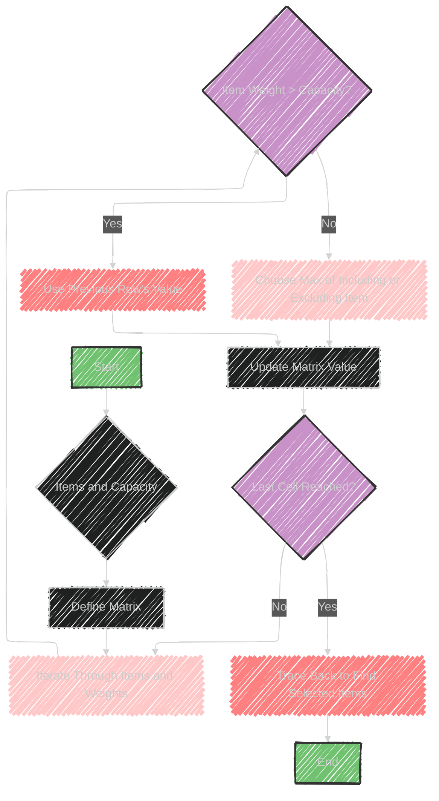

# 0-1 Knapsack Algorithm

> This content is dual-licensed under your choice of the following licenses:
> 1.  **MIT License:** For the code implementations in Swift and Mermaid provided in this document.
> 2.  **Creative Commons Attribution 4.0 International License (CC BY 4.0):** For all other content, including the text, explanations, and the Mermaid diagrams and illustrations.

---


The 0/1 Knapsack problem is a classic optimization problem used to select items that maximize profit without exceeding a given capacity.

Each item can only be chosen once, either included in the knapsack (1) or not (0)—hence the name "0/1".

## Key Concepts

- **Objective**: Maximize the total value of selected items while staying within a weight limit.
- **Constraints**: 
  - Each item has a weight and value.
  - Total weight of selected items must not exceed the knapsack's capacity.
  - Each item can be included at most once.

## Usage

- **Array, HashTable**: These data structures are often used to store the values, weights, and solution states during computation.
  
## Steps

1. **Define a Matrix**: Use dynamic programming with a 2D array where rows represent items and columns represent weight limits.

2. **Fill the Matrix**: Iterate through items and weight limits, filling the matrix with the maximum value possible by either including or excluding the current item:
   - If the item's weight is greater than the current limit, use the previous row's value.
   - Otherwise, choose the maximum between not taking the item or taking it (adding its value to the remaining capacity's value from the previous row).

3. **Traceback**: Once filled, trace back from the last cell to determine which items were included.

## Sample Problems

- **Equal Subset Sum Partition**: Determine if a set can be partitioned into two subsets with equal sum.
- **Minimum Subset Sum Difference**: Find two subsets of a set such that the difference between their sums is minimized.

The 0/1 Knapsack problem serves as a basis for these types of partitioning problems, using similar principles to distribute values optimally under constraints.


---


## Mermaid illustration

Here is a Mermaid diagram that outlines the process of the 0/1 Knapsack problem:



This diagram shows the flow of the 0/1 Knapsack algorithm, from starting with items and capacity, defining the matrix, iterating through items and weights, updating values, and finally tracing back to identify the selected items.


---


## Full code implementation of the algorithm in Swift

Here's a full Swift implementation of the 0/1 Knapsack algorithm:

```swift
import Foundation

// Knapsack item definition with weight and value
struct Item {
    let weight: Int
    let value: Int
}

func knapsack(_ items: [Item], maxWeight: Int) -> Int {
    // Create a matrix to store the maximum value at each capacity
    var dp = Array(repeating: Array(repeating: 0, count: maxWeight + 1), count: items.count + 1)
    
    // Fill the matrix through dynamic programming
    for i in 1...items.count {
        let currentItem = items[i - 1]
        for w in 1...maxWeight {
            if currentItem.weight > w {
                // If the item's weight is more than the current capacity, use the previous row's value
                dp[i][w] = dp[i - 1][w]
            } else {
                // Otherwise, choose the maximum value between including or excluding the current item
                dp[i][w] = max(dp[i - 1][w],
                               dp[i - 1][w - currentItem.weight] + currentItem.value)
            }
        }
    }
    
    // The last cell of the matrix contains the maximum value for the given capacity
    return dp[items.count][maxWeight]
}

// Example usage
let items = [Item(weight: 1, value: 1),
             Item(weight: 2, value: 2),
             Item(weight: 3, value: 5),
             Item(weight: 4, value: 6)]

let maxWeight = 5
let maxValue = knapsack(items, maxWeight: maxWeight)
print("Maximum value in knapsack: \(maxValue)") // Output: Maximum value in knapsack: 8
```

### Explanation

- **Item Struct**: Represents each item with its weight and value.
- **knapsack Function**: Uses a dynamic programming approach to fill a 2D array (`dp`) where each cell represents the maximum achievable value for a given number of items and capacity.
- **Matrix Filling**: Iterates over the items and possible weights, updating the matrix by considering either including or excluding each item.
- **Output**: The maximum value possible for the given weight capacity is found in the last cell of the matrix.

This code implements the 0/1 Knapsack problem to find the optimal subset of items that maximizes value without exceeding the weight limit.


---


## Iterate all the cases and print out all the cases from the algorithm


To iterate through all possible combinations and print them, you can use a recursive approach. Below is a modified Swift version to display all combinations and their total values for the given capacity:

```swift
import Foundation

struct Item {
    let weight: Int
    let value: Int
}

func knapsackAllCombinations(_ items: [Item], maxWeight: Int) {
    var currentCombination = [(Item, Bool)]()

    // Helper recursive function to explore all combinations
    func exploreCombination(index: Int, currentWeight: Int, currentValue: Int) {
        if index == items.count {
            printCombination(currentCombination, currentValue)
            return
        }

        // Exclude current item
        currentCombination.append((items[index], false))
        exploreCombination(index: index + 1, currentWeight: currentWeight, currentValue: currentValue)
        currentCombination.removeLast()

        // Include current item (only if it doesn't exceed maximum weight)
        if currentWeight + items[index].weight <= maxWeight {
            currentCombination.append((items[index], true))
            exploreCombination(index: index + 1, currentWeight: currentWeight + items[index].weight, currentValue: currentValue + items[index].value)
            currentCombination.removeLast()
        }
    }

    exploreCombination(index: 0, currentWeight: 0, currentValue: 0)
}

func printCombination(_ combination: [(Item, Bool)], _ value: Int) {
    let selectedItems = combination.enumerated().compactMap { index, element in
        element.1 ? "Item\(index + 1)" : nil
    }
    print("Selected: \(selectedItems), Total Value: \(value)")
}

// Example usage
let items = [
    Item(weight: 1, value: 1),
    Item(weight: 2, value: 2),
    Item(weight: 3, value: 5),
    Item(weight: 4, value: 6)
]

let maxWeight = 5
knapsackAllCombinations(items, maxWeight: maxWeight)
```

### Explanation

- **knapsackAllCombinations Function**: Uses recursion to explore all combinations of items whether included or excluded.
- **index**: Iterates through each item deciding inclusion and exclusion.
- **currentWeight and currentValue**: Track the current total weight and value.
- **printCombination Function**: Outputs each valid combination with its corresponding total value. 

This code will print all possible combinations of including or excluding items within the weight constraint.


---
**Licenses:**

- **MIT License:**  [](LICENSE) - Full text in [LICENSE](LICENSE) file.
- **Creative Commons Attribution 4.0 International:** [](LICENSE-CC-BY) - Legal details in [LICENSE-CC-BY](LICENSE-CC-BY) and at [Creative Commons official site](http://creativecommons.org/licenses/by/4.0/).

---