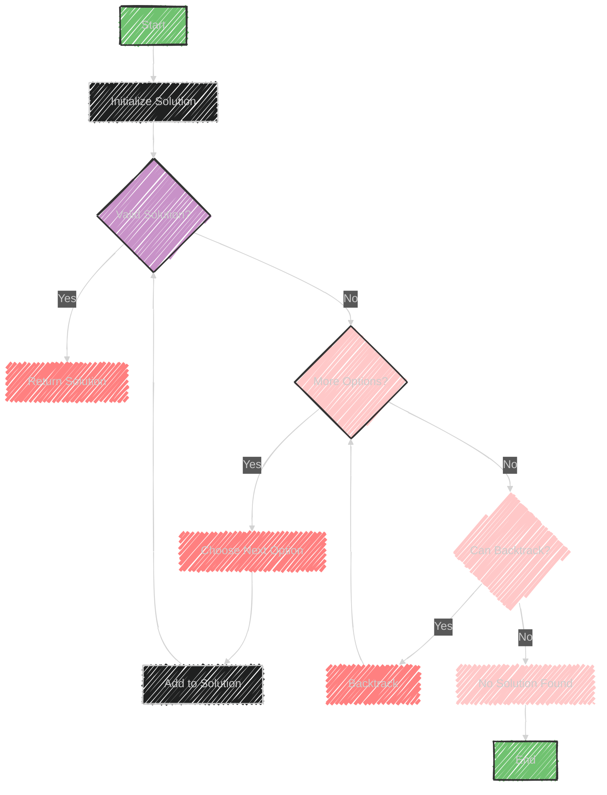

# Backtracking Algorithm

> This content is dual-licensed under your choice of the following licenses:
> 1.  **MIT License:** For the code implementations in Swift and Mermaid provided in this document.
> 2.  **Creative Commons Attribution 4.0 International License (CC BY 4.0):** For all other content, including the text, explanations, and the Mermaid diagrams and illustrations.

---

Backtracking is an algorithmic technique used to solve problems incrementally by building solutions piece by piece.

If a partial solution isn't viable, the algorithm backtracks to try alternative solutions.

**Key Points:**

- **Incremental Approach:** Build the solution step by step, moving forward as long as it's valid.
- **Backtracking:** If a decision leads to a dead end (an invalid solution), the algorithm reverses its last decision to explore a different path.
- **Data Structures Involved:**
  - **Array:** To store sequences or combinations.
  - **HashTable:** For quick access and checks.
  - **LinkedList:** For dynamic manipulation of solution sequences.

**Sample Problems:**
- **Combination Sum:** Find combinations of numbers that sum up to a target.
- **Sudoku Solver:** Fill a grid so that numbers appear exactly once in each row, column, and box.

Backtracking is often used in scenarios where brute force is too inefficient, as it prunes paths early that cannot lead to optimal solutions.


---

## Mermaid illustration

Here's a Mermaid flowchart to illustrate the backtracking algorithm:



This flowchart shows the process of incrementally building a solution, checking its validity, and backtracking if necessary.


---


## Full code implementation of the algorithm in Swift

Below is a Swift implementation of a backtracking algorithm to solve a Sudoku puzzle.

This example demonstrates the backtracking technique:

```swift
import Foundation

class SudokuSolver {
    var board: [[Int]]

    init(board: [[Int]]) {
        self.board = board
    }

    func solve() -> Bool {
        for row in 0..<9 {
            for col in 0..<9 {
                if board[row][col] == 0 {
                    for num in 1...9 {
                        if isValidPlacement(num, row, col) {
                            board[row][col] = num
                            if solve() {
                                return true
                            }
                            board[row][col] = 0
                        }
                    }
                    return false
                }
            }
        }
        return true
    }

    func isValidPlacement(_ num: Int, _ row: Int, _ col: Int) -> Bool {
        for i in 0..<9 {
            if board[row][i] == num || board[i][col] == num ||
               board[(row/3)*3 + i/3][(col/3)*3 + i%3] == num {
                return false
            }
        }
        return true
    }

    func printBoard() {
        for row in board {
            print(row.map { String($0) }.joined(separator: " "))
        }
    }
}

// Example Sudoku puzzle (0 represents empty cells)
var puzzle: [[Int]] = [
    [5, 3, 0, 0, 7, 0, 0, 0, 0],
    [6, 0, 0, 1, 9, 5, 0, 0, 0],
    [0, 9, 8, 0, 0, 0, 0, 6, 0],
    [8, 0, 0, 0, 6, 0, 0, 0, 3],
    [4, 0, 0, 8, 0, 3, 0, 0, 1],
    [7, 0, 0, 0, 2, 0, 0, 0, 6],
    [0, 6, 0, 0, 0, 0, 2, 8, 0],
    [0, 0, 0, 4, 1, 9, 0, 0, 5],
    [0, 0, 0, 0, 8, 0, 0, 7, 9]
]

let solver = SudokuSolver(board: puzzle)
if solver.solve() {
    print("Solved Sudoku:")
    solver.printBoard()
} else {
    print("No solution found.")
}
```

This implementation initializes a Sudoku board and uses backtracking to fill in the empty cells (`0`s) with valid numbers according to Sudoku rules.

If a solution is found, it prints the solved board.


---


## Iterate all the cases and print out all the cases from the algorithm


To print all possible solutions of a Sudoku puzzle using backtracking, you can adjust the algorithm to continue searching after finding a solution. 

Here's how you can modify the previous implementation to iterate through and print all solutions:

```swift
import Foundation

class SudokuSolver {
    var board: [[Int]]
    var solutions: [[[Int]]] = []

    init(board: [[Int]]) {
        self.board = board
    }

    func solve() {
        if findSolution() {
            solutions.append(board)
        }
        printSolutions()
    }

    func findSolution() -> Bool {
        for row in 0..<9 {
            for col in 0..<9 {
                if board[row][col] == 0 {
                    for num in 1...9 {
                        if isValidPlacement(num, row, col) {
                            board[row][col] = num
                            if findSolution() {
                                board[row][col] = 0
                            } else {
                                board[row][col] = 0
                                return false
                            }
                        }
                    }
                    board[row][col] = 0
                    return true
                }
            }
        }
        return true
    }

    func isValidPlacement(_ num: Int, _ row: Int, _ col: Int) -> Bool {
        for i in 0..<9 {
            if board[row][i] == num || board[i][col] == num ||
               board[(row/3)*3 + i/3][(col/3)*3 + i%3] == num {
                return false
            }
        }
        return true
    }

    func printSolutions() {
        for (index, solution) in solutions.enumerated() {
            print("Solution \(index + 1):")
            for row in solution {
                print(row.map { String($0) }.joined(separator: " "))
            }
            print("")
        }
    }
}

// Example Sudoku puzzle (0 represents empty cells)
var puzzle: [[Int]] = [
    [5, 3, 0, 0, 7, 0, 0, 0, 0],
    [6, 0, 0, 1, 9, 5, 0, 0, 0],
    [0, 9, 8, 0, 0, 0, 0, 6, 0],
    [8, 0, 0, 0, 6, 0, 0, 0, 3],
    [4, 0, 0, 8, 0, 3, 0, 0, 1],
    [7, 0, 0, 0, 2, 0, 0, 0, 6],
    [0, 6, 0, 0, 0, 0, 2, 8, 0],
    [0, 0, 0, 4, 1, 9, 0, 0, 5],
    [0, 0, 0, 0, 8, 0, 0, 7, 9]
]

let solver = SudokuSolver(board: puzzle)
solver.solve()
```

This code will find all valid solutions and print each one. The `solutions` array stores each solution, and `printSolutions()` iterates over them to print. Note that Sudoku puzzles typically have a unique solution unless specifically designed otherwise.


---
**Licenses:**

- **MIT License:**  [](LICENSE) - Full text in [LICENSE](LICENSE) file.
- **Creative Commons Attribution 4.0 International:** [](LICENSE-CC-BY) - Legal details in [LICENSE-CC-BY](LICENSE-CC-BY) and at [Creative Commons official site](http://creativecommons.org/licenses/by/4.0/).

---