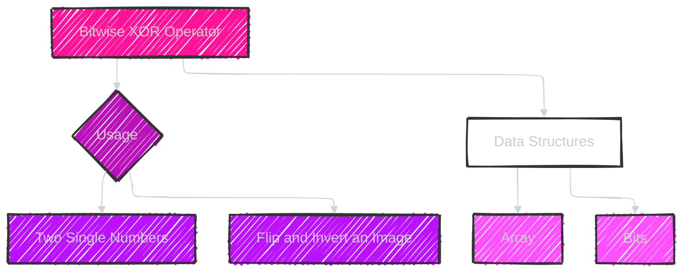
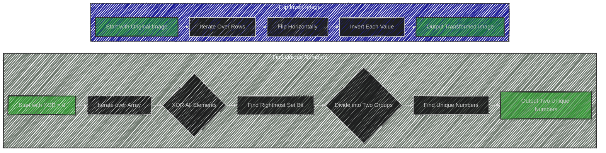
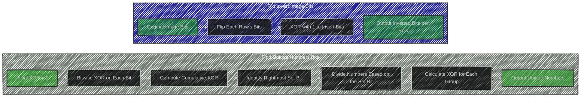

# Bitwise XOR Algorithm

> This content is dual-licensed under your choice of the following licenses:
> 1.  **MIT License:** For the code implementations in Swift and Mermaid provided in this document.
> 2.  **Creative Commons Attribution 4.0 International License (CC BY 4.0):** For all other content, including the text, explanations, and the Mermaid diagrams and illustrations.

---


The algorithm described in the image involves using the Bitwise XOR operator to manipulate bits for problem-solving.

Here's an explanation:

## Bitwise XOR (^) Operator
- The XOR operator compares two bits and returns 1 if they are different, and 0 if they are the same.
- It is often used in problems involving binary representation and manipulation.

## Usage
- **Two Single Numbers**: XOR can be used to find a unique number in an array where every other number appears twice. This is because XORing a number with itself results in 0, and XORing with 0 results in the number itself.
- **Flip and Invert an Image**: XOR can flip (invert) binary values, such as turning 0s into 1s and vice versa.

## Data Structures Involved
- **Array**: Commonly used to store sequences of numbers or images.
- **Bits**: Directly manipulated using the XOR operator.

This technique is efficient for implementing solutions where bit manipulation is required to achieve the desired outcome.


---


# Mermaid illustrations


Here's a representation using a mermaid diagram to illustrate the concepts discussed:




This diagram summarizes the role of XOR, its usage, and the data structures it involves.


---


# Full code implementation of the algorithm in Swift


Below is a Swift implementation of the algorithms using the Bitwise XOR operator:

## Finding Two Single Numbers in an Array

```swift
func findUniqueNumbers(_ nums: [Int]) -> [Int] {
    var xor = 0
    for num in nums {
        xor ^= num
    }
    
    let rightmostSetBit = xor & -xor
    var num1 = 0, num2 = 0
    
    for num in nums {
        if (num & rightmostSetBit) == 0 {
            num1 ^= num
        } else {
            num2 ^= num
        }
    }
    
    return [num1, num2]
}

let nums = [4, 1, 2, 1, 2, 5]
print(findUniqueNumbers(nums)) // Output: [4, 5]
```

## Flipping and Inverting an Image

```swift
func flipAndInvertImage(_ image: [[Int]]) -> [[Int]] {
    var result = image
    
    for i in 0..<result.count {
        let n = result[i].count
        for j in 0..<(n + 1) / 2 {
            let temp = result[i][j] ^ 1
            result[i][j] = result[i][n - 1 - j] ^ 1
            result[i][n - 1 - j] = temp
        }
    }
    
    return result
}

let image = [
    [1, 1, 0],
    [1, 0, 1],
    [0, 0, 0]
]

print(flipAndInvertImage(image))
// Output: [[1, 0, 0], [0, 1, 0], [1, 1, 1]]
```

### Explanation
- **Finding Two Single Numbers**: This function finds two unique numbers in an array where all other numbers appear twice. It uses XOR to differentiate and identify the unique numbers.
- **Flipping and Inverting an Image**: This function flips the image horizontally and inverts it. The XOR operation toggles each pixel value between 0 and 1.


---


# Iterate all the cases and print out all the cases from the algorithm

Here's the Swift code to iterate through and print all the steps involved for both the "find unique numbers" and "flip and invert an image" algorithms:

## Finding Two Single Numbers with Steps

```swift
func findUniqueNumbersWithSteps(_ nums: [Int]) {
    var xor = 0
    print("Initial Array:", nums)
    for num in nums {
        xor ^= num
        print("XOR so far:", xor)
    }
    
    let rightmostSetBit = xor & -xor
    var num1 = 0, num2 = 0

    for num in nums {
        if (num & rightmostSetBit) == 0 {
            num1 ^= num
            print("Group 1 XORing:", num1)
        } else {
            num2 ^= num
            print("Group 2 XORing:", num2)
        }
    }
    
    print("The unique numbers are:", num1, "and", num2)
}

let nums = [4, 1, 2, 1, 2, 5]
findUniqueNumbersWithSteps(nums)
```

## Flipping and Inverting an Image with Steps

```swift
func flipAndInvertImageWithSteps(_ image: [[Int]]) {
    var result = image
    print("Original Image:")
    for row in image {
        print(row)
    }
    
    for i in 0..<result.count {
        let n = result[i].count
        for j in 0..<(n + 1) / 2 {
            let temp = result[i][j] ^ 1
            result[i][j] = result[i][n - 1 - j] ^ 1
            result[i][n - 1 - j] = temp
            print("Step", i, ",", j, "Flipped and Inverted so far:", result[i])
        }
    }
    
    print("Final Image:")
    for row in result {
        print(row)
    }
}

let image = [
    [1, 1, 0],
    [1, 0, 1],
    [0, 0, 0]
]

flipAndInvertImageWithSteps(image)
```

### Explanation
- **Find Unique Numbers with Steps**: Prints the progressive XOR value and the results of dividing numbers into two groups based on the rightmost set bit.
- **Flip and Invert Image with Steps**: Shows the image after each flipping and inverting step, helping to visualize the transformation process.

---

## Mermaid diagrams


Here's a mermaid diagram that illustrates the operations on an array for both finding unique numbers and flipping/inverting an image:



### Explanation
- **FindUniqueNumbers**:
  - Begins with an XOR of 0 and iterates over the array.
  - XOR all elements to find the cumulative XOR result.
  - Determines the rightmost set bit to divide numbers into two groups.
  - Finds the unique numbers in each group and outputs them.

- **FlipInvertImage**:
  - Starts with the original image and iterates over each row.
  - Flips the elements horizontally.
  - Inverts each value (using XOR with 1).
  - Outputs the transformed image.
---


## Mermaid illustrations for Bits in this topic


Here's a mermaid diagram that illustrates the operations on bits involved in both finding unique numbers and flipping/inverting an image using the Bitwise XOR operator:



### Explanation
- **FindUniqueNumbersBits**:
  - Starts with an XOR of 0 and applies bitwise XOR on each bit of the numbers.
  - Computes a cumulative XOR of all numbers in the array.
  - Identifies the rightmost set bit in the cumulative XOR result to divide numbers.
  - Calculates XOR for each divided group to find unique numbers and outputs them.

- **FlipInvertImageBits**:
  - Works at the bit level for each pixel in the image, flipping each row's bits.
  - Uses XOR with 1 to invert bits (0 to 1 and 1 to 0) for each pixel after flipping.
  - Outputs the inverted bits for each row in the transformed image.


---
**Licenses:**

- **MIT License:**  [](LICENSE) - Full text in [LICENSE](LICENSE) file.
- **Creative Commons Attribution 4.0 International:** [](LICENSE-CC-BY) - Legal details in [LICENSE-CC-BY](LICENSE-CC-BY) and at [Creative Commons official site](http://creativecommons.org/licenses/by/4.0/).

---