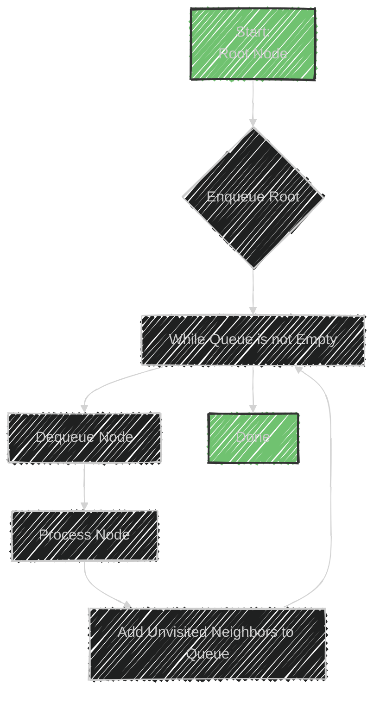

# The Breadth-First Search (BFS) algorithm

The image describes the Breadth-First Search (BFS) algorithm, which is a technique used to traverse or search through data structures like trees or graphs.

## Key Points

**Usage:**
- BFS is used to traverse or search through these structures level by level. This means it explores all nodes at the present depth before moving on to nodes at the next depth level.

**Data Structures Involved:**
- **Tree**: BFS can be used to traverse all nodes in a tree level by level.
- **Graph**: BFS is used to explore all vertices and edges by levels.
- **Matrix**: Often used in grid-based problems, treating the matrix as a graph.
- **Queue**: This data structure is crucial as BFS uses a queue to keep track of nodes to be explored.

**Sample Problems:**
1. **Binary Tree Level Order Traversal**: Using BFS to explore each level of a binary tree from left to right.
2. **Minimum Depth of a Binary Tree**: Finding the shortest path to a leaf node by traversing levels.
3. **Connect Level Order Siblings**: Linking nodes within the same level together.

## How BFS Works
1. Start from the root (or any arbitrary node in graphs) and enqueue it.
2. Dequeue a node, process it, and enqueue all its unvisited neighboring nodes.
3. Repeat the process until the queue is empty.

This approach ensures that all nodes at a current depth are processed before moving deeper, making it effective for problems that require level order exploration.


---


## Mermaid illustration

Here's a Mermaid diagram illustrating the basics of the Breadth-First Search (BFS) algorithm:




## Explanation
- **Start:** Begin at the root node.
- **Enqueue Root:** Add the root node to the queue.
- **Loop:** Continuously process nodes while the queue is not empty.
- **Dequeue Node:** Remove the node from the front of the queue.
- **Process Node:** Perform any required operations on the node.
- **Add Neighbors:** Enqueue all adjacent unvisited nodes.
- **Done:** The algorithm completes when the queue is empty.


---


## Full code implementation of the algorithm in Swif


Here's a Swift implementation of the Breadth-First Search (BFS) algorithm for a binary tree:

```swift
import Foundation

// Define a TreeNode class for a binary tree
class TreeNode {
    var value: Int
    var left: TreeNode?
    var right: TreeNode?
    
    init(_ value: Int) {
        self.value = value
        self.left = nil
        self.right = nil
    }
}

// BFS function to traverse a binary tree level by level
func bfs(root: TreeNode?) {
    guard let root = root else { return }
    
    var queue: [TreeNode] = [root]
    
    while !queue.isEmpty {
        let currentNode = queue.removeFirst()
        print(currentNode.value)
        
        // Enqueue left child
        if let leftNode = currentNode.left {
            queue.append(leftNode)
        }
        
        // Enqueue right child
        if let rightNode = currentNode.right {
            queue.append(rightNode)
        }
    }
}

// Example usage:
let root = TreeNode(1)
root.left = TreeNode(2)
root.right = TreeNode(3)
root.left?.left = TreeNode(4)
root.left?.right = TreeNode(5)
root.right?.left = TreeNode(6)
root.right?.right = TreeNode(7)

bfs(root: root)
```

## Explanation
- **TreeNode Class:** Represents each node in the binary tree with properties for its `value`, `left`, and `right` children.
- **BFS Function:** Uses a queue to traverse the tree. It starts with the root node and prints each node's value while adding its unvisited children to the queue.
- **Example Usage:** Constructs a simple binary tree and performs BFS traversal, printing each node's value.


---


## Iterate all the cases and print out all the cases from the algorithm

The BFS traversal can be modified to print out the nodes level by level.

Here's how you can iterate through each level and print out the nodes:

```swift
import Foundation

// Define a TreeNode class for a binary tree
class TreeNode {
    var value: Int
    var left: TreeNode?
    var right: TreeNode?
    
    init(_ value: Int) {
        self.value = value
        self.left = nil
        self.right = nil
    }
}

// BFS function to traverse a binary tree and print nodes level by level
func bfs(root: TreeNode?) {
    guard let root = root else { return }
    
    var queue: [TreeNode] = [root]
    
    while !queue.isEmpty {
        let levelSize = queue.count
        var currentLevel: [Int] = []
        
        for _ in 0..<levelSize {
            let currentNode = queue.removeFirst()
            currentLevel.append(currentNode.value)
            
            // Enqueue left child
            if let leftNode = currentNode.left {
                queue.append(leftNode)
            }
            
            // Enqueue right child
            if let rightNode = currentNode.right {
                queue.append(rightNode)
            }
        }
        
        print("Level: \(currentLevel)")
    }
}

// Example usage:
let root = TreeNode(1)
root.left = TreeNode(2)
root.right = TreeNode(3)
root.left?.left = TreeNode(4)
root.left?.right = TreeNode(5)
root.right?.left = TreeNode(6)
root.right?.right = TreeNode(7)

bfs(root: root)
```

## Explanation
- **TreeNode Class:** Represents each node in the binary tree with properties for its `value`, `left`, and `right` children.
- **BFS Function:** 
  - Uses a queue to traverse the tree.
  - Iterates through each level using a for-loop, storing node values in `currentLevel`.
  - Enqueues left and right children of each node.
  - Prints the values at the current level before moving to the next.

---
