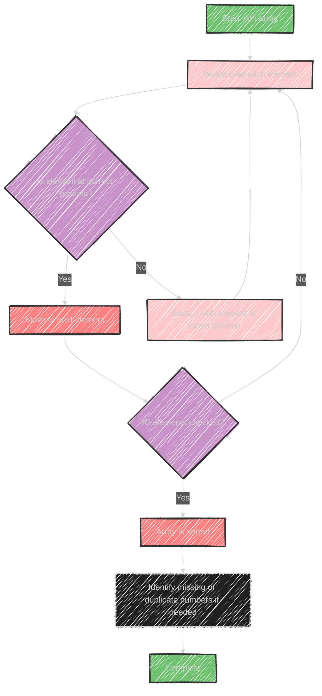

# Cyclic Sort Algorithm

Cyclic Sort is an efficient algorithm used to solve problems involving arrays where the input data falls within a fixed range, typically from 1 to n. 

## How Cyclic Sort Works
1. **Position Correctness:** The main idea is to place each element at its correct position, i.e., the value 1 at index 0, value 2 at index 1, and so on.
2. **Iterative Placement:** Start at the first index and move each element to its correct position. Continue this process iteratively for all elements.
3. **Swap Elements:** If an element is not at the correct position, swap it with the element at its target position.
4. **Repeat Until Sorted:** Continue swapping until every number is in its correct index.

## Use Cases
- **Finding Missing Numbers:** By sorting numbers in their correct place, missing numbers are identified by checking positions where the value does not match the index.
- **Finding Duplicates:** If swapping reveals that two values are in a position where they point to the same index, duplicates can be identified.
- **Finding First K Missing Positive Numbers:** Once sorted cyclically, the first K locations that don't have the expected value can be identified as missing.

This sort assumes that no number is less than 1 or greater than the array's length, ensuring all numbers can be placed at their correct indices within the range.


---


## Mermaid illustration


Here's a Mermaid diagram illustrating the Cyclic Sort process:




This diagram shows the iterative process of placing each element in its correct position, repeating until the entire array is sorted, and then identifying any missing or duplicate numbers.


---


## Full code implementation of the algorithm in Swift


Here's a full Swift implementation of the Cyclic Sort algorithm, including how to find missing and duplicate numbers:

```swift
func cyclicSort(_ nums: inout [Int]) {
    var i = 0
    while i < nums.count {
        let correctIndex = nums[i] - 1
        if nums[i] != nums[correctIndex] {
            nums.swapAt(i, correctIndex)
        } else {
            i += 1
        }
    }
}

func findMissingNumbers(_ nums: [Int]) -> [Int] {
    var numsCopy = nums
    cyclicSort(&numsCopy)
    var missingNumbers = [Int]()
    for (index, num) in numsCopy.enumerated() {
        if num != index + 1 {
            missingNumbers.append(index + 1)
        }
    }
    return missingNumbers
}

func findDuplicateNumbers(_ nums: [Int]) -> [Int] {
    var numsCopy = nums
    cyclicSort(&numsCopy)
    var duplicateNumbers = [Int]()
    for (index, num) in numsCopy.enumerated() {
        if num != index + 1 && !duplicateNumbers.contains(num) {
            duplicateNumbers.append(num)
        }
    }
    return duplicateNumbers
}

// Example usage:
var nums = [3, 1, 2, 5, 2]
cyclicSort(&nums)
print("Sorted array:", nums) // Output: Sorted array: [1, 2, 2, 3, 5]

let missing = findMissingNumbers([3, 1, 2, 5, 2])
print("Missing numbers:", missing) // Output: Missing numbers: [4]

let duplicates = findDuplicateNumbers([3, 1, 2, 5, 2])
print("Duplicate numbers:", duplicates) // Output: Duplicate numbers: [2]
```

## Explanation
- **Cyclic Sort Function:** Arranges each number into its correct position.
- **Find Missing Numbers:** After applying Cyclic Sort, missing numbers are identified by checking where the index and number do not match.
- **Find Duplicate Numbers:** Duplicates are detected if a number indexes incorrectly and appears more than once.


---


## Iterate all the cases and print out all the cases from the algorithm

Here is a modified version of the Swift code that iterates through each step of the Cyclic Sort algorithm, printing the state of the array at each step:

```swift
func cyclicSortWithTracing(_ nums: inout [Int]) {
    var i = 0
    while i < nums.count {
        let correctIndex = nums[i] - 1
        if nums[i] != nums[correctIndex] {
            nums.swapAt(i, correctIndex)
            print("Swapped elements at indices \(i) and \(correctIndex):", nums)
        } else {
            i += 1
        }
    }
}

func findMissingNumbersWithTracing(_ nums: [Int]) -> [Int] {
    var numsCopy = nums
    print("Starting array:", numsCopy)
    cyclicSortWithTracing(&numsCopy)
    var missingNumbers = [Int]()
    for (index, num) in numsCopy.enumerated() {
        if num != index + 1 {
            missingNumbers.append(index + 1)
        }
    }
    return missingNumbers
}

func findDuplicateNumbersWithTracing(_ nums: [Int]) -> [Int] {
    var numsCopy = nums
    print("Starting array:", numsCopy)
    cyclicSortWithTracing(&numsCopy)
    var duplicateNumbers = [Int]()
    for (index, num) in numsCopy.enumerated() {
        if num != index + 1 && !duplicateNumbers.contains(num) {
            duplicateNumbers.append(num)
        }
    }
    return duplicateNumbers
}

// Example usage:
var nums = [3, 1, 2, 5, 2]
print("Executing Cyclic Sort:")
cyclicSortWithTracing(&nums)
print("Final sorted array:", nums)

print("\nFinding Missing Numbers:")
let missing = findMissingNumbersWithTracing([3, 1, 2, 5, 2])
print("Missing numbers:", missing)

print("\nFinding Duplicate Numbers:")
let duplicates = findDuplicateNumbersWithTracing([3, 1, 2, 5, 2])
print("Duplicate numbers:", duplicates)
```

## Explanation of the Output
- **Swapped Elements:** As the Cyclic Sort runs, each swap is printed, showing how numbers are moved to their correct positions.
- **Final Sorted Array:** After sorting, the final state of the array is displayed.
- **Missing and Duplicate Numbers:** After tracing through sorting, the functions identify and print missing and duplicate numbers, respectively.

---


