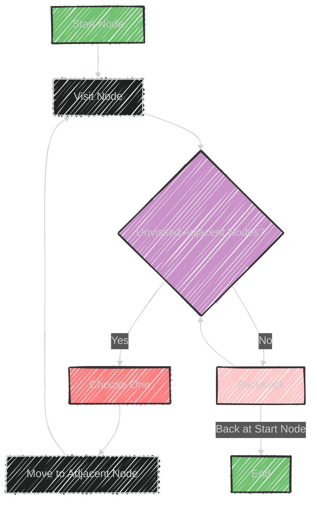

# Depth First Search Algorithm

Depth First Search (DFS) is an algorithm used to traverse or search through tree or graph data structures.

Here's a breakdown of its key aspects:

## Usage
- **Purpose**: DFS is used to explore nodes and edges of a graph. It starts at the root (or an arbitrary node) and explores as far as possible along each branch before backtracking.
- **Applications**: Solves problems related to pathfinding, such as determining connectivity, and finding cycles.

## Data Structures Involved
- **Tree**: DFS can be used to traverse binary trees, N-ary trees, etc.
- **Graph**: Applicable to both directed and undirected graphs.
- **Matrix**: Can be adapted for problems involving grid-based layouts like mazes.

## Sample Problems
- **Path With Given Sequence**: Determines if there exists a path in a tree or graph that matches a given sequence.
- **Count Paths for a Sum**: Counts the number of paths that sum up to a specific value in a tree or graph.

## How DFS Works
1. **Start**: Begin at the chosen start node or the root.
2. **Explore**: Move to an adjacent, unvisited node, marking nodes as visited.
3. **Backtrack**: If there are no unvisited adjacent nodes, return to the previous node.
4. **Repeat**: Continue until all nodes reachable from the start node have been visited.

## Characteristics
- **Recursive or Iterative**: Can be implemented using recursion or with a stack for iterative solutions.
- **Time Complexity**: O(V + E), where V is the number of vertices and E is the number of edges.
- **Space Complexity**: O(V) in the case of implicit recursion or using a stack.

DFS is foundational in computer science and is used in various algorithms and applications.


---


## Mermaid illustration

Here's a Mermaid diagram illustrating the Depth First Search (DFS) process:




This diagram represents the steps of the DFS algorithm, showing how nodes are visited, and how the algorithm backtracks when there are no more unvisited adjacent nodes.

---


## Full code implementation of the algorithm in Swift

Here's a complete Swift implementation of the Depth First Search (DFS) algorithm for a simple graph represented as an adjacency list:

```swift
import Foundation

// Graph class
class Graph {
    private var adjacencyList: [Int: [Int]] = [:]
    
    // Add edge to the graph
    func addEdge(from: Int, to: Int) {
        if adjacencyList[from] != nil {
            adjacencyList[from]?.append(to)
        } else {
            adjacencyList[from] = [to]
        }
    }
    
    // Depth First Search (DFS) implementation
    func dfs(start: Int) {
        var visited = Set<Int>()
        dfsRecursive(node: start, visited: &visited)
    }
    
    // Recursive DFS helper function
    private func dfsRecursive(node: Int, visited: inout Set<Int>) {
        guard !visited.contains(node) else { return }
        
        // Mark the node as visited
        visited.insert(node)
        print("Visited: \(node)")
        
        // Explore adjacent nodes
        if let neighbors = adjacencyList[node] {
            for neighbor in neighbors {
                dfsRecursive(node: neighbor, visited: &visited)
            }
        }
    }
}

// Example usage
let graph = Graph()
graph.addEdge(from: 0, to: 1)
graph.addEdge(from: 0, to: 2)
graph.addEdge(from: 1, to: 3)
graph.addEdge(from: 1, to: 4)
graph.addEdge(from: 2, to: 5)
graph.addEdge(from: 2, to: 6)

print("DFS starting from node 0:")
graph.dfs(start: 0)
```

## Explanation

- **Graph Representation**: The graph is represented using an adjacency list, where each node points to a list of its neighbors.
- **DFS Implementation**:
  - **dfs() Function**: Begins the DFS from the specified start node.
  - **dfsRecursive() Function**: A helper function to perform the actual DFS using recursion. It visits a node, marks it as visited, and recursively explores each unvisited adjacent node.
  
This implementation prints the order in which nodes are visited during the DFS traversal. You can adjust the graph structure and starting node to explore DFS on different graphs.


---


## Iterate all the cases and print out all the cases from the algorithm


To explore and print all possible paths in a graph using Depth First Search (DFS), we can slightly modify the algorithm to track and print each path.

Here's how you can implement it in Swift:

```swift
import Foundation

// Graph class
class Graph {
    private var adjacencyList: [Int: [Int]] = [:]
    
    // Add edge to the graph
    func addEdge(from: Int, to: Int) {
        if adjacencyList[from] != nil {
            adjacencyList[from]?.append(to)
        } else {
            adjacencyList[from] = [to]
        }
    }
    
    // Depth First Search (DFS) that prints all paths
    func dfsAllPaths(start: Int) {
        var visited = Set<Int>()
        var path = [Int]()
        dfsRecursiveAllPaths(node: start, visited: &visited, path: &path)
    }
    
    // Recursive DFS helper function for all paths
    private func dfsRecursiveAllPaths(node: Int, visited: inout Set<Int>, path: inout [Int]) {
        // Mark the node as visited
        visited.insert(node)
        path.append(node)

        // Print the current path
        print("Path: \(path)")
        
        // Explore adjacent nodes
        if let neighbors = adjacencyList[node] {
            for neighbor in neighbors {
                if !visited.contains(neighbor) {
                    dfsRecursiveAllPaths(node: neighbor, visited: &visited, path: &path)
                }
            }
        }

        // Backtrack: remove the node from path and visited
        path.removeLast()
        visited.remove(node)
    }
}

// Example usage
let graph = Graph()
graph.addEdge(from: 0, to: 1)
graph.addEdge(from: 0, to: 2)
graph.addEdge(from: 1, to: 3)
graph.addEdge(from: 1, to: 4)
graph.addEdge(from: 2, to: 5)
graph.addEdge(from: 2, to: 6)

print("All paths starting from node 0:")
graph.dfsAllPaths(start: 0)
```

## Explanation
- **Path Tracking**: A `path` array is used to keep track of the current path from the start node.
- **Recursive DFS Helper**: In each recursive call, the current node is added to the path. After recursively exploring its neighbors, the algorithm backtracks by removing the node from the path and the visited set.
- **Printing Paths**: The current path is printed each time a node is visited.

This approach allows you to explore and print all paths from the starting node, providing insights into the numerous ways nodes can be reached in the graph using DFS.


---
**Licenses:**

- **MIT License:**  [](LICENSE) - Full text in [LICENSE](LICENSE) file.
- **Creative Commons Attribution 4.0 International:** [](LICENSE-CC-BY) - Legal details in [LICENSE-CC-BY](LICENSE-CC-BY) and at [Creative Commons official site](http://creativecommons.org/licenses/by/4.0/).

---