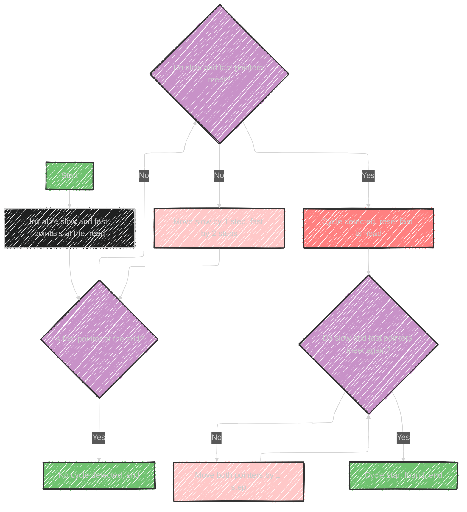

# Fast and Slow Pointers Algorithm

> This content is dual-licensed under your choice of the following licenses:
> 1.  **MIT License:** For the code implementations in Swift and Mermaid provided in this document.
> 2.  **Creative Commons Attribution 4.0 International License (CC BY 4.0):** For all other content, including the text, explanations, and the Mermaid diagrams and illustrations.

---

The Fast & Slow Pointers algorithm, also known as the Hare & Tortoise algorithm, is a technique used to solve problems involving cycles in data structures. It involves two pointers that move at different speeds through the data.

## Usage:
- **Data Structures Involved:** Array, String, Linked List
- **Main Purpose:** Detect cycles or find specific elements within a structure.

## How It Works:
1. **Two Pointers:** 
   - **Slow Pointer (Tortoise):** Moves one step at a time.
   - **Fast Pointer (Hare):** Moves two steps at a time.
   
2. **Cycle Detection:**
   - If there's a cycle, the fast pointer will eventually meet the slow pointer within the cycle.
   - If there's no cycle, the fast pointer will reach the end of the data structure.

3. **Cycle Start Detection:**
   - Once a cycle is detected (pointers meet), reset one pointer to the start and move both one step at a time to find the cycle's starting node.

## Sample Problems:
- **Middle of the Linked List:** Find the middle by moving slow one step and fast two steps.
- **Happy Number:** Determine if following the square sum of digits leads to 1 (a cycle indicates a non-happy number).
- **Cycle in a Circular Array:** Detect repetitive movements in circular data arrangements.

This algorithm is efficient because it uses constant space and can detect cycles in linear time.


---


## Mermaid illustration of the algorithm

Here's a Mermaid diagram illustrating the Fast & Slow Pointers algorithm:




This diagram shows the process of using fast and slow pointers to detect and find the start of a cycle in a linked list.


---


## Full code implementation of the algorithm in Swift

Here's a Swift implementation of the Fast & Slow Pointers algorithm to detect a cycle and find the cycle's starting point in a linked list:

```swift
class ListNode {
    var value: Int
    var next: ListNode?

    init(_ value: Int) {
        self.value = value
        self.next = nil
    }
}

func detectCycle(_ head: ListNode?) -> ListNode? {
    var slow = head
    var fast = head

    // Detect if a cycle exists
    while fast != nil && fast?.next != nil {
        slow = slow?.next
        fast = fast?.next?.next

        if slow === fast {
            // A cycle is detected, now find the start of the cycle
            var startPointer = head

            while startPointer !== slow {
                startPointer = startPointer?.next
                slow = slow?.next
            }

            return startPointer // Cycle start found
        }
    }

    return nil // No cycle
}

// Example usage:
let head = ListNode(1)
head.next = ListNode(2)
head.next?.next = ListNode(3)
head.next?.next?.next = ListNode(4)
head.next?.next?.next?.next = ListNode(5)
head.next?.next?.next?.next?.next = head.next?.next  // Creates a cycle

if let cycleStart = detectCycle(head) {
    print("Cycle starts at node with value: \(cycleStart.value)")
} else {
    print("No cycle detected")
}
```

## Explanation:
- **ListNode Class**: Represents a node in the linked list.
- **detectCycle Function**:
  - Uses two pointers, `slow` and `fast`.
  - Moves `slow` by one step and `fast` by two steps until they meet, indicating a cycle.
  - Resets one pointer to the head and moves both by one step to find the cycle's start node.
- **Example Usage**: The list is created, a cycle is introduced, and the function checks for the cycle's presence and starting point.


---


## Iterate all the case and print out all the cases from the algorithm


Here’s how you can extend the algorithm to iterate through the linked list, detect, and print out all cases related to cycle detection, such as when a cycle is detected and where it starts:

```swift
class ListNode {
    var value: Int
    var next: ListNode?

    init(_ value: Int) {
        self.value = value
        self.next = nil
    }
}

func detectCycle(_ head: ListNode?) -> (hasCycle: Bool, cycleStart: ListNode?) {
    var slow = head
    var fast = head

    while fast != nil && fast?.next != nil {
        slow = slow?.next
        fast = fast?.next?.next

        if slow === fast {
            // Cycle detected
            print("Cycle detected")
            var startPointer = head

            while startPointer !== slow {
                startPointer = startPointer?.next
                slow = slow?.next
            }

            // Cycle start found
            print("Cycle starts at node with value: \(startPointer?.value ?? -1)")
            return (true, startPointer)
        }
    }

    // No cycle found
    print("No cycle detected")
    return (false, nil)
}

// Example usage:
let head = ListNode(1)
head.next = ListNode(2)
head.next?.next = ListNode(3)
head.next?.next?.next = ListNode(4)
head.next?.next?.next?.next = ListNode(5)
head.next?.next?.next?.next?.next = head.next?.next  // Creates a cycle

let result = detectCycle(head)
if result.hasCycle {
    print("Cycle starts at node with value: \(result.cycleStart?.value ?? -1)")
} else {
    print("No cycle detected")
}
```

## Explanation:

- **Cycle Detection**: As the fast and slow pointers move, if they meet, it indicates a cycle.
- **Cycle Start Detection**: Reset one pointer to the head and move both by one step until they meet again, which identifies the cycle's start node.
- **Output**: Prints whether a cycle is detected and the value at the node where the cycle starts.

This code will print each situation as it goes through the list, giving a clear picture of where cycles are detected and where they start.

---


## Iterate all the cases and print out all the cases from the algorithm


Let's create a detailed example of using the Fast & Slow Pointers algorithm with multiple test cases, checking for different scenarios.

## Detailed Example

```swift
class ListNode {
    var value: Int
    var next: ListNode?

    init(_ value: Int) {
        self.value = value
        self.next = nil
    }
}

func detectCycle(_ head: ListNode?) -> (hasCycle: Bool, cycleStart: ListNode?) {
    var slow = head
    var fast = head

    while fast != nil && fast?.next != nil {
        slow = slow?.next
        fast = fast?.next?.next

        if slow === fast {
            print("Cycle detected")
            var startPointer = head

            while startPointer !== slow {
                startPointer = startPointer?.next
                slow = slow?.next
            }

            print("Cycle starts at node with value: \(startPointer?.value ?? -1)")
            return (true, startPointer)
        }
    }

    print("No cycle detected")
    return (false, nil)
}

func testCycleDetection() {
    // Test Case 1: List with a cycle
    let head1 = ListNode(1)
    head1.next = ListNode(2)
    head1.next?.next = ListNode(3)
    head1.next?.next?.next = ListNode(4)
    head1.next?.next?.next?.next = ListNode(5)
    head1.next?.next?.next?.next?.next = head1.next?.next // Creates a cycle at node 3

    print("Test Case 1:")
    _ = detectCycle(head1)

    // Test Case 2: List without a cycle
    let head2 = ListNode(1)
    head2.next = ListNode(2)
    head2.next?.next = ListNode(3)

    print("\nTest Case 2:")
    _ = detectCycle(head2)

    // Test Case 3: Single node, no cycle
    let head3 = ListNode(1)

    print("\nTest Case 3:")
    _ = detectCycle(head3)

    // Test Case 4: Single node, self-cycle
    let head4 = ListNode(1)
    head4.next = head4 // Creates a cycle with itself

    print("\nTest Case 4:")
    _ = detectCycle(head4)
}

// Run test cases
testCycleDetection()
```

## Explanation

- **Test Case 1**: A list with a cycle starting at node 3. The algorithm detects the cycle and identifies the start.
- **Test Case 2**: A simple list without a cycle. The algorithm confirms no cycle.
- **Test Case 3**: A single node with no cycle. The algorithm handles this edge case.
- **Test Case 4**: A single node that points to itself, forming a cycle. The algorithm detects the self-cycle.

Each test case prints the result, showing whether a cycle is detected and where it starts, if applicable.


---
**Licenses:**

- **MIT License:**  [](LICENSE) - Full text in [LICENSE](LICENSE) file.
- **Creative Commons Attribution 4.0 International:** [](LICENSE-CC-BY) - Legal details in [LICENSE-CC-BY](LICENSE-CC-BY) and at [Creative Commons official site](http://creativecommons.org/licenses/by/4.0/).

---