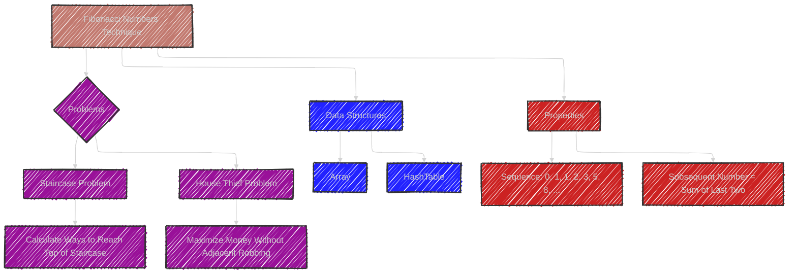
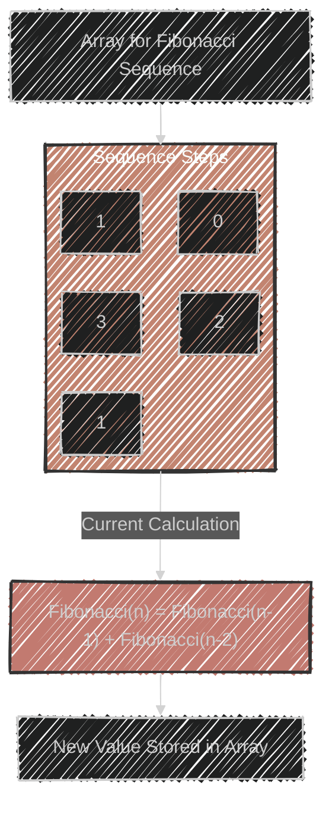
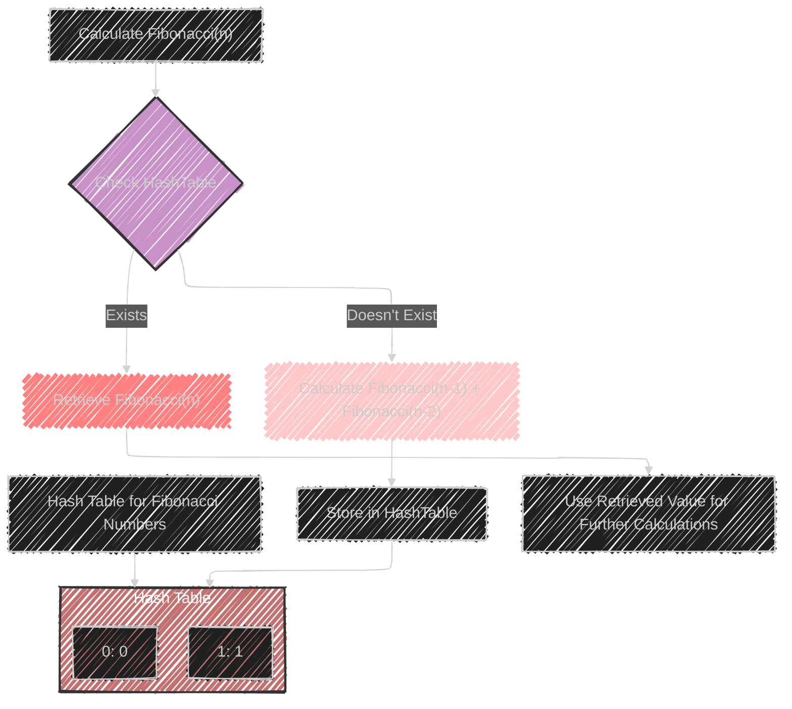

# Fibonacci Numbers Algorithm

> This content is dual-licensed under your choice of the following licenses:
> 1.  **MIT License:** For the code implementations in Swift and Mermaid provided in this document.
> 2.  **Creative Commons Attribution 4.0 International License (CC BY 4.0):** For all other content, including the text, explanations, and the Mermaid diagrams and illustrations.

---

The image discusses the Fibonacci Numbers technique, which is useful for solving problems involving sequences where each number is the sum of the preceding ones.

This typically refers to the Fibonacci sequence:

1. **Fibonacci Sequence:** Begins with 0 and 1, and each subsequent number is the sum of the previous two: 0, 1, 1, 2, 3, 5, 8, etc.

2. **Usage:** This sequence is often applied to problems where future states depend on previous ones. 

3. **Data Structures:** Arrays and hash tables are typically used to store previously calculated values for efficient access.

4. **Sample Problems:**
   - **Staircase Problem:** Calculate the number of ways to reach the top of a staircase with n steps, where you can take 1 or 2 steps at a time (a problem analogous to calculating Fibonacci numbers).
   - **House Thief Problem:** Maximize the amount of money a thief can rob without robbing two adjacent houses. It involves a similar approach where current decisions are based on a few previous ones.

Understanding this method involves recognizing patterns of dependency in sequences and applying dynamic programming to efficiently compute results.


---


## Mermaid illustrations


Here is a Mermaid diagram to illustrate the Fibonacci-related concepts:




This diagram captures how the Fibonacci Numbers technique is applied to specific problems and the data structures that support efficient computation.


---


## Full code implementation of the algorithm in Swift


Here's a Swift implementation of the Fibonacci technique as described, applied to the Staircase (Climbing Stairs) and House Thief (House Robber) problems:

### Staircase Problem (Climbing Stairs)

```swift
func climbStairs(_ n: Int) -> Int {
    if n <= 2 { return n }
    
    var first = 1
    var second = 2
    
    for _ in 3...n {
        let third = first + second
        first = second
        second = third
    }
    
    return second
}

// Example usage:
let steps = 5
print("Ways to climb \(steps) steps: \(climbStairs(steps))")
```

### House Thief Problem (House Robber)

```swift
func rob(_ nums: [Int]) -> Int {
    if nums.isEmpty { return 0 }
    if nums.count == 1 { return nums[0] }
    
    var prevMax = 0
    var currentMax = 0
    
    for num in nums {
        let newMax = max(currentMax, prevMax + num)
        prevMax = currentMax
        currentMax = newMax
    }
    
    return currentMax
}

// Example usage:
let houses = [2, 7, 9, 3, 1]
print("Maximum money that can be robbed: \(rob(houses))")
```

In the **Staircase Problem**, the approach uses two variables to iteratively calculate the number of ways to reach the top. In the **House Thief Problem**, the algorithm tracks the maximum money that can be robbed up to each house without robbing two adjacent houses, using dynamic programming principles.


---


## Iterate all the cases and print out all the cases from the algorithm

Below are the modified versions of the algorithms that print out all possible calculations for each step or decision.

### Staircase Problem (Climbing Stairs)

```swift
func climbStairs(_ n: Int) -> Int {
    if n <= 2 {
        print("Ways to climb \(n) steps: \(n)")
        return n
    }
    
    var first = 1
    var second = 2
    print("Ways to climb 1 step: 1")
    print("Ways to climb 2 steps: 2")
    
    for i in 3...n {
        let third = first + second
        first = second
        second = third
        print("Ways to climb \(i) steps: \(third)")
    }
    
    return second
}

// Example usage:
let steps = 5
climbStairs(steps)
```

### House Thief Problem (House Robber)

```swift
func rob(_ nums: [Int]) -> Int {
    if nums.isEmpty { 
        print("No houses to rob.")
        return 0 
    }
    
    if nums.count == 1 {
        print("Maximum money from 1 house: \(nums[0])")
        return nums[0] 
    }
    
    var prevMax = 0
    var currentMax = 0
    
    for (index, num) in nums.enumerated() {
        let newMax = max(currentMax, prevMax + num)
        print("House \(index + 1) with money \(num): Max money up to this house: \(newMax)")
        prevMax = currentMax
        currentMax = newMax
    }
    
    return currentMax
}

// Example usage:
let houses = [2, 7, 9, 3, 1]
rob(houses)
```

In the **Staircase Problem**, the function prints the number of ways to climb each number of steps up to `n`. In the **House Thief Problem**, the function prints the calculations for the maximum money that can be robbed up to each house.

---

## Mermaid diagrams for Array in this topic


Here's a simple Mermaid diagram illustrating how an array can be used in the context of the Fibonacci sequence:




This diagram shows the process of calculating each Fibonacci number and how it is stored in an array. Each number is calculated using the previous two numbers in the sequence.

---

## Mermaid diagram for HashTable in this topic


Here's a Mermaid diagram to illustrate how a hash table (or dictionary) might be used to store previously calculated Fibonacci numbers for efficient retrieval:




This diagram illustrates how a hash table can be used to store and retrieve Fibonacci numbers efficiently, avoiding redundant calculations by checking if a number is already present in the hash table. If it exists, the value is retrieved; if not, the number is calculated, stored, and then potentially used in further calculations.


---
**Licenses:**

- **MIT License:**  [](LICENSE) - Full text in [LICENSE](LICENSE) file.
- **Creative Commons Attribution 4.0 International:** [](LICENSE-CC-BY) - Legal details in [LICENSE-CC-BY](LICENSE-CC-BY) and at [Creative Commons official site](http://creativecommons.org/licenses/by/4.0/).

---