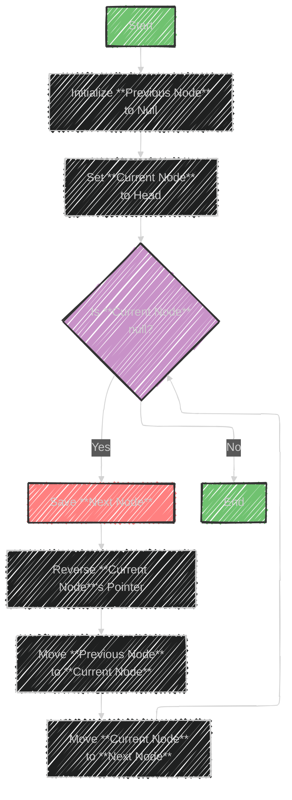

# In-place Reversal of a LinkedList algorithm

The image describes the "In-place Reversal of a LinkedList" algorithm, a method used to reverse the links between nodes in a linked list efficiently. The key point is that this reversal is performed in-place, meaning it uses the existing nodes without requiring extra memory for new nodes.

## Key Concepts
- **In-place:** The algorithm reuses the existing nodes and modifies their links directly, avoiding additional space usage.
- **LinkedList:** A data structure consisting of nodes, where each node contains data and a reference to the next node.

## Usage
- Efficiently reverses the order of nodes directly within the linked list.
- Suitable for scenarios where memory usage is a concern.

## Sample Problems
1. **Reverse Every K-element Sub-list:**
   - Breaks the list into segments of K nodes and reverses each segment individually.
2. **Rotate a LinkedList:**
   - Moves nodes from the front to the end or vice versa, effectively rotating the list.

This technique is often used in problems requiring the manipulation of node orders without incurring significant memory overhead.


---


## Mermaid illustration

Here's a Mermaid flowchart illustrating the in-place reversal of a linked list:



## Explanation
- Start with the head of the linked list.
- Initialize `Previous` to `null` and `Current` to `head`.
- While the current node is not `null`:
  - Save the next node.
  - Reverse the current node's pointer to point to the previous node.
  - Move the previous node pointer to the current node.
  - Move the current node pointer to the next node.
- End the process when the current node is null (reversal is complete).


---


## Full code implementation of the algorithm in Swift


Below is a Swift implementation of the in-place reversal of a linked list:

```swift
class ListNode {
    var value: Int
    var next: ListNode?
    
    init(_ value: Int) {
        self.value = value
        self.next = nil
    }
}

func reverseLinkedList(head: ListNode?) -> ListNode? {
    var previous: ListNode? = nil
    var current = head
    var next: ListNode? = nil

    while current != nil {
        // Save next node
        next = current?.next
        // Reverse current node's pointer
        current?.next = previous
        // Move pointers one position ahead
        previous = current
        current = next
    }
    
    return previous
}

// Helper function to print the linked list
func printLinkedList(head: ListNode?) {
    var current = head
    while current != nil {
        print(current!.value, terminator: " ")
        current = current?.next
    }
    print()
}

// Example usage:
let head = ListNode(1)
head.next = ListNode(2)
head.next?.next = ListNode(3)
head.next?.next?.next = ListNode(4)

print("Original Linked List:")
printLinkedList(head: head)

let reversedHead = reverseLinkedList(head: head)

print("Reversed Linked List:")
printLinkedList(head: reversedHead)
```

## Explanation
- **`ListNode` Class:** Defines a node in the linked list with `value` and `next` properties.
- **`reverseLinkedList` Function:** Takes the head of the linked list and reverses it in-place.
- **Reversal Logic:**
  - Initializes `previous` to `nil`.
  - Iterates through the list, reversing the pointers of each node.
  - Returns the new head of the reversed list.
- **`printLinkedList` Function:** A helper to print the linked list for testing purposes. 

This code will reverse the linked list and print both the original and reversed lists.


---


## Iterate all the cases and print out all the cases from the algorithm


To iterate through each step of the linked list reversal and print the state of the list at each step, you can modify the code as follows:

```swift
class ListNode {
    var value: Int
    var next: ListNode?
    
    init(_ value: Int) {
        self.value = value
        self.next = nil
    }
}

func reverseLinkedList(head: ListNode?) -> ListNode? {
    var previous: ListNode? = nil
    var current = head
    
    var step = 1
    while current != nil {
        // Print current state
        print("Step \(step):")
        printLinkedList(head: current)

        // Save next node
        let next = current?.next
        // Reverse current node's pointer
        current?.next = previous
        // Move pointers one position ahead
        previous = current
        current = next

        step += 1
    }

    print("Final reversed list:")
    printLinkedList(head: previous)

    return previous
}

func printLinkedList(head: ListNode?) {
    var current = head
    while current != nil {
        print(current!.value, terminator: " ")
        current = current?.next
    }
    print()
}

// Example usage:
let head = ListNode(1)
head.next = ListNode(2)
head.next?.next = ListNode(3)
head.next?.next?.next = ListNode(4)

print("Original Linked List:")
printLinkedList(head: head)

let _ = reverseLinkedList(head: head)
```

## Explanation
- **Step Printing:** At each iteration, print the current state of the linked list.
- **Helper Function:** `printLinkedList` helps visualize the current configuration of nodes.
- **Output:** You'll see the linked list configuration at each step of the reversal process.

---

