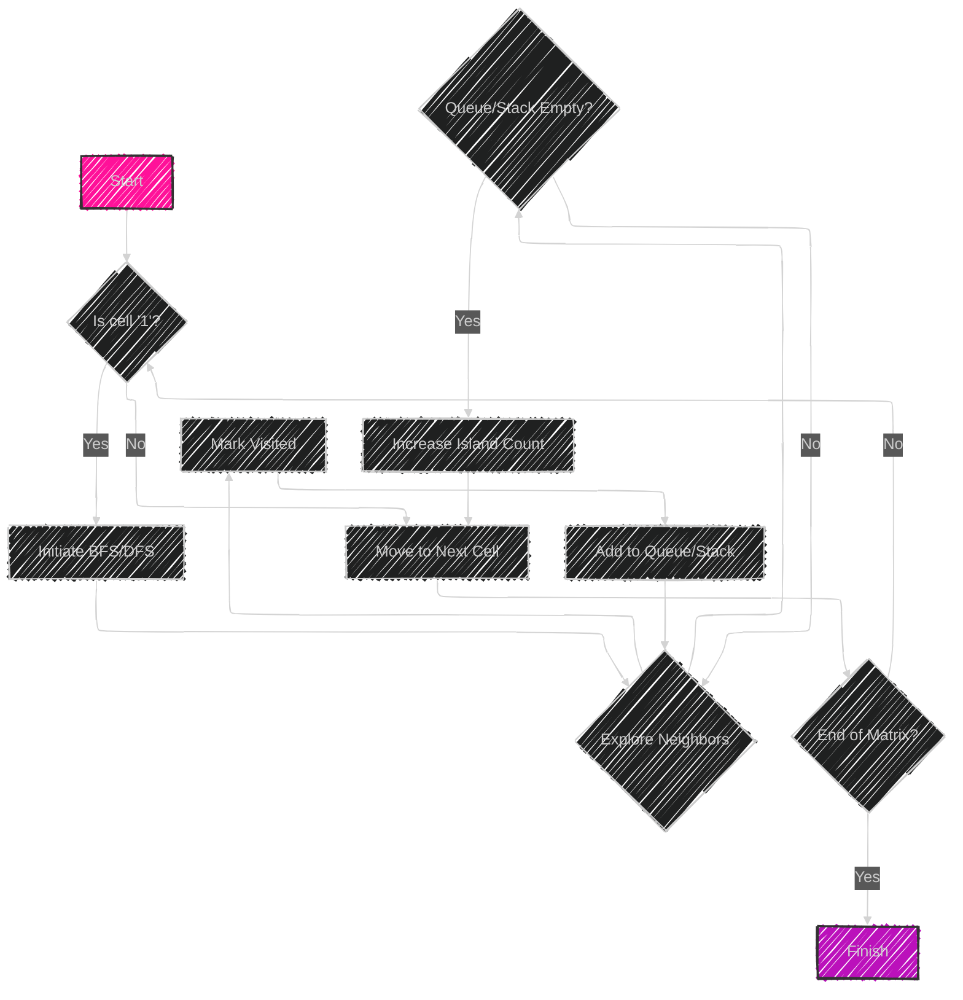

# Islands - Matrix Traversal


The "Islands (Matrix Traversal)" algorithm is commonly used to solve problems involving traversal in a matrix or 2D array. This pattern leverages a data structure such as a queue to efficiently explore and manipulate the matrix. Here's a breakdown of how it typically works:

## Algorithm Explanation

1. **Objective**: Identify and explore connected components in a matrix, often used to solve problems like counting the number of islands, performing flood fill, or detecting cycles in a matrix.

2. **Matrix and Queue Use**: 
   - **Matrix**: Represents the 2D grid to be traversed.
   - **Queue**: Used to manage the traversal order (often a Breadth-First Search, BFS).

3. **Traversal Process**:
   - Iterate over each cell in the matrix.
   - When a cell with a value of '1' (representing land or unvisited node) is found, initiate a traversal to explore all connected '1's using BFS or Depth-First Search (DFS).
   - Mark each visited cell to avoid reprocessing.
   - For BFS, enqueue each adjacent unvisited '1' to continue exploration level by level.

4. **Sample Problems**:
   - **Number of Islands**: Count discrete connected regions of '1's.
   - **Flood Fill**: Change the color or value of a region in a matrix.
   - **Cycle in a Matrix**: Detect if there is a cycle in the connections.

This pattern efficiently handles matrix-based traversal, exploring each node once, giving a time complexity proportional to the number of cells in the matrix, typically \(O(n \times m)\), where \(n\) and \(m\) are the dimensions of the matrix.

---

## Mermaid illustration


---


Here's a Mermaid diagram illustrating the Islands (Matrix Traversal) algorithm pattern:



## Explanation of the Diagram

- **Start**: Begin checking each cell in the matrix.
- **Is cell '1'?**: Determines if the current cell is land (i.e., part of an island).
- **Initiate BFS/DFS**: Begins a breadth-first or depth-first search from the current cell.
- **Explore Neighbors**: Check adjacent cells (up, down, left, right).
- **Mark Visited**: Mark each cell as visited to avoid reprocessing.
- **Add to Queue/Stack**: Add each unvisited neighbor to the queue or stack for further exploration.
- **Queue/Stack Empty?**: Checks if there are more cells to explore.
- **Increase Island Count**: Increments the count of discovered islands once exploration around a cell is complete.
- **Move to Next Cell**: Advances to the next cell in the matrix.
- **End of Matrix?**: Determines if all cells have been checked.
- **Finish**: Concludes the traversal once all cells have been processed.


---


## Full code implementation of the algorithm in Swift


Here's a Swift implementation of the "Number of Islands" problem using BFS:

```swift
import Foundation

func numIslands(_ grid: [[Character]]) -> Int {
    if grid.isEmpty { return 0 }
    
    var grid = grid
    let rows = grid.count
    let cols = grid[0].count
    var islandCount = 0
    
    let directions = [(0, 1), (1, 0), (0, -1), (-1, 0)]
    
    func bfs(_ r: Int, _ c: Int) {
        var queue: [(Int, Int)] = [(r, c)]
        grid[r][c] = "0"
        
        while !queue.isEmpty {
            let (row, col) = queue.removeFirst()
            
            for direction in directions {
                let newRow = row + direction.0
                let newCol = col + direction.1
                
                if newRow >= 0, newRow < rows, newCol >= 0, newCol < cols, grid[newRow][newCol] == "1" {
                    queue.append((newRow, newCol))
                    grid[newRow][newCol] = "0"
                }
            }
        }
    }
    
    for r in 0..<rows {
        for c in 0..<cols {
            if grid[r][c] == "1" {
                islandCount += 1
                bfs(r, c)
            }
        }
    }
    
    return islandCount
}

// Example usage:
let grid: [[Character]] = [
    ["1", "1", "1", "0", "0"],
    ["0", "1", "0", "0", "1"],
    ["0", "0", "1", "1", "0"],
    ["0", "0", "1", "0", "0"],
    ["0", "1", "0", "0", "0"]
]

let numberOfIslands = numIslands(grid)
print("Number of Islands: \(numberOfIslands)")
```

## Explanation

- **Grid Initialization**: The grid is a 2D array of characters ('1' for land and '0' for water).
- **BFS Implementation**: A queue is used to explore all connected '1's starting from any unvisited '1'.
- **Directions**: An array of tuples helps navigate up, down, left, and right.
- **Island Counting**: Each time a '1' is found, it triggers a BFS, marks the island as visited, and increments the island count.


---


## Iterate all the case and print out all the cases from the algorithm

---

You can modify the implementation to print each step as the algorithm processes the grid. Here’s how you can do that:

```swift
import Foundation

func numIslands(_ grid: [[Character]]) -> Int {
    if grid.isEmpty { return 0 }
    
    var grid = grid
    let rows = grid.count
    let cols = grid[0].count
    var islandCount = 0
    
    let directions = [(0, 1), (1, 0), (0, -1), (-1, 0)]
    
    func bfs(_ r: Int, _ c: Int) {
        var queue: [(Int, Int)] = [(r, c)]
        grid[r][c] = "0"
        print("Starting BFS at (\(r), \(c))")
        
        while !queue.isEmpty {
            let (row, col) = queue.removeFirst()
            print("Visiting (\(row), \(col))")
            
            for direction in directions {
                let newRow = row + direction.0
                let newCol = col + direction.1
                
                if newRow >= 0, newRow < rows, newCol >= 0, newCol < cols, grid[newRow][newCol] == "1" {
                    queue.append((newRow, newCol))
                    grid[newRow][newCol] = "0"
                    print("Found connected land at (\(newRow), \(newCol)), marking as visited and adding to queue")
                }
            }
        }
    }
    
    for r in 0..<rows {
        for c in 0..<cols {
            if grid[r][c] == "1" {
                islandCount += 1
                print("Island \(islandCount) starting at (\(r), \(c))")
                bfs(r, c)
            }
        }
    }
    
    return islandCount
}

// Example usage:
let grid: [[Character]] = [
    ["1", "1", "1", "0", "0"],
    ["0", "1", "0", "0", "1"],
    ["0", "0", "1", "1", "0"],
    ["0", "0", "1", "0", "0"],
    ["0", "1", "0", "0", "0"]
]

let numberOfIslands = numIslands(grid)
print("Number of Islands: \(numberOfIslands)")
```

## Added Debug Statements

- **Starting BFS**: Prints when a BFS starts at a particular cell.
- **Visiting**: Logs each cell visited during BFS.
- **Connected Land Found**: Indicates when connected land is found and marked as visited.

---

