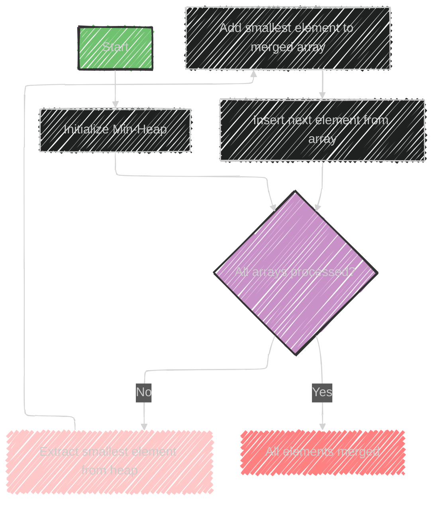

# K-way Merge Algorithm

> This content is dual-licensed under your choice of the following licenses:
> 1.  **MIT License:** For the code implementations in Swift and Mermaid provided in this document.
> 2.  **Creative Commons Attribution 4.0 International License (CC BY 4.0):** For all other content, including the text, explanations, and the Mermaid diagrams and illustrations.

---

The "K-way Merge" algorithm is a technique used to merge multiple sorted arrays into a single sorted array efficiently.

Here's a breakdown of its components and uses:

## Usage
- The K-way Merge is particularly useful for problems that involve handling multiple sorted arrays or lists. It's commonly applied in scenarios like finding the Kth smallest element across multiple sorted arrays.

## Data Structures Involved
- **Array**: The input data structure, consisting of multiple sorted arrays to be merged.
- **Queue**: Sometimes used to manage the elements being merged, although heaps are more common.
- **Heap (Priority Queue)**: A min-heap is typically used to efficiently extract the smallest element among the current front elements of the arrays.

## How It Works
1. **Initialize a Min-Heap**: Insert the first element of each sorted array into the heap. Each entry in the heap also keeps track of which array the element came from and its index in that array.
   
2. **Pull Elements**: Continuously extract the smallest element from the heap (the root of the heap), as this will be the next smallest element in the merged array.

3. **Insert Next Element**: After extracting an element from a particular array, insert the next element from that same array into the heap.

4. **Repeat**: Continue this process until all elements from all arrays have been processed and merged into the final array.

## Sample Problems
- **Kth Smallest Number in M Sorted Lists**: Identify the Kth smallest number when you have multiple sorted lists.
- **Kth Smallest Number in a Sorted Matrix**: Find the Kth smallest element in a matrix where each row and column is sorted.

This technique efficiently reduces the complexity involved with merging multiple arrays by leveraging the properties of heaps to keep the merging process optimal.


---


## Mermaid illustration

Here is a mermaid diagram illustrating the K-way Merge algorithm:



This diagram outlines the essential steps in the K-way Merge algorithm:
- **Start**: Begin the process.
- **Initialize Min-Heap**: Insert the first element from each array.
- **Check if all arrays are processed**: If not, continue; otherwise, finish.
- **Extract smallest element**: Remove the smallest element from the heap.
- **Add to merged array**: Insert this element into the final merged array.
- **Insert next element**: Add the next element from the same array the small element came from into the heap.
- **End**: Once all arrays are processed, the merge is complete.


---


## Full code implementation of the algorithm in Swift


Here is a Swift implementation of the K-way merge algorithm using a priority queue.

We'll use a min-heap to efficiently merge multiple sorted arrays into a single sorted array.

```swift
import Foundation

struct Heap<Element: Comparable> {
    var elements: [Element]
    private var isOrderedBefore: (Element, Element) -> Bool

    init(compare: @escaping (Element, Element) -> Bool) {
        self.elements = []
        self.isOrderedBefore = compare
    }

    mutating func insert(_ value: Element) {
        elements.append(value)
        siftUp(elements.count - 1)
    }

    mutating func remove() -> Element? {
        guard !elements.isEmpty else { return nil }
        let value = elements[0]
        elements[0] = elements.removeLast()
        siftDown(0)
        return value
    }

    private mutating func siftUp(_ index: Int) {
        var childIndex = index
        let childValue = elements[childIndex]
        var parentIndex = (childIndex - 1) / 2

        while childIndex > 0 && isOrderedBefore(childValue, elements[parentIndex]) {
            elements[childIndex] = elements[parentIndex]
            childIndex = parentIndex
            parentIndex = (childIndex - 1) / 2
        }

        elements[childIndex] = childValue
    }

    private mutating func siftDown(_ index: Int) {
        let startIndex = index
        let value = elements[startIndex]
        var parentIndex = startIndex

        while true {
            var leftChildIndex = 2 * parentIndex + 1
            var rightChildIndex = leftChildIndex + 1
            var first = parentIndex

            if leftChildIndex < elements.count && isOrderedBefore(elements[leftChildIndex], elements[first]) {
                first = leftChildIndex
            }
            if rightChildIndex < elements.count && isOrderedBefore(elements[rightChildIndex], elements[first]) {
                first = rightChildIndex
            }
            if first == parentIndex { return }

            elements[parentIndex] = elements[first]
            parentIndex = first
        }

        elements[parentIndex] = value
    }
}

func kWayMerge(sortedArrays: [[Int]]) -> [Int] {
    var mergedArray = [Int]()
    var minHeap = Heap(compare: { $0.0 < $1.0 })

    // Initialize the heap with the first element of each array
    for (i, array) in sortedArrays.enumerated() where !array.isEmpty {
        minHeap.insert((array[0], i, 0))
    }

    while let (value, arrayIndex, elementIndex) = minHeap.remove() {
        mergedArray.append(value)
        let nextElementIndex = elementIndex + 1
        
        // If there's a next element in the same array, add it to the heap
        if nextElementIndex < sortedArrays[arrayIndex].count {
            let nextValue = sortedArrays[arrayIndex][nextElementIndex]
            minHeap.insert((nextValue, arrayIndex, nextElementIndex))
        }
    }

    return mergedArray
}

// Example usage
let arrays = [
    [1, 4, 7],
    [2, 5, 8],
    [3, 6, 9]
]

let result = kWayMerge(sortedArrays: arrays)
print(result)  // Output: [1, 2, 3, 4, 5, 6, 7, 8, 9]
```

### Explanation
- We define a `Heap` structure that will manage our min-heap operations.
- The `kWayMerge` function takes an array of sorted arrays and returns a single sorted array.
- The algorithm inserts the first element from each array into the heap, identified by its value, array index, and element index.
- The smallest element is continuously extracted from the heap, and its next element from the same array is inserted until all elements are processed.
- The result is a merged array containing all elements in sorted order.


---


## Iterate all the cases and print out all the cases from the algorithm


To iterate through all the steps of the algorithm and print out the state of the heap and the merged array at each step, you can add some debug print statements.

Here's the modified code:

```swift
import Foundation

struct Heap<Element: Comparable> {
    var elements: [Element]
    private var isOrderedBefore: (Element, Element) -> Bool

    init(compare: @escaping (Element, Element) -> Bool) {
        self.elements = []
        self.isOrderedBefore = compare
    }

    mutating func insert(_ value: Element) {
        elements.append(value)
        siftUp(elements.count - 1)
    }

    mutating func remove() -> Element? {
        guard !elements.isEmpty else { return nil }
        let value = elements[0]
        elements[0] = elements.removeLast()
        siftDown(0)
        return value
    }

    private mutating func siftUp(_ index: Int) {
        var childIndex = index
        let childValue = elements[childIndex]
        var parentIndex = (childIndex - 1) / 2

        while childIndex > 0 && isOrderedBefore(childValue, elements[parentIndex]) {
            elements[childIndex] = elements[parentIndex]
            childIndex = parentIndex
            parentIndex = (childIndex - 1) / 2
        }

        elements[childIndex] = childValue
    }

    private mutating func siftDown(_ index: Int) {
        let startIndex = index
        let value = elements[startIndex]
        var parentIndex = startIndex

        while true {
            var leftChildIndex = 2 * parentIndex + 1
            var rightChildIndex = leftChildIndex + 1
            var first = parentIndex

            if leftChildIndex < elements.count && isOrderedBefore(elements[leftChildIndex], elements[first]) {
                first = leftChildIndex
            }
            if rightChildIndex < elements.count && isOrderedBefore(elements[rightChildIndex], elements[first]) {
                first = rightChildIndex
            }
            if first == parentIndex { return }

            elements[parentIndex] = elements[first]
            parentIndex = first
        }

        elements[parentIndex] = value
    }
}

func kWayMerge(sortedArrays: [[Int]]) -> [Int] {
    var mergedArray = [Int]()
    var minHeap = Heap(compare: { $0.0 < $1.0 })

    // Initialize the heap with the first element of each array
    for (i, array) in sortedArrays.enumerated() where !array.isEmpty {
        minHeap.insert((array[0], i, 0))
    }

    // Debug: Print initial heap state
    print("Initial heap: \(minHeap.elements)")

    while let (value, arrayIndex, elementIndex) = minHeap.remove() {
        mergedArray.append(value)
        let nextElementIndex = elementIndex + 1
        
        // If there's a next element in the same array, add it to the heap
        if nextElementIndex < sortedArrays[arrayIndex].count {
            let nextValue = sortedArrays[arrayIndex][nextElementIndex]
            minHeap.insert((nextValue, arrayIndex, nextElementIndex))
        }

        // Debug: Print heap and merged array state
        print("Heap after removal: \(minHeap.elements)")
        print("Merged array: \(mergedArray)")
    }

    return mergedArray
}

// Example usage
let arrays = [
    [1, 4, 7],
    [2, 5, 8],
    [3, 6, 9]
]

let result = kWayMerge(sortedArrays: arrays)
print("Final merged array: \(result)")
```

### Explanation of Debugging Output
- **Initial Heap**: Shows the state of the heap after inserting the first element of each array.
- **Heap after removal**: Displays the state of the heap after each extraction.
- **Merged Array**: Shows the current state of the merged array at each iteration. 

Running this code will print out each step, allowing you to trace the algorithm's execution and understand how elements are processed and merged.


---
**Licenses:**

- **MIT License:**  [](LICENSE) - Full text in [LICENSE](LICENSE) file.
- **Creative Commons Attribution 4.0 International:** [](LICENSE-CC-BY) - Legal details in [LICENSE-CC-BY](LICENSE-CC-BY) and at [Creative Commons official site](http://creativecommons.org/licenses/by/4.0/).

---