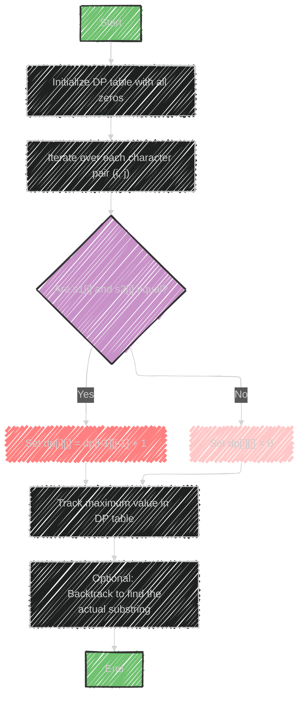

# Longest Common Substring Algorithm

> This content is dual-licensed under your choice of the following licenses:
> 1.  **MIT License:** For the code implementations in Swift and Mermaid provided in this document.
> 2.  **Creative Commons Attribution 4.0 International License (CC BY 4.0):** For all other content, including the text, explanations, and the Mermaid diagrams and illustrations.

---

The **Longest Common Substring** algorithm is used to find the longest sequence of characters that appears in the same order in two strings.

Below is a detailed explanation:

## Usage
- This technique is employed to identify the optimal part of a string or sequence that appears in both strings. It can be useful in applications like DNA sequence analysis, text comparison, and pattern recognition.

## Data Structures Involved
- **Array**: Often used to store intermediate results, like dynamic programming tables.
- **HashTable**: Can be used for efficient look-up operations to check occurrences of substrings.

## Sample Problems
- **Maximum Sum Increasing Subsequence**: Though a different problem, it uses similar principles of dynamic programming to find optimal subsequences.
- **Edit Distance**: The process of finding the longest common substring is related to calculating how different two strings are by determining the minimum number of operations (like insertions, deletions, and substitutions) needed to transform one string into another.

## Algorithm Overview
1. **Dynamic Programming (DP) Approach**: A common method to solve the longest common substring problem is to use a DP table where each cell `dp[i][j]` contains the length of the longest common substring that ends with characters at index `i` of the first string and `j` of the second string.
   
2. **Initialization**: Begin with a table of size `(m+1) x (n+1)` filled with zeros, where `m` and `n` are the lengths of the two strings. The first row and first column are zeros indicating no characters matched with an empty prefix.
   
3. **Filling the Table**:
   - Iterate over the strings, and for each pair of characters `(i, j)`, if they match, update the cell `dp[i][j] = dp[i-1][j-1] + 1`.
   - If they don't match, set `dp[i][j] = 0`.

4. **Track the Maximum**: While filling the table, track the maximum value obtained, which represents the length of the longest common substring.

5. **Backtracking**: (Optional) To find the actual substring, backtrack from the cell with the maximum value to reconstruct the substring.

This method allows for an efficient $O(m \times n)$ complexity solution using dynamic programming, suitable for moderately sized strings.


---


## Mermaid illustration

Here's a Mermaid diagram illustrating the dynamic programming approach for finding the Longest Common Substring:




### Explanation
- **A**: Start the process.
- **B**: Initialize a DP table with zeros.
- **C**: Iterate over each character pair from the two strings.
- **D**: Check if characters are equal.
- **E**: If equal, update the DP table with the previous diagonal value plus one.
- **F**: If not, set the value to zero.
- **G**: Track the maximum value found in the DP table.
- **H**: (Optional) Backtrack to find and reconstruct the longest substring.
- **I**: End the process.


---


## Full code implementation of the algorithm in Swift


Here's a full Swift implementation of the Longest Common Substring algorithm using dynamic programming:

```swift
func longestCommonSubstring(_ s1: String, _ s2: String) -> String {
    let m = s1.count
    let n = s2.count
    var dp = Array(repeating: Array(repeating: 0, count: n + 1), count: m + 1)
    var length = 0
    var endIndex = 0

    let s1Array = Array(s1)
    let s2Array = Array(s2)

    for i in 1...m {
        for j in 1...n {
            if s1Array[i - 1] == s2Array[j - 1] {
                dp[i][j] = dp[i - 1][j - 1] + 1
                if dp[i][j] > length {
                    length = dp[i][j]
                    endIndex = i
                }
            }
        }
    }
    
    // Extract the longest common substring
    if length > 0 {
        let start = endIndex - length
        return String(s1Array[start..<endIndex])
    }
    
    return ""
}

// Example Usage
let s1 = "abcdefg"
let s2 = "zcdemfg"
let result = longestCommonSubstring(s1, s2)
print("Longest Common Substring: \(result)")
```

### Explanation
- **Inputs**: Two strings, `s1` and `s2`.
- **DP Table**: A 2D array `dp` initialized to zero, with dimensions `(m+1) x (n+1)`.
- **Iteration**: Loop through characters of `s1` and `s2`. If characters match, update the `dp[i][j]` with `dp[i-1][j-1] + 1`.
- **Track Maximum Length**: Keep track of the maximum length and the end index.
- **Extract Substring**: After calculating the DP table, use the length and end index to extract the longest common substring.
- **Output**: Print the longest common substring.


---


## Iterate all the cases and print out all the cases from the algorithm


Here's how you can modify the Swift code to iterate through all possible cases and print each iteration of the DP table:

```swift
func longestCommonSubstring(_ s1: String, _ s2: String) -> (String, [[Int]]) {
    let m = s1.count
    let n = s2.count
    var dp = Array(repeating: Array(repeating: 0, count: n + 1), count: m + 1)
    var length = 0
    var endIndex = 0

    let s1Array = Array(s1)
    let s2Array = Array(s2)

    for i in 1...m {
        for j in 1...n {
            if s1Array[i - 1] == s2Array[j - 1] {
                dp[i][j] = dp[i - 1][j - 1] + 1
                if dp[i][j] > length {
                    length = dp[i][j]
                    endIndex = i
                }
            }
            print("DP table after updating dp[\(i)][\(j)]:")
            for row in dp {
                print(row)
            }
            print("\n")
        }
    }
    
    // Extract the longest common substring
    if length > 0 {
        let start = endIndex - length
        return (String(s1Array[start..<endIndex]), dp)
    }
    
    return ("", dp)
}

// Example Usage
let s1 = "abcdefg"
let s2 = "zcdemfg"
let (result, dpTable) = longestCommonSubstring(s1, s2)
print("Longest Common Substring: \(result)")
```

### Explanation
- **DP Table State Printing**: After updating each cell `dp[i][j]`, the current state of the DP table is printed, allowing you to see how the table evolves with each iteration.
- **Output**: For each step, it prints the 2D DP table. At the end, it gives the longest common substring.
- **Result**: You will see the process for each character match and non-match, letting you verify the updates to the DP table.


---
**Licenses:**

- **MIT License:**  [](LICENSE) - Full text in [LICENSE](LICENSE) file.
- **Creative Commons Attribution 4.0 International:** [](LICENSE-CC-BY) - Legal details in [LICENSE-CC-BY](LICENSE-CC-BY) and at [Creative Commons official site](http://creativecommons.org/licenses/by/4.0/).

---