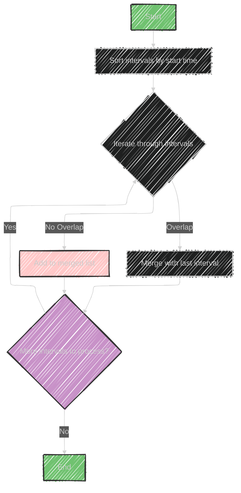

# Merge Intervals Algorithm

The "Merge Intervals" algorithm is used to handle overlapping intervals, often encountered in scheduling problems like conflicting appointments or finding the minimum number of meeting rooms needed.

## Key Concepts:

1. **Intervals:** Represent time periods with a start and end.
2. **Overlapping Intervals:** Occur when one interval starts before another ends.

## Algorithm Steps:

1. **Sort Intervals:** Begin by sorting all intervals based on their start times.

2. **Merge Overlapping Intervals:**
   - Initialize an empty list (or heap) to store merged intervals.
   - Iterate through each interval:
     - If the list is empty or the current interval does not overlap with the last merged interval, append it to the list.
     - If there is an overlap (the current interval's start is less than or equal to the last interval's end), merge them by extending the last interval's end to the maximum end value of both intervals.

## Examples in the Diagram:

1. **No Overlap:** `a` and `b` are separate intervals (e.g., 1 and 6).
2. **Overlap Examples:**
   - Intervals `a` and `b` partially overlap, and `b` ends after `a` (2).
   - Interval `a` completely overlaps `b` (3).
   - Intervals `a` and `b` overlap, but `a` ends after `b` (4).
   - Interval `b` completely overlaps `a` (5).

## Applications:
- **Scheduling:** Determine meeting room requirements.
- **Merging events or timelines** by identifying overlaps and combining them efficiently.

The primary data structures involved are arrays for storing intervals and a priority queue or heap in some implementations for efficient retrieval and merging.


---


## Mermaid illustration

Here's a simplified version of the "Merge Intervals" algorithm using Mermaid diagrams:




This diagram illustrates the basic flow of the algorithm: sorting the intervals, iterating through them to merge as needed, and then finishing once all intervals are processed.


---


## Full code implementation of the algorithm in Swift

Here's a full Swift implementation of the "Merge Intervals" algorithm as described:

```swift
import Foundation

struct Interval {
    var start: Int
    var end: Int
}

func mergeIntervals(_ intervals: [Interval]) -> [Interval] {
    // If there are no intervals, return an empty list
    if intervals.isEmpty {
        return []
    }
    
    // Sort the intervals based on their start times
    let sortedIntervals = intervals.sorted { $0.start < $1.start }
    
    // Initialize the merged array with the first interval
    var merged: [Interval] = [sortedIntervals[0]]
    
    // Iterate over the remaining intervals
    for i in 1..<sortedIntervals.count {
        // Get the last interval in the merged list
        var last = merged.last!
        let current = sortedIntervals[i]
        
        // Check if current interval overlaps with last merged interval
        if current.start <= last.end {
            // Merge them by extending the end of the last interval
            last.end = max(last.end, current.end)
            merged[merged.count - 1] = last
        } else {
            // No overlap, add current interval to merged array
            merged.append(current)
        }
    }
    
    return merged
}

// Example usage:
let intervals = [
    Interval(start: 1, end: 3),
    Interval(start: 2, end: 6),
    Interval(start: 8, end: 10),
    Interval(start: 15, end: 18)
]

let merged = mergeIntervals(intervals)
for interval in merged {
    print("(\(interval.start), \(interval.end))")
}
```

## Explanation:

1. **Interval Struct:** Defines the start and end of an interval.
2. **Function `mergeIntervals`:** Takes an array of intervals and returns a merged array.
   - **Sorting:** Intervals are sorted by their start value.
   - **Merging Logic:**
     - If intervals overlap, merge them by updating the last interval's end time.
     - If no overlap, add the current interval to the merged list.
3. **Example Usage:** Demonstrates how to use the function with a sample list of intervals.


---


## Iterate all the cases and print out all the cases from the algorithm

Here's how you can iterate through all the cases and print them using the algorithm described:

```swift
import Foundation

struct Interval {
    var start: Int
    var end: Int
}

func mergeIntervals(_ intervals: [Interval]) -> [Interval] {
    if intervals.isEmpty {
        return []
    }
    
    let sortedIntervals = intervals.sorted { $0.start < $1.start }
    var merged: [Interval] = [sortedIntervals[0]]
    
    print("Initial sorted intervals: \(sortedIntervals)")
    
    for i in 1..<sortedIntervals.count {
        var last = merged.last!
        let current = sortedIntervals[i]
        
        if current.start <= last.end {
            // Overlapping intervals
            print("Merging (\(last.start), \(last.end)) with (\(current.start), \(current.end))")
            last.end = max(last.end, current.end)
            merged[merged.count - 1] = last
        } else {
            // No overlap
            print("No overlap between (\(last.start), \(last.end)) and (\(current.start), \(current.end))")
            merged.append(current)
        }
    }
    
    return merged
}

// Example usage:
let intervals = [
    Interval(start: 1, end: 3),
    Interval(start: 2, end: 6),
    Interval(start: 8, end: 10),
    Interval(start: 15, end: 18)
]

let merged = mergeIntervals(intervals)
print("\nMerged intervals:")
for interval in merged {
    print("(\(interval.start), \(interval.end))")
}
```

## Explanation:

- **Initial Sorted Intervals:** Prints the sorted list of intervals.
- **Overlapping vs Non-Overlapping:**

  - Prints "Merging" when two intervals overlap, indicating the merge event.
  - Prints "No overlap" when there's no overlap, indicating separate intervals.

This code will print each step of the merging process, showing how intervals are merged or identified as non-overlapping.

---
**Licenses:**

- **MIT License:**  [](LICENSE) - Full text in [LICENSE](LICENSE) file.
- **Creative Commons Attribution 4.0 International:** [](LICENSE-CC-BY) - Legal details in [LICENSE-CC-BY](LICENSE-CC-BY) and at [Creative Commons official site](http://creativecommons.org/licenses/by/4.0/).

---