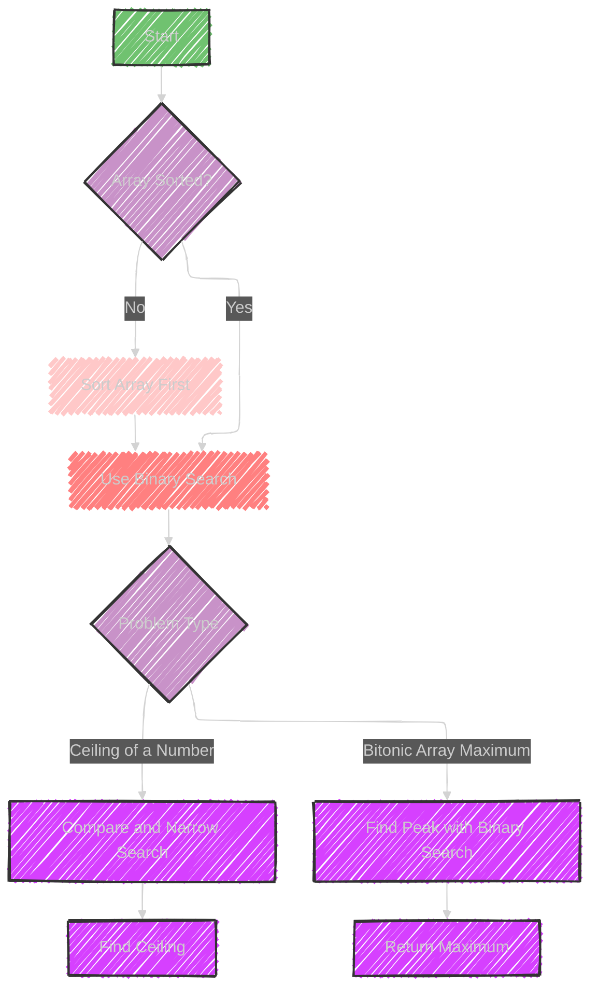

# Modified Binary Search Algorithm

> This content is dual-licensed under your choice of the following licenses:
> 1.  **MIT License:** For the code implementations in Swift and Mermaid provided in this document.
> 2.  **Creative Commons Attribution 4.0 International License (CC BY 4.0):** For all other content, including the text, explanations, and the Mermaid diagrams and illustrations.

---

The Modified Binary Search is an adaptation of the traditional binary search algorithm, designed to efficiently search sorted arrays.

Here's how it works and its typical applications:

## Key Characteristics:
- **Usage:** It efficiently finds elements or properties within a sorted dataset.
- **Data Structure Involved:** Array.

## Sample Problems:
1. **Ceiling of a Number:**
   - **Problem:** Find the smallest element in the array that is greater than or equal to a given number.
   - **Approach:** Use binary search to locate the position where this property is satisfied.

2. **Bitonic Array Maximum:**
   - **Problem:** A bitonic array is first increasing and then decreasing. Find the maximum element.
   - **Approach:** Use binary search to find the peak element by comparing middle elements to their neighbors.

## Why Use Modified Binary Search?
- It leverages the properties of sorted arrays to reduce the time complexity of search operations from linear ($O(N)$) to logarithmic ($O(\log N)$), similar to traditional binary search but adapted for specialized conditions or variations in the data structure, like bitonic arrays or finding closest matches.

These modifications make the algorithm versatile for specific problems that might not be efficiently solved using the basic binary search.


---


## Mermaid illustration

Here's a mermaid diagram illustrating the concept of Modified Binary Search and its applications:




This diagram outlines the decision process and steps for using the Modified Binary Search to solve different problems.


---


## Full code implementation of the algorithm in Swift


Here's a Swift implementation of the Modified Binary Search for both the "Ceiling of a Number" and "Bitonic Array Maximum" problems:

## Ceiling of a Number

```swift
func ceilingOfNumber(arr: [Int], key: Int) -> Int? {
    var start = 0
    var end = arr.count - 1
    var result: Int? = nil

    while start <= end {
        let mid = start + (end - start) / 2

        if arr[mid] == key {
            return arr[mid] // Exact match
        } else if arr[mid] < key {
            start = mid + 1
        } else {
            result = arr[mid] // Potential ceiling
            end = mid - 1
        }
    }
    return result
}

// Example usage
let sortedArray = [1, 3, 8, 10, 15]
if let ceiling = ceilingOfNumber(arr: sortedArray, key: 9) {
    print("Ceiling is \(ceiling)")
} else {
    print("No ceiling found")
}
```

## Bitonic Array Maximum

```swift
func findBitonicMax(arr: [Int]) -> Int? {
    var start = 0
    var end = arr.count - 1

    while start <= end {
        let mid = start + (end - start) / 2

        if (mid > 0 && mid < arr.count - 1) {
            if arr[mid] > arr[mid - 1] && arr[mid] > arr[mid + 1] {
                return arr[mid]
            } else if arr[mid] < arr[mid + 1] {
                start = mid + 1
            } else {
                end = mid - 1
            }
        } else if mid == 0 {
            return arr[0] > arr[1] ? arr[0] : arr[1]
        } else if mid == arr.count - 1 {
            return arr[mid] > arr[mid - 1] ? arr[mid] : arr[mid - 1]
        }
    }
    return nil
}

// Example usage
let bitonicArray = [1, 3, 8, 12, 4, 2]
if let maxElement = findBitonicMax(arr: bitonicArray) {
    print("Maximum element is \(maxElement)")
} else {
    print("No maximum found")
}
```

These code snippets demonstrate how to implement the Modified Binary Search technique in Swift for solving two common problems, providing an efficient approach to handle each scenario.

---


## Iterate all the cases and print out all the cases from the algorithm


Here is how you can iterate through each step and print the cases for both the Ceiling of a Number and the Bitonic Array Maximum algorithms.

This will help visualize the process:

## Ceiling of a Number with Detailed Steps

```swift
func ceilingOfNumberWithSteps(arr: [Int], key: Int) -> Int? {
    var start = 0
    var end = arr.count - 1
    var result: Int? = nil

    while start <= end {
        let mid = start + (end - start) / 2

        print("Checking middle element at index \(mid): \(arr[mid])")

        if arr[mid] == key {
            print("Exact match found at index \(mid): \(arr[mid])")
            return arr[mid]
        } else if arr[mid] < key {
            print("Element \(arr[mid]) is less than \(key), moving right")
            start = mid + 1
        } else {
            print("Element \(arr[mid]) is greater than \(key), moving left")
            result = arr[mid]
            end = mid - 1
        }
    }
    
    if let ceiling = result {
        print("Ceiling is \(ceiling)")
    } else {
        print("No ceiling found")
    }
    
    return result
}

// Example usage
let sortedArray = [1, 3, 8, 10, 15]
ceilingOfNumberWithSteps(arr: sortedArray, key: 9)
```

## Bitonic Array Maximum with Detailed Steps

```swift
func findBitonicMaxWithSteps(arr: [Int]) -> Int? {
    var start = 0
    var end = arr.count - 1

    while start <= end {
        let mid = start + (end - start) / 2

        print("Checking middle element at index \(mid): \(arr[mid])")

        if (mid > 0 && mid < arr.count - 1) {
            if arr[mid] > arr[mid - 1] && arr[mid] > arr[mid + 1] {
                print("Maximum found at index \(mid): \(arr[mid])")
                return arr[mid]
            } else if arr[mid] < arr[mid + 1] {
                print("Element \(arr[mid]) is less than its next element, moving right")
                start = mid + 1
            } else {
                print("Element \(arr[mid]) is greater than its next element, moving left")
                end = mid - 1
            }
        } else if mid == 0 {
            let maxElem = arr[0] > arr[1] ? arr[0] : arr[1]
            print("Maximum found at index 0 or 1: \(maxElem)")
            return maxElem
        } else if mid == arr.count - 1 {
            let maxElem = arr[mid] > arr[mid - 1] ? arr[mid] : arr[mid - 1]
            print("Maximum found at last index or before last: \(maxElem)")
            return maxElem
        }
    }
    
    print("No maximum found")
    return nil
}

// Example usage
let bitonicArray = [1, 3, 8, 12, 4, 2]
findBitonicMaxWithSteps(arr: bitonicArray)
```

These functions print each step, showing the decision-making process during the execution of the algorithms.


---
**Licenses:**

- **MIT License:**  [](LICENSE) - Full text in [LICENSE](LICENSE) file.
- **Creative Commons Attribution 4.0 International:** [](LICENSE-CC-BY) - Legal details in [LICENSE-CC-BY](LICENSE-CC-BY) and at [Creative Commons official site](http://creativecommons.org/licenses/by/4.0/).

---