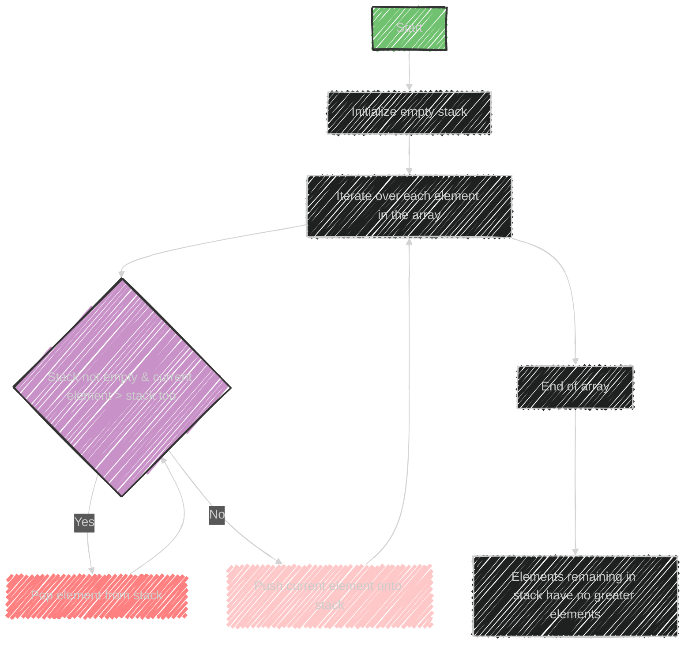

# Monotonic Stack Algorithm

A **monotonic stack** is a data structure used to maintain elements in a specific order, either non-increasing or non-decreasing. This approach is especially useful for solving problems that require finding certain relationships between elements, such as the next greater or smaller element.

## How It Works
- **Monotonic Increasing Stack:** Maintains elements in increasing order. Elements are added to the stack and if a new element is smaller, elements are popped until the order is preserved.
- **Monotonic Decreasing Stack:** Maintains elements in decreasing order. Elements are added to the stack and if a new element is larger, elements are popped until the order is preserved.

## Sample Problems
1. **Next Greater Element:** For each element, find the next greater element to its right.
2. **Next Smaller Element:** For each element, find the next smaller element to its right.
3. **Largest Rectangle in Histogram:** Use a stack to calculate the largest rectangle area in a histogram by maintaining heights in a monotonic order.

This structure helps efficiently solve problems involving nearest elements, by reducing the complexity compared to typical brute force approaches.


---


## Mermaid illustration


Here's a mermaid diagram that illustrates how a monotonic stack works for the "Next Greater Element" problem:



This diagram shows the process of iterating over an array, using a stack to track the order, and handling each element based on the relationship with elements already in the stack.


---


## Full code implementation of the algorithm in Swift


Here's a full implementation of the "Next Greater Element" problem using a monotonic stack in Swift:

```swift
func nextGreaterElements(_ nums: [Int]) -> [Int] {
    var result = Array(repeating: -1, count: nums.count)
    var stack: [Int] = []
    
    for i in 0..<nums.count {
        while let last = stack.last, nums[i] > nums[last] {
            result[stack.removeLast()] = nums[i]
        }
        stack.append(i)
    }
    
    return result
}

// Example Usage
let nums = [2, 1, 2, 4, 3]
let result = nextGreaterElements(nums)
print(result)  // Output: [4, 2, 4, -1, -1]
```

### Explanation
- **result**: An array initialized with -1, indicating that no greater element has been found yet.
- **stack**: Used to keep track of indices of elements in a way that helps find the next greater element.
- We iterate over each element in `nums`.
  - While the stack is not empty and the current element is greater than the element at the index stored at the top of the stack, we update the result for that index and pop the stack.
  - Push the current index onto the stack.
- Finally, `result` contains the next greater element for each position in the original array. If no greater element exists, the result remains -1.


---


## Iterate all the cases and print out all the cases from the algorithm


Here's how you can modify the function to print out the process for finding the "Next Greater Element" using a monotonic stack in Swift:

```swift
func nextGreaterElements(_ nums: [Int]) -> [Int] {
    var result = Array(repeating: -1, count: nums.count)
    var stack: [Int] = []
    
    for i in 0..<nums.count {
        print("Processing element: \(nums[i]) at index \(i)")

        while let last = stack.last, nums[i] > nums[last] {
            let index = stack.removeLast()
            result[index] = nums[i]
            print("Next greater element for \(nums[index]) at index \(index) is \(nums[i])")
        }
        
        stack.append(i)
        print("Current stack: \(stack.map { nums[$0] })")
    }
    
    print("\nRemaining elements have no greater elements.")
    for index in stack {
        print("Element \(nums[index]) at index \(index) has no greater element.")
    }
    
    return result
}

// Example Usage
let nums = [2, 1, 2, 4, 3]
let result = nextGreaterElements(nums)
print("\nResult: \(result)")  // Output: [4, 2, 4, -1, -1]
```

### Explanation
- The function now prints the element being processed and the current state of the stack.
- It outputs when a next greater element is found for a specific position.
- Once the iteration is complete, it prints out any elements remaining in the stack that have no greater element.
- Finally, it prints the overall result array.


---
**Licenses:**

- **MIT License:**  [](LICENSE) - Full text in [LICENSE](LICENSE) file.
- **Creative Commons Attribution 4.0 International:** [](LICENSE-CC-BY) - Legal details in [LICENSE-CC-BY](LICENSE-CC-BY) and at [Creative Commons official site](http://creativecommons.org/licenses/by/4.0/).

---