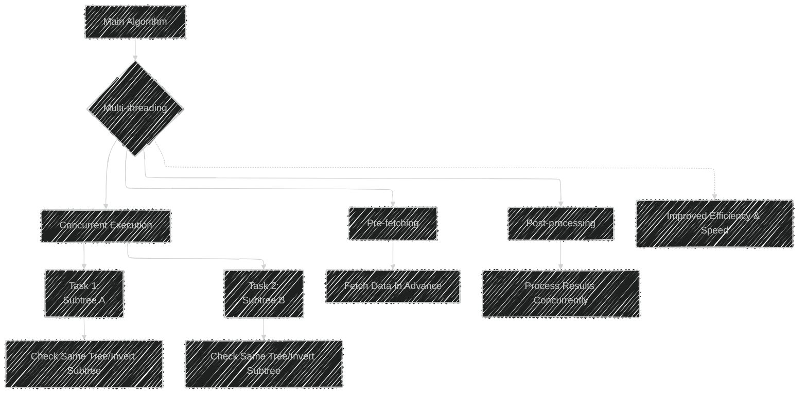

# Multi-threaded Algorithm

The image describes the concept of making an algorithm multi-threaded.

This approach involves dividing a task into multiple concurrent threads, allowing different parts of the algorithm to run simultaneously. 

## Usage
- **Concurrent Tasks:** Multi-threading is used to perform several tasks concurrently, improving the efficiency and speed of an algorithm.
- **Pre-fetching/Post-processing:** Threads can be used for pre-fetching data or post-processing results, further optimizing performance.

## Sample Problems
The image provides examples where multi-threading can be beneficial:
- **Same Tree:** Checking if two binary trees are identical can be parallelized by checking subtrees concurrently.
- **Invert Binary Tree:** The process of inverting a binary tree can be split into inverting subtrees simultaneously.
- **Binary Search Tree Iterator:** A multi-threaded iterator can fetch multiple elements concurrently or prepare the next batch of elements in advance.

Overall, multi-threading can significantly speed up tasks, especially in resource-intensive or computational-heavy operations.


---


## Mermaid illustration

Here's a diagram using Mermaid syntax to illustrate the concept of multi-threading in algorithms:



This diagram illustrates how an algorithm can leverage multi-threading to improve performance through concurrent execution, pre-fetching, and post-processing.


---


## Full code implementation of the algorithm in Swift


Below is a Swift implementation that demonstrates a multi-threaded approach for inverting a binary tree.

We'll use Grand Central Dispatch (GCD) to perform the inversion concurrently.

```swift
import Foundation

// Definition for a binary tree node
class TreeNode {
    var val: Int
    var left: TreeNode?
    var right: TreeNode?
    
    init(_ val: Int) {
        self.val = val
        self.left = nil
        self.right = nil
    }
}

// Function to invert a binary tree using multi-threading
func invertTree(_ root: TreeNode?) -> TreeNode? {
    guard let root = root else {
        return nil
    }
    
    // Concurrent queue for threading
    let queue = DispatchQueue(label: "invertTree", attributes: .concurrent)
    let group = DispatchGroup()
    
    // Invert the left subtree
    queue.async(group: group) {
        root.left = invertTree(root.left)
    }
    
    // Invert the right subtree
    queue.async(group: group) {
        root.right = invertTree(root.right)
    }
    
    // Wait for the asynchronous tasks to complete
    group.wait()
    
    // Swap the inverted left and right subtrees
    swap(&root.left, &root.right)
    
    return root
}

// Helper function to print the tree (in-order traversal)
func printTree(_ root: TreeNode?) {
    guard let root = root else { return }
    printTree(root.left)
    print(root.val, terminator: " ")
    printTree(root.right)
}

// Example usage
let root = TreeNode(1)
root.left = TreeNode(2)
root.right = TreeNode(3)
root.left?.left = TreeNode(4)
root.left?.right = TreeNode(5)

print("Original Tree:")
printTree(root)
print("\n")

if let invertedRoot = invertTree(root) {
    print("Inverted Tree:")
    printTree(invertedRoot)
    print("\n")
}
```

### Explanation
- **TreeNode Class:** Represents each node in the binary tree.
- **invertTree Function:** It uses a concurrent dispatch queue to invert the left and right subtrees simultaneously, improving efficiency.
- **DispatchGroup:** Ensures both left and right subtree inversions complete before swapping them.
- **Threading:** Handles subtree inversion using GCD for concurrent execution.
- **Example Usage:** Creates a simple binary tree, inverts it, and prints out the original and inverted trees. 

Please make sure to test this in a proper Swift environment as the concurrency model might require appropriate setup and hardware capabilities.


---


## Iterate all the cases and print out all the cases from the algorithm


To iterate through and print all cases of the algorithm (e.g., the values of the tree nodes during each step), we can modify the inversion function to include a print statement that outputs the tree's state.

We'll perform a pre-order traversal to capture the state at each step.

Here's how you can implement it:

```swift
import Foundation

// Definition for a binary tree node
class TreeNode {
    var val: Int
    var left: TreeNode?
    var right: TreeNode?
    
    init(_ val: Int) {
        self.val = val
        self.left = nil
        self.right = nil
    }
}

// Function to invert and print the binary tree using multi-threading
func invertAndPrintTree(_ root: TreeNode?) -> TreeNode? {
    guard let root = root else {
        return nil
    }
    
    // Print current state of the node being processed
    print("Processing node with value: \(root.val)")
    
    // Concurrent queue for threading
    let queue = DispatchQueue(label: "invertTree", attributes: .concurrent)
    let group = DispatchGroup()
    
    // Invert the left subtree
    queue.async(group: group) {
        root.left = invertAndPrintTree(root.left)
    }
    
    // Invert the right subtree
    queue.async(group: group) {
        root.right = invertAndPrintTree(root.right)
    }
    
    // Wait for the asynchronous tasks to complete
    group.wait()
    
    // Swap the inverted left and right subtrees
    swap(&root.left, &root.right)
    
    return root
}

// Helper function to print the tree (pre-order traversal)
func printTreeState(_ root: TreeNode?) {
    guard let root = root else { return }
    print(root.val, terminator: " ")
    printTreeState(root.left)
    printTreeState(root.right)
}

// Example usage
let root = TreeNode(1)
root.left = TreeNode(2)
root.right = TreeNode(3)
root.left?.left = TreeNode(4)
root.left?.right = TreeNode(5)

print("Original Tree Pre-order:")
printTreeState(root)
print("\n")

if let invertedRoot = invertAndPrintTree(root) {
    print("\nInverted Tree Pre-order:")
    printTreeState(invertedRoot)
    print("\n")
}
```

### Explanation
- **Printing State:** The `invertAndPrintTree` function includes a print statement that logs the value of each node as it gets processed.
- **Pre-order Traversal:** Outputs the tree's structure before and after inversion to illustrate the state changes.
- **Concurrency Aspects:** Remain the same, using GCD to concurrently invert subtrees. 

This setup will print each node as it is processed and allow you to see the changes in the tree's structure during each recursive call.

---
