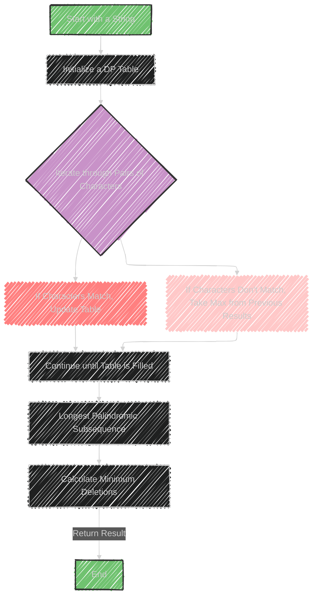

# Palindromic Subsequence Algorithm

> This content is dual-licensed under your choice of the following licenses:
> 1.  **MIT License:** For the code implementations in Swift and Mermaid provided in this document.
> 2.  **Creative Commons Attribution 4.0 International License (CC BY 4.0):** For all other content, including the text, explanations, and the Mermaid diagrams and illustrations.

---

The concept of "Palindromic Subsequence" is an optimization technique used in string manipulation problems, focusing on palindromes. Here's a breakdown:

## Usage
This technique is applied to solve optimization problems involving palindromic sequences or strings. A palindrome reads the same forward and backward, like "radar" or "level".

## Data Structures Involved
- **Array:** Used to store intermediate results, especially in dynamic programming.
- **HashTable:** Can be used for quick lookups, although less common in basic palindromic subsequence problems.

## Sample Problems
1. **Longest Palindromic Subsequence:**
   - Goal: Find the longest subsequence in a string that is a palindrome.
   - Approach: Use dynamic programming to explore all subsequences efficiently, storing results in a table to avoid redundant calculations.

2. **Minimum Deletions in a String to Make it a Palindrome:**
   - Goal: Determine the fewest deletions required to convert a string into a palindrome.
   - Approach: Calculate the longest palindromic subsequence and derive deletions by subtracting its length from the total string length.

These problems leverage dynamic programming to efficiently determine the desired outcomes by breaking down the problem into smaller overlapping subproblems and building up solutions based on previously computed results.


---


## Mermaid illustration


Here's a Mermaid illustration to represent solving the longest palindromic subsequence using dynamic programming.




This diagram illustrates the process of solving the longest palindromic subsequence and how it ties into calculating the minimum deletions to make a string a palindrome.


---


## Full code implementation of the algorithm in Swift


Below is a Swift implementation to find the longest palindromic subsequence and calculate the minimum deletions needed to make a string a palindrome.

```swift
func longestPalindromicSubsequence(_ s: String) -> Int {
    let n = s.count
    let characters = Array(s)
    var dp = Array(repeating: Array(repeating: 0, count: n), count: n)
    
    // Each character is a palindrome of length 1
    for i in 0..<n {
        dp[i][i] = 1
    }
    
    // Fill the table
    for length in 2...n { // length of the substring
        for i in 0...(n - length) {
            let j = i + length - 1
            if characters[i] == characters[j] {
                dp[i][j] = 2 + dp[i + 1][j - 1] // Matching characters
            } else {
                dp[i][j] = max(dp[i + 1][j], dp[i][j - 1]) // Take the max without one of the characters
            }
        }
    }
    
    // The result is in dp[0][n-1], covering the whole string
    return dp[0][n - 1]
}

func minimumDeletionsToMakePalindrome(_ s: String) -> Int {
    let longestPalindromicLength = longestPalindromicSubsequence(s)
    return s.count - longestPalindromicLength
}

// Example usage
let inputString = "abcde"
let longestPalindromicLength = longestPalindromicSubsequence(inputString)
let minDeletions = minimumDeletionsToMakePalindrome(inputString)
print("Longest Palindromic Subsequence Length: \(longestPalindromicLength)")
print("Minimum Deletions to Make Palindrome: \(minDeletions)")
```

### Explanation
- **`longestPalindromicSubsequence:`** This function uses dynamic programming to find the longest palindromic subsequence by filling a 2D table. Each entry `dp[i][j]` represents the length of the longest palindromic subsequence in the substring `s[i...j]`.
- **`minimumDeletionsToMakePalindrome:`** This utilizes the length of the longest palindromic subsequence to calculate the minimum deletions required. It subtracts the length of the longest palindromic subsequence from the total length of the string.


---


## Iterate all the cases and print out all the cases from the algorithm


To iterate through all cases and print each step in the algorithm, you can modify the code to include print statements that trace the dynamic programming table's updates.

Here's an updated version of the code with additional debug output:

```swift
func longestPalindromicSubsequence(_ s: String) -> Int {
    let n = s.count
    let characters = Array(s)
    var dp = Array(repeating: Array(repeating: 0, count: n), count: n)
    
    // Each character is a palindrome of length 1
    for i in 0..<n {
        dp[i][i] = 1
    }
    
    // Fill the table
    for length in 2...n { // length of the substring
        for i in 0...(n - length) {
            let j = i + length - 1
            if characters[i] == characters[j] {
                dp[i][j] = 2 + dp[i + 1][j - 1] // Matching characters
            } else {
                dp[i][j] = max(dp[i + 1][j], dp[i][j - 1]) // Take the max without one of the characters
            }
            // Print the current state of the dp table
            printDPTable(dp, n)
        }
    }
    
    // The result is in dp[0][n-1], covering the whole string
    return dp[0][n - 1]
}

func printDPTable(_ dp: [[Int]], _ n: Int) {
    print("Current DP Table State:")
    for i in 0..<n {
        for j in 0..<n {
            let value = dp[i][j]
            let output = value == 0 ? "." : String(value)
            print(output, terminator: " ")
        }
        print()
    }
    print("---------------")
}

func minimumDeletionsToMakePalindrome(_ s: String) -> Int {
    let longestPalindromicLength = longestPalindromicSubsequence(s)
    return s.count - longestPalindromicLength
}

// Example usage
let inputString = "abcde"
let longestPalindromicLength = longestPalindromicSubsequence(inputString)
let minDeletions = minimumDeletionsToMakePalindrome(inputString)
print("Longest Palindromic Subsequence Length: \(longestPalindromicLength)")
print("Minimum Deletions to Make Palindrome: \(minDeletions)")
```

### Explanation
- **`printDPTable:`** This helper function prints the current state of the dynamic programming table. It outputs a dot (.) for uninitialized values and the current values for initialized cells.
- As the `dp` table is filled, the state of the table is printed after each update, allowing you to trace the algorithm's progress step-by-step.

---
**Licenses:**

- **MIT License:**  [](LICENSE) - Full text in [LICENSE](LICENSE) file.
- **Creative Commons Attribution 4.0 International:** [](LICENSE-CC-BY) - Legal details in [LICENSE-CC-BY](LICENSE-CC-BY) and at [Creative Commons official site](http://creativecommons.org/licenses/by/4.0/).

---