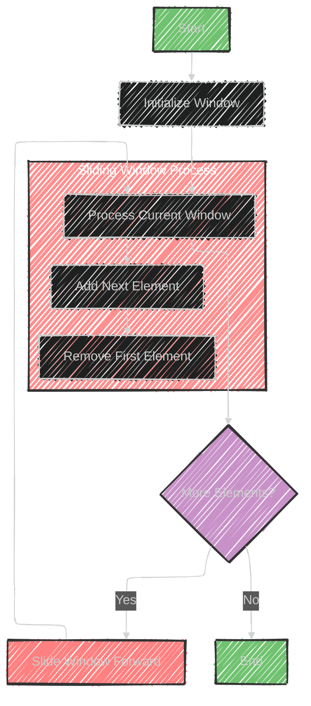

# Sliding Windows Algorithm

The sliding window technique is an algorithmic method used to efficiently solve problems involving a continuous range or sequence of data. It involves maintaining a subset or "window" of the data and moving this window over the dataset to perform desired computations.

### Key Components:

1. **Window Size**: A fixed size for the window which moves across the data.

2. **Data Structures Involved**: 
   - **Array**: Often used to store the data over which the window slides.
   - **String**: Used when the data involves characters.
   - **HashTable**: Can be used to keep track of the frequency of elements within the window or for fast lookups.

### How it Works:

- **Initialization**: Start with the window covering the initial elements.
- **Sliding**: Move the window over the dataset by adding the next element to the window and removing the element that just slid out.
- **Processing**: During each step, perform necessary computations based on the elements currently in the window.

### Use Cases:

- **Longest Substring with 'K' Distinct Characters**: Find the maximum length of a substring containing exactly 'K' distinct characters.
- **Fruits into Baskets**: Also known as the "two distinct characters" problem, where you find the longest contiguous subarray containing at most two different numbers.

### Advantages:

- **Efficiency**: Reduces the time complexity compared to more naive methods, making it suitable for large datasets.
- **Flexibility**: Can be adapted for various scenarios, including different window sizes or conditions.

This technique optimizes the handling of the data by reusing computations, which is especially beneficial in scenarios requiring performance improvements.

---

## Mermaid diagram

Here's a simple Mermaid diagram illustrating the sliding window technique:



This diagram shows the basic flow of applying the sliding window technique, where you start with an initial window, process it, and slide it forward until all elements have been considered.


---

## Code Implementation in Swift


Here is a Swift implementation of the sliding window technique to solve the "Longest Substring with 'K' Distinct Characters" problem:

```swift
func longestSubstringWithKDistinct(_ s: String, _ k: Int) -> Int {
    var maxLength = 0
    var windowStart = 0
    var charFrequency = [Character: Int]()

    for (windowEnd, char) in s.enumerated() {
        // Add the current character to the dictionary
        charFrequency[char, default: 0] += 1

        // Shrink the sliding window until we have 'k' distinct characters in the frequency dictionary
        while charFrequency.count > k {
            let startChar = s[s.index(s.startIndex, offsetBy: windowStart)]
            charFrequency[startChar]! -= 1

            if charFrequency[startChar] == 0 {
                charFrequency.removeValue(forKey: startChar)
            }

            windowStart += 1
        }

        // Update the maximum length of the substring found so far
        maxLength = max(maxLength, windowEnd - windowStart + 1)
    }

    return maxLength
}

// Example usage
let s = "araaci"
let k = 2
print("Length of the longest substring with \(k) distinct characters: \(longestSubstringWithKDistinct(s, k))")
```

### Explanation:

1. **Initialize Variables**:
   - `maxLength`: Keeps track of the longest substring found so far.
   - `windowStart`: Marks the starting index of the window.
   - `charFrequency`: Dictionary to store the frequency of characters in the current window.

2. **Iterate Over the String**:
   - Use `enumerated()` to track the current character and its index.
   - Add each character to `charFrequency`.

3. **Adjust the Window**:
   - If the number of distinct characters exceeds `k`, shrink the window from the start until we have `k` distinct characters.

4. **Update Maximum Length**:
   - Calculate the current window length and update `maxLength` if necessary.

This code efficiently finds the longest substring with exactly `k` distinct characters by maintaining a sliding window over the input string.


---

## iterate all the case and print out all the substring


Here's how you can modify the sliding window technique to print all substrings with exactly `k` distinct characters in Swift:

```swift
func substringsWithKDistinct(_ s: String, _ k: Int) {
    var windowStart = 0
    var charFrequency = [Character: Int]()

    for (windowEnd, char) in s.enumerated() {
        // Add the current character to the dictionary
        charFrequency[char, default: 0] += 1

        // Shrink the sliding window until we have 'k' distinct characters
        while charFrequency.count > k {
            let startChar = s[s.index(s.startIndex, offsetBy: windowStart)]
            charFrequency[startChar]! -= 1

            if charFrequency[startChar] == 0 {
                charFrequency.removeValue(forKey: startChar)
            }

            windowStart += 1
        }

        // If we have exactly 'k' distinct characters, print the substring
        if charFrequency.count == k {
            let startIdx = s.index(s.startIndex, offsetBy: windowStart)
            let endIdx = s.index(s.startIndex, offsetBy: windowEnd)
            print(String(s[startIdx...endIdx]))
        }
    }
}

// Example usage
let s = "araaci"
let k = 2
print("Substrings with \(k) distinct characters:")
substringsWithKDistinct(s, k)
```

### Explanation:

1. **Initialize and Track Frequencies**:
   - Use a dictionary `charFrequency` to maintain character counts within the sliding window.

2. **Iterate Over the String**:
   - Add each character to the dictionary and update its count.

3. **Adjust the Window**:
   - If the count of distinct characters exceeds `k`, reduce the window size from the start, updating the character counts as necessary.

4. **Print Substrings**:
   - Whenever the window contains exactly `k` distinct characters, print the substring within the current window bounds.

This code iterates over the string, dynamically adjusting the window to include exactly `k` distinct characters and outputs all such substrings.


---

## Code Implementation in Swift 2 


Here's a Swift implementation of the Sliding Window technique as it applies to finding the maximum sum of a subarray of size `k` in an array. This example highlights the core concept of the Sliding Window pattern:

```swift
import Foundation

func maxSumSubarray(arr: [Int], k: Int) -> Int {
    // Handle edge cases
    if arr.isEmpty || k <= 0 || k > arr.count {
        return 0
    }
    
    var maxSum = 0
    var windowSum = 0
    var windowStart = 0
    
    // Calculate initial window sum
    for windowEnd in 0..<k {
        windowSum += arr[windowEnd]
    }
    
    maxSum = windowSum
    
    // Slide the window through the array
    for windowEnd in k..<arr.count {
        windowSum += arr[windowEnd] - arr[windowStart]
        windowStart += 1
        maxSum = max(maxSum, windowSum)
    }
    
    return maxSum
}

// Example usage
let arr = [2, 1, 5, 1, 3, 2]
let k = 3
let maxSum = maxSumSubarray(arr: arr, k: k)
print("Maximum sum of subarray of size \(k) is \(maxSum)")
```

### Explanation:
- **maxSumSubarray Function**: 
  - Input: An array `arr` and an integer `k`, the size of the window.
  - Output: The maximum sum of any contiguous subarray of size `k`.

- **Edge Cases**: Covers cases like an empty array or invalid values of `k`.

- **Initial Window Sum**: Calculates the sum of the first `k` elements.

- **Sliding the Window**: 
  - Iterate from `k` to the end of the array.
  - Adjust the window sum by adding the next element and subtracting the first element of the previous window.
  - Update `maxSum` if the current window sum is greater.

- **Time Complexity**: \(O(n)\), where \(n\) is the number of elements in the array.

You can use this basic structure to solve a variety of problems using the Sliding Window technique by adjusting the logic inside the loop based on the problem requirements.


---


## iterate all the case and print out all the substring for example 2


---

Here's how you can modify the sliding window technique in Swift to iterate through the array and print all subarrays (substrings for strings) of a given size `k`.

```swift
import Foundation

func printAllSubarrays(arr: [Int], k: Int) {
    // Handle edge cases
    if arr.isEmpty || k <= 0 || k > arr.count {
        print("Invalid input")
        return
    }
    
    for start in 0...(arr.count - k) {
        let subarray = arr[start..<(start + k)]
        print(Array(subarray))
    }
}

// Example usage
let arr = [2, 1, 5, 1, 3, 2]
let k = 3
print("All subarrays of size \(k):")
printAllSubarrays(arr: arr, k: k)
```

### Explanation:
- **printAllSubarrays Function**: 
  - Input: An array `arr` and an integer `k`, the size of the subarrays.
  - Action: Iterates through the array, printing each subarray of size `k`.

- **Iteration**:
  - Loop starts at each index where a subarray of size `k` can begin (`0` to `arr.count - k`).
  - Uses Swift's slicing to create subarrays from `arr[start..<(start + k)]`.

- **Edge Cases**: Handles invalid inputs like an empty array or inappropriate `k` values.

This function will print all contiguous subarrays of size `k` in the array. You can adapt this technique for strings by replacing the integer array with a string and adjusting accordingly.


---


## Code Implementation in Swift 3 


Here's a full implementation of the Sliding Window technique in Swift, using the example of finding the maximum sum of a subarray of a fixed size:

```swift
import Foundation

func maxSumSubarray(ofSize k: Int, in array: [Int]) -> Int? {
    guard array.count >= k else { return nil }
    
    var maxSum = 0
    var windowSum = 0
    
    // Calculate the sum of the first window
    for i in 0..<k {
        windowSum += array[i]
    }
    
    maxSum = windowSum
    
    // Slide the window across the array
    for i in k..<array.count {
        windowSum += array[i] - array[i - k]
        maxSum = max(maxSum, windowSum)
    }
    
    return maxSum
}

// Example usage
if let result = maxSumSubarray(ofSize: 3, in: [2, 1, 5, 1, 3, 2]) {
    print("Maximum sum of subarray of size 3 is \(result).")
} else {
    print("The array is smaller than the subarray size.")
}
```

### Explanation:

1. **Initialize Variables:**
   - `maxSum` keeps track of the maximum sum of any subarray found so far.
   - `windowSum` computes the sum of the current window.

2. **Calculate Initial Window Sum:**
   - The sum of the first `k` elements of the array is calculated and assigned to both `windowSum` and `maxSum`.

3. **Slide the Window:**
   - Iterate over the array starting from index `k`.
   - For each element, adjust the `windowSum` by adding the new element and subtracting the element that is no longer in the window.
   - Update `maxSum` if the `windowSum` is greater.

4. **Return Result:**
   - The function returns the maximum sum or `nil` if the array is smaller than the specified subarray size.

This code efficiently finds the maximum sum of a subarray with a fixed length using the Sliding Window technique, with a time complexity of O(n).


---

## Iterate all the case and print out all the substrings for code example 3

---

Below is a Swift implementation that uses the Sliding Window technique to iterate through all possible substrings of a fixed size in a string and prints each substring:

```swift
import Foundation

func substrings(ofSize k: Int, in str: String) {
    guard str.count >= k else {
        print("The string is smaller than the substring size.")
        return
    }
    
    let characters = Array(str)
    
    for i in 0...(characters.count - k) {
        let substring = characters[i..<(i + k)]
        print(String(substring))
    }
}

// Example usage
substrings(ofSize: 3, in: "abcdef")
```

### Explanation:

1. **Check Input:**
   - Ensure the input string length is greater than or equal to the desired substring size.

2. **Convert String to Array:**
   - Convert the string to a character array to support slicing.

3. **Iterate Over Possible Starting Points:**
   - Use a loop to iterate over each possible starting index for the substring.
   - Create a substring of size `k` starting from each index.

4. **Print Each Substring:**
   - Convert the character slice back to a string and print it.

This code iterates over all possible substrings of a given size and prints each one, efficiently handling the input string.


---

