# Overview of Sorting Algorithms

Below is a series of diagrams using Mermaid syntax to visually represent the core concepts of sorting algorithms in a way that enhances understanding and provides a clear reference.

## Diagram 1: Overview of Sorting Algorithms

---

## Diagram 2: Algorithm Trade-offs

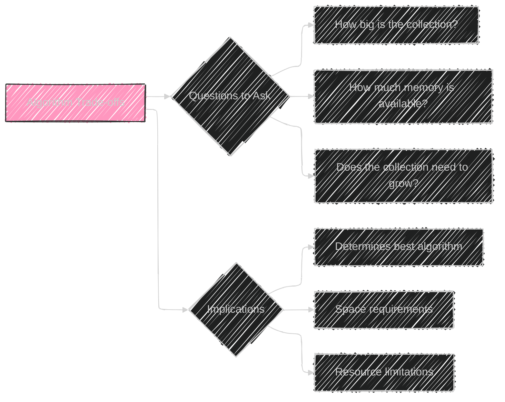

----

## Diagram 3: Classification Parameters of Sorting Algoritms

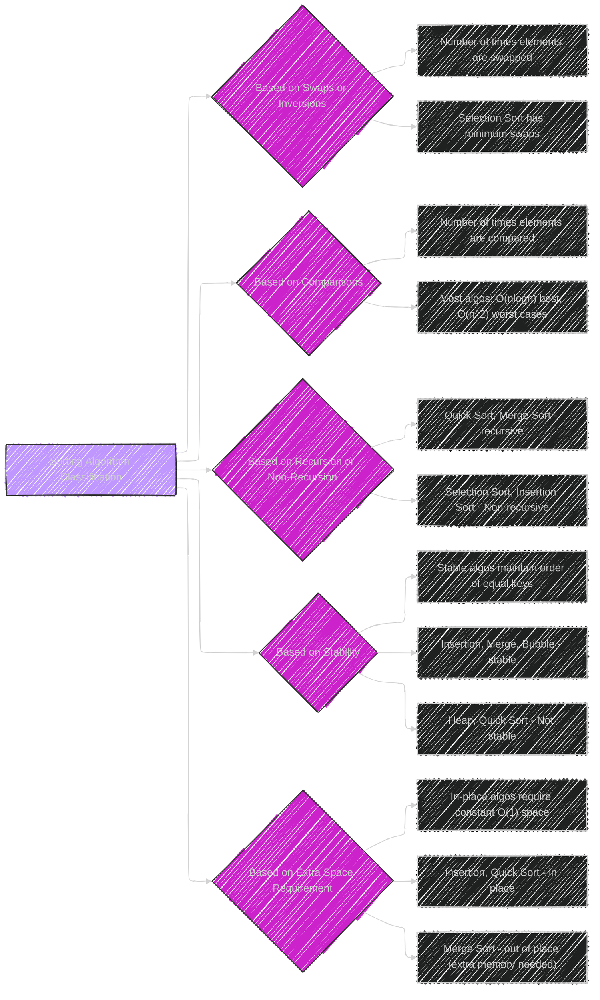

----

## Diagram 4: Bucket Sort

------

## Diagram 5: Counting Sort

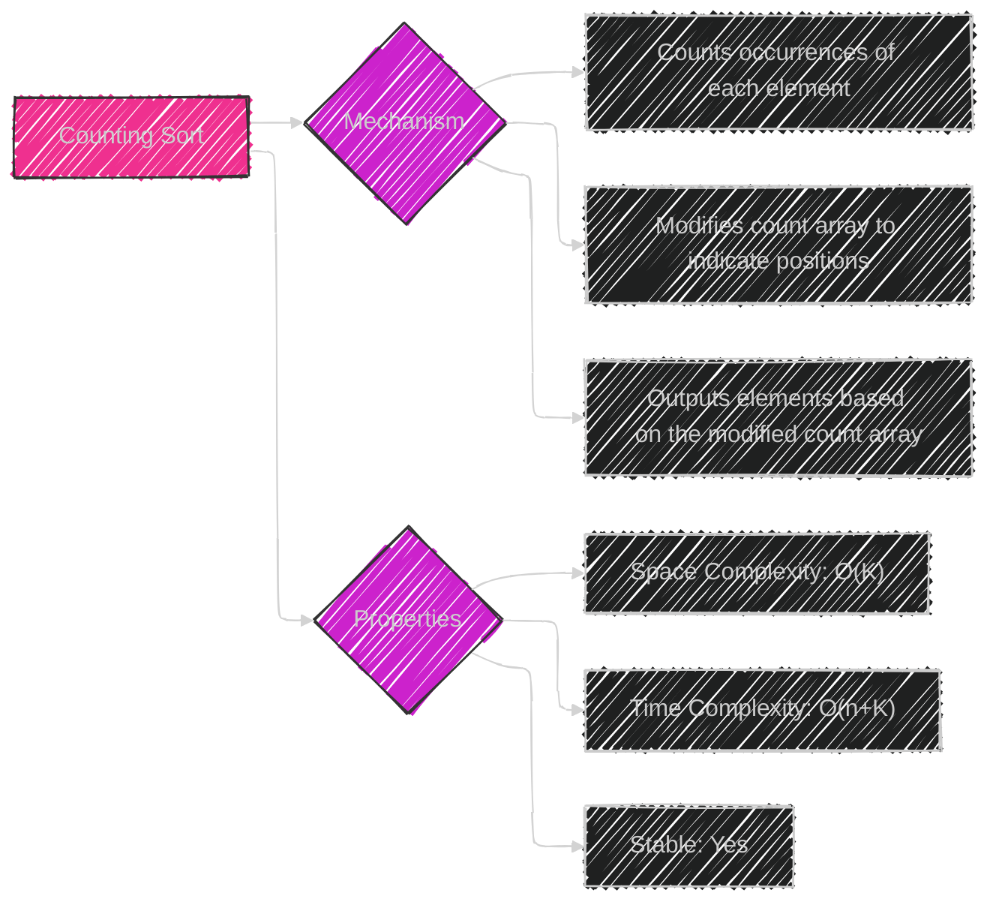

-----

## Diagram 6: Insertion Sort

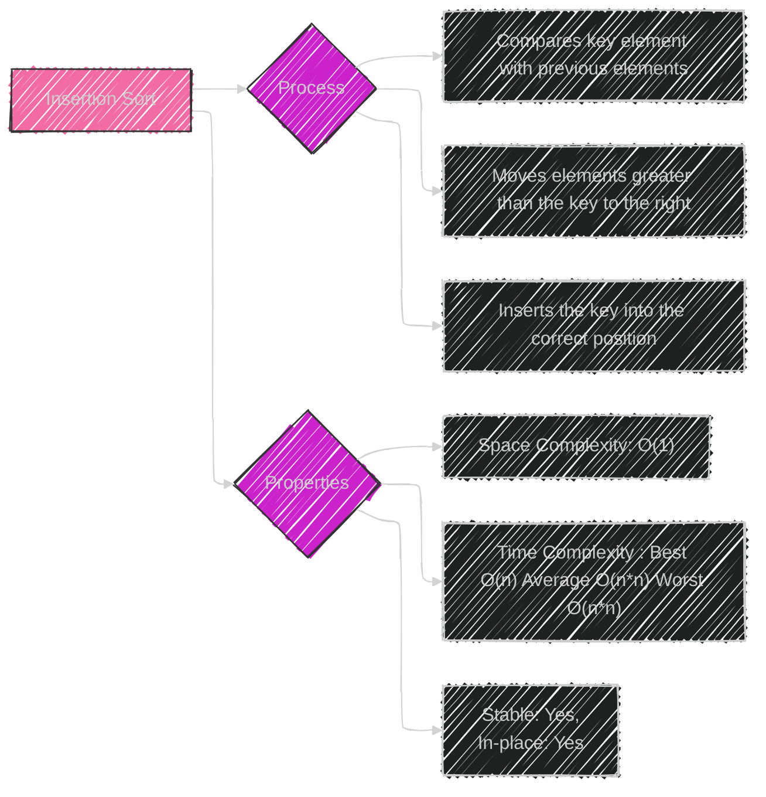

----

## Diagram 7: Heap Sort

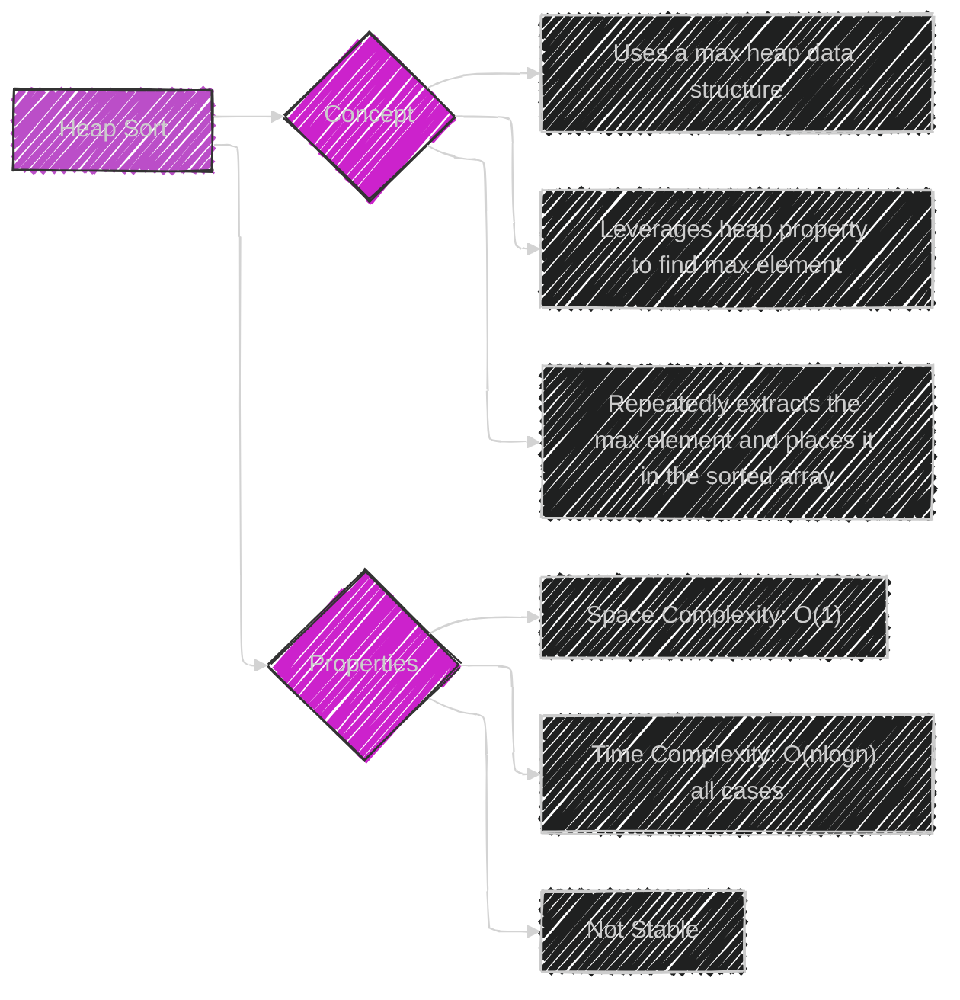

-----

## Diagram 8: Radix Sort

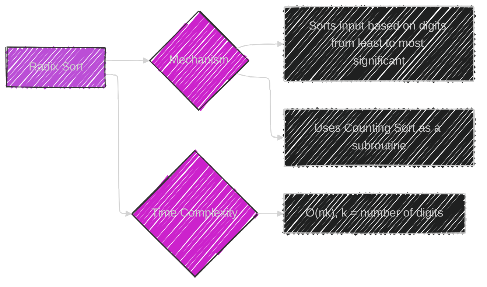

----

## Diagram 9: Selection Sort

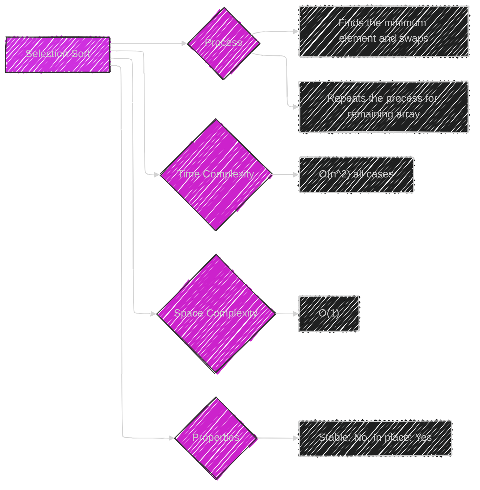

----

## Diagram 10: Bubble Sort

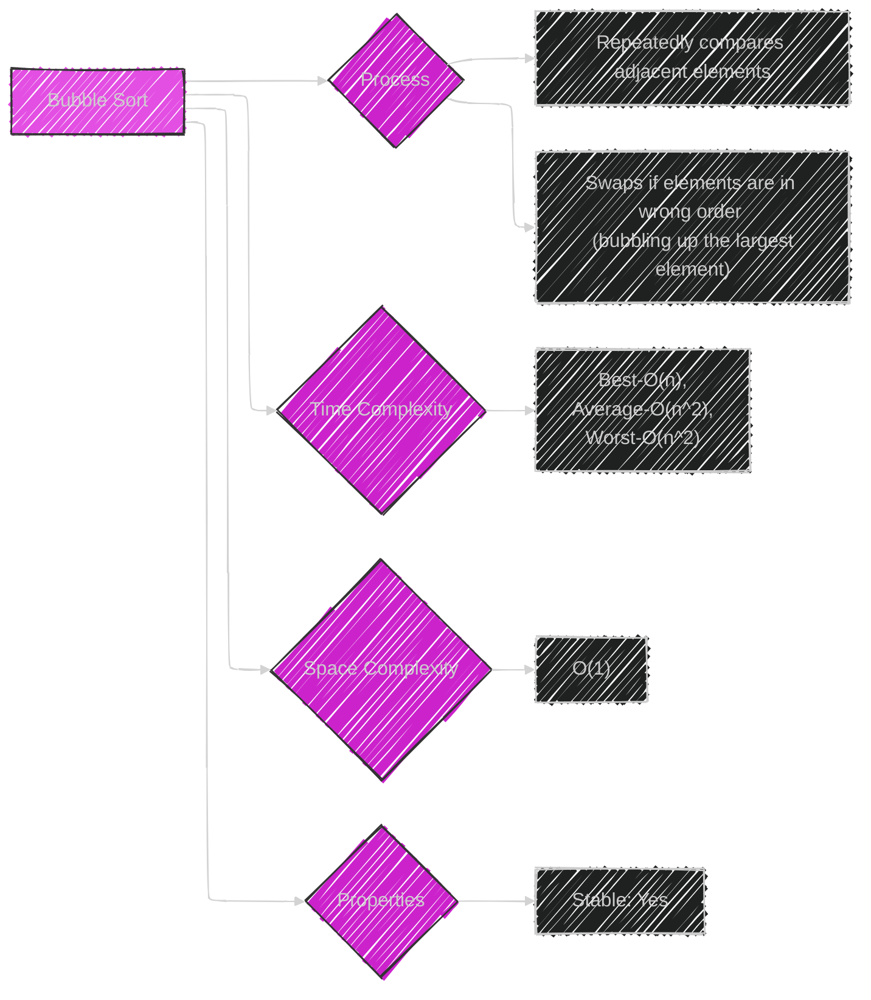

----

## Diagram 11: Quick Sort

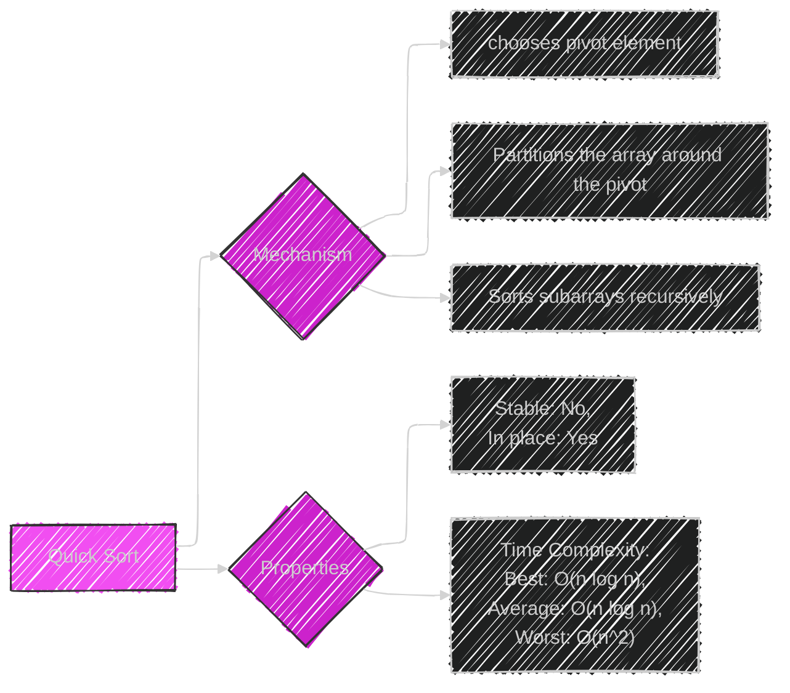

----

## Diagram 12: Timsort

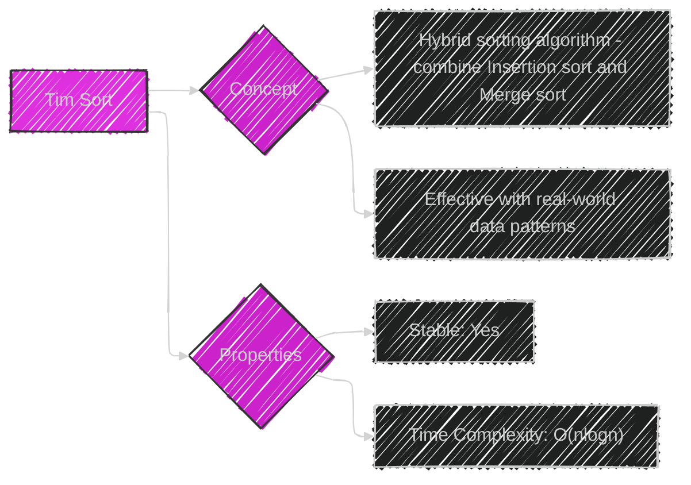

----

## Diagram 13: Merge Sort

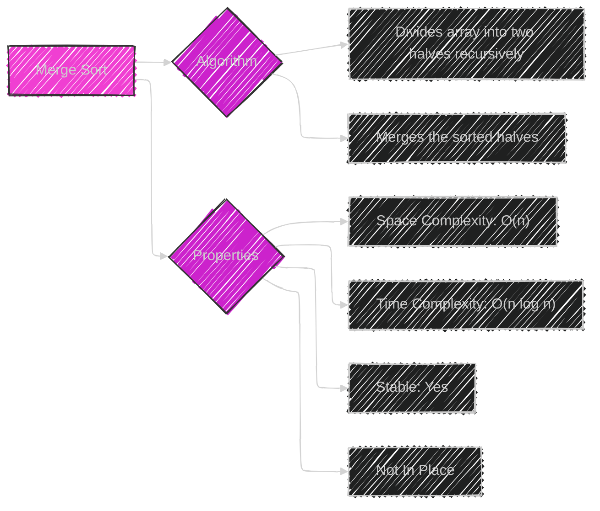

---
**Licenses:**

- **MIT License:**   - Full text in [LICENSE](LICENSE) file.
- **Creative Commons Attribution 4.0 International:**  - Legal details in [LICENSE-CC-BY](LICENSE-CC-BY) and at [Creative Commons official site](http://creativecommons.org/licenses/by/4.0/).

---