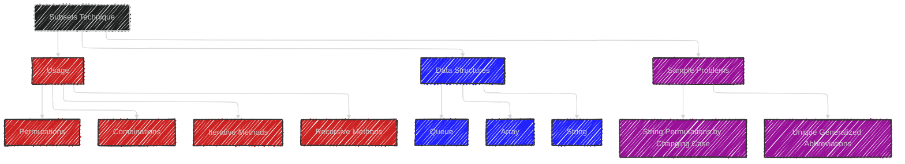
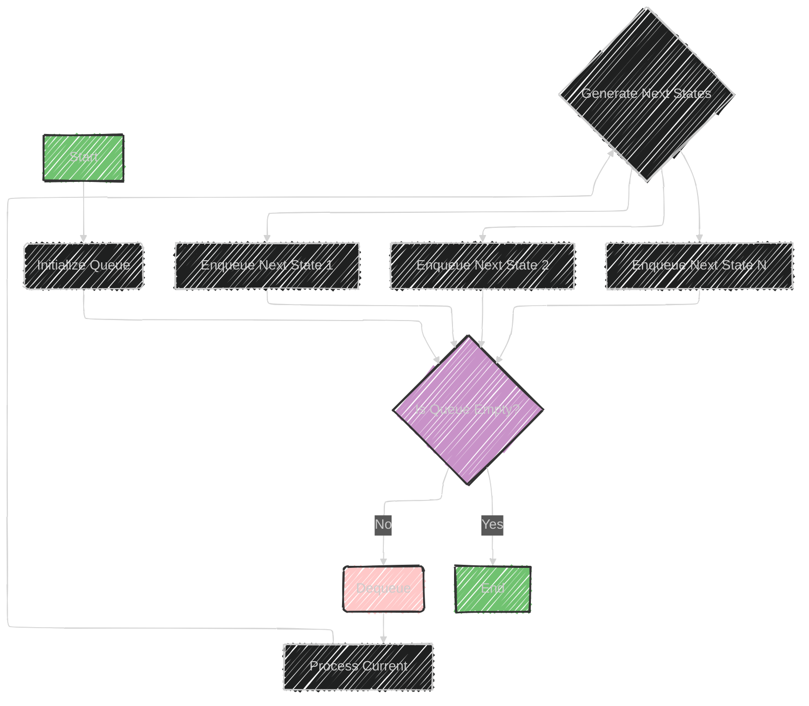

# Subsets Algorithm

> This content is dual-licensed under your choice of the following licenses:
> 1.  **MIT License:** For the code implementations in Swift and Mermaid provided in this document.
> 2.  **Creative Commons Attribution 4.0 International License (CC BY 4.0):** For all other content, including the text, explanations, and the Mermaid diagrams and illustrations.

---

The image describes an algorithmic technique focused on handling subsets or combinations, particularly useful for problems involving permutations or combinations of a set of elements.

Here’s a breakdown:

## Usage
- **Purpose:** It's used when dealing with permutations (arrangements) or combinations (selection) within a set of elements.
  
## Data Structures Involved:
- **Queue:** Useful for iterative generation of subsets.
- **Array:** Efficient storage and manipulation of elements.
- **String:** Specifically for problems involving string permutations.

## Sample Problems
1. **String Permutations by Changing Case:**
   - This involves generating permutations of a string by varying the cases of letters (e.g., "a1b2" -> "A1b2", "a1B2").
   
2. **Unique Generalized Abbreviations:**
   - This involves generating abbreviations where part of the string is replaced by the count of letters, maintaining uniqueness (e.g., "word" -> "w2d", "1o1d").

## Technique
Typically, these problems use recursive or iterative methods to explore all potential combinations or permutations, leveraging the aforementioned data structures for efficient computation and storage.


---


## Mermaid illustration

Here's a mermaid diagram illustrating the key concepts from the explanation:




This diagram captures the connection between usage, data structures, and sample problems associated with the subsets technique.


---


## Full code implementation of the algorithm in Swift

Below is a Swift implementation demonstrating how to solve the sample problems: string permutations by changing case and generating unique generalized abbreviations.

## String Permutations by Changing Case

```swift
func letterCasePermutations(_ s: String) -> [String] {
    var results = [String]()
    var characters = Array(s)
    
    func backtrack(_ index: Int) {
        if index == characters.count {
            results.append(String(characters))
            return
        }
        
        // Permute with the current case
        backtrack(index + 1)
        
        // If it's a letter, change its case and permute
        if characters[index].isLetter {
            characters[index] = characters[index].isUppercase ?
                Character(characters[index].lowercased()) :
                Character(characters[index].uppercased())
            backtrack(index + 1)
        }
    }
    
    backtrack(0)
    return results
}

// Example usage:
print(letterCasePermutations("a1b2"))
```

## Unique Generalized Abbreviations

```swift
func generateAbbreviations(_ word: String) -> [String] {
    var results = [String]()
    
    func backtrack(_ index: Int, _ current: String, _ count: Int) {
        if index == word.count {
            let abbreviation = current + (count > 0 ? "\(count)" : "")
            results.append(abbreviation)
            return
        }
        
        // Choose to abbreviate the current character
        backtrack(index + 1, current, count + 1)
        
        // Choose to keep the current character
        let nextChar = Array(word)[index]
        let newStr = current + (count > 0 ? "\(count)" : "") + "\(nextChar)"
        backtrack(index + 1, newStr, 0)
    }
    
    backtrack(0, "", 0)
    return results
}

// Example usage:
print(generateAbbreviations("word"))
```

## Explanation

- **String Permutations by Changing Case:** Uses backtracking to explore all variations of the string with different letter cases.
- **Unique Generalized Abbreviations:** Uses recursive backtracking to generate unique abbreviations by abbreviating different sections of the word.

These implementations efficiently generate all possible solutions to both problems.


---


## Iterate all the cases and print out all the cases from the algorithm

Below is the Swift code that iterates through and prints all possible cases for both problems.

## String Permutations by Changing Case

```swift
func letterCasePermutations(_ s: String) -> [String] {
    var results = [String]()
    var characters = Array(s)
    
    func backtrack(_ index: Int) {
        if index == characters.count {
            results.append(String(characters))
            return
        }
        
        // Permute with the current case
        backtrack(index + 1)
        
        // If it's a letter, change its case and permute
        if characters[index].isLetter {
            characters[index] = characters[index].isUppercase ?
                Character(characters[index].lowercased()) :
                Character(characters[index].uppercased())
            backtrack(index + 1)
        }
    }
    
    backtrack(0)
    return results
}

// Example usage:
let permutations = letterCasePermutations("a1b2")
print("String Permutations:")
for permutation in permutations {
    print(permutation)
}
```

## Unique Generalized Abbreviations

```swift
func generateAbbreviations(_ word: String) -> [String] {
    var results = [String]()
    
    func backtrack(_ index: Int, _ current: String, _ count: Int) {
        if index == word.count {
            let abbreviation = current + (count > 0 ? "\(count)" : "")
            results.append(abbreviation)
            return
        }
        
        // Choose to abbreviate the current character
        backtrack(index + 1, current, count + 1)
        
        // Choose to keep the current character
        let nextChar = Array(word)[index]
        let newStr = current + (count > 0 ? "\(count)" : "") + "\(nextChar)"
        backtrack(index + 1, newStr, 0)
    }
    
    backtrack(0, "", 0)
    return results
}

// Example usage:
let abbreviations = generateAbbreviations("word")
print("\nUnique Generalized Abbreviations:")
for abbreviation in abbreviations {
    print(abbreviation)
}
```

## Output

When you run this code, it will print all permutations for changing letter cases in "a1b2" and all generalized abbreviations for the word "word". 

This approach uses backtracking to explore all possible configurations in each problem space.


----


## Mermaid syntax to create illustrations or diagrams for queue in this topic


Below is a mermaid diagram illustrating how a queue can be used in the context of subsets and permutations:



## Explanation

- **Initialize Queue:** Start by adding the initial item or state to the queue.
- **Dequeue:** Remove the front item from the queue for processing.
- **Process Current:** Handle the current state, considering different permutations or combinations.
- **Generate Next States:** From the current state, create all possible next states.
- **Enqueue Next State:** Add each newly generated state back into the queue for further exploration.
- **Repeat Until Empty:** Continue processing until the queue is empty, traversing all possibilities.

This diagram visually represents how a queue helps to explore possible permutations or combinations in an iterative fashion.


---

## Mermaid syntax to create illustrations or diagrams for array in this topic

Below is a mermaid diagram illustrating the usage of an array in the context of handling subsets, permutations, or combinations:


## Explanation

- **Initialize Array:** Start by converting the input (e.g., a string) into an Array of characters, making it easier to manipulate each element.
- **Iterate Over Array:** Traverse each element in the array.
- **Check Element Type:** Determine if the current element is a letter or number.
- **Change Case:** If it's a letter, explore permutations by changing its case.
- **Leave Unchanged:** If it's a number, append it directly to the results.
- **Add to Results:** Store the modified arrangement or permutation.
- **Return Results:** Once all elements are processed, return or print the collection of modified versions.

This diagram captures how arrays are manipulated element-wise to explore different combinations and permutations efficiently.


---

*can we use mermaid syntax to create illustrations or diagrams for String in this topic*

---

Certainly! Here's a mermaid diagram illustrating how strings are processed to generate permutations or combinations by changing cases or abbreviating:


## Explanation

- **Input String:** Begin with a given input string that you want to process.
- **Iterate Over Characters:** Traverse through each character of the string.
- **Check If Letter:** Determine if the current character is a letter.
- **Change Case:** If the character is a letter, create a new variant by changing its case.
- **Recursive Call with Modified String:** Use recursion to explore further permutations based on the changed case.
- **Store in Result:** Add the completed permutation to the results.
- **Continue with Original:** If not a letter (e.g., a number), move on with the character unchanged.
- **Proceed to Next Character:** Continue processing the next character in the string.
- **Return All Variations:** Once completed, return the collection of all permutations or combinations.

This diagram shows how strings are handled in problems requiring permutation or combination generation, highlighting key steps and decisions.

---
**Licenses:**

- **MIT License:**  [](LICENSE) - Full text in [LICENSE](LICENSE) file.
- **Creative Commons Attribution 4.0 International:** [](LICENSE-CC-BY) - Legal details in [LICENSE-CC-BY](LICENSE-CC-BY) and at [Creative Commons official site](http://creativecommons.org/licenses/by/4.0/).

---