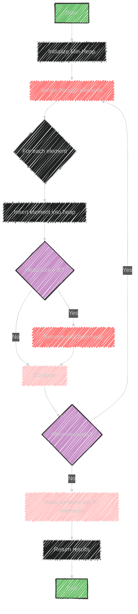

# Top K Elements Algorithm

> This content is dual-licensed under your choice of the following licenses:
> 1.  **MIT License:** For the code implementations in Swift and Mermaid provided in this document.
> 2.  **Creative Commons Attribution 4.0 International License (CC BY 4.0):** For all other content, including the text, explanations, and the Mermaid diagrams and illustrations.

---

The "Top 'K' Elements" algorithm is used to find the top, smallest, or most frequently occurring 'K' elements in a dataset. Here's how it works:

## Usage
The technique is useful for identifying specific elements within a set that fulfill criteria such as being the largest, smallest, or most frequent. 

## Data Structures Involved
- **Array**: Used for storing elements.
- **Heap**: A binary heap (min-heap or max-heap) is commonly used to efficiently retrieve the top 'K' elements based on the desired criteria (smallest or largest).
- **Queue**: Can be used for processing elements in a specific order.

## Sample Problems
1. **'K' Closest Points to the Origin**: Find the 'K' points in a 2D space that are closest to the origin.
2. **Maximum Distinct Elements**: Find the maximum number of distinct elements in a set after performing a certain number of operations.

## Typical Approach
1. **Use a Heap**: For problems searching for the smallest or largest 'K' elements, a heap can efficiently maintain the top 'K' elements as you iterate through the dataset.
   - **Min-Heap**: Used when you want the top 'K' largest elements.
   - **Max-Heap**: Used for the top 'K' smallest elements.

2. **Insert Elements**: As you process each element, insert it into the heap. When the heap size exceeds 'K,' remove the root element, ensuring that only the top 'K' elements are kept.

3. **Return Results**: After processing all elements, the heap will contain the desired top 'K' elements.

This method is efficient due to the log(K) time complexity for heap operations, making it suitable for handling large datasets.


---


## Mermaid illustration

Here's a mermaid diagram illustrating the process for finding the top 'K' elements using a heap:



This diagram shows the iterative process of inserting elements into a heap and maintaining the top 'K' elements by removing the smallest element when necessary.


---


## Full code implementation of the algorithm in Swift


Here's a basic implementation of the "Top 'K' Elements" algorithm in Swift using a min-heap:

```swift
import Foundation

struct MinHeap<T: Comparable> {
    private var heap: [T] = []

    // Insert an element into the heap
    mutating func insert(_ value: T) {
        heap.append(value)
        siftUp(from: heap.count - 1)
    }

    // Remove and return the top (smallest) element
    mutating func removeTop() -> T? {
        guard !heap.isEmpty else { return nil }
        if heap.count == 1 {
            return heap.removeFirst()
        }
        
        let top = heap[0]
        heap[0] = heap.removeLast()
        siftDown(from: 0)
        return top
    }

    // Return the top (smallest) element without removing
    func peek() -> T? {
        return heap.first
    }

    var count: Int {
        return heap.count
    }

    private mutating func siftUp(from index: Int) {
        var childIndex = index
        let childValue = heap[childIndex]
        var parentIndex = (childIndex - 1) / 2

        while childIndex > 0 && childValue < heap[parentIndex] {
            heap[childIndex] = heap[parentIndex]
            childIndex = parentIndex
            parentIndex = (childIndex - 1) / 2
        }

        heap[childIndex] = childValue
    }

    private mutating func siftDown(from index: Int) {
        var parentIndex = index
        let parentValue = heap[parentIndex]
        let count = heap.count
        
        while true {
            let leftChildIndex = 2 * parentIndex + 1
            let rightChildIndex = 2 * parentIndex + 2
            var minIndex = parentIndex

            if leftChildIndex < count && heap[leftChildIndex] < heap[minIndex] {
                minIndex = leftChildIndex
            }
            if rightChildIndex < count && heap[rightChildIndex] < heap[minIndex] {
                minIndex = rightChildIndex
            }
            if minIndex == parentIndex { break }

            heap[parentIndex] = heap[minIndex]
            parentIndex = minIndex
        }

        heap[parentIndex] = parentValue
    }
}

func topKElements<T: Comparable>(from array: [T], k: Int) -> [T] {
    var minHeap = MinHeap<T>()

    for element in array {
        minHeap.insert(element)
        if minHeap.count > k {
            _ = minHeap.removeTop()
        }
    }

    var result: [T] = []
    while let top = minHeap.removeTop() {
        result.append(top)
    }

    return result
}

let array = [3, 1, 5, 12, 2, 11]
let k = 3
let result = topKElements(from: array, k: k)
print("Top \(k) elements: \(result)")
```

### Explanation
- **MinHeap**: A simple min-heap implementation using an array to store elements, with methods for insertion, removal, and peeking at the top element.
- **topKElements**: Takes an array and a count `k`, inserts elements into the heap, and maintains only the top `k` elements.
- **Result**: The top `k` elements are extracted from the heap and returned.


---


## Iterate all the cases and print out all the cases from the algorithm


To iterate through each step of processing the elements and print out the state of the heap at each stage, you can modify the `topKElements` function as follows:

```swift
import Foundation

struct MinHeap<T: Comparable> {
    private var heap: [T] = []

    mutating func insert(_ value: T) {
        heap.append(value)
        siftUp(from: heap.count - 1)
    }

    mutating func removeTop() -> T? {
        guard !heap.isEmpty else { return nil }
        if heap.count == 1 {
            return heap.removeFirst()
        }
        
        let top = heap[0]
        heap[0] = heap.removeLast()
        siftDown(from: 0)
        return top
    }

    func peek() -> T? {
        return heap.first
    }

    var count: Int {
        return heap.count
    }

    private mutating func siftUp(from index: Int) {
        var childIndex = index
        let childValue = heap[childIndex]
        var parentIndex = (childIndex - 1) / 2

        while childIndex > 0 && childValue < heap[parentIndex] {
            heap[childIndex] = heap[parentIndex]
            childIndex = parentIndex
            parentIndex = (childIndex - 1) / 2
        }

        heap[childIndex] = childValue
    }

    private mutating func siftDown(from index: Int) {
        var parentIndex = index
        let parentValue = heap[parentIndex]
        let count = heap.count
        
        while true {
            let leftChildIndex = 2 * parentIndex + 1
            let rightChildIndex = 2 * parentIndex + 2
            var minIndex = parentIndex

            if leftChildIndex < count && heap[leftChildIndex] < heap[minIndex] {
                minIndex = leftChildIndex
            }
            if rightChildIndex < count && heap[rightChildIndex] < heap[minIndex] {
                minIndex = rightChildIndex
            }
            if minIndex == parentIndex { break }

            heap[parentIndex] = heap[minIndex]
            parentIndex = minIndex
        }

        heap[parentIndex] = parentValue
    }
}

func topKElements<T: Comparable>(from array: [T], k: Int) -> [T] {
    var minHeap = MinHeap<T>()

    for element in array {
        minHeap.insert(element)
        print("Inserted \(element), Heap: \(minHeap.heap)") // Print state after insertion
        if minHeap.count > k {
            if let removed = minHeap.removeTop() {
                print("Removed \(removed), Heap after removal: \(minHeap.heap)") // Print state after removal
            }
        }
    }

    var result: [T] = []
    while let top = minHeap.removeTop() {
        result.append(top)
    }

    return result
}

let array = [3, 1, 5, 12, 2, 11]
let k = 3
let result = topKElements(from: array, k: k)
print("Top \(k) elements: \(result)")
```

### Explanation
- **Print Statements**: After each operation on the heap (insertion and removal), the current state of the heap is printed, showing its contents.
- **Iteration**: During each iteration over the elements, we see the step-by-step evolution of the heap.

---
**Licenses:**

- **MIT License:**  [](LICENSE) - Full text in [LICENSE](LICENSE) file.
- **Creative Commons Attribution 4.0 International:** [](LICENSE-CC-BY) - Legal details in [LICENSE-CC-BY](LICENSE-CC-BY) and at [Creative Commons official site](http://creativecommons.org/licenses/by/4.0/).

---