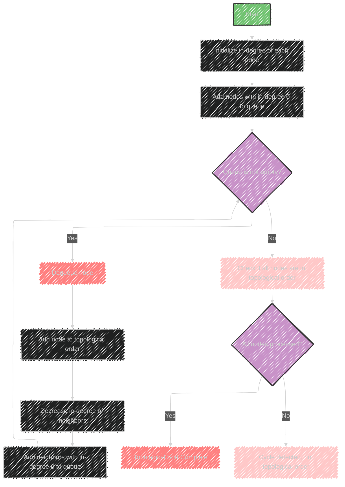

# Topological Sort Algorithm

Topological Sort is an algorithm used to order vertices in a Directed Acyclic Graph (DAG) linearly, where for every directed edge from vertex `u` to vertex `v`, `u` comes before `v` in the ordering.

This is particularly useful for problems that require a sequence of tasks with dependencies.

## Usage
- **Linear Ordering**: It's applied to scenarios where you need to determine a valid sequence of tasks or elements based on their dependencies.

## Data Structures Involved
- **Array**: Used to store the result of the ordered vertices.
- **HashTable**: Can be used to keep track of visited nodes or in-degree counts.
- **Queue**: Employed in the Kahn's algorithm (one approach to topological sorting) to manage nodes with no incoming edges.
- **Graph**: Represents the network of dependencies.

## Sample Problems
- **Tasks Scheduling**: Determining the order to complete tasks given dependencies.
- **Alien Dictionary**: Finding the order of characters in an alien language based on the sorted dictionary of the language.

## Key Algorithms
1. **Depth First Search (DFS) Approach**:
   - Perform DFS on the graph and add nodes to the stack when finished visiting them.
   - The stack will have nodes in reverse topological order.

2. **Kahn’s Algorithm (BFS Approach)**:
   - Track in-degrees (number of incoming edges) of each node.
   - Start with nodes having zero in-degree and place them in a queue.
   - Remove nodes from the queue, decrement the in-degree of their neighbors, and add neighbors with zero in-degree to the queue.
   - Continue until the queue is empty. If all nodes are processed, you have a topological sort.

Topological sorting provides a way to understand task precedence and is crucial for scheduling problems where the order of operations matters.


---


## Mermaid illustration


Here’s a mermaid diagram illustrating the Topological Sort process using Kahn's Algorithm:



This diagram shows the flow of Kahn's Algorithm for performing a Topological Sort. Let me know if you need more details or another type of illustration!


---


## Full code implementation of the algorithm in Swift

Here's a full Swift implementation of the Topological Sort using Kahn's Algorithm:

```swift
import Foundation

func topologicalSort(vertices: Int, edges: [(Int, Int)]) -> [Int]? {
    var inDegree = Array(repeating: 0, count: vertices)
    var adjacencyList: [Int: [Int]] = [:]

    // Build the graph and compute in-degrees
    for (u, v) in edges {
        adjacencyList[u, default: []].append(v)
        inDegree[v] += 1
    }

    // Queue for nodes with in-degree 0
    var queue: [Int] = []
    for i in 0..<vertices {
        if inDegree[i] == 0 {
            queue.append(i)
        }
    }

    var topologicalOrder: [Int] = []

    // Process the queue
    while !queue.isEmpty {
        let node = queue.removeFirst()
        topologicalOrder.append(node)

        if let neighbors = adjacencyList[node] {
            for neighbor in neighbors {
                inDegree[neighbor] -= 1
                if inDegree[neighbor] == 0 {
                    queue.append(neighbor)
                }
            }
        }
    }

    // Check if there was a cycle
    if topologicalOrder.count == vertices {
        return topologicalOrder
    } else {
        return nil // Cycle detected
    }
}

// Example usage:
let vertices = 6
let edges = [(5, 2), (5, 0), (4, 0), (4, 1), (2, 3), (3, 1)]

if let result = topologicalSort(vertices: vertices, edges: edges) {
    print("Topological Sort: \(result)")
} else {
    print("Cycle detected; no topological ordering possible.")
}
```

### Explanation
- **Vertices and Edges**: The function receives the number of vertices and a list of directed edges.
- **In-Degree Calculation**: It calculates the in-degree of each vertex.
- **Queue Initialization**: Nodes with an in-degree of 0 are added to the queue.
- **Process Nodes**: It removes nodes from the queue, adds them to the topological order, and decreases the in-degree of their neighbors.
- **Cycle Detection**: If no cycle is present, it returns the topological order; otherwise, it returns `nil`.


---


## Iterate all the cases and print out all the cases from the algorithm


To iterate through all possible topological sorts, you can use a backtracking approach.

Here's how you can implement it in Swift:

```swift
import Foundation

func allTopologicalSorts(vertices: Int, edges: [(Int, Int)]) {
    var inDegree = Array(repeating: 0, count: vertices)
    var adjacencyList: [Int: [Int]] = [:]
    var result = [Int]()
    var allResults = [[Int]]()

    // Build the graph and compute in-degrees
    for (u, v) in edges {
        adjacencyList[u, default: []].append(v)
        inDegree[v] += 1
    }

    // To keep track of visited nodes
    var visited = Array(repeating: false, count: vertices)

    // Helper function to perform backtracking
    func backtrack() {
        var flag = false

        for i in 0..<vertices {
            if inDegree[i] == 0 && !visited[i] {
                // Include vertex in result
                result.append(i)
                visited[i] = true

                // Reduce in-degree of neighbors
                if let neighbors = adjacencyList[i] {
                    for neighbor in neighbors {
                        inDegree[neighbor] -= 1
                    }
                }

                // Recursive call
                backtrack()

                // Backtrack
                if let neighbors = adjacencyList[i] {
                    for neighbor in neighbors {
                        inDegree[neighbor] += 1
                    }
                }
                visited[i] = false
                result.removeLast()

                flag = true
            }
        }

        if !flag {
            allResults.append(result)
        }
    }

    backtrack()

    // Print all topological sorts
    for res in allResults {
        print(res)
    }
}

// Example usage:
let vertices = 6
let edges = [(5, 2), (5, 0), (4, 0), (4, 1), (2, 3), (3, 1)]

print("All Topological Sorts:")
allTopologicalSorts(vertices: vertices, edges: edges)
```

### Explanation
- **Graph and In-Degree Initialization**: As before, the adjacency list and in-degrees for each vertex are computed.
- **Visited Array**: Keeps track of whether a vertex is included in the current path.
- **Backtracking**: The function uses backtracking to generate all possible topological sorts. It tries each unvisited vertex with zero in-degree, explores further, and backtracks by resetting changes.
- **All Results Collection**: It collects all valid topological sorts and prints them.

This approach generates all possible orderings, handling cycles implicitly by ensuring only zero in-degree nodes are processed.


---
**Licenses:**

- **MIT License:**  [](LICENSE) - Full text in [LICENSE](LICENSE) file.
- **Creative Commons Attribution 4.0 International:** [](LICENSE-CC-BY) - Legal details in [LICENSE-CC-BY](LICENSE-CC-BY) and at [Creative Commons official site](http://creativecommons.org/licenses/by/4.0/).

---